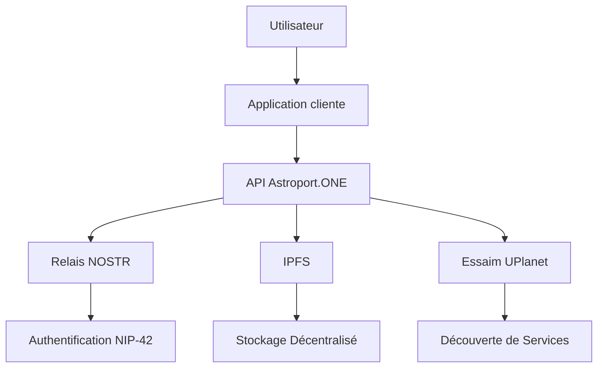
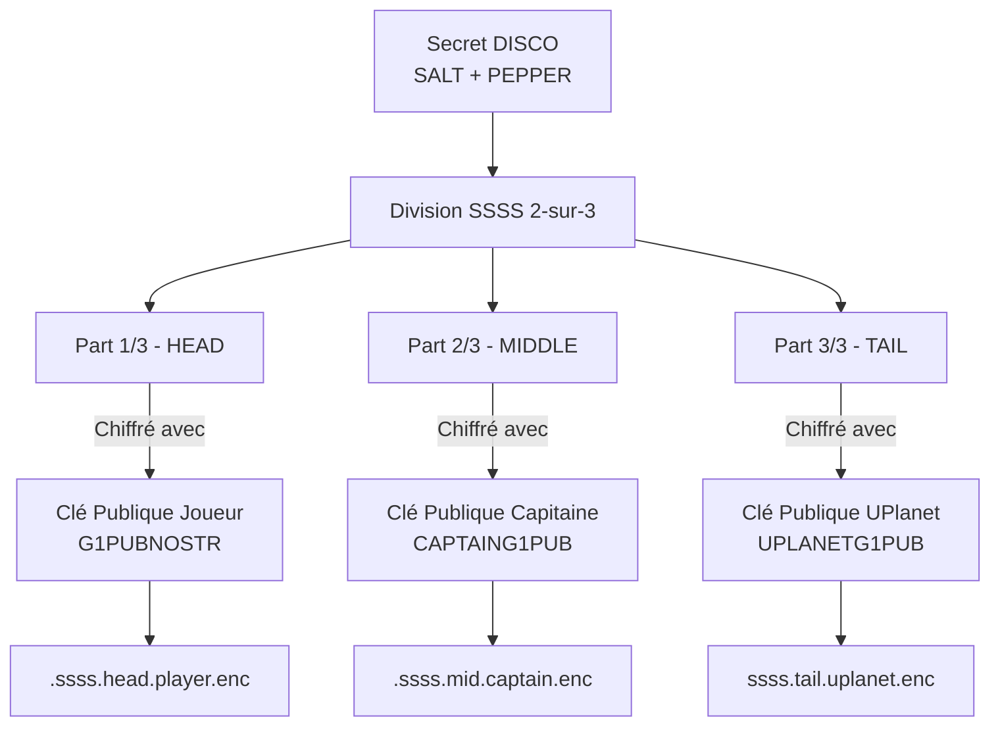
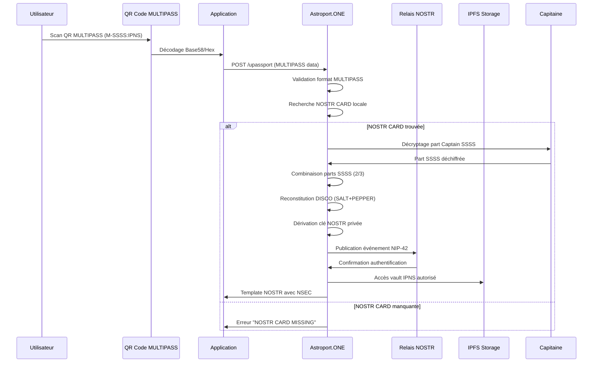
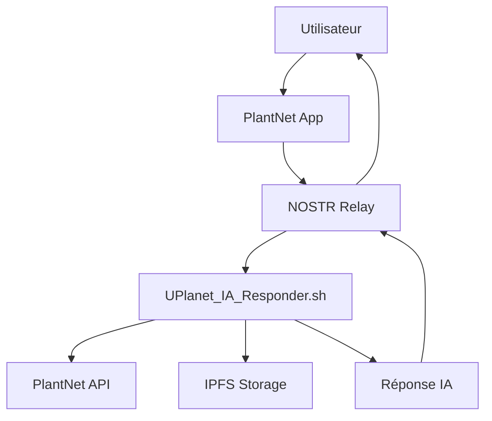
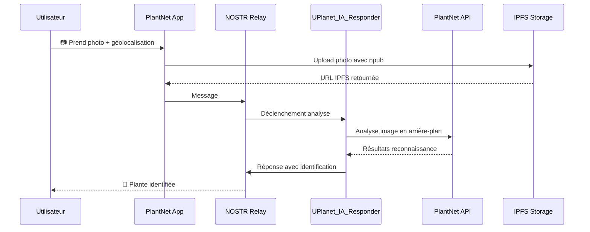
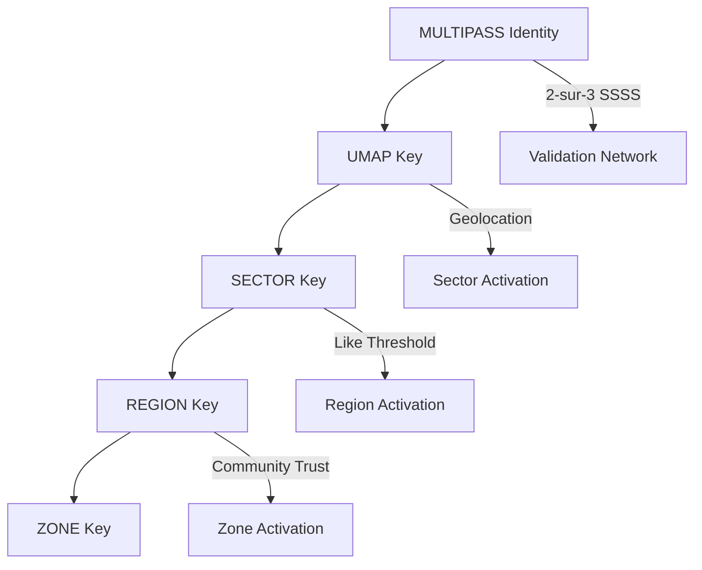
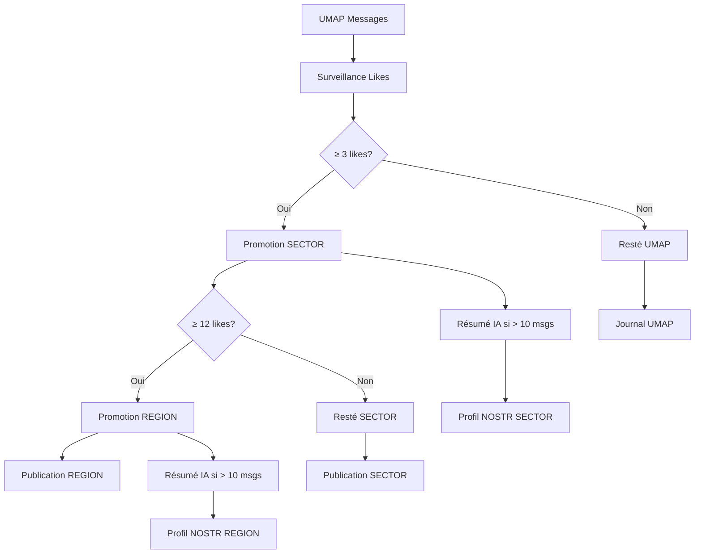

# 🔐 API NOSTR Auth - Guide Développeur Astroport.ONE

## ⚠️ AVERTISSEMENT CRITIQUE : IDENTITÉS CONTRÔLÉES

**ATTENTION : Les identités NOSTR dans l'écosystème UPlanet/Astroport.ONE ne peuvent PAS être générées arbitrairement !**

- ✅ **Création autorisée** : Uniquement via `make_NOSTRCARD.sh` avec système SSSS
- ❌ **Génération libre interdite** : Les clés NOSTR aléatoirement générées ne sont pas acceptées
- 🔒 **Sécurité MULTIPASS** : Chaque identité est protégée par un partage de secret 2-sur-3
- 🌐 **Validation réseau** : Seules les identités validées par un Capitaine de constellation sont reconnues

**Pourquoi cette restriction ?**
- Empêche les attaques Sybil et les identités malveillantes
- Garantit la traçabilité et la responsabilité des utilisateurs
- Assure l'interopérabilité avec l'écosystème G1/Duniter
- Permet la synchronisation sécurisée entre relais de confiance

---

## 🚀 Introduction

Astroport.ONE est une API décentralisée pour l'écosystème UPlanet, permettant l'authentification, le stockage distribué, la découverte de services et d'utilisateurs autour d'une position géographique, sans dépendre d'un cloud centralisé.

Ce guide s'adresse aux développeurs souhaitant créer des applications web, mobiles ou IoT interopérables avec l'essaim UPlanet.

---

## 🌐 Vue d'ensemble de l'écosystème UPlanet/Astroport



### Composants Principaux

- **Astroport.ONE** : API locale sur chaque node
- **UPlanet Swarm** : Réseau de nodes interconnectés (swarm.key)
- **NOSTR** : Protocole d'authentification décentralisé
- **IPFS** : Stockage distribué
- **UMAP/SECTOR/REGION/ZONE** : Découpage géographique hiérarchique

---

## 📚 Librairie JavaScript NOSTR

### Installation et Utilisation

Astroport.ONE utilise et recommande la librairie JavaScript NOSTR hébergée sur IPFS :

```html
<!-- Inclusion de la librairie NOSTR depuis IPFS -->
<script src="https://ipfs.copylaradio.com/ipfs/QmXEmaPRUaGcvhuyeG99mHHNyP43nn8GtNeuDok8jdpG4a/nostr.bundle.js"></script>
```

### Fonctions Principales Disponibles

⚠️ **IMPORTANT** : Les exemples ci-dessous utilisent les fonctions NOSTR standards, mais dans l'écosystème UPlanet/Astroport.ONE, les clés doivent être créées exclusivement via `make_NOSTRCARD.sh`.

```javascript
// ❌ INTERDIT dans UPlanet : Génération libre de clés
// const privateKey = NostrTools.generatePrivateKey();
// const publicKey = NostrTools.getPublicKey(privateKey);

// ✅ CORRECT : Utilisation de clés MULTIPASS créées par make_NOSTRCARD.sh
// Les clés sont dérivées du DISCO (SALT + PEPPER) et fournies via le système SSSS

// Création et signature d'événements (avec clés MULTIPASS existantes)
const event = {
    kind: 22242, // NIP42 - Authentification
    created_at: Math.floor(Date.now() / 1000),
    tags: [
        ['relay', 'ws://127.0.0.1:7777'],
        ['challenge', 'your-challenge-here']
    ],
    content: 'Authentification pour Astroport.ONE'
};

// La signature utilise la clé privée MULTIPASS (fournie par le système SSSS)
const signedEvent = NostrTools.finishEvent(event, multipassPrivateKey);

// Connexion aux relais
const relay = NostrTools.relayInit('ws://127.0.0.1:7777');
await relay.connect();
await relay.publish(signedEvent);
```

### Exemple d'Intégration Complète (Production Ready)

✅ **PRODUCTION READY** : Cet exemple montre l'intégration réelle du système MULTIPASS avec scan QR Code via caméra, identique au processus utilisé dans `scan_new.html`. Il utilise Instascan.js pour le scan de QR Code et l'API UPassport pour le décodage SSSS.

```html
<!DOCTYPE html>
<html>
<head>
    <title>Astroport.ONE - Authentification NOSTR MULTIPASS</title>
    <script src="https://ipfs.copylaradio.com/ipfs/QmXEmaPRUaGcvhuyeG99mHHNyP43nn8GtNeuDok8jdpG4a/nostr.bundle.js"></script>
    <script src="https://ipfs.copylaradio.com/ipfs/QmQLQ5WdCEc7mpKw5rhUujUU1URKweei4Bb4esyVNd9Atx/G1PalPay_fichiers/instascan.min.js"></script>
</head>
<body>
    <h1>Authentification NOSTR MULTIPASS pour Astroport.ONE</h1>
    
    <div class="warning" style="background: #fff3cd; border: 1px solid #ffeaa7; padding: 10px; margin: 10px 0;">
        ✅ <strong>Production Ready</strong> : Utilise le vrai système MULTIPASS avec scan QR Code
    </div>
    
    <div class="scanner-container">
        <div class="camera-controls">
            <button id="start-camera">🎥 Activer Caméra</button>
            <button id="stop-camera">🚫 Arrêter</button>
        </div>
        <video id="preview" style="width: 100%; max-width: 400px; height: 300px;"></video>
        <button onclick="authenticate()">S'authentifier avec MULTIPASS</button>
    </div>
    
    <div id="status"></div>
    
    <script>
        let privateKey = null;
        let publicKey = null;
        let scanner = null;
        let cameraActive = false;
        
        // Configuration du scanner QR (identique à scan_new.html)
        let opts = {
            continuous: true,
            video: document.getElementById('preview'),
            mirror: false,
            captureImage: false,
            backgroundScan: false,
            refractoryPeriod: 5000,
            scanPeriod: 1
        };
        
        // ✅ PRODUCTION : Chargement des clés MULTIPASS via scan QR Code réel
        function initializeMULTIPASSScanner() {
            scanner = new Instascan.Scanner(opts);
            
            // Listener pour détecter les QR Codes MULTIPASS (comme scan_new.html)
            scanner.addListener('scan', async function (content) {
                console.log('QR Code détecté:', content);
                
                // Vérification du format MULTIPASS
                if (content.startsWith('M-') || content.startsWith('1-')) {
                    await processMULTIPASSQR(content);
                } else {
                    document.getElementById('status').innerHTML = 
                        '<p style="color: orange;">⚠️ QR Code détecté mais format MULTIPASS non reconnu</p>';
                }
            });
        }
        
        // Traitement du QR Code MULTIPASS (processus réel de production)
        async function processMULTIPASSQR(qrCodeData) {
            try {
                document.getElementById('status').innerHTML = 
                    '<p style="color: blue;">🔄 Traitement du QR Code MULTIPASS...</p>';
                
                // Envoi à l'API UPassport pour décodage SSSS (identique à scan_new.html)
                const formData = new FormData();
                formData.append('parametre', qrCodeData);
                formData.append('PASS', navigator.language.substring(0, 2));
                
                const response = await fetch('/upassport', {
                    method: 'POST',
                    body: formData
                });
                
                if (!response.ok) {
                    throw new Error('Erreur API UPassport: ' + response.status);
                }
                
                const htmlResult = await response.text();
                
                // Vérification de la réponse (NOSTR CARD MISSING ou succès)
                if (htmlResult.includes('NOSTR CARD MISSING')) {
                    throw new Error('NOSTR CARD MISSING - Identité non trouvée sur ce relais');
                }
                
                // Extraction du NSEC depuis le template nostr.html
                const nsecMatch = htmlResult.match(/const userNsec = '([^']+)'/);
                if (nsecMatch && nsecMatch[1] && nsecMatch[1] !== '') {
                    const nsec = nsecMatch[1];
                    
                    // Décodage du NSEC (clé reconstituée par SSSS)
                    const decoded = NostrTools.nip19.decode(nsec);
                    if (decoded.type === 'nsec' && decoded.data) {
                        privateKey = decoded.data;
                        publicKey = NostrTools.getPublicKey(privateKey);
                        
                        // Arrêter le scanner une fois les clés obtenues
                        if (cameraActive) {
                            scanner.stop();
                            cameraActive = false;
                        }
                        
                        document.getElementById('status').innerHTML = 
                            `<div style="background: #d4edda; padding: 15px; margin: 10px 0; border-radius: 5px;">
                             <p><strong>✅ MULTIPASS Authentifié avec Succès</strong></p>
                             <p><strong>NPUB:</strong> ${NostrTools.nip19.npubEncode(publicKey)}</p>
                             <p><em>Clés reconstituées via système SSSS (2 parts sur 3)</em></p>
                             <p><em>Relais de confiance + UPlanet infrastructure</em></p>
                             </div>`;
                        return;
                    }
                }
                
                throw new Error('Échec du décodage SSSS - NSEC non trouvé dans la réponse');
                
            } catch (error) {
                console.error('Erreur MULTIPASS:', error);
                document.getElementById('status').innerHTML = 
                    `<div style="background: #f8d7da; padding: 15px; margin: 10px 0; border-radius: 5px;">
                     <p><strong>❌ Erreur MULTIPASS: ${error.message}</strong></p>
                     <p><em>Vérifiez que votre QR Code MULTIPASS est valide et que votre NOSTR CARD existe sur ce relais</em></p>
                     </div>`;
            }
        }
        
        async function authenticate() {
            if (!privateKey || !publicKey) {
                alert('Scannez d\'abord votre QR Code MULTIPASS pour charger vos clés');
                return;
            }
            
            try {
                // Créer l'événement d'authentification NIP42
                const authEvent = {
                    kind: 22242,
                    created_at: Math.floor(Date.now() / 1000),
                    tags: [
                        ['relay', 'ws://127.0.0.1:7777'],
                        ['challenge', 'astroport-multipass-' + Date.now()]
                    ],
                    content: 'Authentification MULTIPASS pour Astroport.ONE API'
                };
                
                const signedEvent = NostrTools.finishEvent(authEvent, privateKey);
                
                // Publier sur le relais
                const relay = NostrTools.relayInit('ws://127.0.0.1:7777');
                await relay.connect();
                await relay.publish(signedEvent);
                
                // Tester l'authentification avec l'API
                const response = await fetch('/api/test-nostr', {
                    method: 'POST',
                    headers: {
                        'Content-Type': 'application/x-www-form-urlencoded',
                    },
                    body: `npub=${NostrTools.nip19.npubEncode(publicKey)}`
                });
                
                const result = await response.json();
                
                if (result.auth_verified) {
                    document.getElementById('status').innerHTML += 
                        '<p style="color: green; font-weight: bold;">✅ Authentification MULTIPASS réussie sur le relais !</p>';
                } else {
                    document.getElementById('status').innerHTML += 
                        '<p style="color: red;">❌ Authentification MULTIPASS échouée</p>';
                }
                
                relay.close();
                
            } catch (error) {
                document.getElementById('status').innerHTML += 
                    `<p style="color: red;">❌ Erreur: ${error.message}</p>`;
            }
        }
        
        // Contrôles de caméra (identiques à scan_new.html)
        document.getElementById('start-camera').addEventListener('click', function() {
            if (!cameraActive) {
                Instascan.Camera.getCameras().then(function (cameras) {
                    if (cameras.length > 0) {
                        scanner.start(cameras[0]);
                        cameraActive = true;
                        document.getElementById('status').innerHTML = 
                            '<p style="color: blue;">📱 Caméra activée - Scannez votre QR Code MULTIPASS</p>';
                    } else {
                        alert('Aucune caméra trouvée sur cet appareil.');
                    }
                }).catch(function (e) {
                    console.error(e);
                    alert('Erreur d\'accès à la caméra: ' + e.message);
                });
            }
        });
        
        document.getElementById('stop-camera').addEventListener('click', function() {
            if (cameraActive) {
                scanner.stop();
                cameraActive = false;
                document.getElementById('status').innerHTML = 
                    '<p style="color: gray;">📱 Caméra arrêtée</p>';
            }
        });
        
        // Initialisation du scanner au chargement de la page
        document.addEventListener('DOMContentLoaded', function() {
            initializeMULTIPASSScanner();
        });
    </script>
</body>
</html>
```

### Fonctions NOSTR Disponibles

La librairie fournit toutes les fonctions NOSTR standards :

- **Authentification** : `NostrTools.nip42`
- **Chiffrement** : `NostrTools.nip04`, `NostrTools.nip44`
- **Profils** : `NostrTools.nip05`
- **Relais** : `NostrTools.relayInit`, `NostrTools.SimplePool`
- **Validation** : `NostrTools.validateEvent`, `NostrTools.verifySignature`
- **Utilitaires** : `NostrTools.getEventHash`, `NostrTools.finishEvent`

---

## 🔐 Authentification NOSTR (NIP-42)

### ⚠️ IMPORTANT : Création Contrôlée des Identités NOSTR

**Les identités NOSTR dans l'écosystème UPlanet/Astroport.ONE ne peuvent PAS être prises au hasard ou générées arbitrairement.** 

Toutes les identités NOSTR sont créées exclusivement par le script `make_NOSTRCARD.sh` qui implémente un système de sécurité cryptographique avancé basé sur le partage de secret de Shamir (SSSS - Shamir's Secret Sharing Scheme).

#### Processus de Création d'Identité MULTIPASS

```bash
# Création d'une identité NOSTR sécurisée
./make_NOSTRCARD.sh user@example.com [image] [lat] [lon] [salt] [pepper]
```

**Étapes du processus :**

1. **Génération du DISCO** : Secret principal contenant SALT et PEPPER
2. **Division SSSS (2-sur-3)** : Le secret est divisé en 3 parts avec seuil de reconstruction à 2
3. **Chiffrement asymétrique** : Chaque part est chiffrée pour un acteur spécifique
4. **Dérivation des clés** : Toutes les clés (NOSTR, G1, Bitcoin, Monero) sont dérivées du même DISCO

#### Architecture de Sécurité SSSS



#### Autorisation et Délégation de Confiance

**Le relais Astroport et son Capitaine ont des autorisations spéciales :**

- **Synchronisation N²** : Le Capitaine peut décoder sa part SSSS pour synchroniser les données entre relais de la même constellation
- **Smart Contracts Délégués** : Le relais de confiance peut exécuter des programmes automatisés au nom de l'utilisateur
- **Validation Croisée** : Les relais d'une même constellation peuvent valider l'authenticité des identités MULTIPASS

#### Validation Croisée des Identités MULTIPASS

La validation croisée est assurée par le système de cache swarm (`~/.zen/tmp/swarm`) qui maintient une référence de tous les nœuds de l'essaim partageant la même constellation UPlanet. Cette synchronisation permet aux relais de vérifier l'authenticité des identités MULTIPASS de plusieurs façons :

##### 1. Recherche par Email (`search_for_this_email_in_nostr.sh`)

```bash
# Le script recherche l'identité dans trois sources hiérarchiques :
# 1. LOCAL : ~/.zen/game/nostr/${email}/ (identité locale)
# 2. CACHE : ~/.zen/tmp/${IPFSNODEID}/TW/${email}/ (cache du nœud)
# 3. SWARM : ~/.zen/tmp/swarm/*/TW/${email}/ (essaim de constellation)

./search_for_this_email_in_nostr.sh user@example.com
# Retourne : source, HEX, LAT, LON, EMAIL, G1PUBNOSTR, NPUB, RELAY

# Mode JSON pour toutes les identités
./search_for_this_email_in_nostr.sh --all
```

**Processus de validation :**
1. **Vérification locale** : L'identité existe-t-elle sur ce relais ?
2. **Vérification cache** : L'identité est-elle en cache local ?
3. **Vérification swarm** : L'identité existe-t-elle sur d'autres relais de la constellation ?
4. **Validation croisée** : Les métadonnées (GPS, G1PUBNOSTR, NPUB) sont-elles cohérentes ?

##### 2. Recherche par Clé HEX (`search_for_this_hex_in_uplanet.sh`)

```bash
# Recherche d'une clé HEX spécifique dans l'essaim
./search_for_this_hex_in_uplanet.sh 1a2b3c4d5e6f...

# Liste toutes les clés HEX disponibles
./search_for_this_hex_in_uplanet.sh
```

**Sources de validation :**
- **SWARM UMAP HEX** : Clés géographiques des zones UPlanet
- **SWARM PLAYERs HEX** : Clés des joueurs dans l'essaim
- **LOCAL PLAYERs HEX** : Clés des joueurs locaux

#### Sécurité Multi-Niveaux

```javascript
// Exemple de vérification d'identité MULTIPASS
function verifyMULTIPASS(qrCode) {
    // Format: M-{SSSS_HEAD_B58}:{NOSTRNS}
    // ou: 1-{SSSS_HEAD_HEX}:{NOSTRNS}
    
    if (qrCode.startsWith('M-') || qrCode.startsWith('1-')) {
        const [ssssPart, ipnsVault] = qrCode.split(':');
        
        // Vérification que l'IPNS vault existe
        if (!ipnsVault.startsWith('k51qzi5uqu5d')) {
            throw new Error('Invalid IPNS vault format');
        }
        
        // Recherche de la NOSTR CARD locale correspondante
        const player = getNostrDirectory(ipnsVault);
        if (!player) {
            throw new Error('NOSTR CARD MISSING - Identity not created by make_NOSTRCARD.sh');
        }
        
        return { valid: true, player, vault: ipnsVault };
    }
    
    throw new Error('Invalid MULTIPASS format');
}
```

### Pourquoi NOSTR avec SSSS ?

- **Authentification sans serveur central** : Aucun point de défaillance unique
- **Sécurité distribuée** : Le secret est partagé entre 3 entités de confiance
- **Récupération possible** : 2 des 3 parts suffisent pour reconstituer l'identité
- **Interopérabilité contrôlée** : Compatible NOSTR mais avec vérification d'origine
- **Résistance à la censure** : Distribution sur plusieurs relais de constellation
- **Souveraineté numérique** : L'utilisateur contrôle sa part + une part déléguée

### Workflow d'Authentification MULTIPASS



### Exemple Minimal (Python)

```python
import requests

# Test d'authentification NOSTR
npub = "npub1..."
res = requests.post("http://127.0.0.1:54321/api/test-nostr", 
                   data={"npub": npub})
print(res.json())
```

### Exemple JavaScript

```javascript
// Authentification avec fetch
async function authenticateWithNOSTR(npub) {
    const formData = new FormData();
    formData.append('npub', npub);
    
    const response = await fetch('/api/test-nostr', {
        method: 'POST',
        body: formData
    });
    
    const result = await response.json();
    return result.auth_verified;
}
```

---

## 📡 Endpoints API Astroport.ONE

### Ports et Services

| Port | Service | Description | Protocole |
|------|---------|-------------|-----------|
| **1234** | API Gateway | Point d'entrée principal | HTTP |
| **12345** | Station Map | Cartographie UPlanet | HTTP |
| **54321** | UPassport API | Identité numérique | HTTP |
| **7777** | NOSTR Relay | Authentification | WebSocket |

### Endpoints Principaux

#### 1. Test d'Authentification NOSTR

```http
POST /api/test-nostr
```

**Paramètres** :
- `npub` : Clé publique NOSTR (requis)

**Réponse** :
```json
{
  "auth_verified": true,
  "npub": "npub1...",
  "message": "NOSTR authentication successful",
  "timestamp": "2024-01-01T12:00:00Z"
}
```

#### 2. Upload de Fichier avec Authentification

```http
POST /api/upload
```

**Headers** :
```
Content-Type: multipart/form-data
```

**Paramètres** :
- `file` : Fichier à uploader (requis)
- `npub` : Clé publique NOSTR (requis)

**Réponse** :
```json
{
  "success": true,
  "message": "File uploaded successfully",
  "file_path": "Images/photo.jpg",
  "file_type": "image",
  "target_directory": "Images",
  "new_cid": "QmHash...",
  "timestamp": "2024-01-01T12:00:00Z",
  "auth_verified": true
}
```

#### 3. Suppression de Fichier

```http
POST /api/delete
```

**Body** :
```json
{
  "file_path": "Images/photo.jpg",
  "npub": "npub1..."
}
```

---

## 🌍 Intégration Géographique (NIP-101)

### Clés Géographiques Hiérarchiques

Astroport.ONE étend NOSTR avec des clés géographiques hiérarchiques :

```javascript
// Génération de clé géographique
function generateGeoKey(namespace, latitude, longitude, precision) {
    const coords = `${latitude.toFixed(precision)}_${longitude.toFixed(precision)}`;
    const input = `${namespace}_${coords}`;
    return NostrTools.generatePrivateKey(input);
}

// Exemples d'utilisation
const umapKey = generateGeoKey("UPlanetV1", 48.8534, 2.3412, 2); // 0.01°
const sectorKey = generateGeoKey("UPlanetV1", 48.8534, 2.3412, 1); // 0.1°
const regionKey = generateGeoKey("UPlanetV1", 48.8534, 2.3412, 0); // 1.0°
```

### Tags Géographiques

```javascript
// Événement avec tags géographiques
const geoEvent = {
    kind: 1,
    created_at: Math.floor(Date.now() / 1000),
    tags: [
        ['latitude', '48.8534'],
        ['longitude', '2.3412'],
        ['application', 'uplanet']
    ],
    content: 'Message géolocalisé sur UPlanet'
};
```

---

## 🤖 Intégration IA et Automatisation

### Système de Vœux AstroBot

Astroport.ONE utilise un système de "Vœux" pour l'automatisation :

```javascript
// Déclenchement d'action IA
const voeuEvent = {
    kind: 1,
    created_at: Math.floor(Date.now() / 1000),
    tags: [
        ['latitude', '48.8534'],
        ['longitude', '2.3412'],
        ['application', 'uplanet']
    ],
    content: 'Quel temps fait-il ici ? #BRO #rec'
};
```

### Tags IA Disponibles

| Tag | Fonction | Description |
|-----|----------|-------------|
| `#BRO` | Assistant IA | Assistant personnel intelligent |
| `#rec` | Enregistrement | Stockage en mémoire IA |
| `#mem` | Affichage mémoire | Afficher l'historique |
| `#reset` | Reset mémoire | Effacer l'historique |
| `#search` | Recherche | Recherche d'information |
| `#image` | Génération image | Création d'image IA |
| `#video` | Génération vidéo | Création de vidéo IA |
| `#music` | Génération musique | Création de musique IA |

---

## 🔧 Configuration et Déploiement

### Installation du Relay NOSTR

```bash
# Installation automatique
bash <(wget -qO- https://github.com/papiche/NIP-101/raw/refs/heads/main/install_strfry.sh)

# Configuration manuelle
cd ~/.zen/workspace/NIP-101
./setup.sh
./systemd.setup.sh
```

### Configuration du Relay

```bash
# Fichier de configuration strfry.conf
cat > ~/.zen/strfry/strfry.conf << EOF
# Configuration du relay NOSTR pour Astroport.ONE
bind = "0.0.0.0:7777"
writePolicy.plugin = "$HOME/.zen/workspace/NIP-101/relay.writePolicy.plugin/all_but_blacklist.sh"

# Métadonnées NIP-11
name = "♥️BOX $IPFSNODEID"
description = "Relay NOSTR pour UPlanet Astroport.ONE"
pubkey = "$CAPTAINHEX"
contact = "$CAPTAINEMAIL"
EOF
```

### Filtres Personnalisés

#### Filtre Principal (all_but_blacklist.sh)

```bash
#!/bin/bash
# Filtre principal du relay NOSTR

PUBKEY="$1"
KIND="$2"

# Vérifier la blacklist
if grep -q "^$PUBKEY$" ~/.zen/strfry/blacklist.txt; then
    exit 1  # Rejeter
fi

# Traitement spécial pour les messages texte
if [[ "$KIND" == "1" ]]; then
    ~/.zen/workspace/NIP-101/relay.writePolicy.plugin/filter/1.sh "$PUBKEY" "$KIND"
fi

exit 0  # Accepter
```

#### Filtre Messages (filter/1.sh)

```bash
#!/bin/bash
# Filtre pour les messages texte (kind 1)

PUBKEY="$1"
KIND="$2"

# Gestion des visiteurs
if [[ ! -f ~/.zen/game/players/*/secret.nostr ]]; then
    # Envoyer message d'accueil
    send_welcome_message "$PUBKEY"
fi

# Déclenchement IA si nécessaire
if echo "$CONTENT" | grep -q "#BRO\|#BOT"; then
    ~/.zen/Astroport.ONE/IA/UPlanet_IA_Responder.sh &
fi

exit 0
```

---

## 📊 Monitoring et Debugging

### Logs du Relay NOSTR

```bash
# Voir les logs du relay
sudo journalctl -u strfry -f

# Logs spécifiques
tail -f ~/.zen/strfry/log.txt
```

### Test de Connectivité

```bash
# Test du relay
curl -I http://localhost:7777

# Test WebSocket
wscat -c ws://localhost:7777
```

### Métriques de Performance

```bash
# Statistiques du relay
curl http://localhost:7777/stats

# Nombre de connexions
netstat -an | grep :7777 | wc -l
```

---

## 🔒 Sécurité et Bonnes Pratiques

### Gestion des Clés

```bash
# Génération sécurisée de clés (ancienne méthode)
openssl rand -hex 32

# Nouvelle méthode SSSS / 3
~/.zen/Astroport.ONE/tools/make_NOSTRCARD.sh 
Usage: Make_NOSTRCARD.sh [OPTIONS] <EMAIL> [IMAGE] [LATITUDE] [LONGITUDE] [SALT] [PEPPER]

  Generates a NOSTR card and related cryptographic keys, stores them
  locally, and prepares files for a NOSTR application.

Arguments:
  <EMAIL>        Email address to associate with the NOSTR card.
                 Must be a valid email format.
  [IMAGE]        Optional: Path to an image file to use as profile picture.
                 Alternatively, a two-letter language code (e.g., 'en', 'fr')
                 to set the language. If omitted, defaults to 'fr'.
  [LATITUDE]     Optional: UMAP Latitude for location data.
  [LONGITUDE]    Optional: UMAP Longitude for location data.
  [SALT]         Optional: Salt for key generation. If omitted, a random salt is generated.
  [PEPPER]       Optional: Pepper for key generation. If omitted, a random pepper is generated.

Options:
  -h, --help    Display this help message and exit.

Example:
  make_NOSTRCARD.sh john.doe@example.com ./profile.png 48.85 2.35
  make_NOSTRCARD.sh jane.doe@example.com en


```

### Sécurité Cryptographique SSSS Détaillée

#### Architecture du Partage de Secret (SSSS)

Le secret principal (DISCO) contient les paramètres de dérivation de toutes les clés :
```
DISCO = "/?email@domain.com=SALT&nostr=PEPPER"
```

**Division SSSS (Seuil 2-sur-3) :**

```bash
# Division automatique par make_NOSTRCARD.sh
echo "$DISCO" | ssss-split -t 2 -n 3 -q > ${EMAIL}.ssss

# Extraction des 3 parts
HEAD=$(head -n 1 ${EMAIL}.ssss)     # Part 1/3
MIDDLE=$(head -n 2 | tail -n 1)     # Part 2/3  
TAIL=$(tail -n 1 ${EMAIL}.ssss)     # Part 3/3
```

#### Chiffrement Asymétrique des Parts

**Partie 1 : Chiffrée pour le joueur (contrôle personnel)**
```bash
# Stockage : ~/.zen/game/nostr/*@*/.ssss.head.player.enc
natools.py encrypt -p $G1PUBNOSTR -i ${EMAIL}.ssss.head -o .ssss.head.player.enc
```

**Partie 2 : Chiffrée pour le capitaine (délégation de confiance)**
```bash
# Stockage : ~/.zen/game/nostr/*@*/.ssss.mid.captain.enc  
natools.py encrypt -p $CAPTAING1PUB -i ${EMAIL}.ssss.mid -o .ssss.mid.captain.enc
```

**Partie 3 : Chiffrée pour UPlanet (infrastructure réseau)**
```bash
# Stockage : ~/.zen/game/nostr/*@*/ssss.tail.uplanet.enc
natools.py encrypt -p $UPLANETG1PUB -i ${EMAIL}.ssss.tail -o ssss.tail.uplanet.enc
```

#### Reconstitution et Autorisation

**Pour reconstituer l'identité complète, il faut 2 des 3 parts :**

```bash
# Exemple : Joueur + UPlanet (sans Capitaine)
echo "$PLAYER_PART
$UPLANET_PART" | ssss-combine -t 2 -q

# Exemple : Capitaine + UPlanet (récupération d'urgence)
echo "$CAPTAIN_PART  
$UPLANET_PART" | ssss-combine -t 2 -q
```

#### Avantages de Sécurité

- **Pas de point de défaillance unique** : Aucune entité ne peut reconstituer seule l'identité
- **Récupération possible** : Perte d'une part ne compromet pas l'accès
- **Délégation contrôlée** : Le Capitaine peut agir pour l'utilisateur avec autorisation
- **Synchronisation sécurisée** : Les relais de constellation peuvent valider sans exposer le secret complet
- **Dérivation déterministe** : Toutes les clés (NOSTR, G1, Bitcoin, Monero, IPFS) sont dérivées du même DISCO

#### Synchronisation N² et Smart Contracts Délégués

**Le relais Astroport et son Capitaine disposent d'autorisations spéciales pour :**

##### 1. Synchronisation N² entre Relais de Constellation

```bash
# Le Capitaine peut décoder sa part SSSS pour synchroniser les données
# entre relais partageant la même swarm.key (constellation)

# Processus de synchronisation :
# 1. Décryptage de la part Captain avec CAPTAING1PUB privée
# 2. Combinaison avec la part UPlanet pour reconstituer DISCO
# 3. Dérivation des clés nécessaires pour la synchronisation
# 4. Validation croisée avec les autres relais de la constellation
```

##### 2. Exécution de Smart Contracts Délégués

```javascript
// Exemple : Bot IA automatique agissant pour l'utilisateur
async function executeSmartContract(userEmail, action) {
    // Le relais de confiance peut :
    // - Décoder les parts SSSS autorisées
    // - Signer des événements NOSTR au nom de l'utilisateur  
    // - Exécuter des transactions G1 automatiques
    // - Synchroniser des données IPFS
    
    if (isAuthorizedRelay() && hasValidSSSSParts()) {
        const userKeys = reconstructFromSSSSParts(['captain', 'uplanet']);
        return await executeAutomatedAction(userKeys, action);
    }
    
    throw new Error('Unauthorized relay or insufficient SSSS parts');
}
```

##### 3. Validation d'Authenticité MULTIPASS

```bash
# Vérification qu'une identité NOSTR a été créée par make_NOSTRCARD.sh
function validateMULTIPASSOrigin(npub) {
    # 1. Vérifier la présence des fichiers SSSS chiffrés
    # 2. Contrôler la cohérence des clés dérivées
    # 3. Valider la signature de création par un Capitaine autorisé
    # 4. Confirmer l'existence du vault IPNS correspondant
    
    local email_dir="${HOME}/.zen/game/nostr/${email}/"
    
    [[ -f "${email_dir}/.ssss.head.player.enc" ]] || return 1
    [[ -f "${email_dir}/.ssss.mid.captain.enc" ]] || return 1  
    [[ -f "${email_dir}/ssss.tail.uplanet.enc" ]] || return 1
    [[ -f "${email_dir}/NOSTRNS" ]] || return 1
    
    return 0  # Identité MULTIPASS valide
}
```

**⚠️ Sécurité Importante :**
- Seuls les relais partageant la même `swarm.key` peuvent participer à la synchronisation N²
- Les smart contracts délégués nécessitent une autorisation explicite de l'utilisateur
- La validation croisée empêche les attaques de relais malveillants
- L'audit des actions déléguées est tracé dans les événements NOSTR

### Rate Limiting

```bash
# Configuration du rate limiting
echo "max_events_per_second = 10" >> ~/.zen/strfry/strfry.conf
echo "max_events_per_minute = 100" >> ~/.zen/strfry/strfry.conf
```

### Blacklist Management

```bash
# Ajouter une clé à la blacklist
echo "hex1..." >> ~/.zen/strfry/blacklist.txt

# Supprimer une clé de la blacklist
sed -i '/hex1.../d' ~/.zen/strfry/blacklist.txt
```

---

## 🔧 Fat Layer Protocol - Exemples Pratiques

### Mode API - Récupération du Capitaine et Profil

Le Fat Layer Protocol permet de récupérer automatiquement l'ID du capitaine et d'afficher son profil via l'API NOSTR.

#### Récupération de l'ID du Capitaine

```javascript
// Récupération automatique du signataire depuis les métadonnées
async function loadSignerProfile() {
    try {
        // Charger les signatures depuis _signatures
        const signaturesResponse = await fetch('_signatures');
        const signaturesText = await signaturesResponse.text();
        const lines = signaturesText.split('\n').filter(line => 
            line.trim() && !line.startsWith('#')
        );
        
        if (lines.length > 0) {
            const lastSignature = lines[lines.length - 1];
            const [timestamp, cid, signer, action] = lastSignature.split('|');
            
            console.log(`👨‍✈️ Capitaine détecté: ${signer}`);
            
            // Récupérer la clé publique du signataire
            let signerPubkey = null;
            try {
                // Priorité à la clé HEX
                const hexResponse = await fetch(`frd/multipass/${signer}.hex`);
                if (hexResponse.ok) {
                    signerPubkey = await hexResponse.text().trim();
                    console.log(`🔑 Clé HEX: ${signerPubkey}`);
                } else {
                    // Fallback sur NPUB
                    const npubResponse = await fetch(`frd/multipass/${signer}.npub`);
                    if (npubResponse.ok) {
                        signerPubkey = await npubResponse.text().trim();
                        console.log(`📝 NPUB: ${signerPubkey}`);
                    }
                }
            } catch (e) {
                console.log(`⚠️ Impossible de charger la clé pour ${signer}`);
            }
            
            // Créer un profil basique
            const profileData = {
                name: signer.split('@')[0],
                display_name: `${signer.split('@')[0]} (${signer})`,
                about: `✍️ Signataire MULTIPASS Astroport.ONE\n📧 ${signer}\n🕐 ${new Date(timestamp).toLocaleString('fr-FR')}`,
                picture: null
            };
            
            // Afficher le profil
            displayUserProfile(profileData, signerPubkey);
        }
    } catch (error) {
        console.error('❌ Erreur chargement profil signataire:', error);
    }
}
```

#### Affichage du Profil Utilisateur

```javascript
// Fonction d'affichage du profil (style coinflip)
function displayUserProfile(profileData, pubkey = null) {
    console.log('[Profile] Affichage profil utilisateur:', profileData);
    
    // Créer ou mettre à jour le footer
    let footer = document.querySelector('.footer');
    if (!footer) {
        footer = document.createElement('div');
        footer.className = 'footer';
        document.body.appendChild(footer);
    }
    
    // Extraire les données du profil
    const displayPubkey = pubkey || userPubkey || 'unknown';
    const pubkeyShort = displayPubkey.substring(0, 8) + '...' + displayPubkey.substring(displayPubkey.length - 8);
    
    let name = profileData.name || displayPubkey.substring(0, 16);
    let picture = profileData.picture || '';
    let about = profileData.about || '';
    let g1pubFromProfile = '';
    
    // Chercher les tags g1pub dans les métadonnées
    if (profileData.tags && Array.isArray(profileData.tags)) {
        for (const tag of profileData.tags) {
            if (Array.isArray(tag) && tag[0] === 'i' && typeof tag[1] === 'string') {
                if (tag[1].startsWith('g1pub:')) {
                    g1pubFromProfile = tag[1].slice('g1pub:'.length);
                } else if (tag[1].startsWith('g1pubv2:') && !g1pubFromProfile) {
                    g1pubFromProfile = tag[1].slice('g1pubv2:'.length);
                }
            }
        }
    }
    
    // Construire l'URL du profil complet
    const profileViewerUrl = `/ipns/copylaradio.com/nostr_profile_viewer.html?hex=${displayPubkey}&origin=${displayPubkey}`;
    
    // Construire le HTML du profil
    const profileHtml = `
        <div class="profile-card">
            <div class="profile-header">
                
                <div class="profile-info">
                    <h3 class="profile-name">${name}</h3>
                    <p class="profile-pubkey">${pubkeyShort}</p>
                    ${g1pubFromProfile ? `<p class="profile-g1">💰 ${g1pubFromProfile.substring(0, 8)}...</p>` : ''}
                </div>
            </div>
            <div class="profile-about">${about}</div>
            <div class="profile-actions">
                <a href="${profileViewerUrl}" target="_blank" class="profile-link">👤 Voir Profil</a>
            </div>
        </div>
    `;
    
    footer.innerHTML = profileHtml;
}
```

#### Récupération du Dernier Message

```javascript
// Récupération du dernier message NOSTR
async function fetchLastMessage(pubkey) {
    try {
        const pool = new NostrTools.SimplePool();
        const relays = ['wss://relay.copylaradio.com', 'ws://127.0.0.1:7777'];
        
        const events = await pool.list(relays, [{
            kinds: [1], // Messages texte
            authors: [pubkey],
            limit: 1
        }]);
        
        if (events.length > 0) {
            const lastMessage = events[0];
            console.log('📝 Dernier message:', lastMessage.content);
            
            // Afficher le message
            displayLastMessage(lastMessage);
            return lastMessage;
        } else {
            console.log('Aucun message trouvé');
            return null;
        }
    } catch (error) {
        console.error('Erreur récupération message:', error);
        return null;
    }
}

function displayLastMessage(event) {
    const messageContainer = document.getElementById('last-message');
    if (messageContainer) {
        messageContainer.innerHTML = `
            <div class="message-item">
                <div class="message-content">${event.content}</div>
                <div class="message-meta">
                    ${new Date(event.created_at * 1000).toLocaleString()}
                </div>
            </div>
        `;
    }
}
```

#### Envoi de Like via NOSTR

```javascript
// Fonction pour envoyer un like (réaction)
async function sendLike(eventId, authorPubkey) {
    try {
        if (!window.nostr) {
            throw new Error('Extension NOSTR requise');
        }
        
        // Créer l'événement de réaction (kind 7)
        const likeEvent = {
            kind: 7,
            created_at: Math.floor(Date.now() / 1000),
            tags: [
                ['e', eventId], // Référence à l'événement liké
                ['p', authorPubkey], // Référence à l'auteur
                ['k', '1'] // Kind de l'événement original
            ],
            content: '❤️' // Emoji de réaction
        };
        
        // Signer l'événement
        const signedEvent = await window.nostr.signEvent(likeEvent);
        
        // Publier sur les relais
        const relays = ['wss://relay.copylaradio.com', 'ws://127.0.0.1:7777'];
        const results = await Promise.all(
            relays.map(relay => publishToRelay(relay, signedEvent))
        );
        
        const successCount = results.filter(Boolean).length;
        console.log(`✅ Like envoyé sur ${successCount}/${relays.length} relais`);
        
        return successCount > 0;
    } catch (error) {
        console.error('❌ Erreur envoi like:', error);
        return false;
    }
}

// Fonction pour publier sur un relai
async function publishToRelay(relayUrl, signedEvent) {
    return new Promise((resolve) => {
        try {
            const ws = new WebSocket(relayUrl);
            
            ws.onopen = () => {
                console.log(`📡 Connexion ${relayUrl}`);
                ws.send(JSON.stringify(['EVENT', signedEvent]));
            };
            
            ws.onmessage = (event) => {
                const data = JSON.parse(event.data);
                if (data[0] === 'OK' && data[1] === signedEvent.id) {
                    console.log(`✅ OK ${relayUrl}`);
                    ws.close();
                    resolve(true);
                } else if (data[0] === 'OK' && data[2] === false) {
                    console.error(`❌ Rejeté ${relayUrl}:`, data[3]);
                    ws.close();
                    resolve(false);
                }
            };
            
            ws.onerror = (error) => {
                console.error(`❌ Erreur ${relayUrl}:`, error);
                resolve(false);
            };
            
            // Timeout après 5 secondes
            setTimeout(() => {
                ws.close();
                resolve(false);
            }, 5000);
            
        } catch (error) {
            console.error(`❌ Connexion ${relayUrl}:`, error);
            resolve(false);
        }
    });
}
```

#### Méthode de Connexion (Style copylaradio.com/coinflip)

```javascript
// Variables globales pour NOSTR (inspirées de coinflip)
let DEFAULT_RELAYS = ['wss://relay.copylaradio.com', 'ws://127.0.0.1:7777', 'wss://relay.damus.io'];
let NOSTRws = '';
let nostrRelay = null;
let isNostrConnected = false;
let userPubkey = null;
let authEventPublished = false;

// Fonction pour détecter l'URL du relai automatiquement
function detectNOSTRws() {
    const currentURL = new URL(window.location.href);
    const hostname = currentURL.hostname;
    const port = currentURL.port;
    const protocol = currentURL.protocol.split(":")[0];
    
    let rPort = port;
    if (port === "8080") { rPort = "7777"; }
    
    const rHost = hostname.replace("ipfs", "relay");
    const wsProtocol = protocol === 'https' ? 'wss' : 'ws';
    
    NOSTRws = wsProtocol + "://" + rHost + (rPort ? (":" + rPort) : "");
    console.log('🔗 NOSTR relay websocket:', NOSTRws);
}

// Fonction de connexion à NOSTR
async function connectToNostr() {
    const connectBtn = document.getElementById('connectBtn');
    
    if (!window.nostr || typeof window.nostr.getPublicKey !== 'function') {
        alert('Extension Nostr requise pour se connecter.');
        return;
    }
    
    try {
        console.log('[LOGIN] Démarrage séquence de connexion');
        connectBtn.disabled = true;
        connectBtn.textContent = '🔄 Connexion...';
        
        const pubkey = await window.nostr.getPublicKey();
        if (!pubkey) throw new Error('Aucune clé publique retournée');
        
        userPubkey = pubkey;
        console.log('[LOGIN] Clé publique obtenue:', pubkey.substring(0, 8) + '...');
        
        connectBtn.textContent = '🔐 Authentification...';
        console.log('[LOGIN] Connexion au relai...');
        await connectToRelay();
        
        console.log('[LOGIN] Relai connecté, profil sera récupéré automatiquement');
        
        // Récupérer et afficher le profil
        await fetchProfileAndRelays(pubkey);
        
        connectBtn.textContent = '✅ Connecté';
        connectBtn.disabled = true;
        
    } catch (e) {
        console.error('[LOGIN] Connexion échouée:', e);
        alert('Connexion échouée. Veuillez autoriser dans votre extension Nostr.');
        connectBtn.disabled = false;
        connectBtn.textContent = '🔗 Se connecter';
    }
}

// Fonction de connexion au relai
async function connectToRelay() {
    const relayUrl = NOSTRws || DEFAULT_RELAYS[0];
    
    try {
        nostrRelay = NostrTools.relayInit(relayUrl);
        
        nostrRelay.on('connect', () => {
            isNostrConnected = true;
            console.log('[NIP-42] Connecté au relai', relayUrl);
            
            if (!authEventPublished) {
                console.log('[NIP-42] Publication événement 22242 proactive');
                sendProactiveAuth(relayUrl).catch(err => 
                    console.warn('[NIP-42] Échec publication proactive:', err)
                );
            }
        });
        
        nostrRelay.on('error', (err) => {
            isNostrConnected = false;
            console.error('Erreur relai', err);
        });
        
        nostrRelay.on('auth', async (challenge) => {
            console.log('[NIP-42] Challenge d\'authentification reçu:', challenge);
            await handleAuthChallenge(challenge, relayUrl);
        });
        
        await nostrRelay.connect();
        
    } catch (error) {
        console.error('Erreur connexion relai:', error);
        throw error;
    }
}

// Fonction d'authentification proactive
async function sendProactiveAuth(relayUrl) {
    try {
        if (!userPubkey || !nostrRelay || authEventPublished) return;
        
        const challenge = `client-init-${Date.now()}`;
        const authEvent = {
            kind: 22242,
            created_at: Math.floor(Date.now() / 1000),
            tags: [['relay', relayUrl], ['challenge', challenge]],
            content: '',
            pubkey: userPubkey
        };
        
        let signedAuthEvent = null;
        if (window.nostr && typeof window.nostr.signEvent === 'function') {
            signedAuthEvent = await window.nostr.signEvent(authEvent);
        }
        
        if (!signedAuthEvent) {
            console.warn('[NIP-42] signEvent retourné null');
            return;
        }
        
        // Publier l'événement d'authentification
        const message = JSON.stringify(['EVENT', signedAuthEvent]);
        nostrRelay.send(message);
        
        authEventPublished = true;
        console.log('[NIP-42] Événement d\'authentification publié');
        
    } catch (error) {
        console.error('[NIP-42] Erreur authentification proactive:', error);
    }
}
```

### Mode Scanner QR Code - MULTIPASS SSSS

Le mode scanner QR Code permet de traiter les clés SSSS du MULTIPASS pour l'authentification paper wallet.

#### Traitement des QR Codes MULTIPASS

```bash
# Dans upassport.sh - Traitement des QR codes MULTIPASS SSSS
if [[ ( ${PUBKEY:0:2} == "M-" || ${PUBKEY:0:2} == "1-" ) && ${ZCHK:0:6} == "k51qzi" ]]; then
    echo "MULTIPASS SSSS KEY verification......"
    
    # Décodage Base58 du QR code
    # ex: M-3geE2ktuVKGUoEuv3FQEtiCAZDa69PN2kiT8d4UhAH3RbMkgPbooz7W:k51qzi5uqu5dhwr9cp52nhe7w13y9g58kg4l7m45ojka0tx92s72bise85sjn0
    [[ ${PUBKEY:0:2} == "M-" ]] && DECODED_QRCODE=$($HOME/.zen/Astroport.ONE/tools/Mbase58.py decode "${QRCODE:2}")
    # ex: 1-3601d4a82fc6d8f9033066da40a9d14693737ca12479b3a601a7be319d4b77b2df4477a0d148d7cd:k51qzi5uqu5dhwr9cp52nhe7w13y9g58kg4l7m45ojka0tx92s72bise85sjn0
    [[ ${PUBKEY:0:2} == "1-" ]] && DECODED_QRCODE="${QRCODE}"
    
    SSSS1=$(echo ${DECODED_QRCODE} | cut -d ':' -f 1)
    IPNSVAULT=$(echo ${DECODED_QRCODE} | cut -d ':' -f 2-)
    ipnsk51=$(echo "$IPNSVAULT" | grep -oP "(?<=k51qzi5uqu5d)[^/]*")
    
    if [[ ${ipnsk51} != "" ]]; then
        VAULTNS="k51qzi5uqu5d"$ipnsk51
        
        # Recherche de la NOSTR CARD locale
        PLAYER=$(get_NOSTRNS_directory ${VAULTNS})
        
        if [[ -z $PLAYER ]]; then
            # NOSTR CARD manquante
            cat ${MY_PATH}/templates/message.html \
            | sed -e "s~_TITLE_~$(date -u) <br> ${IPNSVAULT}~g" \
                 -e "s~_MESSAGE_~NOSTR CARD MISSING~g" \
                > ${MY_PATH}/tmp/${MOATS}.out.html
            echo "${MY_PATH}/tmp/${MOATS}.out.html"
            exit 0
        fi
        
        # DÉCODAGE DISCO SSSS
        mkdir -p $HOME/.zen/tmp/$MOATS/$IPNSVAULT/$PLAYER
        
        # Décryptage de la partie tail avec la clé UPLANET
        tmp_player=$(mktemp)
        echo "$SSSS1" > "$tmp_player"
        
        tmp_tail=$(mktemp)
        $HOME/.zen/Astroport.ONE/tools/keygen -t duniter -o $HOME/.zen/tmp/$MOATS/uplanet.dunikey "${UPLANETNAME}" "${UPLANETNAME}"
        $HOME/.zen/Astroport.ONE/tools/natools.py decrypt -f pubsec -i "$HOME/.zen/game/nostr/${PLAYER}/ssss.tail.uplanet.enc" \
                -k $HOME/.zen/tmp/$MOATS/uplanet.dunikey -o "$tmp_tail"
        
        rm $HOME/.zen/tmp/$MOATS/uplanet.dunikey
        
        # Combinaison des parts SSSS (2 sur 3 requis)
        DISCO=$(cat "$tmp_player" "$tmp_tail" | ssss-combine -t 2 -q 2>&1 | tail -n 1)
        
        IFS='=&' read -r s salt p pepper <<< "$DISCO"
        
        if [[ -n $salt && -n $pepper ]]; then
            rm "$tmp_player" "$tmp_tail"
            
            # Génération de la clé NSEC pour l'authentification
            NSEC=$($HOME/.zen/Astroport.ONE/tools/keygen -t nostr "${salt}" "${pepper}" -s)
            
            # Remplissage du template UPassport API avec nsec
            cat ~/.zen/UPassport/templates/nostr.html \
                | sed "s/const userNsec = '';/const userNsec = '${NSEC}';/" \
                > ${MY_PATH}/tmp/${MOATS}.out.html
            
            echo "${MY_PATH}/tmp/${MOATS}.out.html"
            exit 0
        else
            echo "ERROR : BAD DISCO DECODING"
            exit 1
        fi
    fi
fi
```

#### Interface Scanner HTML

```html
<!-- Dans scan_new.html - Interface de scan QR -->
<div class="scanner-container">
    <div class="camera-controls">
        <button id="start-camera">🎥 ON</button>
        <button id="stop-camera">🚫 OFF</button>
        <button id="take-photo">📸 Photo</button>
    </div>
    
    <video id="preview"></video>
    
    <form id="qr-form">
        <input type="text" id="parametre" name="parametre" 
               placeholder="Email || MULTIPASS QR SCAN" required>
        <input type="hidden" id="imageData" name="imageData">
        <input type="password" id="PASS" name="PASS" value="1234">
        <input type="submit" value="-- OK --">
    </form>
</div>

<script>
// Initialisation du scanner QR
let scanner = new Instascan.Scanner({
    continuous: true,
    video: document.getElementById('preview'),
    mirror: false,
    captureImage: false,
    backgroundScan: false,
    refractoryPeriod: 5000,
    scanPeriod: 1
});

// Détection automatique du QR Code
scanner.addListener('scan', function (content) {
    document.getElementById("parametre").value = content;
    $('#submitButton').css('background-color', '#0000FF');
    
    // Capture de l'image du QR code
    let video = document.getElementById('preview');
    let canvas = document.createElement('canvas');
    canvas.width = video.videoWidth;
    canvas.height = video.videoHeight;
    canvas.getContext('2d').drawImage(video, 0, 0, canvas.width, canvas.height);
    let imageDataUrl = canvas.toDataURL('image/png');
    
    $('#imageData').val(imageDataUrl);
});

// Soumission du formulaire
$('#qr-form').submit(function(e) {
    e.preventDefault();
    $('#loadingSpinner').show();
    
    let formData = new FormData(this);
    const parametre = document.getElementById('parametre').value;
    const PASS = document.getElementById('PASS').value;
    
    // Traitement spécial pour les codes ZENCARD (~~~~~) ou DELETE (0000)
    if (parametre.substring(0, 5) === "~~~~~" || PASS === "0000") {
        if (formData.has('imageData')) {
            formData.delete('imageData');
        }
        formData.append('imageData', PASS);
        console.log(`PIN saisi : ${PASS}`);
    }
    
    // Envoi vers l'API UPassport
    $.ajax({
        url: '/upassport',
        type: 'POST',
        data: formData,
        processData: false,
        contentType: false,
        success: function(response) {
            $('#loadingSpinner').hide();
            $('#result-iframe').attr('srcdoc', response);
            $('.result-container').css('display', 'flex');
        },
        error: function() {
            $('#loadingSpinner').hide();
            alert('Erreur lors du traitement. Réessayez.');
        }
    });
});
</script>
```

#### Template NOSTR pour Paper Wallet

```html
<!-- Template nostr.html pour l'authentification paper wallet -->
<script>
// Configuration automatique avec NSEC du MULTIPASS
const userNsec = ''; // Remplacé automatiquement par upassport.sh

// Initialisation automatique si NSEC fourni
if (userNsec) {
    console.log("NSEC fourni. Initialisation clé locale.");
    try {
        const decoded = NostrTools.nip19.decode(userNsec);
        if (decoded.type !== 'nsec' || !decoded.data) {
            throw new Error('Format NSEC invalide');
        }
        
        privateKeyHex = decoded.data;
        publicKey = NostrTools.getPublicKey(privateKeyHex);
        
        console.log(`Clé NSEC OK. Pubkey: ${publicKey.slice(0, 10)}...`);
        
        // Masquer le bouton de connexion et activer la publication
        $('#connectButton').hide();
        $('#postButton').prop('disabled', false);
        
        // Récupérer le profil et les messages
        fetchProfileAndRelays(publicKey);
        fetchAndDisplayMessages(publicKey);
        
    } catch (e) {
        console.log(`Erreur initialisation NSEC: ${e.message}`);
        // Fallback sur l'extension
        checkNostrExtension();
    }
} else {
    // Pas de NSEC, utiliser l'extension
    checkNostrExtension();
}
</script>
```

---

## 🌿 Cas d'Usage : API Personnalisée avec PlantNet

### Application Flora Explorer - Intégration NOSTR + PlantNet

L'application `plantnet.html` démontre comment créer une API personnalisée qui répond aux tags NOSTR reconnus par `UPlanet_IA_Responder.sh`. Cette application permet de cataloguer la flore avec reconnaissance PlantNet et partage sur la UMAP.

#### Architecture de l'Application



#### Tags NOSTR Supportés

L'application utilise les tags suivants reconnus par `UPlanet_IA_Responder.sh` :

| Tag | Fonction | Description |
|-----|----------|-------------|
| `#BRO` | Assistant IA | Active la réponse IA automatique |
| `#plantnet` | Reconnaissance | Analyse d'image avec PlantNet |
| `#rec` | Enregistrement | Stockage en mémoire IA |
| `#mem` | Affichage mémoire | Afficher l'historique |

#### Implémentation JavaScript

Les fonctions principales sont implémentées dans `plantnet.html` :

- **Configuration NOSTR** : [Lignes 810-825](https://github.com/papiche/UPlanet/blob/main/earth/plantnet.html#L810-L825) - Variables globales et configuration des relais
- **Détection API uSPOT** : [Lignes 832-862](https://github.com/papiche/UPlanet/blob/main/earth/plantnet.html#L832-L862) - `detectUSPOTAPI()` 
- **Connexion NOSTR** : [Lignes 865-893](https://github.com/papiche/UPlanet/blob/main/earth/plantnet.html#L865-L893) - `handleNostrLogin()`
- **Connexion relay** : [Lignes 914-946](https://github.com/papiche/UPlanet/blob/main/earth/plantnet.html#L914-L946) - `connectToNostrRelay()`
- **Upload IPFS** : [Lignes 1150-1211](https://github.com/papiche/UPlanet/blob/main/earth/plantnet.html#L1150-L1211) - `uploadPhotoToIPFS()`
- **Envoi message** : [Lignes 1246-1341](https://github.com/papiche/UPlanet/blob/main/earth/plantnet.html#L1246-L1341) - `sendGeolocatedMessage()`
- **Gestion profil** : [Lignes 949-1120](https://github.com/papiche/UPlanet/blob/main/earth/plantnet.html#L949-L1120) - `loadUserProfileAndMessages()`

#### Traitement par UPlanet_IA_Responder.sh

Quand un message avec les tags `#BRO #plantnet` est reçu, le script `UPlanet_IA_Responder.sh` :

1. **Détection des tags** : [Lignes 135-148](https://github.com/papiche/Astroport.ONE/blob/master/IA/UPlanet_IA_Responder.sh#L135-L148) - Détection des tags NOSTR
2. **Traitement PlantNet** : [Lignes 529-565](https://github.com/papiche/Astroport.ONE/blob/master/IA/UPlanet_IA_Responder.sh#L529-L565) - Logique de reconnaissance PlantNet
3. **Analyse en arrière-plan** : [Lignes 220-249](https://github.com/papiche/Astroport.ONE/blob/master/IA/UPlanet_IA_Responder.sh#L220-L249) - `handle_plantnet_background()`
4. **Script PlantNet** : [plantnet_recognition.py](https://github.com/papiche/Astroport.ONE/blob/master/IA/plantnet_recognition.py) - Script Python pour l'analyse d'images

#### Workflow Complet



#### Avantages de cette Architecture

1. **Décentralisation** : Aucun serveur central, tout via NOSTR
2. **Attribution** : Photos liées à l'identité NOSTR de l'utilisateur
3. **Géolocalisation** : Intégration UMAP pour cartographie de la flore
4. **IA Distribuée** : Traitement par le réseau UPlanet
5. **Stockage IPFS** : Images stockées de manière décentralisée
6. **Extensibilité** : Facile d'ajouter de nouveaux tags et fonctionnalités

#### Création d'APIs Personnalisées

Pour créer votre propre API répondant aux tags NOSTR :

1. **Définir vos tags** : [Lignes 118-148](https://github.com/papiche/Astroport.ONE/blob/master/IA/UPlanet_IA_Responder.sh#L118-L148) - Ajouter vos tags dans la détection
2. **Implémenter la logique** : [Lignes 348-689](https://github.com/papiche/Astroport.ONE/blob/master/IA/UPlanet_IA_Responder.sh#L348-L689) - Ajouter votre traitement dans la logique principale
3. **Intégrer avec l'API** : Utiliser les fonctions existantes (IPFS, géolocalisation, etc.)
4. **Tester avec l'application** : Utiliser `plantnet.html` comme base de test

**Exemple d'ajout de tag personnalisé** :
- Détection : [Ligne 148](https://github.com/papiche/Astroport.ONE/blob/master/IA/UPlanet_IA_Responder.sh#L148) - Ajouter `if [[ "$message_text" =~ \#myapi ]]; then TAGS[myapi]=true; fi`
- Traitement : [Lignes 462-601](https://github.com/papiche/Astroport.ONE/blob/master/IA/UPlanet_IA_Responder.sh#L462-L601) - Ajouter votre logique dans la section des commandes spécialisées

---

## 🏗️ Smart Contracts et Architecture des Clés

### Hiérarchie des Clés UMAP

L'écosystème UPlanet utilise une architecture hiérarchique de clés basée sur la géolocalisation et les niveaux de confiance :



### Architecture de Diffusion UPlanet

L'architecture UPlanet utilise un système de surveillance et de relais automatique basé sur les likes et la géolocalisation, implémenté dans `NOSTR.UMAP.refresh.sh` :

#### 1. **Clé UMAP (Niveau 0) - Surveillance Locale**
- **Activation** : Automatique avec identité MULTIPASS validée
- **Portée** : Position géographique précise (lat/lon)
- **Fonctions** : 
  - Surveillance des messages des amis géolocalisés
  - Création de journaux locaux (max 10 messages ou 3000 caractères)
  - Résumé IA automatique si dépassement de seuil
  - Gestion des amis inactifs (suppression après 4 semaines)

#### 2. **Clé SECTOR (Niveau 1) - Agrégation Régionale**
- **Activation** : Messages avec ≥ 3 likes dans la zone 10° × 10°
- **Portée** : Zone géographique de 10° × 10°
- **Fonctions** :
  - Surveillance automatique des likes sur messages UMAP
  - Agrégation des messages populaires (≥ 3 likes)
  - Création de journaux SECTOR avec résumé IA
  - Publication sur profil NOSTR SECTOR
  - Mise à jour calendrier IPFS

#### 3. **Clé REGION (Niveau 2) - Diffusion Large**
- **Activation** : Messages avec ≥ 12 likes dans la zone 30° × 30°
- **Portée** : Zone géographique de 30° × 30°
- **Fonctions** :
  - Surveillance des messages SECTOR populaires
  - Agrégation des contenus très appréciés (≥ 12 likes)
  - Création de journaux REGION avec résumé IA
  - Publication sur profil NOSTR REGION
  - Coordination inter-SECTOR

#### 4. **Système de Surveillance Automatique**
- **Script de surveillance** : `NOSTR.UMAP.refresh.sh` s'exécute quotidiennement
- **Détection des likes** : Utilise `strfry scan` pour détecter les réactions (kind 7)
- **Seuils adaptatifs** : SECTOR (3 likes), REGION (12 likes)
- **Résumé IA** : Utilise `question.py` pour résumer les contenus longs
- **Nettoyage automatique** : Suppression des contenus orphelins et anciens

### Workflow de Surveillance NOSTR.UMAP.refresh.sh

Le script `NOSTR.UMAP.refresh.sh` implémente l'architecture de diffusion réelle :



#### Fonctionnalités Clés du Script

1. **Surveillance des UMAP** : [Lignes 129-175](https://github.com/papiche/Astroport.ONE/blob/master/RUNTIME/NOSTR.UMAP.refresh.sh#L129-L175)
   - Traitement des messages UMAP par géolocalisation
   - Création de journaux locaux avec limites (10 messages, 3000 caractères)
   - Résumé IA automatique si dépassement

2. **Détection des Likes** : [Lignes 696-704](https://github.com/papiche/Astroport.ONE/blob/master/RUNTIME/NOSTR.UMAP.refresh.sh#L696-L704)
   - Utilise `strfry scan` pour compter les réactions (kind 7)
   - Détection des emojis de like : `+`, `👍`, `❤️`, `♥️`

3. **Promotion SECTOR** : [Lignes 706-798](https://github.com/papiche/Astroport.ONE/blob/master/RUNTIME/NOSTR.UMAP.refresh.sh#L706-L798)
   - Agrégation des messages avec ≥ 3 likes
   - Création de journaux SECTOR avec résumé IA
   - Publication sur profil NOSTR SECTOR

4. **Promotion REGION** : [Lignes 884-954](https://github.com/papiche/Astroport.ONE/blob/master/RUNTIME/NOSTR.UMAP.refresh.sh#L884-L954)
   - Agrégation des messages avec ≥ 12 likes
   - Création de journaux REGION avec résumé IA
   - Publication sur profil NOSTR REGION

5. **Gestion des Amis** : [Lignes 177-245](https://github.com/papiche/Astroport.ONE/blob/master/RUNTIME/NOSTR.UMAP.refresh.sh#L177-L245)
   - Surveillance de l'activité des amis
   - Suppression des amis inactifs (4 semaines)
   - Envoi de rappels aux amis peu actifs

6. **Nettoyage Automatique** : [Lignes 538-644](https://github.com/papiche/Astroport.ONE/blob/master/RUNTIME/NOSTR.UMAP.refresh.sh#L538-L644)
   - Suppression des contenus orphelins
   - Nettoyage des images anciennes (6 mois)
   - Suppression des annonces expirées

### Smart Contracts en Bash et Python

Les smart contracts UPlanet sont implémentés directement dans le code Astroport.ONE en bash et Python, permettant de forker le projet pour implémenter de nouveaux contrats :

#### 1. **Smart Contract de Surveillance des Likes**
- **Implémentation** : [Lignes 696-704](https://github.com/papiche/Astroport.ONE/blob/master/RUNTIME/NOSTR.UMAP.refresh.sh#L696-L704) - Fonction `count_likes()`
- **Logique** : Utilise `strfry scan` pour détecter les réactions (kind 7)
- **Seuils** : SECTOR (3 likes), REGION (12 likes)

#### 2. **Smart Contract d'Agrégation SECTOR**
- **Implémentation** : [Lignes 706-798](https://github.com/papiche/Astroport.ONE/blob/master/RUNTIME/NOSTR.UMAP.refresh.sh#L706-L798) - Fonction `create_aggregate_journal()`
- **Logique** : Agrégation des messages avec ≥ 3 likes dans une zone 10° × 10°
- **Résumé IA** : Utilise `question.py` si journal > 10 messages ou 3000 caractères

#### 3. **Smart Contract d'Agrégation REGION**
- **Implémentation** : [Lignes 884-954](https://github.com/papiche/Astroport.ONE/blob/master/RUNTIME/NOSTR.UMAP.refresh.sh#L884-L954) - Fonction `create_region_journal()`
- **Logique** : Agrégation des messages avec ≥ 12 likes dans une zone 30° × 30°
- **Coordination** : Gestion inter-SECTOR

#### 4. **Smart Contract de Gestion des Amis**
- **Implémentation** : [Lignes 177-245](https://github.com/papiche/Astroport.ONE/blob/master/RUNTIME/NOSTR.UMAP.refresh.sh#L177-L245) - Fonction `process_friend_messages()`
- **Logique** : Surveillance de l'activité, suppression des inactifs (4 semaines)
- **Rappels** : Envoi automatique de messages de rappel

#### 5. **Smart Contract de Nettoyage**
- **Implémentation** : [Lignes 538-644](https://github.com/papiche/Astroport.ONE/blob/master/RUNTIME/NOSTR.UMAP.refresh.sh#L538-L644) - Fonctions `cleanup_*()`
- **Logique** : Suppression des contenus orphelins, images anciennes (6 mois)
- **Maintenance** : Nettoyage automatique des annonces expirées

### Extension des Smart Contracts

Pour implémenter de nouveaux smart contracts, il suffit de forker Astroport.ONE et d'ajouter les fonctions dans `NOSTR.UMAP.refresh.sh` :

#### 1. **Ajout de Nouveaux Tags**
- **Localisation** : [Lignes 118-148](https://github.com/papiche/Astroport.ONE/blob/master/IA/UPlanet_IA_Responder.sh#L118-L148) - Section détection des tags
- **Exemple** : Ajouter `if [[ "$message_text" =~ \#myapi ]]; then TAGS[myapi]=true; fi`

#### 2. **Implémentation de Nouveaux Contrats**
- **Localisation** : [Lignes 348-689](https://github.com/papiche/Astroport.ONE/blob/master/IA/UPlanet_IA_Responder.sh#L348-L689) - Section commandes spécialisées
- **Pattern** : Ajouter votre logique dans la section des commandes spécialisées

#### 3. **Intégration avec l'API**
- **Upload IPFS** : [Lignes 1150-1211](https://github.com/papiche/UPlanet/blob/main/earth/plantnet.html#L1150-L1211) - Fonction `uploadPhotoToIPFS()`
- **Géolocalisation** : [Lignes 1246-1341](https://github.com/papiche/UPlanet/blob/main/earth/plantnet.html#L1246-L1341) - Fonction `sendGeolocatedMessage()`
- **Profil NOSTR** : [Lignes 949-1120](https://github.com/papiche/UPlanet/blob/main/earth/plantnet.html#L949-L1120) - Fonction `loadUserProfileAndMessages()`

#### 4. **Exemple d'Extension : Smart Contract de Vote**
```bash
# Dans NOSTR.UMAP.refresh.sh - Ajout d'un smart contract de vote
handle_vote_contract() {
    local message_id="$1"
    local voter_npub="$2"
    local vote_content="$3"
    
    # Vérifier l'éligibilité du votant
    local voter_level=$(get_user_level "$voter_npub")
    local vote_weight=$(get_vote_weight "$voter_level")
    
    # Enregistrer le vote
    echo "$(date +%s)|$message_id|$voter_npub|$vote_content|$vote_weight" >> votes.log
    
    # Calculer le résultat
    calculate_vote_result "$message_id"
}
```

#### 5. **Avantages de l'Architecture Bash/Python**
- **Fork simple** : Clone du repo et modification directe
- **Déploiement immédiat** : Pas de compilation, exécution directe
- **Maintenance facile** : Code lisible et modifiable
- **Extensibilité** : Ajout de nouvelles fonctions sans refactoring
- **Intégration native** : Utilise les outils existants (strfry, IPFS, etc.)

---

## 📚 Exemples d'Applications

⚠️ **IMPORTANT** : Tous les exemples ci-dessous supposent que l'utilisateur possède déjà une identité MULTIPASS créée via `make_NOSTRCARD.sh`. Ces applications ne génèrent pas de nouvelles clés, elles utilisent les identités existantes.

### Application PlantNet - Exemple Complet

L'application `plantnet.html` démontre l'intégration complète avec les smart contracts UPlanet :

#### 1. **Configuration NOSTR**
- **Implémentation** : [Lignes 810-825](https://github.com/papiche/UPlanet/blob/main/earth/plantnet.html#L810-L825) - Variables globales et configuration des relais
- **Détection API** : [Lignes 832-862](https://github.com/papiche/UPlanet/blob/main/earth/plantnet.html#L832-L862) - `detectUSPOTAPI()`

#### 2. **Authentification MULTIPASS**
- **Connexion NOSTR** : [Lignes 865-893](https://github.com/papiche/UPlanet/blob/main/earth/plantnet.html#L865-L893) - `handleNostrLogin()`
- **Connexion relay** : [Lignes 914-946](https://github.com/papiche/UPlanet/blob/main/earth/plantnet.html#L914-L946) - `connectToNostrRelay()`

#### 3. **Smart Contracts Intégrés**
- **Upload IPFS** : [Lignes 1150-1211](https://github.com/papiche/UPlanet/blob/main/earth/plantnet.html#L1150-L1211) - `uploadPhotoToIPFS()` avec attribution npub
- **Envoi message** : [Lignes 1246-1341](https://github.com/papiche/UPlanet/blob/main/earth/plantnet.html#L1246-L1341) - `sendGeolocatedMessage()` avec tags #BRO #plantnet
- **Gestion profil** : [Lignes 949-1120](https://github.com/papiche/UPlanet/blob/main/earth/plantnet.html#L949-L1120) - `loadUserProfileAndMessages()`

#### 4. **Traitement par Smart Contracts**
- **Détection tags** : [Lignes 135-148](https://github.com/papiche/Astroport.ONE/blob/master/IA/UPlanet_IA_Responder.sh#L135-L148) - Détection des tags NOSTR
- **Traitement PlantNet** : [Lignes 529-565](https://github.com/papiche/Astroport.ONE/blob/master/IA/UPlanet_IA_Responder.sh#L529-L565) - Logique de reconnaissance PlantNet
- **Analyse IA** : [Lignes 220-249](https://github.com/papiche/Astroport.ONE/blob/master/IA/UPlanet_IA_Responder.sh#L220-L249) - `handle_plantnet_background()`

### Application Mobile avec Smart Contracts

#### 1. **Authentification MULTIPASS**
- **Scan QR Code** : Utilise `scan_new.html` comme référence
- **Décodage SSSS** : [Lignes 1374-1443](https://github.com/papiche/Astroport.ONE/blob/master/API.NOSTRAuth.readme.md#L1374-L1443) - Traitement des QR codes MULTIPASS

#### 2. **Intégration Smart Contracts**
- **Surveillance likes** : [Lignes 696-704](https://github.com/papiche/Astroport.ONE/blob/master/RUNTIME/NOSTR.UMAP.refresh.sh#L696-L704) - Fonction `count_likes()`
- **Agrégation SECTOR** : [Lignes 706-798](https://github.com/papiche/Astroport.ONE/blob/master/RUNTIME/NOSTR.UMAP.refresh.sh#L706-L798) - Fonction `create_aggregate_journal()`
- **Agrégation REGION** : [Lignes 884-954](https://github.com/papiche/Astroport.ONE/blob/master/RUNTIME/NOSTR.UMAP.refresh.sh#L884-L954) - Fonction `create_region_journal()`

#### 3. **Exemple d'Extension**
- **Nouveau tag** : [Lignes 118-148](https://github.com/papiche/Astroport.ONE/blob/master/IA/UPlanet_IA_Responder.sh#L118-L148) - Ajouter `if [[ "$message_text" =~ \#myapi ]]; then TAGS[myapi]=true; fi`
- **Nouvelle logique** : [Lignes 348-689](https://github.com/papiche/Astroport.ONE/blob/master/IA/UPlanet_IA_Responder.sh#L348-L689) - Ajouter votre traitement dans la section des commandes spécialisées

---

## 🔗 Ressources et Documentation

### Documentation Officielle

- **[NOSTR Protocol](https://github.com/nostr-protocol/nips)** - Spécifications officielles
- **[NIP-42](https://github.com/nostr-protocol/nips/blob/master/42.md)** - Authentification
- **[NIP-101](https://github.com/nostr-protocol/nips/blob/master/101.md)** - Clés géographiques

### Outils et Bibliothèques

- **[NostrTools](https://github.com/pablof7z/nostr-tools)** - Bibliothèque JavaScript
- **[NostrPy](https://github.com/jeffthibault/python-nostr)** - Bibliothèque Python
- **[NostrKit](https://github.com/nbd-wtf/nostr-tools)** - Outils de développement

### Communauté

- **[Forum NOSTR](https://t.me/nostr_protocol)** - Groupe Telegram officiel
- **[Reddit NOSTR](https://reddit.com/r/nostr)** - Communauté Reddit
- **[GitHub Discussions](https://github.com/nostr-protocol/nostr/discussions)** - Discussions GitHub

---

## 📞 Support et Contact

### Support Technique

- **Email** : support@qo-op.com
- **Documentation** : https://astroport-1.gitbook.io/astroport.one/
- **GitHub Issues** : https://github.com/papiche/Astroport.ONE/issues

### Communauté

- **CopyLaRadio** : https://copylaradio.com
- **Open Collective** : https://opencollective.com/monnaie-libre
- **Forum Monnaie Libre** : https://forum.monnaie-libre.fr

---

**Astroport.ONE NOSTR Auth : L'authentification décentralisée pour un web libre** 🔐✨
