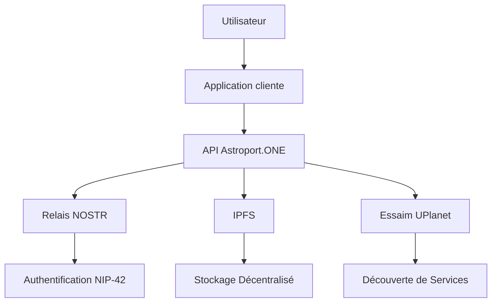
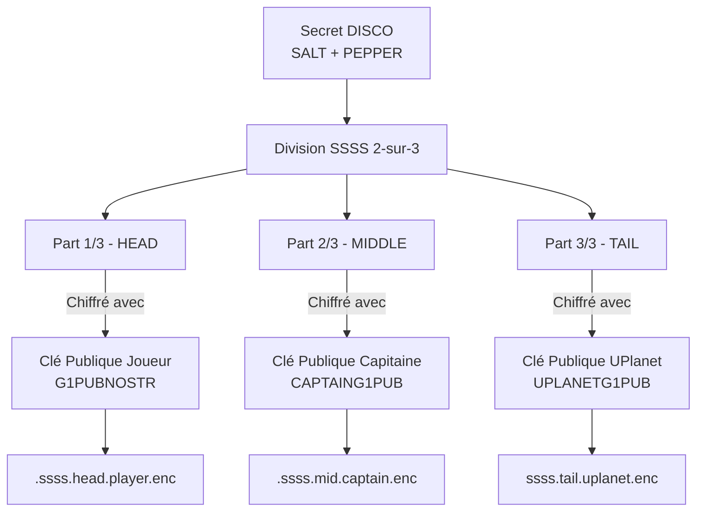
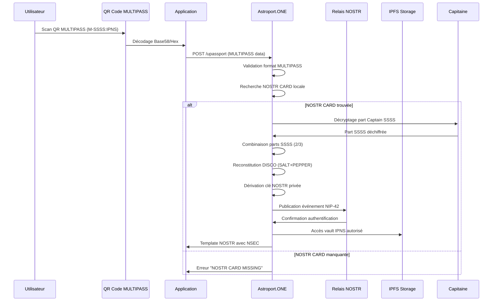
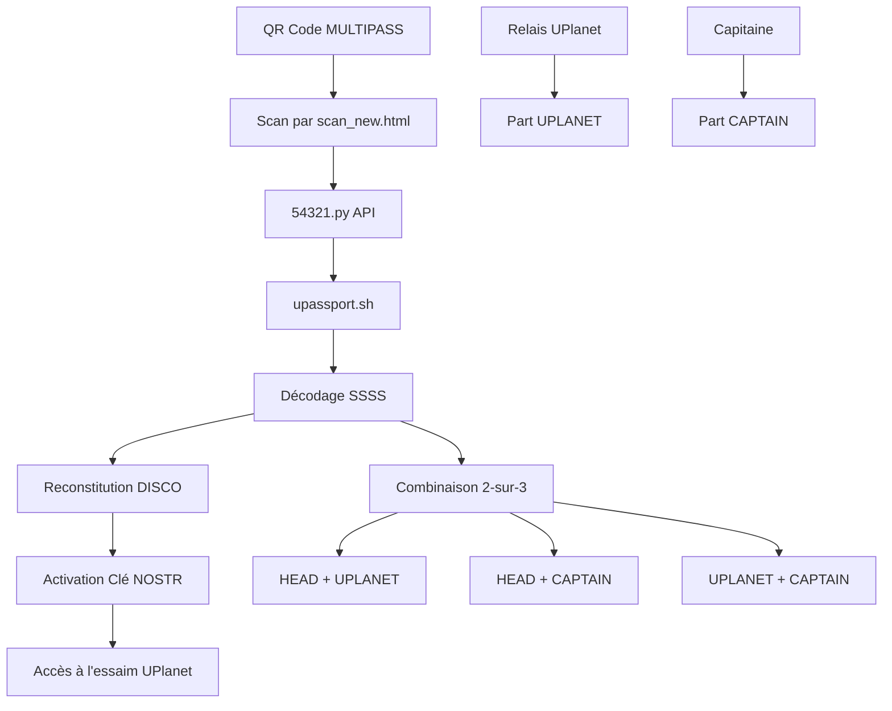
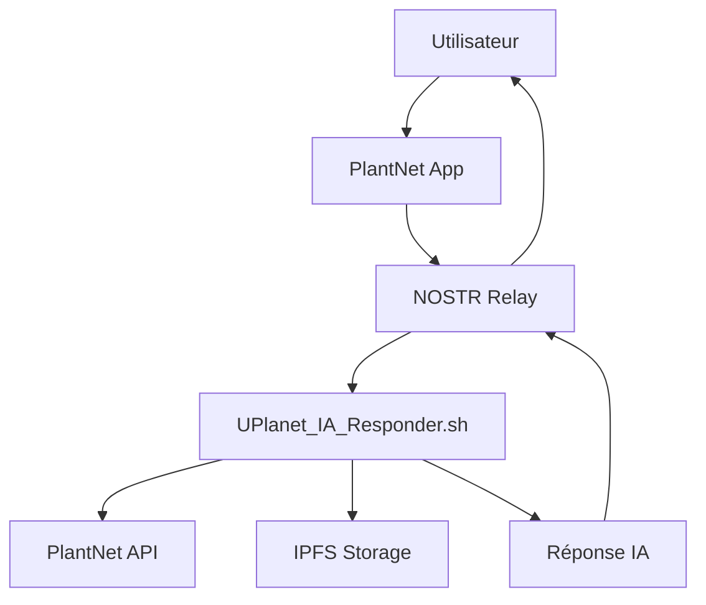
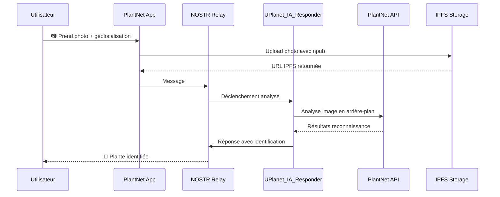
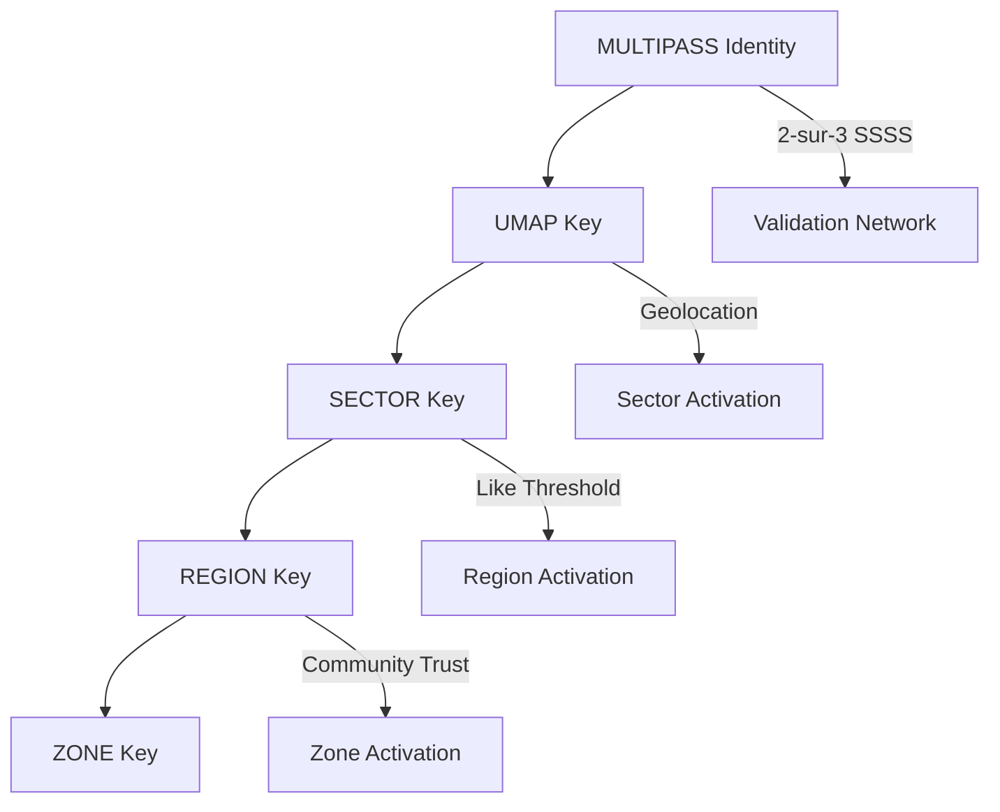
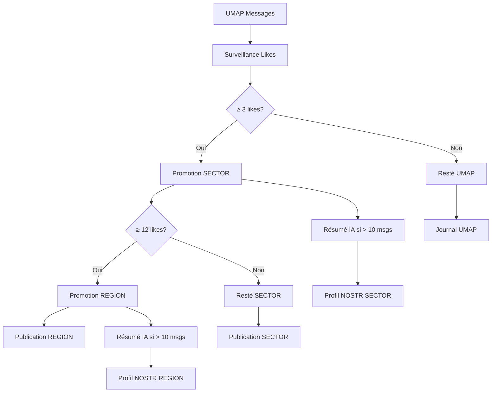
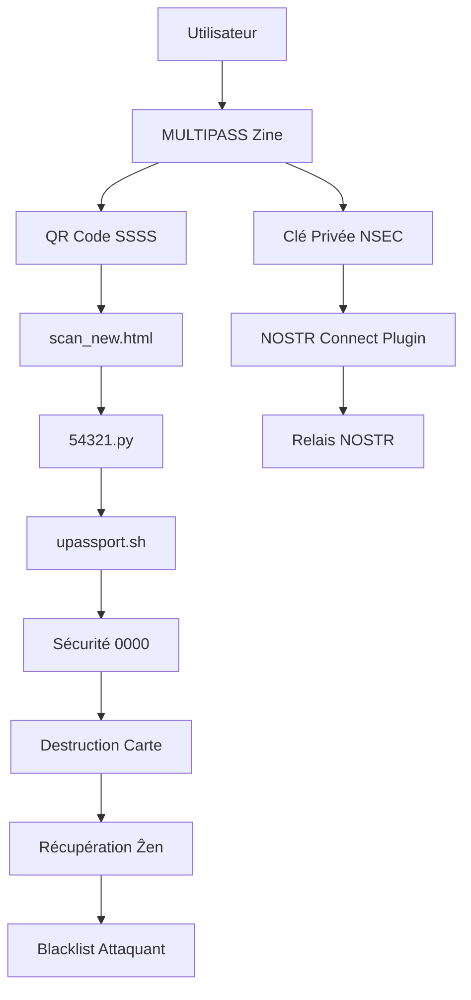
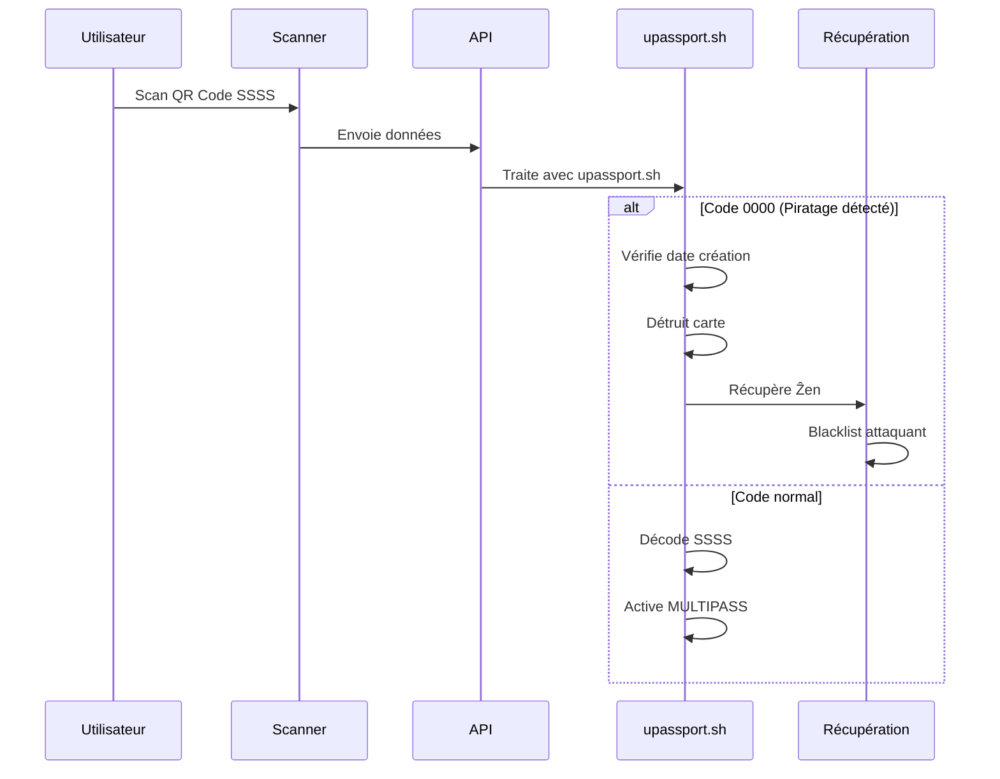

# 🔐 API NOSTR Auth - Guide Développeur Astroport.ONE

## ⚠️ AVERTISSEMENT CRITIQUE : IDENTITÉS CONTRÔLÉES

**ATTENTION : Les identités NOSTR dans l'écosystème UPlanet/Astroport.ONE ne peuvent PAS être générées arbitrairement !**

- ✅ **Création autorisée** : Uniquement via `make_NOSTRCARD.sh` avec système SSSS
- ❌ **Génération libre interdite** : Les clés NOSTR aléatoirement générées ne sont pas acceptées
- 🔒 **Sécurité MULTIPASS** : Chaque identité est protégée par un partage de secret 2-sur-3
- 🌐 **Validation réseau** : Seules les identités validées par un Capitaine de constellation sont reconnues

**Pourquoi cette restriction ?**
- Empêche les attaques Sybil et les identités malveillantes
- Garantit la traçabilité et la responsabilité des utilisateurs
- Assure l'interopérabilité avec l'écosystème G1/Duniter
- Permet la synchronisation sécurisée entre relais de confiance

---

## 🚀 Introduction

Astroport.ONE est une API décentralisée pour l'écosystème UPlanet, permettant l'authentification, le stockage distribué, la découverte de services et d'utilisateurs autour d'une position géographique, sans dépendre d'un cloud centralisé.

Ce guide s'adresse aux développeurs souhaitant créer des applications web, mobiles ou IoT interopérables avec l'essaim UPlanet.

---

## 🌐 Vue d'ensemble de l'écosystème UPlanet/Astroport



### Composants Principaux

- **Astroport.ONE** : API locale sur chaque node
- **UPlanet Swarm** : Réseau de nodes interconnectés (swarm.key)
- **NOSTR** : Protocole d'authentification décentralisé
- **IPFS** : Stockage distribué
- **UMAP/SECTOR/REGION/ZONE** : Découpage géographique hiérarchique

---

## 📚 Librairie JavaScript NOSTR

### Installation et Utilisation

Astroport.ONE utilise et recommande la librairie JavaScript NOSTR hébergée sur IPFS :

```html
<!-- Inclusion de la librairie NOSTR depuis IPFS -->
<script src="https://ipfs.copylaradio.com/ipfs/QmXEmaPRUaGcvhuyeG99mHHNyP43nn8GtNeuDok8jdpG4a/nostr.bundle.js"></script>
```

---

## 🔐 Authentification NOSTR (NIP-42)

### ⚠️ IMPORTANT : Création Contrôlée des Identités NOSTR

**Les identités NOSTR dans l'écosystème UPlanet/Astroport.ONE ne peuvent PAS être prises au hasard ou générées arbitrairement.** 

Toutes les identités NOSTR sont créées exclusivement par le script `make_NOSTRCARD.sh` qui implémente un système de sécurité cryptographique avancé basé sur le partage de secret de Shamir (SSSS - Shamir's Secret Sharing Scheme).

#### Processus de Création d'Identité MULTIPASS

- **Implémentation** : [make_NOSTRCARD.sh](https://github.com/papiche/Astroport.ONE/blob/master/tools/make_NOSTRCARD.sh) - Script de création d'identité NOSTR sécurisée
- **Usage** : `./make_NOSTRCARD.sh user@example.com [image] [lat] [lon] [salt] [pepper]`

**Étapes du processus :**

1. **Génération du DISCO** : Secret principal contenant SALT et PEPPER
2. **Division SSSS (2-sur-3)** : Le secret est divisé en 3 parts avec seuil de reconstruction à 2
3. **Chiffrement asymétrique** : Chaque part est chiffrée pour un acteur spécifique
4. **Dérivation des clés** : Toutes les clés (NOSTR, G1, Bitcoin, Monero) sont dérivées du même DISCO

#### Architecture de Sécurité SSSS



#### Autorisation et Délégation de Confiance

**Le relais Astroport et son Capitaine ont des autorisations spéciales :**

- **Synchronisation N²** : Le Capitaine peut décoder sa part SSSS pour synchroniser les données entre relais de la même constellation
- **Scripts de Traitement Délégués** : Le relais de confiance peut exécuter des programmes automatisés au nom de l'utilisateur
- **Validation Croisée** : Les relais d'une même constellation peuvent valider l'authenticité des identités MULTIPASS

#### Validation Croisée des Identités MULTIPASS

La validation croisée est assurée par le système de cache swarm (`~/.zen/tmp/swarm`) qui maintient une référence de tous les nœuds de l'essaim partageant la même constellation UPlanet. Cette synchronisation permet aux relais de vérifier l'authenticité des identités MULTIPASS de plusieurs façons :

##### 1. Recherche par Email (`search_for_this_email_in_nostr.sh`)

- **Implémentation** : [search_for_this_email_in_nostr.sh](https://github.com/papiche/Astroport.ONE/blob/master/tools/search_for_this_email_in_nostr.sh) - Recherche d'identité par email
- **Sources hiérarchiques** :
  - LOCAL : `~/.zen/game/nostr/${email}/` (identité locale)
  - CACHE : `~/.zen/tmp/${IPFSNODEID}/TW/${email}/` (cache du nœud)
  - SWARM : `~/.zen/tmp/swarm/*/TW/${email}/` (essaim de constellation)
- **Usage** : `./search_for_this_email_in_nostr.sh user@example.com`
- **Retour** : source, HEX, LAT, LON, EMAIL, G1PUBNOSTR, NPUB, RELAY
- **Mode JSON** : `./search_for_this_email_in_nostr.sh --all` pour toutes les identités

**Processus de validation :**
1. **Vérification locale** : L'identité existe-t-elle sur ce relais ?
2. **Vérification cache** : L'identité est-elle en cache local ?
3. **Vérification swarm** : L'identité existe-t-elle sur d'autres relais de la constellation ?
4. **Validation croisée** : Les métadonnées (GPS, G1PUBNOSTR, NPUB) sont-elles cohérentes ?

##### 2. Recherche par Clé HEX (`search_for_this_hex_in_uplanet.sh`)

- **Implémentation** : [search_for_this_hex_in_uplanet.sh](https://github.com/papiche/Astroport.ONE/blob/master/tools/search_for_this_hex_in_uplanet.sh) - Recherche d'identité par clé HEX
- **Usage** : `./search_for_this_hex_in_uplanet.sh 1a2b3c4d5e6f...` (recherche spécifique)
- **Liste** : `./search_for_this_hex_in_uplanet.sh` (toutes les clés disponibles)

**Sources de validation :**
- **SWARM UMAP HEX** : Clés géographiques des zones UPlanet
- **SWARM PLAYERs HEX** : Clés des joueurs dans l'essaim
- **LOCAL PLAYERs HEX** : Clés des joueurs locaux

### Pourquoi NOSTR avec SSSS ?

- **Authentification sans serveur central** : Aucun point de défaillance unique
- **Sécurité distribuée** : Le secret est partagé entre 3 entités de confiance
- **Récupération possible** : 2 des 3 parts suffisent pour reconstituer l'identité
- **Interopérabilité contrôlée** : Compatible NOSTR mais avec vérification d'origine
- **Résistance à la censure** : Distribution sur plusieurs relais de constellation
- **Souveraineté numérique** : L'utilisateur contrôle sa part + une part déléguée

### Workflow d'Authentification MULTIPASS




---

## 🔒 Sécurité et Bonnes Pratiques

### Gestion des Clés

```bash
# Génération sécurisée de clés (ancienne méthode)
openssl rand -hex 32

# Nouvelle méthode SSSS / 3
~/.zen/Astroport.ONE/tools/make_NOSTRCARD.sh 
Usage: Make_NOSTRCARD.sh [OPTIONS] <EMAIL> [IMAGE] [LATITUDE] [LONGITUDE] [SALT] [PEPPER]

  Generates a NOSTR card and related cryptographic keys, stores them
  locally, and prepares files for a NOSTR application.

Arguments:
  <EMAIL>        Email address to associate with the NOSTR card.
                 Must be a valid email format.
  [IMAGE]        Optional: Path to an image file to use as profile picture.
                 Alternatively, a two-letter language code (e.g., 'en', 'fr')
                 to set the language. If omitted, defaults to 'fr'.
  [LATITUDE]     Optional: UMAP Latitude for location data.
  [LONGITUDE]    Optional: UMAP Longitude for location data.
  [SALT]         Optional: Salt for key generation. If omitted, a random salt is generated.
  [PEPPER]       Optional: Pepper for key generation. If omitted, a random pepper is generated.

Options:
  -h, --help    Display this help message and exit.

Example:
  make_NOSTRCARD.sh john.doe@example.com ./profile.png 48.85 2.35
  make_NOSTRCARD.sh jane.doe@example.com en


```

### Sécurité Cryptographique SSSS Détaillée

#### Architecture du Partage de Secret (SSSS)

Le secret principal (DISCO) contient les paramètres de dérivation de toutes les clés :
```
DISCO = "/?email@domain.com=SALT&nostr=PEPPER"
```

**Division SSSS (Seuil 2-sur-3) :**

```bash
# Division automatique par make_NOSTRCARD.sh
echo "$DISCO" | ssss-split -t 2 -n 3 -q > ${EMAIL}.ssss

# Extraction des 3 parts
HEAD=$(head -n 1 ${EMAIL}.ssss)     # Part 1/3
MIDDLE=$(head -n 2 | tail -n 1)     # Part 2/3  
TAIL=$(tail -n 1 ${EMAIL}.ssss)     # Part 3/3
```

#### Chiffrement Asymétrique des Parts

**Partie 1 : Chiffrée pour le joueur (contrôle personnel)**
```bash
# Stockage : ~/.zen/game/nostr/*@*/.ssss.head.player.enc
natools.py encrypt -p $G1PUBNOSTR -i ${EMAIL}.ssss.head -o .ssss.head.player.enc
```

**Partie 2 : Chiffrée pour le capitaine (délégation de confiance)**
```bash
# Stockage : ~/.zen/game/nostr/*@*/.ssss.mid.captain.enc  
natools.py encrypt -p $CAPTAING1PUB -i ${EMAIL}.ssss.mid -o .ssss.mid.captain.enc
```

**Partie 3 : Chiffrée pour UPlanet (infrastructure réseau)**
```bash
# Stockage : ~/.zen/game/nostr/*@*/ssss.tail.uplanet.enc
natools.py encrypt -p $UPLANETG1PUB -i ${EMAIL}.ssss.tail -o ssss.tail.uplanet.enc
```

#### Activation via Scan QR Code MULTIPASS

**Le QR Code sur le MULTIPASS contient la part HEAD (utilisateur) + IPNS Vault :**



**Processus d'Activation :**

1. **Scan QR Code** : L'utilisateur scanne le QR Code de son MULTIPASS
2. **Transmission** : Le QR Code contient `M-{SSSS_HEAD_B58}:{IPNS_VAULT}`
3. **Décodage** : `upassport.sh` décode la part HEAD depuis le QR Code
4. **Récupération** : Le relais récupère sa part UPLANET depuis `~/.zen/tmp/${IPFSNODEID}/`
5. **Reconstitution** : Combinaison HEAD + UPLANET pour reconstituer le DISCO
6. **Activation** : Dérivation de la clé NOSTR et activation dans l'essaim

**Implémentation du Scan :**
- **Scanner** : [scan_new.html](https://github.com/papiche/UPassport/blob/master/templates/scan_new.html) - Interface de scan QR
- **API** : [54321.py](https://github.com/papiche/UPassport/blob/master/54321.py) - Traitement des données
- **Moteur** : [upassport.sh](https://github.com/papiche/UPassport/blob/master/upassport.sh) - Décodage SSSS et activation

#### Avantages de Sécurité

- **Pas de point de défaillance unique** : Aucune entité ne peut reconstituer seule l'identité
- **Récupération possible** : Perte d'une part ne compromet pas l'accès
- **Délégation contrôlée** : Le Capitaine peut agir pour l'utilisateur avec autorisation
- **Synchronisation sécurisée** : Les relais de constellation peuvent valider sans exposer le secret complet
- **Dérivation déterministe** : Toutes les clés (NOSTR, G1, Bitcoin, Monero, IPFS) sont dérivées du même DISCO

#### Synchronisation N² et Scripts de Traitement Délégués

**Le relais Astroport et son Capitaine disposent d'autorisations spéciales pour :**

##### 1. Synchronisation N² entre Relais de Constellation

**Le Capitaine peut décoder sa part SSSS pour synchroniser les données entre relais :**

- **Implémentation** : [Lignes 295-301](https://github.com/papiche/UPassport/blob/master/upassport.sh#L295-L301) - Décryptage de la part Captain
- **Processus** :
  1. Décryptage de la part Captain avec `CAPTAING1PUB` privée
  2. Combinaison avec la part UPlanet pour reconstituer DISCO
  3. Dérivation des clés nécessaires pour la synchronisation
  4. Validation croisée avec les autres relais de la constellation
- **Résultat** : Synchronisation automatique des identités MULTIPASS dans l'essaim

##### 1.1. Forward IPFS P2P et Synchronisation N²

**Le script `DRAGON_p2p_ssh.sh` assure la connectivité et la synchronisation entre stations de l'essaim :**

- **Implémentation** : [DRAGON_p2p_ssh.sh](https://github.com/papiche/Astroport.ONE/blob/master/RUNTIME/DRAGON_p2p_ssh.sh) - Forward IPFS P2P et synchronisation N²
- **Fonctionnalités** :
  - **Forward SSH** : [Lignes 165-189](https://github.com/papiche/Astroport.ONE/blob/master/RUNTIME/DRAGON_p2p_ssh.sh#L165-L189) - Tunnel SSH via IPFS P2P
  - **Forward Relay** : [Lignes 314-340](https://github.com/papiche/Astroport.ONE/blob/master/RUNTIME/DRAGON_p2p_ssh.sh#L314-L340) - Tunnel NOSTR relay via IPFS P2P
  - **Synchronisation N²** : [Lignes 110-122](https://github.com/papiche/Astroport.ONE/blob/master/RUNTIME/DRAGON_p2p_ssh.sh#L110-L122) - Follow automatique des nœuds UMAP
- **Services Forwardés** :
  - SSH (port 22) → `/x/ssh-${IPFSNODEID}`
  - NOSTR Relay (port 7777) → `/x/strfry-${IPFSNODEID}`
  - OLLAMA (port 11434) → `/x/ollama-${IPFSNODEID}`
  - ComfyUI (port 8188) → `/x/comfyui-${IPFSNODEID}`
  - Orpheus (port 5005) → `/x/orpheus-${IPFSNODEID}`
  - Perplexica (port 3001) → `/x/perplexica-${IPFSNODEID}`

**Processus de Synchronisation N² :**

1. **Activation du DRAGON** : Le script s'exécute sur chaque station de l'essaim
2. **Forward des Services** : Les ports locaux sont exposés via IPFS P2P
3. **Follow Automatique** : [Lignes 110-122](https://github.com/papiche/Astroport.ONE/blob/master/RUNTIME/DRAGON_p2p_ssh.sh#L110-L122) - Follow automatique des nœuds UMAP actifs
4. **Synchronisation des Messages** : Les messages des "amis d'amis" sont automatiquement synchronisés
5. **Réseau Maillé** : Chaque station peut accéder aux services des autres via IPFS P2P

**Avantages de l'Architecture DRAGON :**
- **Résilience** : Pas de point de défaillance unique
- **Décentralisation** : Chaque station est autonome
- **Synchronisation** : Messages propagés automatiquement dans l'essaim
- **Sécurité** : Accès SSH sécurisé via IPFS P2P
- **Scalabilité** : Ajout facile de nouvelles stations à l'essaim

##### 2. Exécution de Scripts de Traitement Délégués

**Le relais de confiance peut exécuter des actions automatisées :**

- **Implémentation** : [Lignes 340-347](https://github.com/papiche/UPassport/blob/master/upassport.sh#L340-L347) - Activation de la clé NOSTR
- **Capacités** :
  - Décoder les parts SSSS autorisées
  - Signer des événements NOSTR au nom de l'utilisateur
  - Exécuter des transactions G1 automatiques
  - Synchroniser des données IPFS
- **Sécurité** : Vérification de l'autorisation du relais et des parts SSSS valides

##### 3. Validation d'Authenticité MULTIPASS

- **Implémentation** : [Lignes 194-204](https://github.com/papiche/UPassport/blob/master/upassport.sh#L194-L204) - Vérification de l'existence de l'identité
- **Processus de validation** :
  1. Vérifier la présence des fichiers SSSS chiffrés
  2. Contrôler la cohérence des clés dérivées
  3. Valider la signature de création par un Capitaine autorisé
  4. Confirmer l'existence du vault IPNS correspondant
- **Résultat** : Confirmation de l'authenticité de l'identité MULTIPASS

**⚠️ Sécurité Importante :**
- Seuls les relais partageant la même `swarm.key` peuvent participer à la synchronisation N²
- Les smart contracts délégués nécessitent une autorisation explicite de l'utilisateur
- La validation croisée empêche les attaques de relais malveillants
- L'audit des actions déléguées est tracé dans les événements NOSTR

### Blacklist Management

```bash
# Ajouter une clé à la blacklist
echo "hex1..." >> ~/.zen/strfry/blacklist.txt

# Supprimer une clé de la blacklist
sed -i '/hex1.../d' ~/.zen/strfry/blacklist.txt
```

---

## 🔧 Fat Layer Protocol - Exemples Pratiques

### Mode API - Récupération du Capitaine et Profil

Le Fat Layer Protocol permet de récupérer automatiquement l'ID du capitaine et d'afficher son profil via l'API NOSTR.

#### Récupération de l'ID du Capitaine

- **Implémentation** : [Lignes 570-628](https://github.com/papiche/UPlanet/blob/master/earth/coinflip/index.html#L570-L628) - Fonction `fetchCaptainData()` dans coinflip
- **Processus** :
  1. Récupération des données ASTROPORT station via `window.__ASTROPORT_STATION_URL__`
  2. Extraction du `captainHEX` depuis la réponse JSON
  3. Récupération du profil et des messages du CAPTAIN
  4. Affichage des soldes et informations du CAPTAIN

#### Affichage du Profil Utilisateur

- **Implémentation** : [Lignes 1224-1499](https://github.com/papiche/UPlanet/blob/master/earth/coinflip/index.html#L1224-L1499) - Fonction `fetchAndDisplayProfile()` dans coinflip
- **Fonctionnalités** :
  - Affichage du profil utilisateur avec avatar et informations
  - Gestion des tags G1PUB pour les soldes
  - Interface utilisateur pour la navigation des profils
  - Intégration avec le système de paiement ẐEN

#### Récupération du Dernier Message

- **Implémentation** : [nostr_profile_viewer.html](https://github.com/papiche/UPlanet/blob/master/earth/nostr_profile_viewer.html) - Fonctions de récupération des messages
- **Fonctionnalités** :
  - Récupération des messages NOSTR (kind 1) depuis les relais
  - Affichage des messages récents avec métadonnées
  - Gestion des liens IPFS dans les messages
  - Interface utilisateur pour la navigation des messages

#### Envoi de Like via NOSTR

- **Implémentation** : [Lignes 837-931](https://github.com/papiche/UPlanet/blob/master/earth/coinflip/index.html#L837-L931) - Fonction `sendLikeToCaptain()` dans coinflip
- **Fonctionnalités** :
  - Création d'événements de réaction (kind 7)
  - Signature et publication sur les relais NOSTR
  - Gestion des erreurs et timeouts
  - Intégration avec le système de paiement ẐEN

#### Méthode de Connexion (Style copylaradio.com/coinflip)

- **Implémentation** : [Lignes 1190-1594](https://github.com/papiche/UPlanet/blob/master/earth/coinflip/index.html#L1190-L1594) - Fonctions de connexion NOSTR dans coinflip
- **Fonctionnalités** :
  - Détection automatique des relais NOSTR
  - Authentification NIP-42 avec événements 22242
  - Gestion des profils utilisateur et des soldes
  - Interface utilisateur pour la connexion et l'authentification

### Mode Scanner QR Code - MULTIPASS SSSS

Le mode scanner QR Code permet de traiter les clés SSSS du MULTIPASS pour l'authentification paper wallet.

#### Traitement des QR Codes MULTIPASS

- **Implémentation** : [Lignes 263-318](https://github.com/papiche/UPassport/blob/master/upassport.sh#L263-L318) - Décodage SSSS MULTIPASS dans upassport.sh
- **Processus** :
  1. Détection du format QR Code (M- ou 1-)
  2. Décodage Base58/Hex du QR Code
  3. Extraction de la part SSSS et du vault IPNS
  4. Recherche de la NOSTR CARD locale
  5. Décryptage de la part UPLANET
  6. Combinaison des parts SSSS (2-sur-3)
  7. Génération de la clé NSEC pour l'authentification

#### Interface Scanner HTML

- **Implémentation** : [scan_new.html](https://github.com/papiche/UPassport/blob/master/templates/scan_new.html) - Interface de scan QR Code pour MULTIPASS
- **Fonctionnalités** :
  - Scanner QR Code avec caméra (Instascan.js)
  - Interface de saisie manuelle avec clavier numérique
  - Capture d'image du QR Code scanné
  - Gestion des caméras multiples (front/back)
  - Intégration avec l'API UPassport (`/upassport`)
  - Support des codes de destruction "0000"


#### Template NOSTR pour Paper Wallet

- **Implémentation** : [nostr.html](https://github.com/papiche/Astroport.ONE/blob/master/templates/NOSTR/zine/nostr.html) - Template NOSTR pour l'authentification paper wallet
- **Fonctionnalités** :
  - Configuration automatique avec NSEC du MULTIPASS
  - Initialisation automatique si NSEC fourni
  - Fallback sur l'extension NOSTR si pas de NSEC
  - Intégration avec le système de profils et messages

---

## 🌿 Cas d'Usage : API Personnalisée avec PlantNet

### Application Flora Explorer - Intégration NOSTR + PlantNet

https://ipfs.copylaradio.com/ipns/copylaradio.com/plantnet.html

L'application `plantnet.html` démontre comment créer une API personnalisée qui répond aux tags NOSTR reconnus par `UPlanet_IA_Responder.sh`. Cette application permet de cataloguer la flore avec reconnaissance PlantNet et partage sur la UMAP.

#### Architecture de l'Application



#### Tags NOSTR Supportés

L'application utilise les tags suivants reconnus par `UPlanet_IA_Responder.sh` :

| Tag | Fonction | Description |
|-----|----------|-------------|
| `#BRO` | Assistant IA | Active la réponse IA automatique |
| `#plantnet` | Reconnaissance | Analyse d'image avec PlantNet |
| `#rec` | Enregistrement | Stockage en mémoire IA |
| `#mem` | Affichage mémoire | Afficher l'historique |

#### Implémentation JavaScript

Les fonctions principales sont implémentées dans `plantnet.html` :

- **Configuration NOSTR** : [Lignes 810-825](https://github.com/papiche/UPlanet/blob/main/earth/plantnet.html#L810-L825) - Variables globales et configuration des relais
- **Détection API uSPOT** : [Lignes 832-862](https://github.com/papiche/UPlanet/blob/main/earth/plantnet.html#L832-L862) - `detectUSPOTAPI()` 
- **Connexion NOSTR** : [Lignes 865-893](https://github.com/papiche/UPlanet/blob/main/earth/plantnet.html#L865-L893) - `handleNostrLogin()`
- **Connexion relay** : [Lignes 914-946](https://github.com/papiche/UPlanet/blob/main/earth/plantnet.html#L914-L946) - `connectToNostrRelay()`
- **Upload IPFS** : [Lignes 1150-1211](https://github.com/papiche/UPlanet/blob/main/earth/plantnet.html#L1150-L1211) - `uploadPhotoToIPFS()`
- **Envoi message** : [Lignes 1246-1341](https://github.com/papiche/UPlanet/blob/main/earth/plantnet.html#L1246-L1341) - `sendGeolocatedMessage()`
- **Gestion profil** : [Lignes 949-1120](https://github.com/papiche/UPlanet/blob/main/earth/plantnet.html#L949-L1120) - `loadUserProfileAndMessages()`

#### Traitement par UPlanet_IA_Responder.sh

Quand un message avec les tags `#BRO #plantnet` est reçu, le script `UPlanet_IA_Responder.sh` :

1. **Détection des tags** : [Lignes 135-148](https://github.com/papiche/Astroport.ONE/blob/master/IA/UPlanet_IA_Responder.sh#L135-L148) - Détection des tags NOSTR
2. **Traitement PlantNet** : [Lignes 529-565](https://github.com/papiche/Astroport.ONE/blob/master/IA/UPlanet_IA_Responder.sh#L529-L565) - Logique de reconnaissance PlantNet
3. **Analyse en arrière-plan** : [Lignes 220-249](https://github.com/papiche/Astroport.ONE/blob/master/IA/UPlanet_IA_Responder.sh#L220-L249) - `handle_plantnet_background()`
4. **Script PlantNet** : [plantnet_recognition.py](https://github.com/papiche/Astroport.ONE/blob/master/IA/plantnet_recognition.py) - Script Python pour l'analyse d'images

#### Workflow Complet



#### Avantages de cette Architecture

1. **Décentralisation** : Aucun serveur central, tout via NOSTR
2. **Attribution** : Photos liées à l'identité NOSTR de l'utilisateur
3. **Géolocalisation** : Intégration UMAP pour cartographie de la flore
4. **IA Distribuée** : Traitement par le réseau UPlanet
5. **Stockage IPFS** : Images stockées de manière décentralisée
6. **Extensibilité** : Facile d'ajouter de nouveaux tags et fonctionnalités

#### Création d'APIs Personnalisées

Pour créer votre propre API répondant aux tags NOSTR :

1. **Définir vos tags** : [Lignes 118-148](https://github.com/papiche/Astroport.ONE/blob/master/IA/UPlanet_IA_Responder.sh#L118-L148) - Ajouter vos tags dans la détection
2. **Implémenter la logique** : [Lignes 348-689](https://github.com/papiche/Astroport.ONE/blob/master/IA/UPlanet_IA_Responder.sh#L348-L689) - Ajouter votre traitement dans la logique principale
3. **Intégrer avec l'API** : Utiliser les fonctions existantes (IPFS, géolocalisation, etc.)
4. **Tester avec l'application** : Utiliser `plantnet.html` comme base de test

**Exemple d'ajout de tag personnalisé** :
- Détection : [Ligne 148](https://github.com/papiche/Astroport.ONE/blob/master/IA/UPlanet_IA_Responder.sh#L148) - Ajouter `if [[ "$message_text" =~ \#myapi ]]; then TAGS[myapi]=true; fi`
- Traitement : [Lignes 462-601](https://github.com/papiche/Astroport.ONE/blob/master/IA/UPlanet_IA_Responder.sh#L462-L601) - Ajouter votre logique dans la section des commandes spécialisées

---

## 🏗️ Scripts de Traitement et Architecture des Clés

### Hiérarchie des Clés UMAP

L'écosystème UPlanet utilise une architecture hiérarchique de clés basée sur la géolocalisation et les niveaux de confiance :



### Architecture de Diffusion UPlanet

L'architecture UPlanet utilise un système de surveillance et de relais automatique basé sur les likes et la géolocalisation, implémenté dans `NOSTR.UMAP.refresh.sh` :

#### 1. **Clé UMAP (Niveau 0) - Surveillance Locale**
- **Activation** : Automatique avec identité MULTIPASS validée
- **Portée** : Position géographique précise (lat/lon)
- **Fonctions** : 
  - Surveillance des messages des amis géolocalisés
  - Création de journaux locaux (max 10 messages ou 3000 caractères)
  - Résumé IA automatique si dépassement de seuil
  - Gestion des amis inactifs (suppression après 4 semaines)

#### 2. **Clé SECTOR (Niveau 1) - Agrégation Régionale**
- **Activation** : Messages avec ≥ 3 likes dans la zone 10° × 10°
- **Portée** : Zone géographique de 10° × 10°
- **Fonctions** :
  - Surveillance automatique des likes sur messages UMAP
  - Agrégation des messages populaires (≥ 3 likes)
  - Création de journaux SECTOR avec résumé IA
  - Publication sur profil NOSTR SECTOR
  - Mise à jour calendrier IPFS

#### 3. **Clé REGION (Niveau 2) - Diffusion Large**
- **Activation** : Messages avec ≥ 12 likes dans la zone 30° × 30°
- **Portée** : Zone géographique de 30° × 30°
- **Fonctions** :
  - Surveillance des messages SECTOR populaires
  - Agrégation des contenus très appréciés (≥ 12 likes)
  - Création de journaux REGION avec résumé IA
  - Publication sur profil NOSTR REGION
  - Coordination inter-SECTOR

#### 4. **Système de Surveillance Automatique**
- **Script de surveillance** : `NOSTR.UMAP.refresh.sh` s'exécute quotidiennement
- **Détection des likes** : Utilise `strfry scan` pour détecter les réactions (kind 7)
- **Seuils adaptatifs** : SECTOR (3 likes), REGION (12 likes)
- **Résumé IA** : Utilise `question.py` pour résumer les contenus longs
- **Nettoyage automatique** : Suppression des contenus orphelins et anciens

### Workflow de Surveillance NOSTR.UMAP.refresh.sh

Le script `NOSTR.UMAP.refresh.sh` implémente l'architecture de diffusion réelle :



#### Fonctionnalités Clés du Script

1. **Surveillance des UMAP** : [Lignes 129-175](https://github.com/papiche/Astroport.ONE/blob/master/RUNTIME/NOSTR.UMAP.refresh.sh#L129-L175)
   - Traitement des messages UMAP par géolocalisation
   - Création de journaux locaux avec limites (10 messages, 3000 caractères)
   - Résumé IA automatique si dépassement

2. **Détection des Likes** : [Lignes 696-704](https://github.com/papiche/Astroport.ONE/blob/master/RUNTIME/NOSTR.UMAP.refresh.sh#L696-L704)
   - Utilise `strfry scan` pour compter les réactions (kind 7)
   - Détection des emojis de like : `+`, `👍`, `❤️`, `♥️`

3. **Promotion SECTOR** : [Lignes 706-798](https://github.com/papiche/Astroport.ONE/blob/master/RUNTIME/NOSTR.UMAP.refresh.sh#L706-L798)
   - Agrégation des messages avec ≥ 3 likes
   - Création de journaux SECTOR avec résumé IA
   - Publication sur profil NOSTR SECTOR

4. **Promotion REGION** : [Lignes 884-954](https://github.com/papiche/Astroport.ONE/blob/master/RUNTIME/NOSTR.UMAP.refresh.sh#L884-L954)
   - Agrégation des messages avec ≥ 12 likes
   - Création de journaux REGION avec résumé IA
   - Publication sur profil NOSTR REGION

5. **Gestion des Amis** : [Lignes 177-245](https://github.com/papiche/Astroport.ONE/blob/master/RUNTIME/NOSTR.UMAP.refresh.sh#L177-L245)
   - Surveillance de l'activité des amis
   - Suppression des amis inactifs (4 semaines)
   - Envoi de rappels aux amis peu actifs

6. **Nettoyage Automatique** : [Lignes 538-644](https://github.com/papiche/Astroport.ONE/blob/master/RUNTIME/NOSTR.UMAP.refresh.sh#L538-L644)
   - Suppression des contenus orphelins
   - Nettoyage des images anciennes (6 mois)
   - Suppression des annonces expirées

### Scripts de Traitement en Bash et Python

Les scripts de traitement UPlanet sont implémentés directement dans le code Astroport.ONE en bash et Python. Le système de mise à jour automatique se déroule via `20h12.process.sh` :

#### 1. **Script de Surveillance des Likes**
- **Implémentation** : [Lignes 696-704](https://github.com/papiche/Astroport.ONE/blob/master/RUNTIME/NOSTR.UMAP.refresh.sh#L696-L704) - Fonction `count_likes()`
- **Logique** : Utilise `strfry scan` pour détecter les réactions (kind 7)
- **Seuils** : SECTOR (3 likes), REGION (12 likes)

#### 2. **Script d'Agrégation SECTOR**
- **Implémentation** : [Lignes 706-798](https://github.com/papiche/Astroport.ONE/blob/master/RUNTIME/NOSTR.UMAP.refresh.sh#L706-L798) - Fonction `create_aggregate_journal()`
- **Logique** : Agrégation des messages avec ≥ 3 likes dans une zone 10° × 10°
- **Résumé IA** : Utilise `question.py` si journal > 10 messages ou 3000 caractères

#### 3. **Script d'Agrégation REGION**
- **Implémentation** : [Lignes 884-954](https://github.com/papiche/Astroport.ONE/blob/master/RUNTIME/NOSTR.UMAP.refresh.sh#L884-L954) - Fonction `create_region_journal()`
- **Logique** : Agrégation des messages avec ≥ 12 likes dans une zone 30° × 30°
- **Coordination** : Gestion inter-SECTOR

#### 4. **Script de Gestion des Amis**
- **Implémentation** : [Lignes 177-245](https://github.com/papiche/Astroport.ONE/blob/master/RUNTIME/NOSTR.UMAP.refresh.sh#L177-L245) - Fonction `process_friend_messages()`
- **Logique** : Surveillance de l'activité, suppression des inactifs (4 semaines)
- **Rappels** : Envoi automatique de messages de rappel

#### 5. **Script de Nettoyage**
- **Implémentation** : [Lignes 538-644](https://github.com/papiche/Astroport.ONE/blob/master/RUNTIME/NOSTR.UMAP.refresh.sh#L538-L644) - Fonctions `cleanup_*()`
- **Logique** : Suppression des contenus orphelins, images anciennes (6 mois)
- **Maintenance** : Nettoyage automatique des annonces expirées

### Extension des Scripts de Traitement

Pour implémenter de nouveaux scripts de traitement, il suffit de forker Astroport.ONE et d'ajouter vos fonctions

#### 1. **Ajout de Nouveaux Tags**
- **Localisation** : [Lignes 118-148](https://github.com/papiche/Astroport.ONE/blob/master/IA/UPlanet_IA_Responder.sh#L118-L148) - Section détection des tags
- **Exemple** : Ajouter `if [[ "$message_text" =~ \#myapi ]]; then TAGS[myapi]=true; fi`

#### 2. **Implémentation de Nouveaux Contrats**
- **Localisation** : [Lignes 348-689](https://github.com/papiche/Astroport.ONE/blob/master/IA/UPlanet_IA_Responder.sh#L348-L689) - Section commandes spécialisées
- **Pattern** : Ajouter votre logique dans la section des commandes spécialisées

#### 3. **Intégration avec l'API**
- **Upload IPFS** : [Lignes 1150-1211](https://github.com/papiche/UPlanet/blob/main/earth/plantnet.html#L1150-L1211) - Fonction `uploadPhotoToIPFS()`
- **Géolocalisation** : [Lignes 1246-1341](https://github.com/papiche/UPlanet/blob/main/earth/plantnet.html#L1246-L1341) - Fonction `sendGeolocatedMessage()`
- **Profil NOSTR** : [Lignes 949-1120](https://github.com/papiche/UPlanet/blob/main/earth/plantnet.html#L949-L1120) - Fonction `loadUserProfileAndMessages()`

---

## 🎫 Architecture MULTIPASS et Sécurité

### Vue d'ensemble du Système MULTIPASS



### Composants du Système MULTIPASS

#### 1. **MULTIPASS Zine** (`nostr.html`)
- **Fichier** : [Astroport.ONE/templates/NOSTR/zine/nostr.html](https://github.com/papiche/Astroport.ONE/blob/master/templates/NOSTR/zine/nostr.html)
- **Contenu** : Clé privée NSEC + QR Code SSSS
- **Usage** : Double authentification (plugin + QR)

#### 2. **Scanner Terminal** (`scan_new.html`)
- **Fichier** : [UPassport/templates/scan_new.html](https://github.com/papiche/UPassport/blob/master/templates/scan_new.html)
- **Fonction** : Scan QR Code SSSS + authentification
- **Sécurité** : Clavier numérique randomisé

#### 3. **API de Traitement** (`54321.py`)
- **Fichier** : [UPassport/54321.py](https://github.com/papiche/UPassport/blob/master/54321.py)
- **Endpoints** :
  - `/scan` : Interface de scan
  - `/upassport` : Traitement des QR codes
  - `/nostr` : Interface NOSTR

#### 4. **Moteur de Traitement** (`upassport.sh`)
- **Fichier** : [UPassport/upassport.sh](https://github.com/papiche/UPassport/blob/master/upassport.sh)
- **Fonctions** :
  - Décodage SSSS (2-sur-3)
  - Gestion des cartes MULTIPASS
  - Sécurité anti-piratage

### Mécanismes de Sécurité

#### 🔒 **Système SSSS (Shamir's Secret Sharing)**
- **Implémentation** : [Lignes 990-998](https://github.com/papiche/UPassport/blob/master/upassport.sh#L990-L998) - Partage du secret en 3 parts (2 nécessaires)
- **Distribution** : [Lignes 992-994](https://github.com/papiche/UPassport/blob/master/upassport.sh#L992-L994) - HEAD (utilisateur), MIDDLE (UPlanet), TAIL (Capitaine)
- **Test décodage** : [Lignes 995-998](https://github.com/papiche/UPassport/blob/master/upassport.sh#L995-L998) - Vérification du bon fonctionnement

#### 🚨 **Code de Destruction "0000"**
- **Détection** : [Lignes 207-228](https://github.com/papiche/UPassport/blob/master/upassport.sh#L207-L228) - Vérification du code 0000 et date de création
- **Destruction sécurisée** : [Lignes 213-217](https://github.com/papiche/UPassport/blob/master/upassport.sh#L213-L217) - Suppression de la carte MULTIPASS
- **Gestion erreur** : [Lignes 220-227](https://github.com/papiche/UPassport/blob/master/upassport.sh#L220-L227) - Message d'erreur si compte non créé aujourd'hui

#### 💰 **Récupération des Ẑen Détournés**
- **Génération clé privée** : [Lignes 321-322](https://github.com/papiche/UPassport/blob/master/upassport.sh#L321-L322) - Création de la clé de récupération
- **Récupération données** : [Lignes 323-325](https://github.com/papiche/UPassport/blob/master/upassport.sh#L323-L325) - Lecture G1PUBNOSTR, G1PRIME et montant
- **Transfert sécurisé** : [Ligne 328](https://github.com/papiche/UPassport/blob/master/upassport.sh#L328) - PAYforSURE.sh vers le compte primal
- **Confirmation** : [Lignes 333-337](https://github.com/papiche/UPassport/blob/master/upassport.sh#L333-L337) - Message de confirmation du transfert

### Workflow de Sécurité



### Avantages du Système

- **🔐 Double Authentification** : Plugin + QR Code
- **🛡️ Anti-Piratage** : Code 0000 pour destruction
- **💰 Récupération** : Ẑen automatiquement récupérés
- **📊 Traçabilité** : Historique complet des transactions
- **🚫 Blacklist** : Identification rapide des attaquants
- **🌐 Décentralisé** : Pas de point de défaillance unique

### Application PlantNet - Exemple Complet

L'application `plantnet.html` démontre l'intégration complète avec les smart contracts UPlanet :

#### 1. **Configuration NOSTR**
- **Implémentation** : [Lignes 810-825](https://github.com/papiche/UPlanet/blob/main/earth/plantnet.html#L810-L825) - Variables globales et configuration des relais
- **Détection API** : [Lignes 832-862](https://github.com/papiche/UPlanet/blob/main/earth/plantnet.html#L832-L862) - `detectUSPOTAPI()`

#### 2. **Authentification MULTIPASS**
- **Connexion NOSTR** : [Lignes 865-893](https://github.com/papiche/UPlanet/blob/main/earth/plantnet.html#L865-L893) - `handleNostrLogin()`
- **Connexion relay** : [Lignes 914-946](https://github.com/papiche/UPlanet/blob/main/earth/plantnet.html#L914-L946) - `connectToNostrRelay()`

#### 3. **Scripts de Traitement Intégrés**
- **Upload IPFS** : [Lignes 1150-1211](https://github.com/papiche/UPlanet/blob/main/earth/plantnet.html#L1150-L1211) - `uploadPhotoToIPFS()` avec attribution npub
- **Envoi message** : [Lignes 1246-1341](https://github.com/papiche/UPlanet/blob/main/earth/plantnet.html#L1246-L1341) - `sendGeolocatedMessage()` avec tags #BRO #plantnet
- **Gestion profil** : [Lignes 949-1120](https://github.com/papiche/UPlanet/blob/main/earth/plantnet.html#L949-L1120) - `loadUserProfileAndMessages()`

#### 4. **Traitement par Scripts**
- **Détection tags** : [Lignes 135-148](https://github.com/papiche/Astroport.ONE/blob/master/IA/UPlanet_IA_Responder.sh#L135-L148) - Détection des tags NOSTR
- **Traitement PlantNet** : [Lignes 529-565](https://github.com/papiche/Astroport.ONE/blob/master/IA/UPlanet_IA_Responder.sh#L529-L565) - Logique de reconnaissance PlantNet
- **Analyse IA** : [Lignes 220-249](https://github.com/papiche/Astroport.ONE/blob/master/IA/UPlanet_IA_Responder.sh#L220-L249) - `handle_plantnet_background()`

### Application Mobile avec Scripts de Traitement

#### 1. **Authentification MULTIPASS**
- **Scan QR Code** : Utilise `scan_new.html` comme référence
- **Décodage SSSS** : [Lignes 1374-1443](https://github.com/papiche/Astroport.ONE/blob/master/API.NOSTRAuth.readme.md#L1374-L1443) - Traitement des QR codes MULTIPASS

#### 2. **Intégration Scripts de Traitement**
- **Surveillance likes** : [Lignes 696-704](https://github.com/papiche/Astroport.ONE/blob/master/RUNTIME/NOSTR.UMAP.refresh.sh#L696-L704) - Fonction `count_likes()`
- **Agrégation SECTOR** : [Lignes 706-798](https://github.com/papiche/Astroport.ONE/blob/master/RUNTIME/NOSTR.UMAP.refresh.sh#L706-L798) - Fonction `create_aggregate_journal()`
- **Agrégation REGION** : [Lignes 884-954](https://github.com/papiche/Astroport.ONE/blob/master/RUNTIME/NOSTR.UMAP.refresh.sh#L884-L954) - Fonction `create_region_journal()`

#### 3. **Exemple d'Extension**
- **Nouveau tag** : [Lignes 118-148](https://github.com/papiche/Astroport.ONE/blob/master/IA/UPlanet_IA_Responder.sh#L118-L148) - Ajouter `if [[ "$message_text" =~ \#myapi ]]; then TAGS[myapi]=true; fi`
- **Nouvelle logique** : [Lignes 348-689](https://github.com/papiche/Astroport.ONE/blob/master/IA/UPlanet_IA_Responder.sh#L348-L689) - Ajouter votre traitement dans la section des commandes spécialisées

---

## 🔗 Ressources et Documentation

### Documentation Officielle

- **[NOSTR Protocol](https://github.com/nostr-protocol/nips)** - Spécifications officielles
- **[NIP-42](https://github.com/nostr-protocol/nips/blob/master/42.md)** - Authentification

---

## 📞 Support et Contact

### Support Technique

- **Email** : support@qo-op.com
- **GitHub Issues** : https://github.com/papiche/Astroport.ONE/issues

### Communauté

- **CopyLaRadio** : https://copylaradio.com
- **Open Collective** : https://opencollective.com/monnaie-libre
- **Forum Monnaie Libre** : https://forum.monnaie-libre.fr

---

**Astroport.ONE NOSTR Auth : L'authentification décentralisée pour un web libre** 🔐✨
