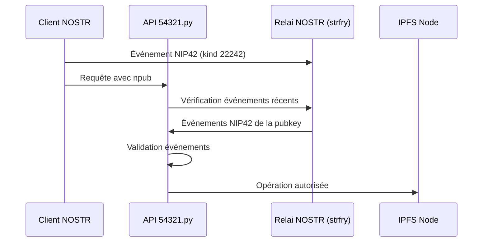

# API NOSTR Authentication System - Astroport.ONE

## Overview

L'API 54321.py d'Astroport.ONE utilise un système d'authentification basé sur le protocole NOSTR (Notes and Other Stuff Transmitted by Relays) pour sécuriser l'accès aux fonctionnalités de gestion de fichiers IPFS. Ce système garantit que seuls les utilisateurs authentifiés peuvent uploader, supprimer et gérer leurs fichiers dans leur espace personnel uDRIVE.

## Architecture d'Authentification

### 1. Protocole NOSTR et NIP42

L'authentification repose sur le **NIP42** (Nostr Implementation Possibility 42), qui définit un mécanisme d'authentification pour les relais NOSTR. Le système utilise :

- **Événements NIP42** : Événements de type `kind 22242` envoyés par les clients NOSTR
- **Relai local** : Connexion WebSocket vers `ws://127.0.0.1:7777` (strfry)
- **Validation temporelle** : Événements récents (moins de 24h)

### 2. Flux d'Authentification



## Routes Protégées

### Routes Requérant l'Authentification NOSTR

| Route | Méthode | Description | Authentification |
|-------|---------|-------------|------------------|
| `/api/upload` | POST | Upload de fichiers vers uDRIVE | **Obligatoire** |
| `/api/upload_from_drive` | POST | Synchronisation depuis IPFS | **Obligatoire** |
| `/api/delete` | POST | Suppression de fichiers | **Obligatoire** |
| `/api/test-nostr` | POST | Test d'authentification | **Obligatoire** |

### Routes Publiques

| Route | Méthode | Description |
|-------|---------|-------------|
| `/` | GET | Statut UPlanet |
| `/scan` | GET | Interface de scan QR |
| `/nostr` | GET | Interface NOSTR |
| `/upload2ipfs` | POST | Upload IPFS legacy (NIP96) |

## Mécanismes d'Authentification

### 1. Conversion des Clés Publiques

```python
def npub_to_hex(npub: str) -> Optional[str]:
    """
    Convertit une clé publique npub (bech32) en format hexadécimal.
    Supporte aussi les clés déjà en format hex (64 caractères).
    """
```

**Formats supportés :**
- `npub1...` : Format bech32 standard NOSTR
- `[64 chars hex]` : Format hexadécimal direct

### 2. Vérification NIP42

```python
async def check_nip42_auth(npub: str, timeout: int = 5) -> bool:
    """
    Vérifie l'authentification NIP42 sur le relai local.
    Recherche les événements kind 22242 récents (24h) de la pubkey.
    """
```

**Critères de validation :**
- Événements de type `kind 22242`
- Auteur correspondant à la pubkey fournie
- Timestamp récent (moins de 24h)
- Présence du tag `relay` (optionnel mais recommandé)

### 3. Validation des Événements

```python
def validate_nip42_event(event: Dict[str, Any], expected_relay_url: str) -> bool:
    """
    Valide un événement NIP42 selon les spécifications du protocole.
    """
```

**Vérifications effectuées :**
- Champs obligatoires présents (`id`, `pubkey`, `created_at`, `kind`, `tags`, `content`, `sig`)
- Kind correct (22242)
- Âge de l'événement (moins de 24h)
- Format des tags

## Gestion des Répertoires Utilisateurs

### 1. Structure des Répertoires

```
~/.zen/game/nostr/
├── user@example.com/
│   ├── HEX                    # Clé publique hexadécimal
│   ├── .secret.nostr         # Clés privées NOSTR (NSEC/NPUB)
│   └── APP/
│       └── uDRIVE/           # Répertoire de fichiers utilisateur
│           ├── Documents/
│           ├── Images/
│           ├── Music/
│           └── Videos/
```

### 2. Détection Automatique

```python
def find_user_directory_by_hex(hex_pubkey: str) -> Path:
    """
    Trouve le répertoire utilisateur correspondant à une clé publique hex.
    Parcourt ~/.zen/game/nostr/ pour matcher la clé dans le fichier HEX.
    """
```

### 3. Sécurisation des Accès

```python
def get_authenticated_user_directory(npub: str) -> Path:
    """
    Obtient le répertoire APP/uDRIVE de l'utilisateur authentifié.
    Crée automatiquement la structure si nécessaire.
    """
```

**Mesures de sécurité :**
- Validation du chemin absolu
- Vérification que le chemin est dans le répertoire autorisé
- Création automatique de liens symboliques vers les scripts IPFS

## Intégration avec IPFS

### 1. Script de Génération IPFS

Le script `generate_ipfs_structure.sh` est automatiquement lié dans le répertoire uDRIVE de chaque utilisateur :

```bash
# Lien symbolique créé automatiquement
APP/uDRIVE/generate_ipfs_structure.sh -> ~/.zen/Astroport.ONE/tools/generate_ipfs_structure.sh
```

### 2. Détection du Propriétaire

Le script détecte automatiquement le propriétaire du Drive via le fichier `HEX` :

```bash
# Dans generate_ipfs_structure.sh
OWNER_HEX_FILE="${OWNER_PLAYER_DIR}/HEX"
if [ -f "$OWNER_HEX_FILE" ]; then
    OWNER_HEX_PUBKEY=$(cat "$OWNER_HEX_FILE" 2>/dev/null)
    log_message "🔑 Clé publique HEX du propriétaire du Drive détectée: $OWNER_HEX_PUBKEY"
fi
```

### 3. Régénération IPFS

Après chaque opération (upload/suppression), la structure IPFS est automatiquement régénérée :

```python
async def run_ipfs_generation_script(source_dir: Path, enable_logging: bool = False):
    """
    Exécute le script de génération IPFS dans le répertoire uDRIVE de l'utilisateur.
    Retourne le nouveau CID généré.
    """
```

## Gestion des Erreurs

### 1. Erreurs d'Authentification

| Code | Message | Cause |
|------|---------|-------|
| 401 | Authentification NOSTR échouée | Événements NIP42 manquants ou invalides |
| 403 | Nostr authentication failed | Relai inaccessible ou clé invalide |
| 400 | Clé publique NOSTR obligatoire | Paramètre npub manquant |

### 2. Erreurs de Répertoire

| Code | Message | Cause |
|------|---------|-------|
| 404 | Répertoire NOSTR non trouvé | Structure ~/.zen/game/nostr/ manquante |
| 404 | Aucun répertoire utilisateur trouvé | Clé publique non enregistrée |

### 3. Erreurs de Fichier

| Code | Message | Cause |
|------|---------|-------|
| 400 | Chemin de fichier non sécurisé | Tentative de traversal directory |
| 403 | Fichier hors répertoire autorisé | Tentative d'accès non autorisé |

## Configuration

### 1. Variables d'Environnement

```bash
# Clé OBS Studio (optionnelle)
OBSkey=your_obs_key_here
```

### 2. Configuration du Relai

```python
def get_nostr_relay_url() -> str:
    """URL du relai NOSTR local (strfry)"""
    return "ws://127.0.0.1:7777"
```

### 3. Timeouts

```python
# Timeout pour la vérification NIP42
DEFAULT_NIP42_TIMEOUT = 5  # secondes

# Période de validité des événements
NIP42_EVENT_MAX_AGE = 24 * 60 * 60  # 24 heures
```

## Tests et Debugging

### 1. Endpoint de Test

```bash
POST /api/test-nostr
Content-Type: application/x-www-form-urlencoded

npub=npub1your_public_key_here
```

**Réponse de test :**
```json
{
    "input_key": "npub1...",
    "input_format": "npub",
    "hex_pubkey": "0123456789abcdef...",
    "relay_url": "ws://127.0.0.1:7777",
    "relay_connected": true,
    "auth_verified": true,
    "timestamp": "2024-01-01T12:00:00Z",
    "checks": {
        "key_format_valid": true,
        "hex_conversion_success": true,
        "relay_connection": true,
        "nip42_events_found": true
    },
    "message": "✅ Authentification NOSTR réussie",
    "status": "success"
}
```

### 2. Logs de Debug

```python
# Activation des logs détaillés
logging.basicConfig(level=logging.INFO, format='%(asctime)s - %(levelname)s - %(message)s')
```

**Exemples de logs :**
```
2024-01-01 12:00:00 - INFO - Vérification NOSTR pour: npub1...
2024-01-01 12:00:01 - INFO - Connecté au relai NOSTR: ws://127.0.0.1:7777
2024-01-01 12:00:02 - INFO - ✅ 1 événement(s) NIP42 valide(s) trouvé(s)
```

## Sécurité

### 1. Mesures Implémentées

- **Validation stricte des chemins** : Prévention des attaques de traversal directory
- **Authentification obligatoire** : Toutes les opérations sensibles requièrent NOSTR
- **Isolation des répertoires** : Chaque utilisateur accède uniquement à son uDRIVE
- **Validation temporelle** : Événements NIP42 récents uniquement
- **Sanitisation des noms de fichiers** : Prévention des caractères dangereux

### 2. Bonnes Pratiques

- Toujours vérifier l'authentification avant toute opération
- Utiliser des chemins absolus et les valider
- Logger toutes les tentatives d'accès
- Gérer les timeouts pour éviter les blocages
- Valider les formats de clés publiques

## Intégration avec UPlanet

### 1. Système de Coordonnées

L'API intègre le système de coordonnées UPlanet pour la géolocalisation :

```python
@app.get("/")
async def ustats(request: Request, lat: str = None, lon: str = None, deg: str = None):
    """Statut UPlanet avec coordonnées géographiques"""
```

### 2. Gestion des Swarms

Support des abonnements inter-nodes avec gestion automatique des clés SSH :

```python
# Détection des abonnements swarm
is_swarm_subscription = '+' in email and '-' in email.split('@')[0]

# Ajout automatique des clés SSH pour les Y-Level
if is_y_level:
    # Vérification et ajout des clés SSH du node distant
```

## Conclusion

Le système d'authentification NOSTR d'Astroport.ONE fournit une sécurité robuste basée sur les standards du protocole NOSTR. Il garantit que seuls les utilisateurs authentifiés peuvent accéder à leurs fichiers tout en maintenant une intégration transparente avec le système IPFS et UPlanet.

**Points clés :**
- Authentification basée sur NIP42
- Isolation complète des répertoires utilisateurs
- Intégration automatique avec IPFS
- Support des fonctionnalités UPlanet avancées
- Logging et debugging complets
