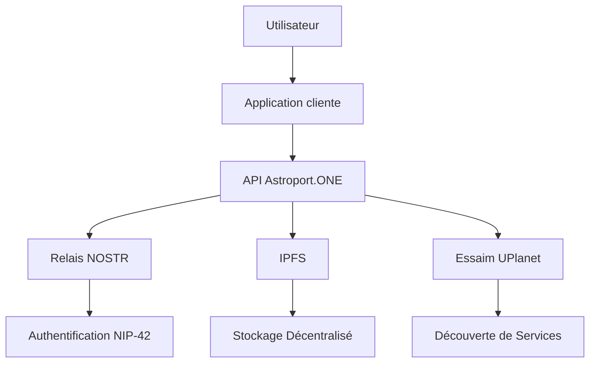
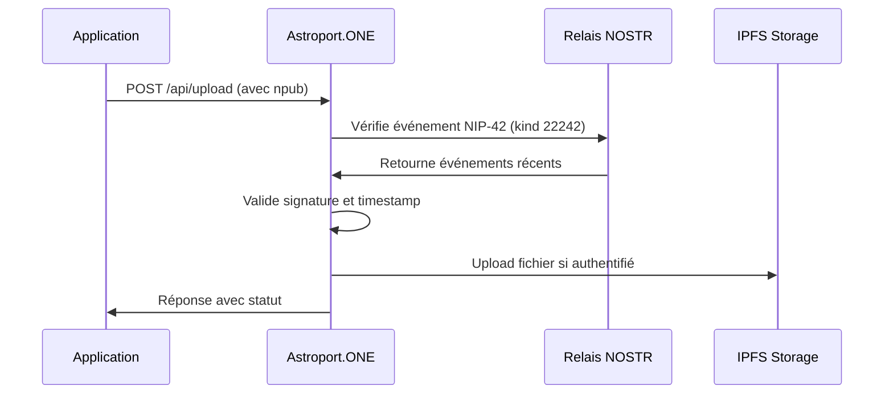

# 🔐 API NOSTR Auth - Guide Développeur Astroport.ONE

## 🚀 Introduction

Astroport.ONE est une API décentralisée pour l'écosystème UPlanet, permettant l'authentification, le stockage distribué, la découverte de services et d'utilisateurs autour d'une position géographique, sans dépendre d'un cloud centralisé.

Ce guide s'adresse aux développeurs souhaitant créer des applications web, mobiles ou IoT interopérables avec l'essaim UPlanet.

---

## 🌐 Vue d'ensemble de l'écosystème UPlanet/Astroport



### Composants Principaux

- **Astroport.ONE** : API locale sur chaque node
- **UPlanet Swarm** : Réseau de nodes interconnectés (swarm.key)
- **NOSTR** : Protocole d'authentification décentralisé
- **IPFS** : Stockage distribué
- **UMAP/SECTOR/REGION/ZONE** : Découpage géographique hiérarchique

---

## 📚 Librairie JavaScript NOSTR

### Installation et Utilisation

Astroport.ONE utilise et recommande la librairie JavaScript NOSTR hébergée sur IPFS :

```html
<!-- Inclusion de la librairie NOSTR depuis IPFS -->
<script src="https://ipfs.copylaradio.com/ipfs/QmXEmaPRUaGcvhuyeG99mHHNyP43nn8GtNeuDok8jdpG4a/nostr.bundle.js"></script>
```

### Fonctions Principales Disponibles

```javascript
// Génération de clés
const privateKey = NostrTools.generatePrivateKey();
const publicKey = NostrTools.getPublicKey(privateKey);

// Création et signature d'événements
const event = {
    kind: 22242, // NIP42 - Authentification
    created_at: Math.floor(Date.now() / 1000),
    tags: [
        ['relay', 'ws://127.0.0.1:7777'],
        ['challenge', 'your-challenge-here']
    ],
    content: 'Authentification pour Astroport.ONE'
};

const signedEvent = NostrTools.finishEvent(event, privateKey);

// Connexion aux relais
const relay = NostrTools.relayInit('ws://127.0.0.1:7777');
await relay.connect();
await relay.publish(signedEvent);
```

### Exemple d'Intégration Complète

```html
<!DOCTYPE html>
<html>
<head>
    <title>Astroport.ONE - Authentification NOSTR</title>
    <script src="https://ipfs.copylaradio.com/ipfs/QmXEmaPRUaGcvhuyeG99mHHNyP43nn8GtNeuDok8jdpG4a/nostr.bundle.js"></script>
</head>
<body>
    <h1>Authentification NOSTR pour Astroport.ONE</h1>
    
    <button onclick="generateKeys()">Générer de nouvelles clés</button>
    <button onclick="authenticate()">S'authentifier</button>
    
    <div id="status"></div>
    
    <script>
        let privateKey = null;
        let publicKey = null;
        
        function generateKeys() {
            privateKey = NostrTools.generatePrivateKey();
            publicKey = NostrTools.getPublicKey(privateKey);
            
            document.getElementById('status').innerHTML = 
                `<p>Clés générées :</p>
                 <p>Public Key: ${publicKey}</p>
                 <p>Private Key: ${privateKey}</p>`;
        }
        
        async function authenticate() {
            if (!privateKey || !publicKey) {
                alert('Générez d\'abord des clés');
                return;
            }
            
            try {
                // Créer l'événement d'authentification NIP42
                const authEvent = {
                    kind: 22242,
                    created_at: Math.floor(Date.now() / 1000),
                    tags: [
                        ['relay', 'ws://127.0.0.1:7777'],
                        ['challenge', 'astroport-auth-' + Date.now()]
                    ],
                    content: 'Authentification pour Astroport.ONE API'
                };
                
                const signedEvent = NostrTools.finishEvent(authEvent, privateKey);
                
                // Publier sur le relais
                const relay = NostrTools.relayInit('ws://127.0.0.1:7777');
                await relay.connect();
                await relay.publish(signedEvent);
                
                // Tester l'authentification avec l'API
                const response = await fetch('/api/test-nostr', {
                    method: 'POST',
                    headers: {
                        'Content-Type': 'application/x-www-form-urlencoded',
                    },
                    body: `npub=${publicKey}`
                });
                
                const result = await response.json();
                
                if (result.auth_verified) {
                    document.getElementById('status').innerHTML += 
                        '<p style="color: green;">✅ Authentification réussie !</p>';
                } else {
                    document.getElementById('status').innerHTML += 
                        '<p style="color: red;">❌ Authentification échouée</p>';
                }
                
                relay.close();
                
            } catch (error) {
                document.getElementById('status').innerHTML += 
                    `<p style="color: red;">❌ Erreur: ${error.message}</p>`;
            }
        }
    </script>
</body>
</html>
```

### Fonctions NOSTR Disponibles

La librairie fournit toutes les fonctions NOSTR standards :

- **Authentification** : `NostrTools.nip42`
- **Chiffrement** : `NostrTools.nip04`, `NostrTools.nip44`
- **Profils** : `NostrTools.nip05`
- **Relais** : `NostrTools.relayInit`, `NostrTools.SimplePool`
- **Validation** : `NostrTools.validateEvent`, `NostrTools.verifySignature`
- **Utilitaires** : `NostrTools.getEventHash`, `NostrTools.finishEvent`

---

## 🔐 Authentification NOSTR (NIP-42)

### Pourquoi NOSTR ?

- **Authentification sans serveur central** : Aucun point de défaillance unique
- **Interopérabilité** : Compatible avec tous les clients NOSTR
- **Résistance à la censure** : Distribution sur plusieurs relais
- **Souveraineté numérique** : L'utilisateur contrôle ses clés

### Workflow d'Authentification



### Exemple Minimal (Python)

```python
import requests

# Test d'authentification NOSTR
npub = "npub1..."
res = requests.post("http://127.0.0.1:54321/api/test-nostr", 
                   data={"npub": npub})
print(res.json())
```

### Exemple JavaScript

```javascript
// Authentification avec fetch
async function authenticateWithNOSTR(npub) {
    const formData = new FormData();
    formData.append('npub', npub);
    
    const response = await fetch('/api/test-nostr', {
        method: 'POST',
        body: formData
    });
    
    const result = await response.json();
    return result.auth_verified;
}
```

---

## 📡 Endpoints API Astroport.ONE

### Ports et Services

| Port | Service | Description | Protocole |
|------|---------|-------------|-----------|
| **1234** | API Gateway | Point d'entrée principal | HTTP |
| **12345** | Station Map | Cartographie UPlanet | HTTP |
| **54321** | UPassport API | Identité numérique | HTTP |
| **7777** | NOSTR Relay | Authentification | WebSocket |

### Endpoints Principaux

#### 1. Test d'Authentification NOSTR

```http
POST /api/test-nostr
```

**Paramètres** :
- `npub` : Clé publique NOSTR (requis)

**Réponse** :
```json
{
  "auth_verified": true,
  "npub": "npub1...",
  "message": "NOSTR authentication successful",
  "timestamp": "2024-01-01T12:00:00Z"
}
```

#### 2. Upload de Fichier avec Authentification

```http
POST /api/upload
```

**Headers** :
```
Content-Type: multipart/form-data
```

**Paramètres** :
- `file` : Fichier à uploader (requis)
- `npub` : Clé publique NOSTR (requis)

**Réponse** :
```json
{
  "success": true,
  "message": "File uploaded successfully",
  "file_path": "Images/photo.jpg",
  "file_type": "image",
  "target_directory": "Images",
  "new_cid": "QmHash...",
  "timestamp": "2024-01-01T12:00:00Z",
  "auth_verified": true
}
```

#### 3. Suppression de Fichier

```http
POST /api/delete
```

**Body** :
```json
{
  "file_path": "Images/photo.jpg",
  "npub": "npub1..."
}
```

---

## 🌍 Intégration Géographique (NIP-101)

### Clés Géographiques Hiérarchiques

Astroport.ONE étend NOSTR avec des clés géographiques hiérarchiques :

```javascript
// Génération de clé géographique
function generateGeoKey(namespace, latitude, longitude, precision) {
    const coords = `${latitude.toFixed(precision)}_${longitude.toFixed(precision)}`;
    const input = `${namespace}_${coords}`;
    return NostrTools.generatePrivateKey(input);
}

// Exemples d'utilisation
const umapKey = generateGeoKey("UPlanetV1", 48.8534, 2.3412, 2); // 0.01°
const sectorKey = generateGeoKey("UPlanetV1", 48.8534, 2.3412, 1); // 0.1°
const regionKey = generateGeoKey("UPlanetV1", 48.8534, 2.3412, 0); // 1.0°
```

### Tags Géographiques

```javascript
// Événement avec tags géographiques
const geoEvent = {
    kind: 1,
    created_at: Math.floor(Date.now() / 1000),
    tags: [
        ['latitude', '48.8534'],
        ['longitude', '2.3412'],
        ['application', 'uplanet']
    ],
    content: 'Message géolocalisé sur UPlanet'
};
```

---

## 🤖 Intégration IA et Automatisation

### Système de Vœux AstroBot

Astroport.ONE utilise un système de "Vœux" pour l'automatisation :

```javascript
// Déclenchement d'action IA
const voeuEvent = {
    kind: 1,
    created_at: Math.floor(Date.now() / 1000),
    tags: [
        ['latitude', '48.8534'],
        ['longitude', '2.3412'],
        ['application', 'uplanet']
    ],
    content: 'Quel temps fait-il ici ? #BRO #rec'
};
```

### Tags IA Disponibles

| Tag | Fonction | Description |
|-----|----------|-------------|
| `#BRO` | Assistant IA | Assistant personnel intelligent |
| `#rec` | Enregistrement | Stockage en mémoire IA |
| `#mem` | Affichage mémoire | Afficher l'historique |
| `#reset` | Reset mémoire | Effacer l'historique |
| `#search` | Recherche | Recherche d'information |
| `#image` | Génération image | Création d'image IA |
| `#video` | Génération vidéo | Création de vidéo IA |
| `#music` | Génération musique | Création de musique IA |

---

## 🔧 Configuration et Déploiement

### Installation du Relay NOSTR

```bash
# Installation automatique
bash <(wget -qO- https://github.com/papiche/NIP-101/raw/refs/heads/main/install_strfry.sh)

# Configuration manuelle
cd ~/.zen/workspace/NIP-101
./setup.sh
./systemd.setup.sh
```

### Configuration du Relay

```bash
# Fichier de configuration strfry.conf
cat > ~/.zen/strfry/strfry.conf << EOF
# Configuration du relay NOSTR pour Astroport.ONE
bind = "0.0.0.0:7777"
writePolicy.plugin = "$HOME/.zen/workspace/NIP-101/relay.writePolicy.plugin/all_but_blacklist.sh"

# Métadonnées NIP-11
name = "♥️BOX $IPFSNODEID"
description = "Relay NOSTR pour UPlanet Astroport.ONE"
pubkey = "$CAPTAINHEX"
contact = "$CAPTAINEMAIL"
EOF
```

### Filtres Personnalisés

#### Filtre Principal (all_but_blacklist.sh)

```bash
#!/bin/bash
# Filtre principal du relay NOSTR

PUBKEY="$1"
KIND="$2"

# Vérifier la blacklist
if grep -q "^$PUBKEY$" ~/.zen/strfry/blacklist.txt; then
    exit 1  # Rejeter
fi

# Traitement spécial pour les messages texte
if [[ "$KIND" == "1" ]]; then
    ~/.zen/workspace/NIP-101/relay.writePolicy.plugin/filter/1.sh "$PUBKEY" "$KIND"
fi

exit 0  # Accepter
```

#### Filtre Messages (filter/1.sh)

```bash
#!/bin/bash
# Filtre pour les messages texte (kind 1)

PUBKEY="$1"
KIND="$2"

# Gestion des visiteurs
if [[ ! -f ~/.zen/game/players/*/secret.nostr ]]; then
    # Envoyer message d'accueil
    send_welcome_message "$PUBKEY"
fi

# Déclenchement IA si nécessaire
if echo "$CONTENT" | grep -q "#BRO\|#BOT"; then
    ~/.zen/Astroport.ONE/IA/UPlanet_IA_Responder.sh &
fi

exit 0
```

---

## 📊 Monitoring et Debugging

### Logs du Relay NOSTR

```bash
# Voir les logs du relay
sudo journalctl -u strfry -f

# Logs spécifiques
tail -f ~/.zen/strfry/log.txt
```

### Test de Connectivité

```bash
# Test du relay
curl -I http://localhost:7777

# Test WebSocket
wscat -c ws://localhost:7777
```

### Métriques de Performance

```bash
# Statistiques du relay
curl http://localhost:7777/stats

# Nombre de connexions
netstat -an | grep :7777 | wc -l
```

---

## 🔒 Sécurité et Bonnes Pratiques

### Gestion des Clés

```bash
# Génération sécurisée de clés (ancienne méthode)
openssl rand -hex 32

# Nouvelle méthode SSSS / 3
~/.zen/Astroport.ONE/tools/make_NOSTRCARD.sh 
Usage: Make_NOSTRCARD.sh [OPTIONS] <EMAIL> [IMAGE] [LATITUDE] [LONGITUDE] [SALT] [PEPPER]

  Generates a NOSTR card and related cryptographic keys, stores them
  locally, and prepares files for a NOSTR application.

Arguments:
  <EMAIL>        Email address to associate with the NOSTR card.
                 Must be a valid email format.
  [IMAGE]        Optional: Path to an image file to use as profile picture.
                 Alternatively, a two-letter language code (e.g., 'en', 'fr')
                 to set the language. If omitted, defaults to 'fr'.
  [LATITUDE]     Optional: UMAP Latitude for location data.
  [LONGITUDE]    Optional: UMAP Longitude for location data.
  [SALT]         Optional: Salt for key generation. If omitted, a random salt is generated.
  [PEPPER]       Optional: Pepper for key generation. If omitted, a random pepper is generated.

Options:
  -h, --help    Display this help message and exit.

Example:
  make_NOSTRCARD.sh john.doe@example.com ./profile.png 48.85 2.35
  make_NOSTRCARD.sh jane.doe@example.com en


```

### Sécurité cryptographique

Le secret principal (DISCO) est divisé en 3 parts :

* Partie 1 : Chiffrée pour le joueur (1/3 personnel)
```~/.zen/game/nostr/*@*/.ssss.head.player.enc```

* Partie 2 : Chiffrée pour le capitaine (1/3 relai)
```~/.zen/game/nostr/*@*/.ssss.mid.captain.enc```

* Partie 3 : Chiffrée pour UPlanet (1/3 infrastructure)
```~/.zen/game/nostr/*@*/ssss.tail.uplanet.enc```

Avantage : Il faut 2 des 3 parties pour reconstituer l'identité complète.

Toutes les clés sont dérivées de SALT + PEPPER


### Rate Limiting

```bash
# Configuration du rate limiting
echo "max_events_per_second = 10" >> ~/.zen/strfry/strfry.conf
echo "max_events_per_minute = 100" >> ~/.zen/strfry/strfry.conf
```

### Blacklist Management

```bash
# Ajouter une clé à la blacklist
echo "hex1..." >> ~/.zen/strfry/blacklist.txt

# Supprimer une clé de la blacklist
sed -i '/hex1.../d' ~/.zen/strfry/blacklist.txt
```

---

## 🔧 Fat Layer Protocol - Exemples Pratiques

### Mode API - Récupération du Capitaine et Profil

Le Fat Layer Protocol permet de récupérer automatiquement l'ID du capitaine et d'afficher son profil via l'API NOSTR.

#### Récupération de l'ID du Capitaine

```javascript
// Récupération automatique du signataire depuis les métadonnées
async function loadSignerProfile() {
    try {
        // Charger les signatures depuis _signatures
        const signaturesResponse = await fetch('_signatures');
        const signaturesText = await signaturesResponse.text();
        const lines = signaturesText.split('\n').filter(line => 
            line.trim() && !line.startsWith('#')
        );
        
        if (lines.length > 0) {
            const lastSignature = lines[lines.length - 1];
            const [timestamp, cid, signer, action] = lastSignature.split('|');
            
            console.log(`👨‍✈️ Capitaine détecté: ${signer}`);
            
            // Récupérer la clé publique du signataire
            let signerPubkey = null;
            try {
                // Priorité à la clé HEX
                const hexResponse = await fetch(`frd/multipass/${signer}.hex`);
                if (hexResponse.ok) {
                    signerPubkey = await hexResponse.text().trim();
                    console.log(`🔑 Clé HEX: ${signerPubkey}`);
                } else {
                    // Fallback sur NPUB
                    const npubResponse = await fetch(`frd/multipass/${signer}.npub`);
                    if (npubResponse.ok) {
                        signerPubkey = await npubResponse.text().trim();
                        console.log(`📝 NPUB: ${signerPubkey}`);
                    }
                }
            } catch (e) {
                console.log(`⚠️ Impossible de charger la clé pour ${signer}`);
            }
            
            // Créer un profil basique
            const profileData = {
                name: signer.split('@')[0],
                display_name: `${signer.split('@')[0]} (${signer})`,
                about: `✍️ Signataire MULTIPASS Astroport.ONE\n📧 ${signer}\n🕐 ${new Date(timestamp).toLocaleString('fr-FR')}`,
                picture: null
            };
            
            // Afficher le profil
            displayUserProfile(profileData, signerPubkey);
        }
    } catch (error) {
        console.error('❌ Erreur chargement profil signataire:', error);
    }
}
```

#### Affichage du Profil Utilisateur

```javascript
// Fonction d'affichage du profil (style coinflip)
function displayUserProfile(profileData, pubkey = null) {
    console.log('[Profile] Affichage profil utilisateur:', profileData);
    
    // Créer ou mettre à jour le footer
    let footer = document.querySelector('.footer');
    if (!footer) {
        footer = document.createElement('div');
        footer.className = 'footer';
        document.body.appendChild(footer);
    }
    
    // Extraire les données du profil
    const displayPubkey = pubkey || userPubkey || 'unknown';
    const pubkeyShort = displayPubkey.substring(0, 8) + '...' + displayPubkey.substring(displayPubkey.length - 8);
    
    let name = profileData.name || displayPubkey.substring(0, 16);
    let picture = profileData.picture || '';
    let about = profileData.about || '';
    let g1pubFromProfile = '';
    
    // Chercher les tags g1pub dans les métadonnées
    if (profileData.tags && Array.isArray(profileData.tags)) {
        for (const tag of profileData.tags) {
            if (Array.isArray(tag) && tag[0] === 'i' && typeof tag[1] === 'string') {
                if (tag[1].startsWith('g1pub:')) {
                    g1pubFromProfile = tag[1].slice('g1pub:'.length);
                } else if (tag[1].startsWith('g1pubv2:') && !g1pubFromProfile) {
                    g1pubFromProfile = tag[1].slice('g1pubv2:'.length);
                }
            }
        }
    }
    
    // Construire l'URL du profil complet
    const profileViewerUrl = `/ipns/copylaradio.com/nostr_profile_viewer.html?hex=${displayPubkey}&origin=${displayPubkey}`;
    
    // Construire le HTML du profil
    const profileHtml = `
        <div class="profile-card">
            <div class="profile-header">
                
                <div class="profile-info">
                    <h3 class="profile-name">${name}</h3>
                    <p class="profile-pubkey">${pubkeyShort}</p>
                    ${g1pubFromProfile ? `<p class="profile-g1">💰 ${g1pubFromProfile.substring(0, 8)}...</p>` : ''}
                </div>
            </div>
            <div class="profile-about">${about}</div>
            <div class="profile-actions">
                <a href="${profileViewerUrl}" target="_blank" class="profile-link">👤 Voir Profil</a>
            </div>
        </div>
    `;
    
    footer.innerHTML = profileHtml;
}
```

#### Récupération du Dernier Message

```javascript
// Récupération du dernier message NOSTR
async function fetchLastMessage(pubkey) {
    try {
        const pool = new NostrTools.SimplePool();
        const relays = ['wss://relay.copylaradio.com', 'ws://127.0.0.1:7777'];
        
        const events = await pool.list(relays, [{
            kinds: [1], // Messages texte
            authors: [pubkey],
            limit: 1
        }]);
        
        if (events.length > 0) {
            const lastMessage = events[0];
            console.log('📝 Dernier message:', lastMessage.content);
            
            // Afficher le message
            displayLastMessage(lastMessage);
            return lastMessage;
        } else {
            console.log('Aucun message trouvé');
            return null;
        }
    } catch (error) {
        console.error('Erreur récupération message:', error);
        return null;
    }
}

function displayLastMessage(event) {
    const messageContainer = document.getElementById('last-message');
    if (messageContainer) {
        messageContainer.innerHTML = `
            <div class="message-item">
                <div class="message-content">${event.content}</div>
                <div class="message-meta">
                    ${new Date(event.created_at * 1000).toLocaleString()}
                </div>
            </div>
        `;
    }
}
```

#### Envoi de Like via NOSTR

```javascript
// Fonction pour envoyer un like (réaction)
async function sendLike(eventId, authorPubkey) {
    try {
        if (!window.nostr) {
            throw new Error('Extension NOSTR requise');
        }
        
        // Créer l'événement de réaction (kind 7)
        const likeEvent = {
            kind: 7,
            created_at: Math.floor(Date.now() / 1000),
            tags: [
                ['e', eventId], // Référence à l'événement liké
                ['p', authorPubkey], // Référence à l'auteur
                ['k', '1'] // Kind de l'événement original
            ],
            content: '❤️' // Emoji de réaction
        };
        
        // Signer l'événement
        const signedEvent = await window.nostr.signEvent(likeEvent);
        
        // Publier sur les relais
        const relays = ['wss://relay.copylaradio.com', 'ws://127.0.0.1:7777'];
        const results = await Promise.all(
            relays.map(relay => publishToRelay(relay, signedEvent))
        );
        
        const successCount = results.filter(Boolean).length;
        console.log(`✅ Like envoyé sur ${successCount}/${relays.length} relais`);
        
        return successCount > 0;
    } catch (error) {
        console.error('❌ Erreur envoi like:', error);
        return false;
    }
}

// Fonction pour publier sur un relai
async function publishToRelay(relayUrl, signedEvent) {
    return new Promise((resolve) => {
        try {
            const ws = new WebSocket(relayUrl);
            
            ws.onopen = () => {
                console.log(`📡 Connexion ${relayUrl}`);
                ws.send(JSON.stringify(['EVENT', signedEvent]));
            };
            
            ws.onmessage = (event) => {
                const data = JSON.parse(event.data);
                if (data[0] === 'OK' && data[1] === signedEvent.id) {
                    console.log(`✅ OK ${relayUrl}`);
                    ws.close();
                    resolve(true);
                } else if (data[0] === 'OK' && data[2] === false) {
                    console.error(`❌ Rejeté ${relayUrl}:`, data[3]);
                    ws.close();
                    resolve(false);
                }
            };
            
            ws.onerror = (error) => {
                console.error(`❌ Erreur ${relayUrl}:`, error);
                resolve(false);
            };
            
            // Timeout après 5 secondes
            setTimeout(() => {
                ws.close();
                resolve(false);
            }, 5000);
            
        } catch (error) {
            console.error(`❌ Connexion ${relayUrl}:`, error);
            resolve(false);
        }
    });
}
```

#### Méthode de Connexion (Style copylaradio.com/coinflip)

```javascript
// Variables globales pour NOSTR (inspirées de coinflip)
let DEFAULT_RELAYS = ['wss://relay.copylaradio.com', 'ws://127.0.0.1:7777', 'wss://relay.damus.io'];
let NOSTRws = '';
let nostrRelay = null;
let isNostrConnected = false;
let userPubkey = null;
let authEventPublished = false;

// Fonction pour détecter l'URL du relai automatiquement
function detectNOSTRws() {
    const currentURL = new URL(window.location.href);
    const hostname = currentURL.hostname;
    const port = currentURL.port;
    const protocol = currentURL.protocol.split(":")[0];
    
    let rPort = port;
    if (port === "8080") { rPort = "7777"; }
    
    const rHost = hostname.replace("ipfs", "relay");
    const wsProtocol = protocol === 'https' ? 'wss' : 'ws';
    
    NOSTRws = wsProtocol + "://" + rHost + (rPort ? (":" + rPort) : "");
    console.log('🔗 NOSTR relay websocket:', NOSTRws);
}

// Fonction de connexion à NOSTR
async function connectToNostr() {
    const connectBtn = document.getElementById('connectBtn');
    
    if (!window.nostr || typeof window.nostr.getPublicKey !== 'function') {
        alert('Extension Nostr requise pour se connecter.');
        return;
    }
    
    try {
        console.log('[LOGIN] Démarrage séquence de connexion');
        connectBtn.disabled = true;
        connectBtn.textContent = '🔄 Connexion...';
        
        const pubkey = await window.nostr.getPublicKey();
        if (!pubkey) throw new Error('Aucune clé publique retournée');
        
        userPubkey = pubkey;
        console.log('[LOGIN] Clé publique obtenue:', pubkey.substring(0, 8) + '...');
        
        connectBtn.textContent = '🔐 Authentification...';
        console.log('[LOGIN] Connexion au relai...');
        await connectToRelay();
        
        console.log('[LOGIN] Relai connecté, profil sera récupéré automatiquement');
        
        // Récupérer et afficher le profil
        await fetchProfileAndRelays(pubkey);
        
        connectBtn.textContent = '✅ Connecté';
        connectBtn.disabled = true;
        
    } catch (e) {
        console.error('[LOGIN] Connexion échouée:', e);
        alert('Connexion échouée. Veuillez autoriser dans votre extension Nostr.');
        connectBtn.disabled = false;
        connectBtn.textContent = '🔗 Se connecter';
    }
}

// Fonction de connexion au relai
async function connectToRelay() {
    const relayUrl = NOSTRws || DEFAULT_RELAYS[0];
    
    try {
        nostrRelay = NostrTools.relayInit(relayUrl);
        
        nostrRelay.on('connect', () => {
            isNostrConnected = true;
            console.log('[NIP-42] Connecté au relai', relayUrl);
            
            if (!authEventPublished) {
                console.log('[NIP-42] Publication événement 22242 proactive');
                sendProactiveAuth(relayUrl).catch(err => 
                    console.warn('[NIP-42] Échec publication proactive:', err)
                );
            }
        });
        
        nostrRelay.on('error', (err) => {
            isNostrConnected = false;
            console.error('Erreur relai', err);
        });
        
        nostrRelay.on('auth', async (challenge) => {
            console.log('[NIP-42] Challenge d\'authentification reçu:', challenge);
            await handleAuthChallenge(challenge, relayUrl);
        });
        
        await nostrRelay.connect();
        
    } catch (error) {
        console.error('Erreur connexion relai:', error);
        throw error;
    }
}

// Fonction d'authentification proactive
async function sendProactiveAuth(relayUrl) {
    try {
        if (!userPubkey || !nostrRelay || authEventPublished) return;
        
        const challenge = `client-init-${Date.now()}`;
        const authEvent = {
            kind: 22242,
            created_at: Math.floor(Date.now() / 1000),
            tags: [['relay', relayUrl], ['challenge', challenge]],
            content: '',
            pubkey: userPubkey
        };
        
        let signedAuthEvent = null;
        if (window.nostr && typeof window.nostr.signEvent === 'function') {
            signedAuthEvent = await window.nostr.signEvent(authEvent);
        }
        
        if (!signedAuthEvent) {
            console.warn('[NIP-42] signEvent retourné null');
            return;
        }
        
        // Publier l'événement d'authentification
        const message = JSON.stringify(['EVENT', signedAuthEvent]);
        nostrRelay.send(message);
        
        authEventPublished = true;
        console.log('[NIP-42] Événement d\'authentification publié');
        
    } catch (error) {
        console.error('[NIP-42] Erreur authentification proactive:', error);
    }
}
```

### Mode Scanner QR Code - MULTIPASS SSSS

Le mode scanner QR Code permet de traiter les clés SSSS du MULTIPASS pour l'authentification paper wallet.

#### Traitement des QR Codes MULTIPASS

```bash
# Dans upassport.sh - Traitement des QR codes MULTIPASS SSSS
if [[ ( ${PUBKEY:0:2} == "M-" || ${PUBKEY:0:2} == "1-" ) && ${ZCHK:0:6} == "k51qzi" ]]; then
    echo "MULTIPASS SSSS KEY verification......"
    
    # Décodage Base58 du QR code
    # ex: M-3geE2ktuVKGUoEuv3FQEtiCAZDa69PN2kiT8d4UhAH3RbMkgPbooz7W:k51qzi5uqu5dhwr9cp52nhe7w13y9g58kg4l7m45ojka0tx92s72bise85sjn0
    [[ ${PUBKEY:0:2} == "M-" ]] && DECODED_QRCODE=$($HOME/.zen/Astroport.ONE/tools/Mbase58.py decode "${QRCODE:2}")
    # ex: 1-3601d4a82fc6d8f9033066da40a9d14693737ca12479b3a601a7be319d4b77b2df4477a0d148d7cd:k51qzi5uqu5dhwr9cp52nhe7w13y9g58kg4l7m45ojka0tx92s72bise85sjn0
    [[ ${PUBKEY:0:2} == "1-" ]] && DECODED_QRCODE="${QRCODE}"
    
    SSSS1=$(echo ${DECODED_QRCODE} | cut -d ':' -f 1)
    IPNSVAULT=$(echo ${DECODED_QRCODE} | cut -d ':' -f 2-)
    ipnsk51=$(echo "$IPNSVAULT" | grep -oP "(?<=k51qzi5uqu5d)[^/]*")
    
    if [[ ${ipnsk51} != "" ]]; then
        VAULTNS="k51qzi5uqu5d"$ipnsk51
        
        # Recherche de la NOSTR CARD locale
        PLAYER=$(get_NOSTRNS_directory ${VAULTNS})
        
        if [[ -z $PLAYER ]]; then
            # NOSTR CARD manquante
            cat ${MY_PATH}/templates/message.html \
            | sed -e "s~_TITLE_~$(date -u) <br> ${IPNSVAULT}~g" \
                 -e "s~_MESSAGE_~NOSTR CARD MISSING~g" \
                > ${MY_PATH}/tmp/${MOATS}.out.html
            echo "${MY_PATH}/tmp/${MOATS}.out.html"
            exit 0
        fi
        
        # DÉCODAGE DISCO SSSS
        mkdir -p $HOME/.zen/tmp/$MOATS/$IPNSVAULT/$PLAYER
        
        # Décryptage de la partie tail avec la clé UPLANET
        tmp_player=$(mktemp)
        echo "$SSSS1" > "$tmp_player"
        
        tmp_tail=$(mktemp)
        $HOME/.zen/Astroport.ONE/tools/keygen -t duniter -o $HOME/.zen/tmp/$MOATS/uplanet.dunikey "${UPLANETNAME}" "${UPLANETNAME}"
        $HOME/.zen/Astroport.ONE/tools/natools.py decrypt -f pubsec -i "$HOME/.zen/game/nostr/${PLAYER}/ssss.tail.uplanet.enc" \
                -k $HOME/.zen/tmp/$MOATS/uplanet.dunikey -o "$tmp_tail"
        
        rm $HOME/.zen/tmp/$MOATS/uplanet.dunikey
        
        # Combinaison des parts SSSS (2 sur 3 requis)
        DISCO=$(cat "$tmp_player" "$tmp_tail" | ssss-combine -t 2 -q 2>&1 | tail -n 1)
        
        IFS='=&' read -r s salt p pepper <<< "$DISCO"
        
        if [[ -n $salt && -n $pepper ]]; then
            rm "$tmp_player" "$tmp_tail"
            
            # Génération de la clé NSEC pour l'authentification
            NSEC=$($HOME/.zen/Astroport.ONE/tools/keygen -t nostr "${salt}" "${pepper}" -s)
            
            # Remplissage du template UPassport API avec nsec
            cat ~/.zen/UPassport/templates/nostr.html \
                | sed "s/const userNsec = '';/const userNsec = '${NSEC}';/" \
                > ${MY_PATH}/tmp/${MOATS}.out.html
            
            echo "${MY_PATH}/tmp/${MOATS}.out.html"
            exit 0
        else
            echo "ERROR : BAD DISCO DECODING"
            exit 1
        fi
    fi
fi
```

#### Interface Scanner HTML

```html
<!-- Dans scan_new.html - Interface de scan QR -->
<div class="scanner-container">
    <div class="camera-controls">
        <button id="start-camera">🎥 ON</button>
        <button id="stop-camera">🚫 OFF</button>
        <button id="take-photo">📸 Photo</button>
    </div>
    
    <video id="preview"></video>
    
    <form id="qr-form">
        <input type="text" id="parametre" name="parametre" 
               placeholder="Email || MULTIPASS QR SCAN" required>
        <input type="hidden" id="imageData" name="imageData">
        <input type="password" id="PASS" name="PASS" value="1234">
        <input type="submit" value="-- OK --">
    </form>
</div>

<script>
// Initialisation du scanner QR
let scanner = new Instascan.Scanner({
    continuous: true,
    video: document.getElementById('preview'),
    mirror: false,
    captureImage: false,
    backgroundScan: false,
    refractoryPeriod: 5000,
    scanPeriod: 1
});

// Détection automatique du QR Code
scanner.addListener('scan', function (content) {
    document.getElementById("parametre").value = content;
    $('#submitButton').css('background-color', '#0000FF');
    
    // Capture de l'image du QR code
    let video = document.getElementById('preview');
    let canvas = document.createElement('canvas');
    canvas.width = video.videoWidth;
    canvas.height = video.videoHeight;
    canvas.getContext('2d').drawImage(video, 0, 0, canvas.width, canvas.height);
    let imageDataUrl = canvas.toDataURL('image/png');
    
    $('#imageData').val(imageDataUrl);
});

// Soumission du formulaire
$('#qr-form').submit(function(e) {
    e.preventDefault();
    $('#loadingSpinner').show();
    
    let formData = new FormData(this);
    const parametre = document.getElementById('parametre').value;
    const PASS = document.getElementById('PASS').value;
    
    // Traitement spécial pour les codes ZENCARD (~~~~~) ou DELETE (0000)
    if (parametre.substring(0, 5) === "~~~~~" || PASS === "0000") {
        if (formData.has('imageData')) {
            formData.delete('imageData');
        }
        formData.append('imageData', PASS);
        console.log(`PIN saisi : ${PASS}`);
    }
    
    // Envoi vers l'API UPassport
    $.ajax({
        url: '/upassport',
        type: 'POST',
        data: formData,
        processData: false,
        contentType: false,
        success: function(response) {
            $('#loadingSpinner').hide();
            $('#result-iframe').attr('srcdoc', response);
            $('.result-container').css('display', 'flex');
        },
        error: function() {
            $('#loadingSpinner').hide();
            alert('Erreur lors du traitement. Réessayez.');
        }
    });
});
</script>
```

#### Template NOSTR pour Paper Wallet

```html
<!-- Template nostr.html pour l'authentification paper wallet -->
<script>
// Configuration automatique avec NSEC du MULTIPASS
const userNsec = ''; // Remplacé automatiquement par upassport.sh

// Initialisation automatique si NSEC fourni
if (userNsec) {
    console.log("NSEC fourni. Initialisation clé locale.");
    try {
        const decoded = NostrTools.nip19.decode(userNsec);
        if (decoded.type !== 'nsec' || !decoded.data) {
            throw new Error('Format NSEC invalide');
        }
        
        privateKeyHex = decoded.data;
        publicKey = NostrTools.getPublicKey(privateKeyHex);
        
        console.log(`Clé NSEC OK. Pubkey: ${publicKey.slice(0, 10)}...`);
        
        // Masquer le bouton de connexion et activer la publication
        $('#connectButton').hide();
        $('#postButton').prop('disabled', false);
        
        // Récupérer le profil et les messages
        fetchProfileAndRelays(publicKey);
        fetchAndDisplayMessages(publicKey);
        
    } catch (e) {
        console.log(`Erreur initialisation NSEC: ${e.message}`);
        // Fallback sur l'extension
        checkNostrExtension();
    }
} else {
    // Pas de NSEC, utiliser l'extension
    checkNostrExtension();
}
</script>
```

---

## 📚 Exemples d'Applications

### Application Web Simple

```html
<!DOCTYPE html>
<html>
<head>
    <title>UPlanet App</title>
    <script src="https://ipfs.copylaradio.com/ipfs/QmXEmaPRUaGcvhuyeG99mHHNyP43nn8GtNeuDok8jdpG4a/nostr.bundle.js"></script>
</head>
<body>
    <div id="messages"></div>
    
    <script>
        // Connexion au relay local
        const relay = NostrTools.relayInit('ws://127.0.0.1:7777');
        
        relay.on('event', (event) => {
            if (event.kind === 1) {
                displayMessage(event);
            }
        });
        
        function displayMessage(event) {
            const div = document.createElement('div');
            div.textContent = event.content;
            document.getElementById('messages').appendChild(div);
        }
    </script>
</body>
</html>
```

### Application Mobile (React Native)

```javascript
// Exemple React Native
import { NostrTools } from 'nostr-tools';

class UPlanetApp extends Component {
    async componentDidMount() {
        // Connexion au relay
        this.relay = NostrTools.relayInit('ws://127.0.0.1:7777');
        await this.relay.connect();
        
        // Écoute des événements
        this.relay.on('event', this.handleEvent);
    }
    
    handleEvent = (event) => {
        if (event.kind === 1) {
            this.setState(prevState => ({
                messages: [...prevState.messages, event]
            }));
        }
    }
}
```

---

## 🔗 Ressources et Documentation

### Documentation Officielle

- **[NOSTR Protocol](https://github.com/nostr-protocol/nips)** - Spécifications officielles
- **[NIP-42](https://github.com/nostr-protocol/nips/blob/master/42.md)** - Authentification
- **[NIP-101](https://github.com/nostr-protocol/nips/blob/master/101.md)** - Clés géographiques

### Outils et Bibliothèques

- **[NostrTools](https://github.com/pablof7z/nostr-tools)** - Bibliothèque JavaScript
- **[NostrPy](https://github.com/jeffthibault/python-nostr)** - Bibliothèque Python
- **[NostrKit](https://github.com/nbd-wtf/nostr-tools)** - Outils de développement

### Communauté

- **[Forum NOSTR](https://t.me/nostr_protocol)** - Groupe Telegram officiel
- **[Reddit NOSTR](https://reddit.com/r/nostr)** - Communauté Reddit
- **[GitHub Discussions](https://github.com/nostr-protocol/nostr/discussions)** - Discussions GitHub

---

## 📞 Support et Contact

### Support Technique

- **Email** : support@qo-op.com
- **Documentation** : https://astroport-1.gitbook.io/astroport.one/
- **GitHub Issues** : https://github.com/papiche/Astroport.ONE/issues

### Communauté

- **CopyLaRadio** : https://copylaradio.com
- **Open Collective** : https://opencollective.com/monnaie-libre
- **Forum Monnaie Libre** : https://forum.monnaie-libre.fr

---

**Astroport.ONE NOSTR Auth : L'authentification décentralisée pour un web libre** 🔐✨
