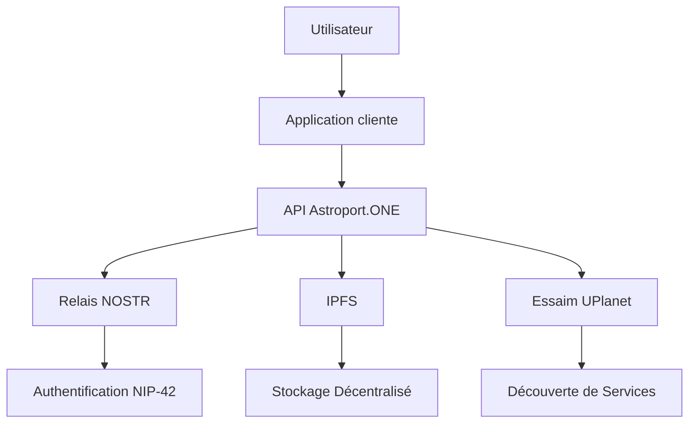
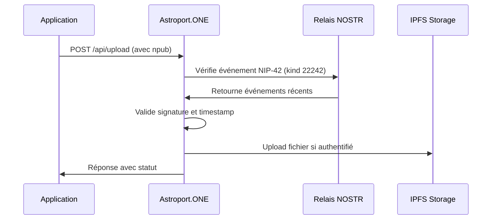

# 🔐 API NOSTR Auth - Guide Développeur Astroport.ONE

## 🚀 Introduction

Astroport.ONE est une API décentralisée pour l'écosystème UPlanet, permettant l'authentification, le stockage distribué, la découverte de services et d'utilisateurs autour d'une position géographique, sans dépendre d'un cloud centralisé.

Ce guide s'adresse aux développeurs souhaitant créer des applications web, mobiles ou IoT interopérables avec l'essaim UPlanet.

---

## 🌐 Vue d'ensemble de l'écosystème UPlanet/Astroport



### Composants Principaux

- **Astroport.ONE** : API locale sur chaque node
- **UPlanet Swarm** : Réseau de nodes interconnectés (swarm.key)
- **NOSTR** : Protocole d'authentification décentralisé
- **IPFS** : Stockage distribué
- **UMAP/SECTOR/REGION/ZONE** : Découpage géographique hiérarchique

---

## 📚 Librairie JavaScript NOSTR

### Installation et Utilisation

Astroport.ONE utilise et recommande la librairie JavaScript NOSTR hébergée sur IPFS :

```html
<!-- Inclusion de la librairie NOSTR depuis IPFS -->
<script src="https://ipfs.copylaradio.com/ipfs/QmXEmaPRUaGcvhuyeG99mHHNyP43nn8GtNeuDok8jdpG4a/nostr.bundle.js"></script>
```

### Fonctions Principales Disponibles

```javascript
// Génération de clés
const privateKey = NostrTools.generatePrivateKey();
const publicKey = NostrTools.getPublicKey(privateKey);

// Création et signature d'événements
const event = {
    kind: 22242, // NIP42 - Authentification
    created_at: Math.floor(Date.now() / 1000),
    tags: [
        ['relay', 'ws://127.0.0.1:7777'],
        ['challenge', 'your-challenge-here']
    ],
    content: 'Authentification pour Astroport.ONE'
};

const signedEvent = NostrTools.finishEvent(event, privateKey);

// Connexion aux relais
const relay = NostrTools.relayInit('ws://127.0.0.1:7777');
await relay.connect();
await relay.publish(signedEvent);
```

### Exemple d'Intégration Complète

```html
<!DOCTYPE html>
<html>
<head>
    <title>Astroport.ONE - Authentification NOSTR</title>
    <script src="https://ipfs.copylaradio.com/ipfs/QmXEmaPRUaGcvhuyeG99mHHNyP43nn8GtNeuDok8jdpG4a/nostr.bundle.js"></script>
</head>
<body>
    <h1>Authentification NOSTR pour Astroport.ONE</h1>
    
    <button onclick="generateKeys()">Générer de nouvelles clés</button>
    <button onclick="authenticate()">S'authentifier</button>
    
    <div id="status"></div>
    
    <script>
        let privateKey = null;
        let publicKey = null;
        
        function generateKeys() {
            privateKey = NostrTools.generatePrivateKey();
            publicKey = NostrTools.getPublicKey(privateKey);
            
            document.getElementById('status').innerHTML = 
                `<p>Clés générées :</p>
                 <p>Public Key: ${publicKey}</p>
                 <p>Private Key: ${privateKey}</p>`;
        }
        
        async function authenticate() {
            if (!privateKey || !publicKey) {
                alert('Générez d\'abord des clés');
                return;
            }
            
            try {
                // Créer l'événement d'authentification NIP42
                const authEvent = {
                    kind: 22242,
                    created_at: Math.floor(Date.now() / 1000),
                    tags: [
                        ['relay', 'ws://127.0.0.1:7777'],
                        ['challenge', 'astroport-auth-' + Date.now()]
                    ],
                    content: 'Authentification pour Astroport.ONE API'
                };
                
                const signedEvent = NostrTools.finishEvent(authEvent, privateKey);
                
                // Publier sur le relais
                const relay = NostrTools.relayInit('ws://127.0.0.1:7777');
                await relay.connect();
                await relay.publish(signedEvent);
                
                // Tester l'authentification avec l'API
                const response = await fetch('/api/test-nostr', {
                    method: 'POST',
                    headers: {
                        'Content-Type': 'application/x-www-form-urlencoded',
                    },
                    body: `npub=${publicKey}`
                });
                
                const result = await response.json();
                
                if (result.auth_verified) {
                    document.getElementById('status').innerHTML += 
                        '<p style="color: green;">✅ Authentification réussie !</p>';
                } else {
                    document.getElementById('status').innerHTML += 
                        '<p style="color: red;">❌ Authentification échouée</p>';
                }
                
                relay.close();
                
            } catch (error) {
                document.getElementById('status').innerHTML += 
                    `<p style="color: red;">❌ Erreur: ${error.message}</p>`;
            }
        }
    </script>
</body>
</html>
```

### Fonctions NOSTR Disponibles

La librairie fournit toutes les fonctions NOSTR standards :

- **Authentification** : `NostrTools.nip42`
- **Chiffrement** : `NostrTools.nip04`, `NostrTools.nip44`
- **Profils** : `NostrTools.nip05`
- **Relais** : `NostrTools.relayInit`, `NostrTools.SimplePool`
- **Validation** : `NostrTools.validateEvent`, `NostrTools.verifySignature`
- **Utilitaires** : `NostrTools.getEventHash`, `NostrTools.finishEvent`

---

## 🔐 Authentification NOSTR (NIP-42)

### Pourquoi NOSTR ?

- **Authentification sans serveur central** : Aucun point de défaillance unique
- **Interopérabilité** : Compatible avec tous les clients NOSTR
- **Résistance à la censure** : Distribution sur plusieurs relais
- **Souveraineté numérique** : L'utilisateur contrôle ses clés

### Workflow d'Authentification



### Exemple Minimal (Python)

```python
import requests

# Test d'authentification NOSTR
npub = "npub1..."
res = requests.post("http://127.0.0.1:54321/api/test-nostr", 
                   data={"npub": npub})
print(res.json())
```

### Exemple JavaScript

```javascript
// Authentification avec fetch
async function authenticateWithNOSTR(npub) {
    const formData = new FormData();
    formData.append('npub', npub);
    
    const response = await fetch('/api/test-nostr', {
        method: 'POST',
        body: formData
    });
    
    const result = await response.json();
    return result.auth_verified;
}
```

---

## 📡 Endpoints API Astroport.ONE

### Ports et Services

| Port | Service | Description | Protocole |
|------|---------|-------------|-----------|
| **1234** | API Gateway | Point d'entrée principal | HTTP |
| **12345** | Station Map | Cartographie UPlanet | HTTP |
| **54321** | UPassport API | Identité numérique | HTTP |
| **7777** | NOSTR Relay | Authentification | WebSocket |

### Endpoints Principaux

#### 1. Test d'Authentification NOSTR

```http
POST /api/test-nostr
```

**Paramètres** :
- `npub` : Clé publique NOSTR (requis)

**Réponse** :
```json
{
  "auth_verified": true,
  "npub": "npub1...",
  "message": "NOSTR authentication successful",
  "timestamp": "2024-01-01T12:00:00Z"
}
```

#### 2. Upload de Fichier avec Authentification

```http
POST /api/upload
```

**Headers** :
```
Content-Type: multipart/form-data
```

**Paramètres** :
- `file` : Fichier à uploader (requis)
- `npub` : Clé publique NOSTR (requis)

**Réponse** :
```json
{
  "success": true,
  "message": "File uploaded successfully",
  "file_path": "Images/photo.jpg",
  "file_type": "image",
  "target_directory": "Images",
  "new_cid": "QmHash...",
  "timestamp": "2024-01-01T12:00:00Z",
  "auth_verified": true
}
```

#### 3. Suppression de Fichier

```http
POST /api/delete
```

**Body** :
```json
{
  "file_path": "Images/photo.jpg",
  "npub": "npub1..."
}
```

---

## 🌍 Intégration Géographique (NIP-101)

### Clés Géographiques Hiérarchiques

Astroport.ONE étend NOSTR avec des clés géographiques hiérarchiques :

```javascript
// Génération de clé géographique
function generateGeoKey(namespace, latitude, longitude, precision) {
    const coords = `${latitude.toFixed(precision)}_${longitude.toFixed(precision)}`;
    const input = `${namespace}_${coords}`;
    return NostrTools.generatePrivateKey(input);
}

// Exemples d'utilisation
const umapKey = generateGeoKey("UPlanetV1", 48.8534, 2.3412, 2); // 0.01°
const sectorKey = generateGeoKey("UPlanetV1", 48.8534, 2.3412, 1); // 0.1°
const regionKey = generateGeoKey("UPlanetV1", 48.8534, 2.3412, 0); // 1.0°
```

### Tags Géographiques

```javascript
// Événement avec tags géographiques
const geoEvent = {
    kind: 1,
    created_at: Math.floor(Date.now() / 1000),
    tags: [
        ['latitude', '48.8534'],
        ['longitude', '2.3412'],
        ['application', 'uplanet']
    ],
    content: 'Message géolocalisé sur UPlanet'
};
```

---

## 🤖 Intégration IA et Automatisation

### Système de Vœux AstroBot

Astroport.ONE utilise un système de "Vœux" pour l'automatisation :

```javascript
// Déclenchement d'action IA
const voeuEvent = {
    kind: 1,
    created_at: Math.floor(Date.now() / 1000),
    tags: [
        ['latitude', '48.8534'],
        ['longitude', '2.3412'],
        ['application', 'uplanet']
    ],
    content: 'Quel temps fait-il ici ? #BRO #rec'
};
```

### Tags IA Disponibles

| Tag | Fonction | Description |
|-----|----------|-------------|
| `#BRO` | Assistant IA | Assistant personnel intelligent |
| `#rec` | Enregistrement | Stockage en mémoire IA |
| `#mem` | Affichage mémoire | Afficher l'historique |
| `#reset` | Reset mémoire | Effacer l'historique |
| `#search` | Recherche | Recherche d'information |
| `#image` | Génération image | Création d'image IA |
| `#video` | Génération vidéo | Création de vidéo IA |
| `#music` | Génération musique | Création de musique IA |

---

## 🔧 Configuration et Déploiement

### Installation du Relay NOSTR

```bash
# Installation automatique
bash <(wget -qO- https://github.com/papiche/NIP-101/raw/refs/heads/main/install_strfry.sh)

# Configuration manuelle
cd ~/.zen/workspace/NIP-101
./setup.sh
./systemd.setup.sh
```

### Configuration du Relay

```bash
# Fichier de configuration strfry.conf
cat > ~/.zen/strfry/strfry.conf << EOF
# Configuration du relay NOSTR pour Astroport.ONE
bind = "0.0.0.0:7777"
writePolicy.plugin = "$HOME/.zen/workspace/NIP-101/relay.writePolicy.plugin/all_but_blacklist.sh"

# Métadonnées NIP-11
name = "♥️BOX $IPFSNODEID"
description = "Relay NOSTR pour UPlanet Astroport.ONE"
pubkey = "$CAPTAINHEX"
contact = "$CAPTAINEMAIL"
EOF
```

### Filtres Personnalisés

#### Filtre Principal (all_but_blacklist.sh)

```bash
#!/bin/bash
# Filtre principal du relay NOSTR

PUBKEY="$1"
KIND="$2"

# Vérifier la blacklist
if grep -q "^$PUBKEY$" ~/.zen/strfry/blacklist.txt; then
    exit 1  # Rejeter
fi

# Traitement spécial pour les messages texte
if [[ "$KIND" == "1" ]]; then
    ~/.zen/workspace/NIP-101/relay.writePolicy.plugin/filter/1.sh "$PUBKEY" "$KIND"
fi

exit 0  # Accepter
```

#### Filtre Messages (filter/1.sh)

```bash
#!/bin/bash
# Filtre pour les messages texte (kind 1)

PUBKEY="$1"
KIND="$2"

# Gestion des visiteurs
if [[ ! -f ~/.zen/game/players/*/secret.nostr ]]; then
    # Envoyer message d'accueil
    send_welcome_message "$PUBKEY"
fi

# Déclenchement IA si nécessaire
if echo "$CONTENT" | grep -q "#BRO\|#BOT"; then
    ~/.zen/Astroport.ONE/IA/UPlanet_IA_Responder.sh &
fi

exit 0
```

---

## 📊 Monitoring et Debugging

### Logs du Relay NOSTR

```bash
# Voir les logs du relay
sudo journalctl -u strfry -f

# Logs spécifiques
tail -f ~/.zen/strfry/log.txt
```

### Test de Connectivité

```bash
# Test du relay
curl -I http://localhost:7777

# Test WebSocket
wscat -c ws://localhost:7777
```

### Métriques de Performance

```bash
# Statistiques du relay
curl http://localhost:7777/stats

# Nombre de connexions
netstat -an | grep :7777 | wc -l
```

---

## 🔒 Sécurité et Bonnes Pratiques

### Gestion des Clés

```bash
# Génération sécurisée de clés
openssl rand -hex 32

# Stockage sécurisé
chmod 600 ~/.zen/game/nostr/*/.secret.nostr
```

### Rate Limiting

```bash
# Configuration du rate limiting
echo "max_events_per_second = 10" >> ~/.zen/strfry/strfry.conf
echo "max_events_per_minute = 100" >> ~/.zen/strfry/strfry.conf
```

### Blacklist Management

```bash
# Ajouter une clé à la blacklist
echo "npub1..." >> ~/.zen/strfry/blacklist.txt

# Supprimer une clé de la blacklist
sed -i '/npub1.../d' ~/.zen/strfry/blacklist.txt
```

---

## 🌐 Intégration avec UPlanet

### Découverte de Services

```javascript
// Découverte de services UPlanet
async function discoverUPlanetServices(latitude, longitude) {
    const geoKey = generateGeoKey("UPlanetV1", latitude, longitude, 2);
    const relay = NostrTools.relayInit('ws://127.0.0.1:7777');
    
    await relay.connect();
    
    const events = await relay.list([
        {
            kinds: [1],
            authors: [geoKey],
            limit: 100
        }
    ]);
    
    return events;
}
```

### Synchronisation Swarm

```javascript
// Synchronisation avec l'essaim UPlanet
async function syncWithUPlanetSwarm() {
    const bootstrapNodes = [
        'ws://node1.uplanet.org:7777',
        'ws://node2.uplanet.org:7777',
        'ws://node3.uplanet.org:7777'
    ];
    
    for (const node of bootstrapNodes) {
        const relay = NostrTools.relayInit(node);
        await relay.connect();
        // Synchronisation des données
    }
}
```

---

## 📚 Exemples d'Applications

### Application Web Simple

```html
<!DOCTYPE html>
<html>
<head>
    <title>UPlanet App</title>
    <script src="https://ipfs.copylaradio.com/ipfs/QmXEmaPRUaGcvhuyeG99mHHNyP43nn8GtNeuDok8jdpG4a/nostr.bundle.js"></script>
</head>
<body>
    <div id="messages"></div>
    
    <script>
        // Connexion au relay local
        const relay = NostrTools.relayInit('ws://127.0.0.1:7777');
        
        relay.on('event', (event) => {
            if (event.kind === 1) {
                displayMessage(event);
            }
        });
        
        function displayMessage(event) {
            const div = document.createElement('div');
            div.textContent = event.content;
            document.getElementById('messages').appendChild(div);
        }
    </script>
</body>
</html>
```

### Application Mobile (React Native)

```javascript
// Exemple React Native
import { NostrTools } from 'nostr-tools';

class UPlanetApp extends Component {
    async componentDidMount() {
        // Connexion au relay
        this.relay = NostrTools.relayInit('ws://127.0.0.1:7777');
        await this.relay.connect();
        
        // Écoute des événements
        this.relay.on('event', this.handleEvent);
    }
    
    handleEvent = (event) => {
        if (event.kind === 1) {
            this.setState(prevState => ({
                messages: [...prevState.messages, event]
            }));
        }
    }
}
```

---

## 🔗 Ressources et Documentation

### Documentation Officielle

- **[NOSTR Protocol](https://github.com/nostr-protocol/nips)** - Spécifications officielles
- **[NIP-42](https://github.com/nostr-protocol/nips/blob/master/42.md)** - Authentification
- **[NIP-101](https://github.com/nostr-protocol/nips/blob/master/101.md)** - Clés géographiques

### Outils et Bibliothèques

- **[NostrTools](https://github.com/pablof7z/nostr-tools)** - Bibliothèque JavaScript
- **[NostrPy](https://github.com/jeffthibault/python-nostr)** - Bibliothèque Python
- **[NostrKit](https://github.com/nbd-wtf/nostr-tools)** - Outils de développement

### Communauté

- **[Forum NOSTR](https://t.me/nostr_protocol)** - Groupe Telegram officiel
- **[Reddit NOSTR](https://reddit.com/r/nostr)** - Communauté Reddit
- **[GitHub Discussions](https://github.com/nostr-protocol/nostr/discussions)** - Discussions GitHub

---

## 📞 Support et Contact

### Support Technique

- **Email** : support@qo-op.com
- **Documentation** : https://astroport-1.gitbook.io/astroport.one/
- **GitHub Issues** : https://github.com/papiche/Astroport.ONE/issues

### Communauté

- **CopyLaRadio** : https://copylaradio.com
- **Open Collective** : https://opencollective.com/monnaie-libre
- **Forum Monnaie Libre** : https://forum.monnaie-libre.fr

---

**Astroport.ONE NOSTR Auth : L'authentification décentralisée pour un web libre** 🔐✨
