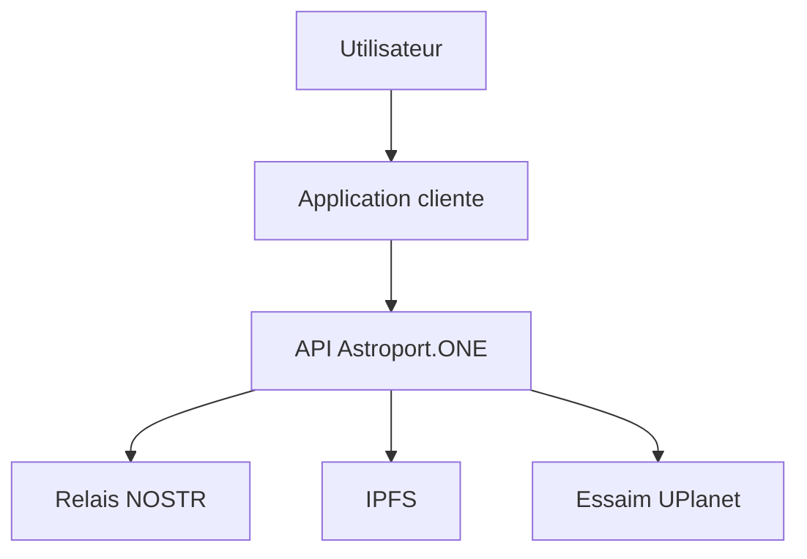
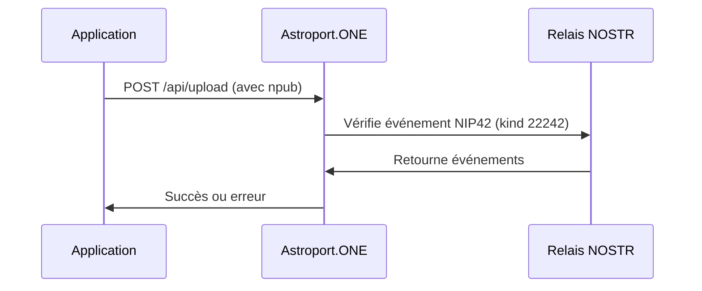
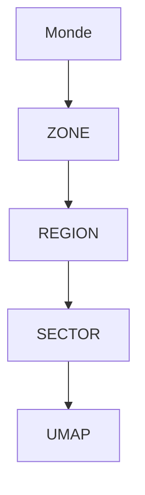

# Astroport.ONE API & UPlanet Swarm – Developer Guide

## 🚀 Introduction

Astroport.ONE est une API décentralisée pour l'écosystème UPlanet, permettant l'authentification, le stockage distribué, la découverte de services et d'utilisateurs autour d'une position géographique, sans dépendre d'un cloud centralisé.

Ce guide s'adresse aux développeurs souhaitant créer des applications web, mobiles ou IoT interopérables avec l'essaim UPlanet.

---

## 🌐 Vue d'ensemble de l'écosystème UPlanet/Astroport



- **Astroport.ONE** : API locale sur chaque node
- **UPlanet Swarm** : Réseau de nodes interconnectés (swarm.key)
- **NOSTR** : Protocole d'authentification décentralisé
- **IPFS** : Stockage distribué
- **UMAP/SECTOR/REGION/ZONE** : Découpage géographique hiérarchique

---

## 📚 Librairie JavaScript NOSTR

### Installation et utilisation

Astroport.ONE utilise et recommande la librairie JavaScript NOSTR hébergée sur IPFS :

```html
<!-- Inclusion de la librairie NOSTR depuis IPFS -->
<script src="https://ipfs.copylaradio.com/ipfs/QmXEmaPRUaGcvhuyeG99mHHNyP43nn8GtNeuDok8jdpG4a/nostr.bundle.js"></script>
```

### Fonctions principales disponibles

```javascript
// Génération de clés
const privateKey = NostrTools.generatePrivateKey();
const publicKey = NostrTools.getPublicKey(privateKey);

// Création et signature d'événements
const event = {
    kind: 22242, // NIP42 - Authentification
    created_at: Math.floor(Date.now() / 1000),
    tags: [
        ['relay', 'ws://127.0.0.1:7777'],
        ['challenge', 'your-challenge-here']
    ],
    content: 'Authentification pour Astroport.ONE'
};

const signedEvent = NostrTools.finishEvent(event, privateKey);

// Connexion aux relais
const relay = NostrTools.relayInit('ws://127.0.0.1:7777');
await relay.connect();
await relay.publish(signedEvent);
```

### Exemple d'intégration complète

```html
<!DOCTYPE html>
<html>
<head>
    <title>Astroport.ONE - Authentification NOSTR</title>
    <script src="https://ipfs.copylaradio.com/ipfs/QmXEmaPRUaGcvhuyeG99mHHNyP43nn8GtNeuDok8jdpG4a/nostr.bundle.js"></script>
</head>
<body>
    <h1>Authentification NOSTR pour Astroport.ONE</h1>
    
    <button onclick="generateKeys()">Générer de nouvelles clés</button>
    <button onclick="authenticate()">S'authentifier</button>
    
    <div id="status"></div>
    
    <script>
        let privateKey = null;
        let publicKey = null;
        
        function generateKeys() {
            privateKey = NostrTools.generatePrivateKey();
            publicKey = NostrTools.getPublicKey(privateKey);
            
            document.getElementById('status').innerHTML = 
                `<p>Clés générées :</p>
                 <p>Public Key: ${publicKey}</p>
                 <p>Private Key: ${privateKey}</p>`;
        }
        
        async function authenticate() {
            if (!privateKey || !publicKey) {
                alert('Générez d\'abord des clés');
                return;
            }
            
            try {
                // Créer l'événement d'authentification NIP42
                const authEvent = {
                    kind: 22242,
                    created_at: Math.floor(Date.now() / 1000),
                    tags: [
                        ['relay', 'ws://127.0.0.1:7777'],
                        ['challenge', 'astroport-auth-' + Date.now()]
                    ],
                    content: 'Authentification pour Astroport.ONE API'
                };
                
                const signedEvent = NostrTools.finishEvent(authEvent, privateKey);
                
                // Publier sur le relais
                const relay = NostrTools.relayInit('ws://127.0.0.1:7777');
                await relay.connect();
                await relay.publish(signedEvent);
                
                // Tester l'authentification avec l'API
                const response = await fetch('/api/test-nostr', {
                    method: 'POST',
                    headers: {
                        'Content-Type': 'application/x-www-form-urlencoded',
                    },
                    body: `npub=${publicKey}`
                });
                
                const result = await response.json();
                
                if (result.auth_verified) {
                    document.getElementById('status').innerHTML += 
                        '<p style="color: green;">✅ Authentification réussie !</p>';
                } else {
                    document.getElementById('status').innerHTML += 
                        '<p style="color: red;">❌ Authentification échouée</p>';
                }
                
                relay.close();
                
            } catch (error) {
                document.getElementById('status').innerHTML += 
                    `<p style="color: red;">❌ Erreur: ${error.message}</p>`;
            }
        }
    </script>
</body>
</html>
```

### Fonctions NOSTR disponibles

La librairie fournit toutes les fonctions NOSTR standards :

- **Authentification** : `NostrTools.nip42`
- **Chiffrement** : `NostrTools.nip04`, `NostrTools.nip44`
- **Profils** : `NostrTools.nip05`
- **Relais** : `NostrTools.relayInit`, `NostrTools.SimplePool`
- **Validation** : `NostrTools.validateEvent`, `NostrTools.verifySignature`
- **Utilitaires** : `NostrTools.getEventHash`, `NostrTools.finishEvent`

---

## 🔐 Authentification NOSTR (NIP42)

### Pourquoi NOSTR ?
- Authentification sans serveur central
- Interopérabilité et résistance à la censure

### Workflow



### Exemple minimal (Python)

```python
import requests
npub = "npub1..."
res = requests.post("http://127.0.0.1:54321/api/test-nostr", data={"npub": npub})
print(res.json())
```

---

## 📡 Endpoints API Astroport.ONE

| Endpoint                | Méthode | Description                  | Authentification |
|------------------------|---------|------------------------------|------------------|
| `/api/upload`          | POST    | Upload vers uDRIVE           | NOSTR            |
| `/api/upload_from_drive`| POST   | Sync depuis IPFS             | NOSTR            |
| `/api/delete`          | POST    | Suppression fichier          | NOSTR            |
| `/api/test-nostr`      | POST    | Test authentification        | NOSTR            |
| `/`                    | GET     | Statut, découverte territoire| Publique         |

### Exemple d'upload (JS avec librairie NOSTR)

```javascript
// Utilisation de la librairie NOSTR pour l'authentification
async function uploadFile(file, npub) {
    const formData = new FormData();
    formData.append('npub', npub);
    formData.append('file', file);
    
    const response = await fetch('/api/upload', { 
        method: 'POST', 
        body: formData 
    });
    
    return await response.json();
}

// Exemple d'utilisation
document.getElementById('uploadForm').addEventListener('submit', async (e) => {
    e.preventDefault();
    
    const file = document.getElementById('fileInput').files[0];
    const npub = document.getElementById('npub').value;
    
    try {
        const result = await uploadFile(file, npub);
        console.log('Upload réussi:', result.new_cid);
    } catch (error) {
        console.error('Erreur upload:', error);
    }
});
```

---

## 🗺️ Découverte du territoire et services locaux

### Système UMAP/SECTOR/REGION/ZONE

- **ZONE** : 10° x 10° (~1111km)
- **REGION** : 1° x 1° (~111km)
- **SECTOR** : 0.1° x 0.1° (~11km)
- **UMAP** : 0.01° x 0.01° (~1.1km)



### Découverte dynamique (nouveauté Ustats.sh)

L'API retourne désormais les **4 UMAPs les plus proches** du centre demandé :

#### Exemple de requête

```bash
GET /?lat=48.8566&lon=2.3522&deg=0.01
```

#### Extrait de réponse JSON

```json
{
  "CENTER": {"LAT": "48.86", "LON": "2.35", "DEG": "0.01"},
  "CLOSEST_UMAPs": [
    { "LAT": "48.86", "LON": "2.35", "UMAPROOT": "...", "DISTANCE_KM": "0.0", ... },
    ...
  ],
  "UMAPs": [...],
  "PLAYERs": [...],
  ...
}
```

#### Utilisation côté client

- Afficher les 4 UMAPs les plus proches sur une carte
- Lister les services ou utilisateurs présents dans ces UMAPs
- Proposer des interactions contextuelles (chat, partage, etc.)

#### Exemple Python

```python
import requests
r = requests.get('http://127.0.0.1:54321/', params={'lat': 48.8566, 'lon': 2.3522, 'deg': 0.01})
data = r.json()
for umap in data['CLOSEST_UMAPs']:
    print(f"UMAP {umap['LAT']},{umap['LON']} à {umap['DISTANCE_KM']} km")
```

---

## 📁 Structure des données et réponses

### Exemple de réponse complète

```json
{
  "version": "1.1",
  "DATE": "2024-01-01 12:00:00 UTC",
  "CENTER": {"LAT": "48.86", "LON": "2.35", "DEG": "0.01"},
  "CLOSEST_UMAPs": [ ... ],
  "UMAPs": [ ... ],
  "PLAYERs": [ ... ],
  "NOSTR": [ ... ],
  "SWARM": [ ... ],
  "ZEN": "990",
  "BILAN": "934",
  ...
}
```

### Explication des champs principaux
- **CENTER** : Coordonnées et précision de la requête
- **CLOSEST_UMAPs** : Les 4 UMAPs les plus proches du centre
- **UMAPs** : Toutes les UMAPs trouvées dans la zone
- **PLAYERs** : Utilisateurs actifs dans la zone
- **NOSTR** : Comptes NOSTR actifs
- **SWARM** : Autres nodes Astroport dans l'essaim
- **ZEN/BILAN** : Indicateurs d'économie locale

---

## 🛠️ Exemples d'intégration

### Web (HTML/JS avec librairie NOSTR)

```html
<!DOCTYPE html>
<html>
<head>
    <title>Mon App Astroport.ONE</title>
    <script src="https://ipfs.copylaradio.com/ipfs/QmXEmaPRUaGcvhuyeG99mHHNyP43nn8GtNeuDok8jdpG4a/nostr.bundle.js"></script>
</head>
<body>
    <h1>Upload vers uDRIVE avec NOSTR</h1>
    
    <form id="uploadForm">
        <input type="text" id="npub" placeholder="Votre clé publique NOSTR" required>
        <input type="file" id="fileInput" required>
        <button type="submit">Upload</button>
    </form>
    
    <div id="result"></div>
    
    <script>
        document.getElementById('uploadForm').addEventListener('submit', async (e) => {
            e.preventDefault();
            
            const npub = document.getElementById('npub').value;
            const file = document.getElementById('fileInput').files[0];
            
            const formData = new FormData();
            formData.append('npub', npub);
            formData.append('file', file);
            
            try {
                const response = await fetch('/api/upload', {
                    method: 'POST',
                    body: formData
                });
                
                const result = await response.json();
                document.getElementById('result').innerHTML = 
                    `<p>✅ Upload réussi! CID: ${result.new_cid}</p>`;
            } catch (error) {
                document.getElementById('result').innerHTML = 
                    `<p>❌ Erreur: ${error.message}</p>`;
            }
        });
    </script>
</body>
</html>
```

### Mobile (React Native)

```javascript
// ... voir documentation précédente pour l'exemple complet
```

### CLI (Shell)

```bash
curl -X POST http://127.0.0.1:54321/api/test-nostr -d "npub=your_npub_here"
curl "http://127.0.0.1:54321/?lat=48.8566&lon=2.3522&deg=0.01"
```

---

## 🔒 Sécurité, bonnes pratiques et gestion des erreurs

- **Validation des entrées** (npub, fichiers, etc.)
- **Gestion des erreurs API** (statuts HTTP, messages d'erreur)
- **Conseils production** : cache, logs, monitoring

---

## ❓ FAQ et ressources

- [Protocole NOSTR](https://github.com/nostr-protocol/nostr)
- [NIP42 - Authentification](https://github.com/nostr-protocol/nips/blob/master/42.md)
- [IPFS Documentation](https://docs.ipfs.io/)
- [CopyLaRadio](https://copylaradio.com/)
- [UPlanet ORIGIN](https://ipfs.copylaradio.com/ipns/copylaradio.com)
- **Librairie NOSTR** : [https://ipfs.copylaradio.com/ipfs/QmXEmaPRUaGcvhuyeG99mHHNyP43nn8GtNeuDok8jdpG4a/nostr.bundle.js](https://ipfs.copylaradio.com/ipfs/QmXEmaPRUaGcvhuyeG99mHHNyP43nn8GtNeuDok8jdpG4a/nostr.bundle.js)
- Discord UPlanet, GitHub Astroport.ONE

---

## 📚 Annexe : Structure JSON détaillée

Voir la section « Structure des données et réponses » pour un exemple complet et l'explication de chaque champ.

---

*Développez librement, restez décentralisé !* 🌍✨
