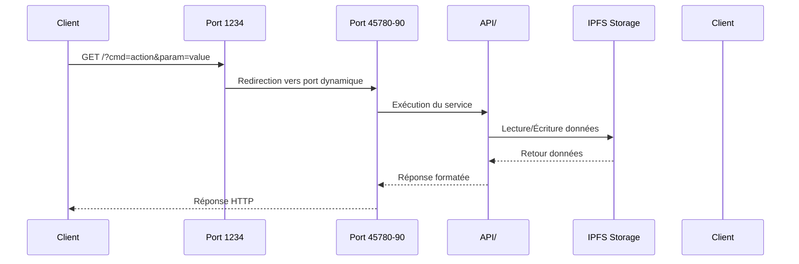
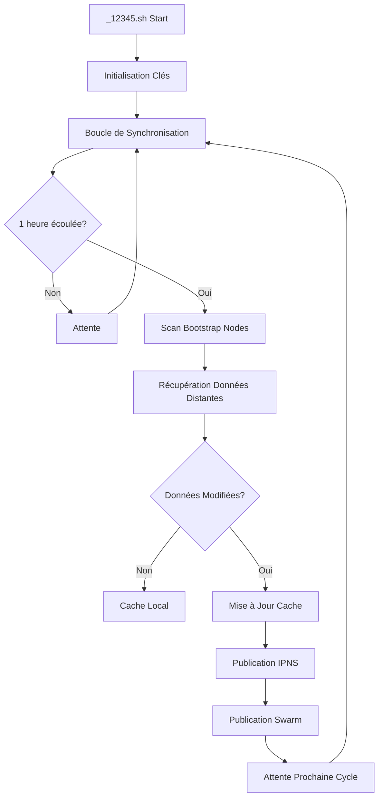
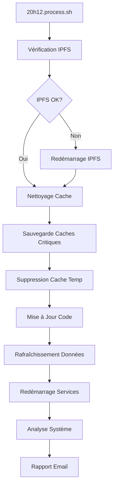

# 🏗️ Architecture Astroport.ONE

## 📋 Table des Matières

1. [Vue d'ensemble](#-vue-densemble)
2. [Architecture Système](#-architecture-système)
3. [Composants Principaux](#-composants-principaux)
4. [Flux de Données](#-flux-de-données)
5. [Sécurité et Cryptographie](#-sécurité-et-cryptographie)
6. [Économie et Paiements](#-économie-et-paiements)
7. [Stockage et Cache](#-stockage-et-cache)
8. [APIs et Services](#-apis-et-services)
9. [Maintenance et Monitoring](#-maintenance-et-monitoring)
10. [Déploiement](#-déploiement)
11. [Intégration NOSTR](#-intégration-nostr)
12. [Système UPassport](#-système-upassport)

---

## 🌟 Vue d'ensemble

Astroport.ONE est une plateforme décentralisée qui combine **monnaie libre (Ğ1)**, **stockage IPFS**, **identité numérique NOSTR** et **automatisation intelligente** pour créer un écosystème Web3 complet.

### 🎯 Objectifs

- **Souveraineté Numérique** : Contrôle total des données utilisateur
- **Économie Libre** : Transactions sans intermédiaires via Ğ1
- **Identité Décentralisée** : Gestion d'identité basée sur NOSTR et IPFS
- **Résilience** : Architecture distribuée sans point de défaillance unique
- **Automatisation Intelligente** : Système AstroBot avec Vœux

### 🌍 Écosystème UPlanet

Astroport.ONE alimente l'écosystème **UPlanet** qui fonctionne sur deux niveaux :

#### 🌐 **UPlanet ORIGIN (Niveau X)**
- **Accès public** pour tous les utilisateurs
- **Sécurité standard** avec surveillance Ğ1
- **Token fixe** : 1 Ẑen = 0.1 Ğ1
- **Services** : MULTIPASS, ZENCARD de base

#### 🛡️ **UPlanet Ẑen (Niveau Y/Z)**
- **Réseau privé** avec clés SSH<->IPFS jumelles
- **Sécurité avancée** avec détection d'intrusion
- **Tokens personnalisables** : 1 Ẑen = valeur d'actif (€, m², kWh, etc.)
- **Services avancés** : DeFi, actifs réels, coopératives

---

## 🏗️ Architecture Système

### Diagramme d'Architecture Générale

```
┌─────────────────────────────────────────────────────────────────┐
│                        Astroport.ONE                           │
│                    Écosystème Décentralisé                     │
└─────────────────────────────────────────────────────────────────┘
                                │
                ┌───────────────┼───────────────┐
                │               │               │
        ┌───────▼──────┐ ┌──────▼──────┐ ┌─────▼─────┐
        │   Interface  │ │   Services  │ │ Stockage  │
        │     Web      │ │   Métier    │ │Décentralisé│
        └──────────────┘ └─────────────┘ └───────────┘
                │               │               │
        ┌───────▼──────┐ ┌──────▼──────┐ ┌─────▼─────┐
        │   Port 1234  │ │  RUNTIME/   │ │   IPFS    │
        │  API Gateway │ │  Services   │ │  Storage  │
        └──────────────┘ └─────────────┘ └───────────┘
                │               │               │
        ┌───────▼──────┐ ┌──────▼──────┐ ┌─────▼─────┐
        │   Port 12345 │ │  ASTROBOT/  │ │  ~/.zen/  │
        │ Station Map  │ │ Automation  │ │   Cache   │
        └──────────────┘ └─────────────┘ └───────────┘
```

### Architecture en Couches

| Couche | Composants | Description |
|--------|------------|-------------|
| **Présentation** | Ports 1234, 12345, 54321 | Interfaces web et APIs |
| **Application** | API/, RUNTIME/, ASTROBOT/ | Services métier et automatisation |
| **Données** | IPFS, ~/.zen/game/ | Stockage décentralisé et cache |
| **Réseau** | Ğ1, NOSTR, IPFS | Protocoles de communication |

---

## 🔧 Composants Principaux

### 1. Scripts de Gestion Principaux

| Script | Taille | Port | Rôle |
|--------|--------|------|------|
| `command.sh` | 51KB | - | Interface principale de gestion |
| `12345.sh` | 10KB | 1234 | Serveur API principal |
| `_12345.sh` | 23KB | 12345 | Cartographie des stations |
| `20h12.process.sh` | 11KB | - | Maintenance quotidienne |
| `NOSTRCARD.refresh.sh` | 34KB | - | Gestion des cartes NOSTR |

### 2. Services et Ports

| Port | Service | Description | Protocole |
|------|---------|-------------|-----------|
| **1234** | API Gateway | Point d'entrée principal | HTTP |
| **12345** | Station Map | Cartographie UPlanet | HTTP |
| **45780-90** | API Response | Ports de réponse dynamiques | HTTP |
| **33101** | G1Billet | Service de paiement Ğ1 | HTTP |
| **54321** | UPassport | API d'identité numérique | HTTP |
| **8080, 4001, 5001** | IPFS Gateway | Accès stockage décentralisé | HTTP |
| **7777** | NOSTR Relay | Réseau social décentralisé | WebSocket |

### 3. Structure des Répertoires

```
Astroport.ONE/
├── command.sh              # Interface principale
├── 12345.sh               # Serveur API
├── _12345.sh              # Cartographie stations
├── 20h12.process.sh       # Maintenance quotidienne
├── install.sh             # Installation automatique
├── tools/                 # Utilitaires système
│   ├── my.sh             # Bibliothèque de fonctions
│   ├── keygen            # Générateur de clés
│   └── heartbox_analysis.sh # Analyse système
├── API/                   # Endpoints spécialisés
│   ├── QRCODE.sh         # Gestion QR codes
│   ├── SALT.sh           # Authentification
│   └── UPLANET.sh        # Données UPlanet
├── RUNTIME/               # Services en arrière-plan
│   ├── G1PalPay.sh       # Surveillance Ğ1
│   ├── NOSTRCARD.refresh.sh # Cartes NOSTR
│   └── PLAYER.refresh.sh # Rafraîchissement joueurs
├── ASTROBOT/              # Automatisation
│   └── N1*.sh            # Commandes N1
├── templates/             # Templates HTML
└── docker/               # Configuration Docker
```

---

## 🔄 Flux de Données

### 1. Flux de Requête API Typique



### 2. Flux de Synchronisation Swarm



### 3. Flux de Maintenance Quotidienne



---

## 🔐 Sécurité et Cryptographie

### 1. Gestion des Clés

| Type de Clé | Format | Usage | Stockage |
|-------------|--------|-------|----------|
| **Dunikey** | Ğ1 | Paiements et transactions | `~/.zen/game/players/*/secret.dunikey` |
| **IPFS Key** | IPFS | Identité décentralisée | `~/.ipfs/keystore/` |
| **NOSTR Key** | NOSTR | Réseau social | `~/.zen/game/nostr/*/.secret.nostr` |
| **SSSS Keys** | Shamir | Partage de secrets | `~/.zen/game/nostr/*/.secret.disco` |

### 2. Validation des Transactions

```bash
# Vérification des transactions primaires
function validate_primal_transaction() {
    local transaction="$1"
    local primal_source="$2"
    
    # Vérification de la source primaire
    if [[ "$primal_source" == "UPlanet_ORIGIN" ]]; then
        # Accepte toute source primaire
        return 0
    elif [[ "$primal_source" == "UPlanet_ZEN" ]]; then
        # Vérification stricte avec détection d'intrusion
        check_intrusion_detection "$transaction"
        return $?
    fi
}
```

### 3. Système de Chiffrement

- **Clés Géographiques** : Génération basée sur coordonnées GPS
- **Stargates** : Distribution sécurisée des clés de chiffrement
- **Communs Cryptographiques** : Partage de ressources cryptographiques

---

## 💰 Économie et Paiements

### 1. Système Multi-Tokens

#### **Tokens Ẑen (MULTIPASS & ZENCARD)**
- **UPlanet ORIGIN** : 1 Ẑen = 0.1 Ğ1 (taux fixe)
- **UPlanet Ẑen** : 1 Ẑen = valeur personnalisable (€, terrain, énergie, etc.)

#### **Tokens NEẐ (uPASSPORT ZEROCARD)**
- **Valeur** : 1 NEẐ = 1 Ğ1 (équivalent direct Ğ1)
- **Usage** : Actions dans l'infrastructure coopérative

#### **Made In Zen Tokens**
- **Usage** : Gouvernance coopérative et propriété d'infrastructure
- **Accès** : Disponible aux détenteurs de ZENCARD et utilisateurs uPASSPORT

### 2. G1PalPay.sh - Surveillance Temps Réel

```bash
# Surveillance des transactions Ğ1
function monitor_g1_transactions() {
    local player="$1"
    local g1pub="$2"
    
    # Surveillance continue des transactions
    while true; do
        # Récupération des nouvelles transactions
        local new_transactions=$(get_new_transactions "$g1pub")
        
        # Traitement des transactions
        for transaction in $new_transactions; do
            process_transaction "$transaction" "$player"
        done
        
        sleep 30
    done
}
```

### 3. Économie des Likes

- **Chaque like reçu** = 0.1 Ğ1 automatiquement transféré
- **Système de gratitude** : Récompense directe pour les interactions
- **Capitalisation automatique** : Gestion des tokens en temps réel

---

## 💾 Stockage et Cache

### 1. Structure IPFS

```
~/.zen/game/
├── players/              # Données des joueurs
│   ├── .current/        # Joueur actuel
│   └── */               # Données par joueur
│       ├── secret.dunikey
│       ├── ipfs/        # Stockage IPFS personnel
│       └── nostr/       # Données NOSTR
├── nostr/               # Données NOSTR globales
└── tmp/                 # Cache temporaire
```

### 2. Système de Cache

- **Cache Local** : `~/.zen/tmp/` pour les données temporaires
- **Cache IPFS** : Stockage local des blobs IPFS fréquemment accédés
- **Cache NOSTR** : Stockage local des événements NOSTR

### 3. Synchronisation

- **Synchronisation Swarm** : Partage des données entre stations UPlanet
- **Publication IPNS** : Mise à jour des références IPNS
- **Cache Invalidation** : Gestion automatique de l'expiration des caches

---

## 🔌 APIs et Services

### 1. API Gateway (Port 1234)

```bash
# Point d'entrée principal
GET /?cmd=action&param=value

# Redirection vers ports dynamiques (45780-90)
# Exécution des services API/
```

### 2. Station Map (Port 12345)

```bash
# Cartographie des stations UPlanet
GET / - Interface de cartographie
GET /api/stations - Données JSON des stations
GET /api/players - Données des joueurs
```

### 3. UPassport API (Port 54321)

```bash
# API d'identité numérique
POST /api/upload - Upload de fichiers vers IPFS
POST /api/delete - Suppression de fichiers
GET /api/test-nostr - Test d'authentification NOSTR
```

---

## 🔧 Maintenance et Monitoring

### 1. Maintenance Quotidienne (20h12.process.sh)

```bash
# Vérification IPFS
check_ipfs_status

# Nettoyage cache
cleanup_temp_files

# Sauvegarde caches critiques
backup_critical_caches

# Mise à jour code
update_code

# Redémarrage services
restart_services

# Analyse système
system_analysis

# Rapport email
send_maintenance_report
```

### 2. Monitoring Système

- **heartbox_analysis.sh** : Analyse complète du système
- **heartbox_control.sh** : Contrôle et gestion du système
- **heartbox_prometheus_analysis.sh** : Métriques Prometheus

### 3. Logs et Debugging

- **Logs système** : `/var/log/astroport/`
- **Logs IPFS** : `~/.zen/tmp/ipfs.log`
- **Logs NOSTR** : `~/.zen/tmp/nostr.log`

---

## 🚀 Déploiement

### 1. Installation Automatique

```bash
# Installation complète
bash <(curl -sL https://install.astroport.com)

# Ou installation manuelle
git clone https://github.com/papiche/Astroport.ONE.git ~/.zen/Astroport.ONE
cd ~/.zen/Astroport.ONE
./install.sh
```

### 2. Configuration Système

```bash
# Configuration IPFS
~/.zen/Astroport.ONE/ipfs_setup.sh

# Configuration NOSTR
~/.zen/workspace/NIP-101/setup.sh

# Configuration UPassport
~/.zen/Astroport.ONE/install_upassport.sh
```

### 3. Services Systemd

```bash
# Service Astroport
sudo systemctl enable astroport
sudo systemctl start astroport

# Service UPassport
sudo systemctl enable upassport
sudo systemctl start upassport

# Service NOSTR Relay
sudo systemctl enable strfry
sudo systemctl start strfry
```

---

## 🤖 Intégration NOSTR

### 1. Relay NOSTR (Port 7777)

Astroport.ONE utilise un relay NOSTR dédié avec des filtres personnalisés pour :

- **Authentification NIP-42** : Vérification des identités
- **IA Contextuelle** : Réponses automatiques avec #BRO
- **Géolocalisation** : Messages liés aux coordonnées GPS
- **Mémoire Privée** : Stockage contrôlé avec #rec

### 2. Filtres Personnalisés

```bash
# Filtre principal (all_but_blacklist.sh)
# Accepte tous les événements sauf ceux de la blacklist

# Filtre kind 1 (filter/1.sh)
# Gestion des messages texte avec IA et mémoire
```

### 3. Système de Mémoire

- **Mémoire Utilisateur** : `~/.zen/strfry/uplanet_memory/pubkey/{pubkey}.json`
- **Mémoire UMAP** : `~/.zen/strfry/uplanet_memory/{latitude}_{longitude}.json`
- **Contrôle Privé** : Tag #rec requis pour stockage

---

## 🛡️ Système UPassport

### 1. API d'Identité Numérique (Port 54321)

UPassport fournit une API complète pour :

- **Gestion d'Identité** : Création et gestion des UPassports
- **Stockage IPFS** : Upload et gestion de fichiers décentralisés
- **Intégration NOSTR** : Authentification et gestion des cartes NOSTR
- **Intégration Ğ1** : Vérification de solde et transactions

### 2. Authentification NIP-42

```bash
# Test d'authentification
curl -X POST http://localhost:54321/api/test-nostr \
  -F "npub=npub1..."

# Upload avec authentification
curl -F "file=@photo.jpg" \
     -F "npub=npub1..." \
     http://localhost:54321/api/upload
```

### 3. Structure de Stockage

```
~/.zen/UPassport/
├── Images/          # Images uploadées
├── Music/           # Fichiers audio
├── Videos/          # Fichiers vidéo
├── Documents/       # Documents
└── _index.html      # Interface web
```

---

## 📊 Métriques et Performance

### 1. Indicateurs Clés

- **Uptime** : Disponibilité des services
- **Latence** : Temps de réponse des APIs
- **Stockage** : Utilisation IPFS et cache
- **Transactions** : Volume de transactions Ğ1

### 2. Monitoring Prometheus

- **Exporters** : Métriques système et application
- **Dashboards** : Visualisation des performances
- **Alertes** : Notifications automatiques

### 3. Optimisation

- **Cache IPFS** : Optimisation des accès fréquents
- **Compression** : Réduction de la bande passante
- **Load Balancing** : Répartition de charge

---

## 🔗 Liens et Ressources

### Documentation
- **[README.md](README.md)** - Introduction principale
- **[WELCOME.md](WELCOME.md)** - Guide écosystème UPlanet
- **[UPASSPORT_API.md](UPASSPORT_API.md)** - Documentation API UPassport
- **[API.NOSTRAuth.readme.md](API.NOSTRAuth.readme.md)** - Documentation NOSTR

### Ressources Externes
- **[GitHub Repository](https://github.com/papiche/Astroport.ONE)** - Code source
- **[Open Collective](https://opencollective.com/monnaie-libre)** - Support financier
- **[Documentation GitBook](https://astroport-1.gitbook.io/astroport.one/)** - Guide utilisateur

### Contact
- **Email** : support@qo-op.com
- **Site Web** : https://astroport.copylaradio.com
- **Communauté** : https://copylaradio.com

---

**Astroport.ONE : L'architecture décentralisée pour un Internet libre et souverain** 🌍✨ 