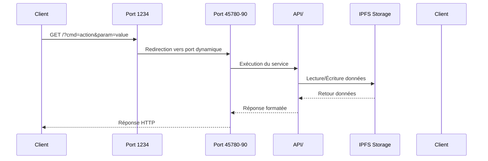
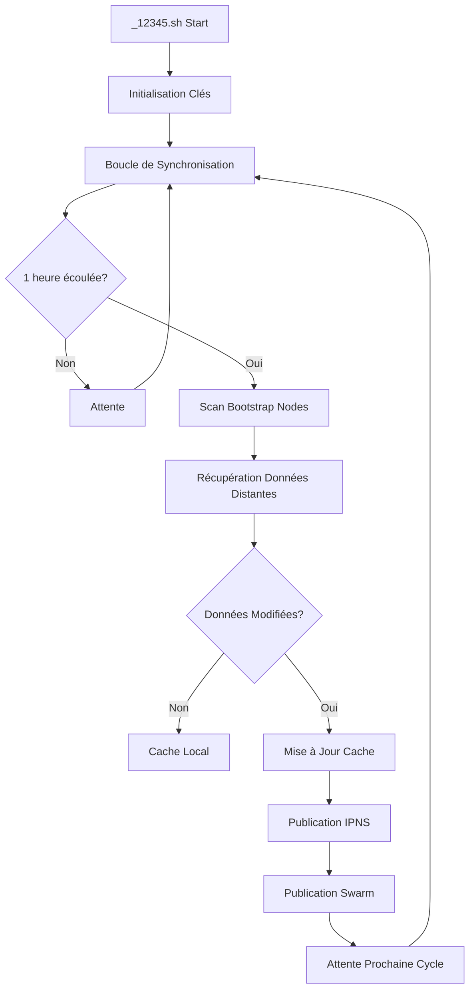
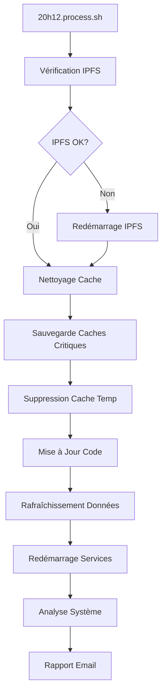
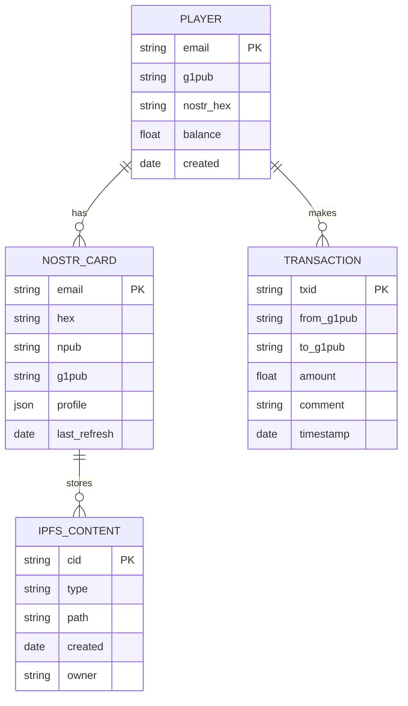
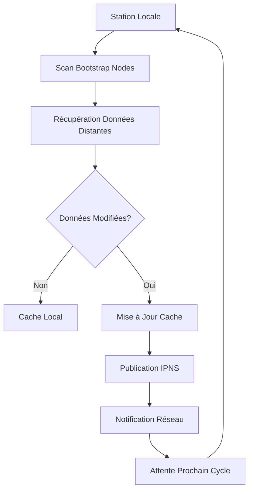

# 🏗️ Architecture Astroport.ONE

## 📋 Table des Matières

1. [Vue d'ensemble](#-vue-densemble)
2. [Architecture Système](#-architecture-système)
3. [Composants Principaux](#-composants-principaux)
4. [Flux de Données](#-flux-de-données)
5. [Sécurité et Cryptographie](#-sécurité-et-cryptographie)
6. [Économie et Paiements](#-économie-et-paiements)
7. [Stockage et Cache](#-stockage-et-cache)
8. [APIs et Services](#-apis-et-services)
9. [Maintenance et Monitoring](#-maintenance-et-monitoring)
10. [Déploiement](#-déploiement)

---

## 🌟 Vue d'ensemble

Astroport.ONE est une plateforme décentralisée qui combine **monnaie libre (Ğ1)**, **stockage IPFS**, **identité numérique NOSTR** et **automatisation intelligente** pour créer un écosystème Web3 complet.

### 🎯 Objectifs

- **Souveraineté Numérique** : Contrôle total des données utilisateur
- **Économie Libre** : Transactions sans intermédiaires via Ğ1
- **Identité Décentralisée** : Gestion d'identité basée sur NOSTR et IPFS
- **Résilience** : Architecture distribuée sans point de défaillance unique

---

## 🏗️ Architecture Système

### Diagramme d'Architecture Générale

```
┌─────────────────────────────────────────────────────────────────┐
│                        Astroport.ONE                           │
│                    Écosystème Décentralisé                     │
└─────────────────────────────────────────────────────────────────┘
                                │
                ┌───────────────┼───────────────┐
                │               │               │
        ┌───────▼──────┐ ┌──────▼──────┐ ┌─────▼─────┐
        │   Interface  │ │   Services  │ │ Stockage  │
        │     Web      │ │   Métier    │ │Décentralisé│
        └──────────────┘ └─────────────┘ └───────────┘
                │               │               │
        ┌───────▼──────┐ ┌──────▼──────┐ ┌─────▼─────┐
        │   Port 1234  │ │  RUNTIME/   │ │   IPFS    │
        │  API Gateway │ │  Services   │ │  Storage  │
        └──────────────┘ └─────────────┘ └───────────┘
                │               │               │
        ┌───────▼──────┐ ┌──────▼──────┐ ┌─────▼─────┐
        │   Port 12345 │ │  ASTROBOT/  │ │  ~/.zen/  │
        │ Station Map  │ │ Automation  │ │   Cache   │
        └──────────────┘ └─────────────┘ └───────────┘
```

### Architecture en Couches

| Couche | Composants | Description |
|--------|------------|-------------|
| **Présentation** | Ports 1234, 12345, 54321 | Interfaces web et APIs |
| **Application** | API/, RUNTIME/, ASTROBOT/ | Services métier et automatisation |
| **Données** | IPFS, ~/.zen/game/ | Stockage décentralisé et cache |
| **Réseau** | Ğ1, NOSTR, IPFS | Protocoles de communication |

---

## 🔧 Composants Principaux

### 1. Scripts de Gestion Principaux

| Script | Taille | Port | Rôle |
|--------|--------|------|------|
| `command.sh` | 51KB | - | Interface principale de gestion |
| `12345.sh` | 10KB | 1234 | Serveur API principal |
| `_12345.sh` | 23KB | 12345 | Cartographie des stations |
| `20h12.process.sh` | 11KB | - | Maintenance quotidienne |
| `NOSTRCARD.refresh.sh` | 34KB | - | Gestion des cartes NOSTR |

### 2. Services et Ports

| Port | Service | Description | Protocole |
|------|---------|-------------|-----------|
| **1234** | API Gateway | Point d'entrée principal | HTTP |
| **12345** | Station Map | Cartographie UPlanet | HTTP |
| **45780-90** | API Response | Ports de réponse dynamiques | HTTP |
| **33101** | G1Billet | Service de paiement Ğ1 | HTTP |
| **54321** | UPassport | API d'identité numérique | HTTP |
| **8080, 4001, 5001** | IPFS Gateway | Accès stockage décentralisé | HTTP |
| **7777** | NOSTR Relay | Réseau social décentralisé | WebSocket |

### 3. Structure des Répertoires

```
Astroport.ONE/
├── command.sh              # Interface principale
├── 12345.sh               # Serveur API
├── _12345.sh              # Cartographie stations
├── 20h12.process.sh       # Maintenance quotidienne
├── install.sh             # Installation automatique
├── tools/                 # Utilitaires système
│   ├── my.sh             # Bibliothèque de fonctions
│   ├── keygen            # Générateur de clés
│   └── heartbox_analysis.sh # Analyse système
├── API/                   # Endpoints spécialisés
│   ├── QRCODE.sh         # Gestion QR codes
│   ├── SALT.sh           # Authentification
│   └── UPLANET.sh        # Données UPlanet
├── RUNTIME/               # Services en arrière-plan
│   ├── G1PalPay.sh       # Surveillance Ğ1
│   ├── NOSTRCARD.refresh.sh # Cartes NOSTR
│   └── PLAYER.refresh.sh # Rafraîchissement joueurs
├── ASTROBOT/              # Automatisation
│   └── N1*.sh            # Commandes N1
├── templates/             # Templates HTML
└── docker/               # Configuration Docker
```

---

## 🔄 Flux de Données

### 1. Flux de Requête API Typique



### 2. Flux de Synchronisation Swarm



### 3. Flux de Maintenance Quotidienne



---

## 🔐 Sécurité et Cryptographie

### 1. Gestion des Clés

| Type de Clé | Format | Usage | Stockage |
|-------------|--------|-------|----------|
| **Dunikey** | Ğ1 | Paiements et transactions | `~/.zen/game/players/*/secret.dunikey` |
| **IPFS Key** | IPFS | Identité décentralisée | `~/.ipfs/keystore/` |
| **NOSTR Key** | NOSTR | Réseau social | `~/.zen/game/nostr/*/.secret.nostr` |
| **SSSS Keys** | Shamir | Partage de secrets | `~/.zen/game/nostr/*/.secret.disco` |

### 2. Validation des Transactions

```bash
# Vérification des transactions primaires
function validate_primal_transaction() {
    local g1pub="$1"
    local cache_file="~/.zen/tmp/coucou/${g1pub}.primal"
    
    if [[ ! -s "$cache_file" ]]; then
        # Récupération de l'historique
        silkaj_output=$(silkaj --endpoint "$BMAS_NODE" --json money history ${g1pub})
        g1prime=$(echo "$silkaj_output" | jq -r '.history[0].pubkey')
        
        # Cache du résultat
        [[ ! -z ${g1prime} ]] && echo "${g1prime}" > "$cache_file"
    fi
    
    return $(cat "$cache_file")
}
```

### 3. Contrôle d'Intrusion

| Type d'Attaque | Détection | Action |
|----------------|-----------|--------|
| **Transaction Non-Autorisée** | Vérification primal | Remboursement automatique |
| **Portefeuille Intrus** | Validation source | Alerte email + destruction |
| **Données Corrompues** | Checksum IPFS | Régénération depuis backup |
| **Relai Malveillant** | Validation NOSTR | Blacklist automatique |

---

## 💰 Économie et Paiements

### 1. Système de Paiement Ğ1

| Type de Paiement | Montant | Fréquence | Destinataire |
|------------------|---------|-----------|--------------|
| **MULTIPASS** | 1 Ẑen | Hebdomadaire | Captain |
| **ZENCARD** | 4 Ẑen | Hebdomadaire | Captain |
| **NOSTR Card** | 1 Ẑen | Hebdomadaire | Captain |
| **UPlanet ORIGIN** | 0.1 Ğ1 | Quotidien | UPlanet |

### 2. Calcul des Soldes

```bash
# Conversion Ğ1 vers Ẑen
COINS=$(${MY_PATH}/../tools/COINScheck.sh ${G1PUB} | tail -n 1)
if [[ -n "$COINS" && "$COINS" != "null" ]]; then
    ZEN=$(echo "($COINS - 1) * 10" | bc | cut -d '.' -f 1)
else
    ZEN=-10
fi
```

### 3. Automatisation des Paiements

```bash
# Cycle de paiement hebdomadaire
if [ $((DIFF_DAYS % 7)) -eq 0 ]; then
    if [[ $(echo "$COINS > 1" | bc -l) -eq 1 ]]; then
        # Paiement automatique
        ${MY_PATH}/../tools/PAYforSURE.sh \
            "$HOME/.zen/tmp/${MOATS}/nostr.${PLAYER}.dunikey" \
            "$Gpaf" "${CAPTAING1PUB}" \
            "NOSTR:${UPLANETG1PUB:0:8}:PAF"
    else
        # Destruction de la carte
        ${MY_PATH}/../tools/nostr_DESTROY_TW.sh "${PLAYER}"
    fi
fi
```

---

## 💾 Stockage et Cache

### 1. Structure de Stockage

```
~/.zen/
├── Astroport.ONE/          # Code source principal
├── game/                   # Données utilisateurs
│   ├── players/           # Profils joueurs
│   │   ├── .current/     # Joueur actuel
│   │   └── [email]/       # Données par utilisateur
│   │       ├── ipfs/moa/ # TiddlyWiki personnel
│   │       ├── G1PalPay/ # Historique transactions
│   │       └── secret.dunikey # Clés cryptographiques
│   └── nostr/            # Cartes NOSTR
│       └── [email]/      # Données NOSTR par utilisateur
│           ├── APP/      # Applications (uDRIVE, uWORLD)
│           ├── PRIMAL/   # Données transaction primaire
│           └── .secret.* # Clés cryptographiques
├── tmp/                   # Cache temporaire
│   ├── [MOATS]/          # Sessions temporaires
│   ├── [IPFSNODEID]/     # Données par nœud
│   ├── swarm/            # Cache réseau
│   ├── coucou/           # Cache transactions
│   └── flashmem/         # Cache géographique
├── ♥Box                  # IP publique (NAT)
├── GPS/                  # Géolocalisation
└── workspace/            # Environnement développement
```

### 2. Système de Cache Intelligent

| Type de Cache | Localisation | Durée de Vie | Contenu |
|---------------|--------------|--------------|---------|
| **Swarm** | `~/.zen/tmp/swarm/` | 1 heure | Données réseau |
| **Coucou** | `~/.zen/tmp/coucou/` | Persistant | Transactions primaires |
| **FlashMem** | `~/.zen/tmp/flashmem/` | Persistant | Données géographiques |
| **Session** | `~/.zen/tmp/[MOATS]/` | Requête | Données temporaires |

### 3. Mécanismes de Cache

```bash
# Vérification du statut des services
check_services_status() {
    local status_file="$HOME/.zen/tmp/$IPFSNODEID/12345.json"
    local file_age=$(( $(date +%s) - $(stat -c %Y "$status_file") ))
    
    if [[ $file_age -lt 86400 ]]; then  # 24 heures
        # Utilise le cache JSON récent
        use_json_status=true
    else
        # Vérification en temps réel
        check_real_time_status
    fi
}
```

---

## 🔌 APIs et Services

### 1. API Gateway (Port 1234)

| Endpoint | Méthode | Description | Paramètres |
|----------|---------|-------------|------------|
| `/` | GET | Page d'accueil | - |
| `/?cmd=action&param=value` | GET | API dynamique | Variables multiples |
| `/test` | GET | Test de connectivité | - |

### 2. API UPassport (Port 54321)

| Endpoint | Méthode | Description | Auth |
|----------|---------|-------------|------|
| `/api/upload` | POST | Upload fichier uDRIVE | NOSTR NIP42 |
| `/api/upload_from_drive` | POST | Sync IPFS vers uDRIVE | NOSTR NIP42 |
| `/api/delete` | POST | Suppression fichier | NOSTR NIP42 |
| `/api/test-nostr` | POST | Test authentification | - |

### 3. Services RUNTIME

| Service | Script | Fonction |
|---------|--------|----------|
| **G1PalPay** | `G1PalPay.sh` | Surveillance blockchain Ğ1 |
| **NOSTR Cards** | `NOSTRCARD.refresh.sh` | Gestion cartes NOSTR |
| **Player Refresh** | `PLAYER.refresh.sh` | Rafraîchissement joueurs |
| **UPlanet Sync** | `UPLANET.refresh.sh` | Synchronisation UPlanet |

---

## 🔧 Maintenance et Monitoring

### 1. Script de Maintenance (20h12.process.sh)

| Phase | Action | Durée |
|-------|--------|-------|
| **Vérification** | Test IPFS et services | 5 min |
| **Nettoyage** | Sauvegarde et suppression cache | 10 min |
| **Mise à jour** | Git pull et dépendances | 15 min |
| **Synchronisation** | Rafraîchissement données réseau | 30 min |
| **Redémarrage** | Services et analyse | 10 min |

### 2. Monitoring Automatique

```bash
# Vérification de la connectivité IPFS
ipfs --timeout=30s swarm peers 2>/dev/null > ~/.zen/tmp/ipfs.swarm.peers
[[ ! -s ~/.zen/tmp/ipfs.swarm.peers || $? != 0 ]] \
    && sudo systemctl restart ipfs
```

### 3. Métriques Collectées

| Métrique | Source | Fréquence | Usage |
|----------|--------|-----------|-------|
| **Statut Services** | `heartbox_analysis.sh` | Quotidien | Monitoring |
| **Transactions Ğ1** | `G1PalPay.sh` | Temps réel | Économie |
| **Performance** | APIs | Requête | Optimisation |
| **Géolocalisation** | GPS | Quotidien | Réseau |

---

## 🚀 Déploiement

### 1. Installation Automatique

```bash
# Installation complète
bash <(curl -sL https://install.astroport.com)

# Ou installation manuelle
git clone https://github.com/papiche/Astroport.ONE.git ~/.zen/Astroport.ONE
cd ~/.zen/Astroport.ONE
./install.sh
```

### 2. Configuration Système

| Composant | Configuration | Fichier |
|-----------|---------------|---------|
| **IPFS** | Daemon systemd | `/etc/systemd/system/ipfs.service` |
| **Astroport** | Service systemd | `/etc/systemd/system/astroport.service` |
| **G1Billet** | Service systemd | `/etc/systemd/system/g1billet.service` |
| **NOSTR Relay** | Service systemd | `/etc/systemd/system/strfry.service` |

### 3. Variables d'Environnement

| Variable | Description | Exemple |
|----------|-------------|---------|
| `UPLANETNAME` | Nom de la station UPlanet | `"ZenStation"` |
| `UPLANETG1PUB` | Clé publique UPlanet | `"AwdjhpJNqzQgmSrvpUk5Fd2GxBZMJVQkBQmXn4JQLr6z"` |
| `IPFSNODEID` | Identifiant nœud IPFS | `"QmHash..."` |
| `CAPTAINEMAIL` | Email du capitaine | `"captain@example.com"` |

---

## 📊 Diagrammes Techniques

### Architecture de Données



### Flux de Synchronisation



---

## 🔮 Évolutions Futures

### 1. Niveaux N1/N2

| Niveau | Description | Validation |
|--------|-------------|------------|
| **N1** | Validation des compétences | 5+ signatures |
| **N2** | Transmission des savoirs | 10+ signatures |

### 2. Intégrations Prévues

- **IA Décentralisée** : Assistant personnel #BRO
- **Métavers** : Monde virtuel uWORLD étendu
- **IoT** : Intégration objets connectés
- **DeFi** : Services financiers décentralisés

---

## 📚 Références

- [Documentation UPlanet](https://astroport-1.gitbook.io/astroport.one/)
- [Protocole NOSTR](https://github.com/nostr-protocol/nostr)
- [Monnaie Libre Ğ1](https://monnaie-libre.fr)
- [IPFS Documentation](https://docs.ipfs.io/)

---

*Document généré automatiquement - Astroport.ONE v3.6* 