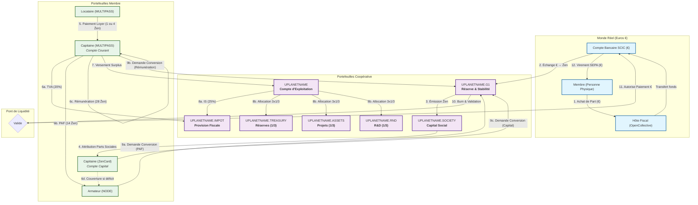

# **CONSTITUTION DE L'ÉCOSYSTÈME UPLANET ẐEN**
**Pacte Social et Protocole Opérationnel de la SCIC CopyLaRadio**
*Version 3.1 - "La Coopérative Auto-Exécutable et Régénératrice"*

---
> ### **Notes de Version 3.1**
> Cette version affine et clarifie plusieurs points critiques :
> - **Précision du Rôle des Portefeuilles Membres :** Clarification du `MULTIPASS` comme compte courant et de la `ZenCard` comme compte de capital.
> - **Calcul du Surplus du Capitaine :** Le diagramme et la logique reflètent désormais le calcul exact : `Surplus = Revenus Locatifs - (TVA + PAF Armateur + Rémunération Capitaine)`.
> - **Clarification de la Règle du 1/3 :** La règle s'applique aux revenus d'activité. La conversion du capital social suit les règles du droit des sociétés.
> - **Amélioration du Diagramme des Flux :** Le diagramme a été entièrement revu pour plus de clarté, de précision et pour illustrer la séquence logique des opérations.

---

## **PRÉAMBULE : NOTRE MISSION**

Nous, membres de la SCIC CopyLaRadio, déclarons notre intention de créer un écosystème économique régénérateur où la technologie sert l'humain et la nature. Notre mission est de transformer l'économie numérique en un outil de création de biens communs physiques et durables.

**Notre Vision :** Un monde où chaque like, chaque contribution numérique, participe à la régénération de notre planète.

**Notre Méthode :** La coopération, la transparence et l'automatisation au service de l'intérêt collectif.

---

> **📖 Pour comprendre COMMENT cette Constitution est appliquée techniquement, consultez le [Code de la Route de l'Écosystème](https://github.com/papiche/Astroport.ONE/blob/master/RUNTIME/ZEN.ECONOMY.readme.md)**

---

## **TITRE I : FONDEMENTS PHILOSOPHIQUES**

### **Article 1 : Le Principe de la Comptabilité par la Preuve**
La blockchain Ğ1 constitue notre **livre de comptes vivant, infalsifiable et auditable en temps réel**. Ce registre transactionnel immuable est la base de notre transparence et de notre confiance mutuelle.

### **Article 2 : L'Architecture "Hôtel Coopératif"**
Notre écosystème fonctionne comme un **"Hôtel Coopératif"** décentralisé où :
- **L'Armateur** fournit l'infrastructure physique (le bâtiment, les chambres).
- **Le Capitaine** gère les services, la maintenance et les clients.
- **Le Locataire** paie pour utiliser une chambre et les services.
- **Le Sociétaire** possède une part de l'hôtel et participe à la gouvernance et aux bénéfices.

### **Article 3 : La Règle des 3x1/3**
Le surplus net de la coopérative est alloué selon la règle statutaire des **3x1/3** :
1.  **1/3 Trésorerie** : Réserves impartageables pour la stabilité.
2.  **1/3 R&D** : Financement du G1FabLab et de l'innovation.
3.  **1/3 Forêts Jardins** : Acquisition d'actifs physiques régénératifs.

---

## **TITRE II : STRUCTURE COOPÉRATIVE**

### **Article 4 : Statut SCIC**
La SCIC CopyLaRadio est une **Société Coopérative d'Intérêt Collectif** régie par le Code de commerce français. Elle respecte les principes coopératifs fondamentaux.

### **Article 5 : Délégation au Protocole Automatisé**
**La répartition des revenus et des charges est déléguée à un protocole automatisé, public et auditable, dont le code fait partie intégrante du présent pacte social.** Ce protocole garantit l'application impartiale des règles statutaires.

### **Article 6 : Hôtes Fiscaux Mandatés**
La coopérative peut mandater des **hôtes fiscaux** (tels que OpenCollective) pour agir comme agents dans la gestion des flux en Euros (collecte des apports, exécution des virements SEPA), sous la direction de la coopérative.

---

## **TITRE III : RÈGLES ÉCONOMIQUES FONDAMENTALES**

### **Article 7 : La Participation Aux Frais (PAF) et la Rémunération du Capitaine**
1.  **PAF de l'Armateur :** Le Capitaine paie une PAF hebdomadaire de **14 Ẑen** au NODE (Armateur) pour couvrir les coûts d'infrastructure.
2.  **Rémunération du Capitaine :** Le Capitaine est rémunéré pour son travail de maintenance à hauteur de **2x la PAF (28 Ẑen)** par semaine.
3.  **Hiérarchie de Paiement :** Les charges totales (3xPAF) sont prélevées en priorité sur le **MULTIPASS** (revenus) du Capitaine. Si insuffisant, le solde est prélevé sur sa **ZenCard** (capital), agissant comme un compte courant d'associé automatisé.

### **Article 8 : Gestion du Surplus**
Si les revenus locatifs collectés par un Capitaine excèdent ses charges totales (TVA + 3xPAF), le **surplus est automatiquement transféré** au portefeuille d'exploitation de la coopérative (`UPLANETNAME`).

### **Article 9 : Règle de Conversion du 1/3**
La conversion des Ẑen en Euros est un service offert par la coopérative. Pour protéger la trésorerie commune, la conversion des **revenus d'activité** (Ẑen acquis sur le MULTIPASS) est limitée à **1/3 du total acquis par année civile**. La conversion du capital social (contenu sur la ZenCard) est une opération exceptionnelle soumise au droit des sociétés et à la validation de l'Assemblée Générale.

### **Article 10 : Provision Fiscale Automatique**
La coopérative provisionne automatiquement la **TVA (20%)** sur les services et l'**Impôt sur les Sociétés (15%/25%)** sur les bénéfices dans le portefeuille `UPLANETNAME.IMPOT`.

---

## **TITRE IV : PORTEFEUILLES ET RÔLES**

### **Article 11 : Portefeuilles Centraux**
| Portefeuille | Rôle | Fonction |
| :--- | :--- | :--- |
| **`UPLANETNAME.G1`** | **Réserve & Stabilité** | Émet et "brûle" les Ẑen lors des conversions avec l'Euro. |
| **`UPLANETNAME.SOCIETY`** | **Capital Social** | Gère les apports des sociétaires et l'émission des parts. |
| **`UPLANETNAME`** | **Exploitation** | Collecte les surplus et gère l'allocation 3x1/3. |
| **`UPLANETNAME.IMPOT`** | **Provision Fiscale** | Isole la TVA et l'IS pour garantir la conformité. |
| **`UPLANETNAME.TREASURY`** | **Trésorerie (1/3)** | Réserves impartageables pour la liquidité. |
| **`UPLANETNAME.RND`** | **R&D (1/3)** | Financement du G1FabLab. |
| **`UPLANETNAME.ASSETS`** | **Actifs Réels (1/3)** | Acquisition des forêts-jardins. |

### **Article 12 : Portefeuilles Membres**
| Portefeuille | Rôle | Fonction |
| :--- | :--- | :--- |
| **`MULTIPASS`** | **Compte Courant d'Activité** | Reçoit les revenus (likes, services), collecte les loyers, paie les charges. |
| **`ZenCard`** | **Compte de Capital** | Stocke les parts sociales (Ẑen) du sociétaire. Sert de garantie pour les charges. |

---

## **TITRE V : LE PONT DE LIQUIDITÉ**

### **Article 13 : Principe et Processus**
La coopérative propose un service de **rachat de Ẑen en Euros**, conditionné par la trésorerie disponible et les règles statutaires. Le processus est le suivant :
1.  **Demande & Justification** (via Terminal Astroport)
2.  **Validation Automatisée** (conformité, fonds, règle du 1/3)
3.  **Burn** : Le membre transfère ses Ẑen vers `UPLANETNAME.G1` (destruction).
4.  **Paiement** : L'hôte fiscal exécute le virement SEPA en Euros.

---

## **TITRE VI : GOUVERNANCE ET EXPANSION**

### **Article 14 : Actes Fondateurs**
La **Primo Transaction** est l'acte notarié décentralisé qui lie un membre à un contrat IPFS via la blockchain. Le **UPassport** est le titre de propriété numérique du sociétaire.

### **Article 15 : Expansion Fractale**
Lorsque les fonds d'allocation (`.RND`, `.ASSETS`) atteignent une masse critique, l'Assemblée Générale peut voter la **création d'une SCIC "fille"** autonome, créant un écosystème de coopératives interdépendantes.

---

## **CONCLUSION**

Ce document constitue la **Constitution de l'écosystème UPlanet ẐEN**. Il définit les principes, les règles du jeu social et délègue l'exécution à un protocole automatisé. Notre écosystème n'est pas seulement une entreprise. C'est un protocole pour générer des coopératives résillientes, transparentes et régénératrices.

---

## **ANNEXE : DIAGRAMME DES FLUX ÉCONOMIQUES (Version 3.1)**

