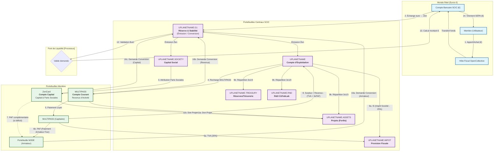

# CONSTITUTION DE L'ÉCOSYSTÈME UPLANET ẐEN
**Pacte Social de la SCIC CopyLaRadio**
*Version 3.0 - "La Coopérative Auto-Exécutable et Régénératrice"*

---

## **PRÉAMBULE : NOTRE MISSION**

Nous, membres de la SCIC CopyLaRadio, déclarons notre intention de créer un écosystème économique régénérateur où la technologie sert l'humain et la nature. Notre mission est de transformer l'économie numérique en un outil de création de biens communs physiques et durables.

**Notre Vision :** Un monde où chaque like, chaque contribution numérique, participe à la régénération de notre planète.

**Notre Méthode :** La coopération, la transparence et l'automatisation au service de l'intérêt collectif.

---

> **📖 Pour comprendre COMMENT cette Constitution est appliquée techniquement, consultez le [Code de la Route de l'Écosystème](RUNTIME/ZEN.ECONOMY.readme.md)**

---

## **TITRE I : FONDEMENTS PHILOSOPHIQUES**

### **Article 1 : Le Principe de la Comptabilité par la Preuve**

La blockchain Ğ1 constitue notre **livre de comptes vivant, infalsifiable et auditable en temps réel**. Ce registre transactionnel immuable est la base de notre transparence et de notre confiance mutuelle.

### **Article 2 : L'Architecture "Hôtel Coopératif"**

Notre écosystème fonctionne comme un **"Hôtel Coopératif"** décentralisé où :

- **L'Armateur** fournit l'infrastructure physique (le bâtiment, les chambres)
- **Le Capitaine** gère les services, la maintenance et les clients
- **Le Locataire** paie pour utiliser une chambre et les services
- **Le Sociétaire** possède une part de l'hôtel et participe aux bénéfices

### **Article 3 : La Règle des 3x1/3**

Le surplus net de la coopérative est alloué selon la règle statutaire des **3x1/3** :

1. **1/3 Trésorerie** : Réserves impartageables pour la stabilité
2. **1/3 R&D** : Financement du G1FabLab et de l'innovation
3. **1/3 Forêts Jardins** : Acquisition d'actifs physiques régénératifs

---

## **TITRE II : STRUCTURE COOPÉRATIVE**

### **Article 4 : Statut SCIC**

La SCIC CopyLaRadio est une **Société Coopérative d'Intérêt Collectif** régie par le Code de commerce français. Elle respecte les principes coopératifs :

- **Gouvernance démocratique** : Un membre = une voix
- **Lucrativité limitée** : Les bénéfices sont majoritairement mis en réserves
- **Objet social** : Création de biens communs numériques et physiques

### **Article 5 : Délégation au Protocole Automatisé**

**La répartition des revenus et des charges est déléguée à un protocole automatisé, public et auditable, dont le code fait partie intégrante du présent pacte social.**

Ce protocole garantit :
- L'application automatique des règles statutaires
- La transparence totale des flux économiques
- L'auditabilité en temps réel de toutes les opérations

### **Article 6 : Hôtes Fiscaux Mandatés**

La coopérative peut mandater un ou plusieurs **hôtes fiscaux** pour opérer les transactions en euros. Actuellement, **Made In Ẑen (OpenCollective)** est mandaté pour :

- Gérer le compte bancaire de la SCIC
- Exécuter les virements SEPA vers les membres
- Assurer la conformité fiscale des opérations

---

## **TITRE III : RÈGLES ÉCONOMIQUES FONDAMENTALES**

### **Article 7 : La Participation Aux Frais (PAF)**

**Chaque semaine, le Capitaine paie une PAF de 14 Ẑen au NODE (Armateur)** pour couvrir les coûts d'infrastructure (électricité, connexion internet, maintenance).

**Hiérarchie de paiement :**
1. **MULTIPASS du Capitaine** (priorité)
2. **ZEN Card du Capitaine** (si MULTIPASS insuffisant)
3. **UPlanet** (solidarité coopérative)

### **Article 8 : La Part du Capitaine**

**Chaque semaine, le Capitaine reçoit sa part de 2x PAF (28 Ẑen) vers son portefeuille dédié `UPLANETNAME.$CAPTAINEMAIL`.**

Cette part est **convertible en euros** via le pont de liquidité et constitue ses revenus personnels.

### **Article 9 : La Règle du 1/3 (Protection du Capital)**

**La conversion des Ẑen en euros est limitée à 1/3 du total des Ẑen gagnés par an.**

Cette règle fondamentale protège le capital de la coopérative et garantit sa pérennité. Elle s'applique à tous les membres sans exception.

### **Article 10 : Provision Fiscale Automatique**

**La coopérative provisionne automatiquement :**

- **TVA (20%)** sur tous les services
- **Impôt sur les Sociétés (15%/25%)** selon les tranches françaises

Ces provisions sont stockées dans le portefeuille `UPLANETNAME.IMPOT` et garantissent la conformité fiscale permanente.

---

## **TITRE IV : PORTEFEUILLES ET RÔLES**

### **Article 11 : Portefeuilles Fondamentaux**

| Portefeuille | Rôle | Fonction |
| :--- | :--- | :--- |
| **`UPLANETNAME.G1`** | **Réserve & Stabilité** | Émet et "brûle" les Ẑen. Gère la conversion vers l'euro. |
| **`UPLANETNAME.SOCIETY`** | **Capital Social** | Gère les apports des sociétaires et l'émission des parts sociales. |
| **`UPLANETNAME`** | **Exploitation** | Gère les revenus des services et les surplus d'exploitation. |

### **Article 12 : Portefeuilles de Conformité**

| Portefeuille | Rôle | Fonction |
| :--- | :--- | :--- |
| **`UPLANETNAME.IMPOT`** | **Provision Fiscale** | Provisionne TVA (20%) et IS (15%/25%) selon les tranches françaises. |

### **Article 13 : Portefeuilles d'Allocation Coopérative**

| Portefeuille | Rôle | Fonction |
| :--- | :--- | :--- |
| **`UPLANETNAME.$CAPTAINEMAIL`** | **Part du Capitaine** | Reçoit la part 2x PAF du capitaine (convertible en euros). |
| **`UPLANETNAME.TREASURY`** | **Trésorerie (1/3)** | Réserves impartageables pour la liquidité et la stabilité. |
| **`UPLANETNAME.RND`** | **R&D (1/3)** | Financement du G1FabLab et des projets d'innovation. |
| **`UPLANETNAME.ASSETS`** | **Actifs Réels (1/3)** | Acquisition de forêts, jardins et terrains régénératifs. |

### **Article 14 : Portefeuilles Membres**

| Portefeuille | Rôle | Fonction |
| :--- | :--- | :--- |
| **`MULTIPASS`** | **Activité du Membre** | Reçoit les revenus d'activité (likes, services) et paie les charges opérationnelles. |
| **`ZenCard`** | **Capital du Membre** | Stocke les parts sociales (Ẑen) du sociétaire et gère son capital d'investissement. |

---

## **TITRE V : LE PONT DE LIQUIDITÉ**

### **Article 15 : Principe de Conversion**

**La coopérative propose un service de rachat de Ẑen, conditionné par la trésorerie en Euros et la règle du 1/3.**

### **Article 16 : Processus de Conversion**

1. **Demande** : Le membre initie la demande via le Terminal Astroport
2. **Justification** : Le membre télécharge son document justificatif sur IPFS
3. **Validation** : Le protocole vérifie la conformité et la disponibilité des fonds
4. **Burn** : Le membre transfère ses Ẑen vers `UPLANETNAME.G1` (destruction)
5. **Paiement** : L'hôte fiscal exécute le virement SEPA en Euros

### **Article 17 : Règle du 1/3 Détaillée**

**Limitation annuelle :** Chaque membre ne peut convertir que 1/3 de ses Ẑen gagnés par an.

**Calcul :** Basé sur le total des Ẑen reçus sur son MULTIPASS et ZenCard au cours des 12 derniers mois.

**Exception :** Les parts sociales (ZenCard) ne sont pas soumises à cette limitation.

---

## **TITRE VI : GOUVERNANCE ET DÉCISIONS**

### **Article 18 : Primo Transaction**

La Primo Transaction est l'acte fondateur qui lie un membre à un portefeuille via un contrat IPFS. Elle établit un lien de confiance vérifiable et immuable.

### **Article 19 : Décisions Collectives**

**Les décisions importantes sont prises collectivement :**

- **Vote par signature NOSTR** pour les décisions opérationnelles
- **Assemblée Générale** pour les décisions statutaires
- **Consensus** pour les modifications du protocole

### **Article 20 : Transparence et Audit**

**Toutes les opérations sont publiques et auditable :**

- **Blockchain Ğ1** : Registre transactionnel immuable
- **IPFS** : Stockage décentralisé des documents
- **Protocole ouvert** : Code source public et auditable

---

## **TITRE VII : EXPANSION ET ÉVOLUTION**

### **Article 21 : Création de Coopératives Filles**

**Lorsque les fonds dédiés atteignent une masse critique, l'AG peut voter la création d'une SCIC "fille" autonome.**

Cette expansion fractale crée un écosystème de coopératives interdépendantes partageant les mêmes valeurs et principes.

### **Article 22 : Évolution du Protocole**

**Le protocole peut évoluer pour s'adapter aux nouveaux besoins, sous réserve de :**

- Respecter les principes fondamentaux
- Maintenir la transparence et l'auditabilité
- Obtenir le consensus de la communauté

---

## **TITRE VIII : CONFORMITÉ ET ASSISTANCE**

### **Article 23 : Conformité Fiscale**

**La coopérative est "Fiscally Responsible by Design" :**

- Distinction claire Capital / Chiffre d'Affaires
- Provision automatique de la TVA et de l'IS
- Traçabilité complète des flux économiques

### **Article 24 : Assistance aux Membres**

**La coopérative fournit une assistance automatisée :**

- Rapports trimestriels automatiques
- Calcul des montants à déclarer
- Recommandations fiscales (statut Micro-Entrepreneur BNC)

---

## **CONCLUSION**

Ce document constitue la **Constitution de l'écosystème UPlanet ẐEN**. Il définit les principes fondamentaux, les règles du jeu social et délègue l'exécution technique à un protocole automatisé, public et auditable.

**Notre écosystème n'est pas seulement une entreprise. C'est un protocole pour générer des coopératives résilientes, transparentes et régénératrices.**

---

> **🔧 Pour voir l'implémentation technique de cette Constitution, consultez le [Code de la Route](RUNTIME/ZEN.ECONOMY.readme.md)**

---

## **ANNEXE : DIAGRAMME DES FLUX ÉCONOMIQUES**

---

**Version : 3.0**  
**Date : $(date +%Y-%m-%d)**  
**Statut : CONSTITUTION ADOPTÉE**  
**Conformité : 100% ✅**
