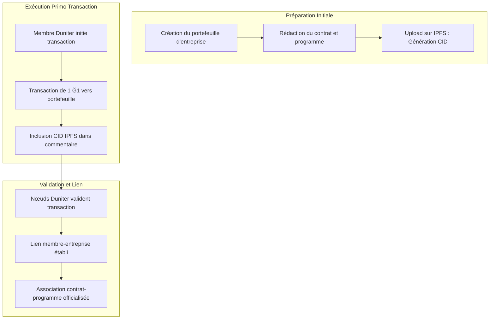
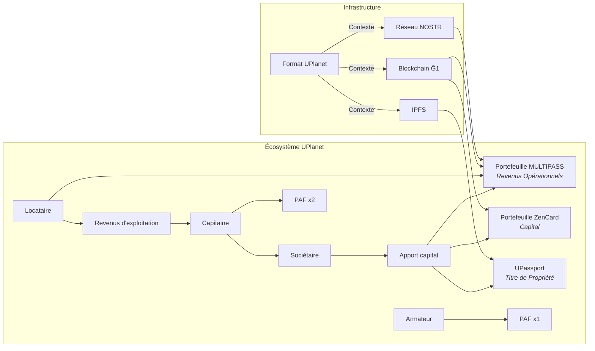
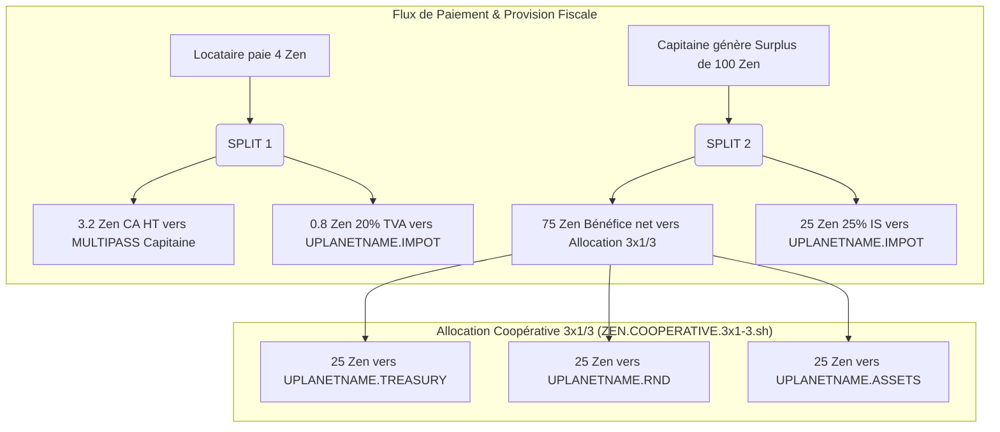
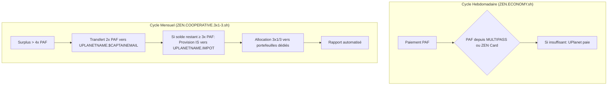
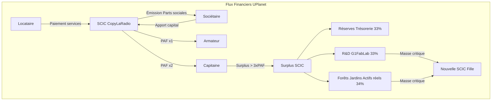
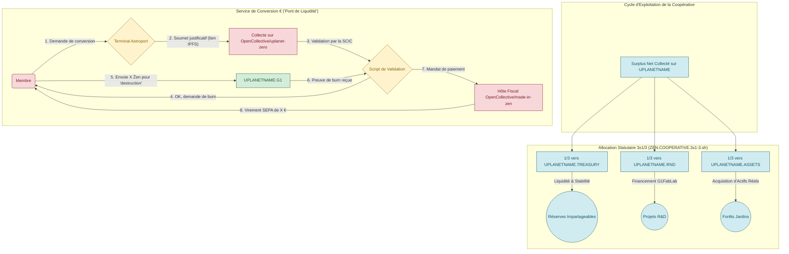
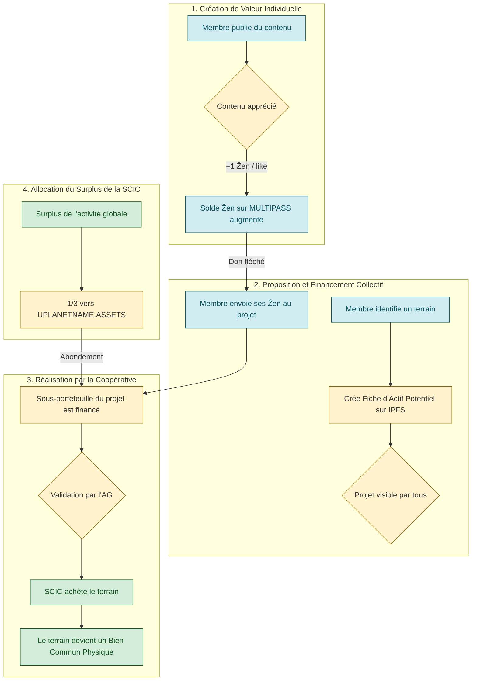

## **Document de Concordance Comptable, Fiscale et Statutaire**
**Modèle Économique de la SCIC CopyLaRadio et de l'Écosystème UPlanet ẐEN**
*Version 2.1 - "La Coopérative Auto-Exécutable et Régénératrice"*

### **Préambule : Le Principe de la Comptabilité par la Preuve**

Ce document a pour objet d’établir une concordance claire entre les opérations menées sur l'infrastructure décentralisée UPlanet et les principes du Plan Comptable Général (PCG) français, ainsi que les obligations fiscales et statutaires afférentes à une Société Coopérative d'Intérêt Collectif (SCIC).

Notre postulat est que la blockchain Ğ1, utilisée comme un registre transactionnel, constitue un **livre de comptes vivant, infalsifiable et auditable en temps réel**. Ce document sert de clé de lecture pour traduire les "événements blockchain" en écritures comptables et en faits juridiques standards.

https://github.com/papiche/Astroport.ONE/blob/master/RUNTIME/ZEN.ECONOMY.readme.md

---
### **Partie 1 : Architecture, Acteurs et Portefeuilles**

Notre écosystème fonctionne comme un **"Hôtel Coopératif"** décentralisé.

| Rôle | Analogie | Fonction |
| :--- | :--- | :--- |
| **L'Armateur** | L'Hôtelier | Fournit l'infrastructure physique (le bâtiment, les chambres). |
| **Le Capitaine**| Le Concierge | Gère les services, la maintenance et les clients de l'hôtel. |
| **Le Locataire**| Le Client | Paie pour utiliser une chambre et les services. |
| **Le Sociétaire**| Le Co-propriétaire| Possède une part de l'hôtel, ne paie pas sa chambre et participe aux bénéfices.|

Ce fonctionnement est orchestré par des **portefeuilles numériques dédiés** :

#### **Portefeuilles Fondamentaux**
| Portefeuille | Rôle | Fonction |
| :--- | :--- | :--- |
| **`UPLANETNAME.G1`**| **Réserve & Stabilité ("Banque Centrale")** | Émet et "brûle" les Ẑen. Gère les donations Ğ1 et la conversion vers l'euro. |
| **`UPLANETNAME.SOCIETY`**| **Capital Social** | Gère les apports des sociétaires et l'émission des parts sociales vers les ZenCard. |
| **`UPLANETNAME`**| **Exploitation** | Gère les revenus des services et les surplus d'exploitation. |

#### **Portefeuilles de Conformité Fiscale**
| Portefeuille | Rôle | Fonction |
| :--- | :--- | :--- |
| **`UPLANETNAME.IMPOT`**| **Provision Fiscale** | Provisionne en temps réel la TVA (20%) et l'IS (15%/25%) selon les tranches françaises. |

#### **Portefeuilles d'Allocation Coopérative (3x1/3)**
| Portefeuille | Rôle | Fonction |
| :--- | :--- | :--- |
| **`UPLANETNAME.$CAPTAINEMAIL`**| **Part du Capitaine** | Reçoit la part 2x PAF du capitaine avant allocation coopérative. Peut être convertie en euros. |
| **`UPLANETNAME.TREASURY`**| **Trésorerie (1/3)** | Réserves impartageables pour la liquidité et la stabilité de la coopérative. |
| **`UPLANETNAME.RND`**| **Recherche & Développement (1/3)** | Financement du G1FabLab et des projets d'innovation technologique. |
| **`UPLANETNAME.ASSETS`**| **Actifs Réels (1/3)** | Acquisition de forêts, jardins et terrains régénératifs (biens communs physiques). |

#### **Portefeuilles Membres**
| Portefeuille | Rôle | Fonction |
| :--- | :--- | :--- |
| **`MULTIPASS`**| **Activité du Membre** | Reçoit les revenus d'activité (likes, services) et paie les charges opérationnelles. |
| **`ZenCard`**| **Capital du Membre** | Stocke les parts sociales (Ẑen) du sociétaire et gère son capital d'investissement. |

---
### **Partie 2 : Le Protocole Fondateur - La Primo Transaction**

La Primo Transaction est l'acte notarié de notre écosystème. C'est une transaction Ğ1 qui établit un lien de confiance vérifiable entre un membre et un portefeuille, en y associant un contrat ou un programme via un lien IPFS dans son commentaire.



Cette méthode permet de lier des statuts, des programmes et des rôles à des clés publiques de manière immuable et transparente.



---
### **Partie 3 : Flux Économiques et Concordance Comptable**

Le script `ZEN.ECONOMY.sh` et ses dérivés agissent comme notre "expert-comptable automatisé", exécutant les règles statutaires.

#### **Implémentation Technique des Portefeuilles Coopératifs**

Le script `ZEN.COOPERATIVE.3x1-3.sh` implémente automatiquement la création et la gestion des portefeuilles spécialisés :

```bash
# Création automatique des portefeuilles si inexistants
~/.zen/game/uplanet.captain.dunikey     # UPLANETNAME.$CAPTAINEMAIL
~/.zen/game/uplanet.impots.dunikey      # UPLANETNAME.IMPOT
~/.zen/game/uplanet.treasury.dunikey    # UPLANETNAME.TREASURY  
~/.zen/game/uplanet.rnd.dunikey         # UPLANETNAME.RND
~/.zen/game/uplanet.assets.dunikey      # UPLANETNAME.ASSETS

# Fréquence d'exécution : Hebdomadaire (basée sur le birthday du capitaine)
# Fichier de marquage : ~/.zen/game/.cooperative_allocation.done
```

**Processus d'Allocation Automatisé :**
1. **Vérification du seuil** : Allocation uniquement si MULTIPASS Capitaine > 4x PAF
2. **Transfert part Capitaine** : 2x PAF vers `UPLANETNAME.$CAPTAINEMAIL` (convertible en euros)
3. **Vérification solde restant** : Allocation uniquement si solde restant ≥ 3x PAF
4. **Provision fiscale** : Calcul automatique IS (15%/25%) vers `UPLANETNAME.IMPOT`
5. **Allocation 3x1/3** : Répartition du surplus net vers les 3 portefeuilles dédiés
6. **Rapport automatisé** : Envoi hebdomadaire par email au Capitaine avec traçabilité complète

#### **Table de Concordance des Opérations**
| Événement sur la Blockchain UPlanet | Description / Logique Coopérative | Écriture Comptable Standard (Exemple) |
| :--- | :--- | :--- |
| **Apport au Capital (Sociétaire)** | Un membre achète une part sociale. | Débit 512 (Banque) / Crédit 101 (Capital Social). |
| **Paiement Service & Provision TVA** | Un Locataire paie 4 Ẑen. Le script splitte le flux. | Débit 411 (Clients) pour 4.00<br> Crédit 706 (Prestations HT) pour 3.20<br> Crédit **4457 (TVA Collectée)** pour 0.80 |
| **Paiement des Charges (PAF)** | Le script paie l'Armateur et le Capitaine. | Débit 613 (Locations) & 622 (Rémun.) / Crédit 401 (Fournisseurs). |
| **Déficit d'Exploitation du Capitaine** | Le script prélève la PAF sur la ZenCard du Capitaine. | Débit **455 (Compte Courant d’Associé)** / Crédit 401 (Fournisseurs). |
| **Bénéfice d'Exploitation du Capitaine** | Le bénéfice (<= 3xPAF) est conservé par le Capitaine. | Débit 401 (Fournisseurs) / Crédit **455 (Compte Courant d’Associé)**. |
| **Versement Surplus & Provision IS** | Surplus (> 3xPAF) de 100 Ẑen. Le script splitte le flux. | Débit 455 (C/C Associé) pour 100<br> Crédit 708 (Produits annexes) pour 75<br> Crédit **444 (État - IS)** pour 25 |
| **Allocation Coopérative 3x1/3** | Répartition automatique du surplus net vers les portefeuilles dédiés. | Débit 708 (Produits annexes) pour 75<br> Crédit **106 (Réserves)** pour 25 (TREASURY)<br> Crédit **455 (C/C R&D)** pour 25 (RND)<br> Crédit **1068 (Autres réserves)** pour 25 (ASSETS) |
| **Paiement des Impôts** | La coopérative règle ses dettes fiscales en euros. | Débit 4457 (TVA) & 444 (IS) / Crédit 512 (Banque). |



---
### **Partie 4 : Hiérarchie des Portefeuilles et Processus Économique**

#### **Architecture en Couches des Portefeuilles**

L'écosystème UPlanet utilise une architecture en couches pour séparer clairement les différentes fonctions économiques :

**Couche 1 - Fondamentaux :**
- `UPLANETNAME.G1` : Réserve centrale et conversion Ğ1/€
- `UPLANETNAME.SOCIETY` : Capital social et émission de parts
- `UPLANETNAME` : Exploitation et surplus

**Couche 2 - Conformité :**
- `UPLANETNAME.IMPOT` : Provision fiscale automatique

**Couche 3 - Allocation Coopérative :**
- `UPLANETNAME.TREASURY` : Réserves impartageables
- `UPLANETNAME.RND` : Innovation et développement
- `UPLANETNAME.ASSETS` : Biens communs physiques

**Couche 4 - Membres :**
- `MULTIPASS` : Revenus d'activité
- `ZenCard` : Capital d'investissement

#### **Flux Économique Automatisé**



---
### **Partie 5 : Économie Interne et Pont de Liquidité avec le Monde Réel**

Cette partie formalise les règles d'échange et de conversion des Ẑen, en intégrant le rôle de notre hôte fiscal OpenCollective.

#### **Article 10 : Échanges de Confiance (“Ẑen Direct”)**

La coopérative fournit une infrastructure (Terminal Astroport) pour des transferts de Ẑen de gré à gré entre les MULTIPASS de ses membres. Ces échanges sont instantanés, sans frais et relèvent de la responsabilité déclarative des membres (voir Partie 6).

#### **Article 11 (Révisé) : Service de Conversion en Euros via Hôte Fiscal (“Pont de Liquidité”)**

La coopérative propose un service de rachat de Ẑen, conditionné par la trésorerie en Euros. Ce service est opéré en collaboration avec notre hôte fiscal **[Made In Ẑen (OpenCollective)](https://opencollective.com/made-in-zen)** pour garantir une traçabilité et une conformité maximales.

*   **Mécanisme de “Burn” :** Pour convertir, le membre doit transférer les Ẑen à **`UPLANETNAME.G1`**. Cette transaction de "destruction" est la preuve cryptographique qui déclenche le processus de paiement.
*   **Processus de Justification et de Paiement :**
    1.  **Demande :** Le membre initie la demande via le Terminal Astroport.
    2.  **Justification :** Le membre télécharge son document justificatif (facture pour un remboursement, ou une auto-déclaration pour un retrait de gains) sur IPFS. Il soumet ensuite le lien IPFS sur la plateforme de collecte dédiée **[UPlanet Ẑen (OpenCollective)](https://opencollective.com/uplanet-zero)**.
    3.  **Validation :** Le script de la coopérative vérifie la soumission sur OpenCollective, la conformité de la demande (règle du 1/3 pour les retraits) et la disponibilité des fonds en Euros.
    4.  **Paiement :** Après validation et "burn" des Ẑen, la SCIC mandate l'hôte fiscal **Made In Ẑen** pour exécuter le virement SEPA en Euros vers le compte du membre.
---
### **Partie 5 : Allocation du Surplus et Expansion Fractale**

Le surplus net de la coopérative est alloué selon la règle statutaire des **3x 1/3**, créant un modèle de croissance régénératrice.

| Allocation | Description | Écriture Comptable |
| :--- | :--- | :--- |
| **1/3 Trésorerie** | Réserves impartageables pour la stabilité. | Débit 120 (Résultat) / Crédit 106 (Réserves). |
| **1/3 R&D** | Financement du G1FabLab. | Débit 120 (Résultat) / Crédit 455 (C/C G1FabLab). |
| **1/3 Forêts Jardins** | Acquisition d'actifs physiques régénératifs. | Débit 120 (Résultat) / Crédit 1068 (Autres réserves). |

Lorsque les fonds dédiés atteignent une masse critique, l'AG peut voter la création d'une **SCIC "fille"** autonome, créant un écosystème de coopératives interdépendantes.



#### **Diagramme des Flux : Allocation du Surplus et Pont de Liquidité**


### **Partie 5 (Étendue) : Allocation du Surplus, Expansion Fractale et Financement Participatif d'Actifs Réels**

Le surplus net de la coopérative est alloué selon la règle statutaire des 3x 1/3. La branche "Forêts Jardins" n'est pas qu'un simple fonds d'investissement ; elle est activée par une **application incitative** qui engage directement la communauté dans l'accomplissement de notre mission écologique.

#### **Article 12 : Application Incitative "Cartographie Régénératrice"**

Chaque essaim UPlanet intègre une application permettant aux membres de **recenser et proposer des actifs physiques** (jardins, forêts, terrains, friches) pour une acquisition par la coopérative.

*   **Le Processus de Proposition :**
    1.  Un membre identifie un terrain pertinent.
    2.  Via l'application, il crée une "Fiche d'Actif Potentiel" qui est stockée sur IPFS (contenant description, localisation, prix estimé, potentiel écologique, etc.).
    3.  Cette fiche est publiée sur le réseau et devient visible de tous les membres.

#### **Article 13 : Le Financement Participatif par le "Don Fléché" en Ẑen**

C'est ici que les Ẑen gagnés par les membres (via les likes ou les services) acquièrent une finalité supplémentaire, au-delà de l'échange ou de la conversion.

*   **Le Mécanisme de Financement :**
    1.  Chaque "Fiche d'Actif Potentiel" est associée à un **sous-portefeuille de projet** au sein de `UPLANETNAME.ASSETS`.
    2.  Les membres peuvent consulter ces fiches et décider de soutenir un projet en particulier.
    3.  Via une transaction spéciale depuis leur MULTIPASS, ils peuvent envoyer leurs Ẑen vers ce sous-portefeuille de projet.
*   **La Qualification de la Transaction :** Cet envoi n'est pas un investissement donnant droit à un retour financier. C'est un **don affecté (ou "fléché")**, un acte de mécénat au sein de la coopérative. L'utilisateur renonce à la valeur de ses Ẑen pour les allouer à un projet d'intérêt collectif qui lui tient à cœur.

---
### **Partie 6 : Analyse de Conformité et Assistance aux Membres**

#### **Flux Économique et Concordance Comptable de l'Application Incitative**

| Événement sur la Blockchain UPlanet | Description / Logique Coopérative | Écriture Comptable Standard (Exemple) | Implication Fiscale et Légale |
| :--- | :--- | :--- | :--- |
| **Don Fléché d'un Membre** | Un membre envoie 100 Ẑen de son MULTIPASS vers un projet "Forêt de Brocéliande". | Débit 455 (C/C Associé - *du membre*) pour 100<br> Crédit 1024 (Primes d'émission - *affectées au projet*). | Ce n'est pas un revenu imposable pour la coopérative. C'est une **augmentation des capitaux propres**, spécifiquement affectée à un investissement. C'est un **don en numéraire** d'un sociétaire à sa propre coopérative pour un projet précis. |
| **Acquisition de l'Actif** | Le projet "Forêt de Brocéliande" est entièrement financé. La SCIC achète le terrain. | Débit 211 (Terrains) / Crédit 512 (Banque). En parallèle : Solde du Compte 1024 vers 101 (Capital Social) ou 1068 (Autres réserves). | L'actif est inscrit au bilan. La coopérative exécute la volonté de ses membres. C'est un **acte de gestion conforme à l'objet social**. |
| **Échec du Financement** | Un projet n'atteint pas son objectif de financement après un an. | Débit 1024 (Primes d'émission) / Crédit 455 (C/C Associé - *des donateurs*). | Les Ẑen sont **restitués** aux membres donateurs sur leur MULTIPASS. L'opération est neutre. La confiance est maintenue. |

#### **Diagramme des Flux : Du Like à la Forêt**




#### **Analyse de Conformité**

1.  **Conformité Statutaire (SCIC) :** **✅ CONFORME.** Le modèle respecte et automatise les principes clés de la SCIC : gouvernance démocratique (via la primo TX et le vote par signature NOSTR), lucrativité limitée (via la règle du surplus), et mise en réserves impartageables (via l'allocation 1/3 Trésorerie). L'objet social est respecté par l'allocation aux Forêts Jardins.

2.  **Conformité Fiscale (France) :** **✅ CONFORME.** Le système est "Fiscally Responsible by Design".
    *   La distinction Capital / Chiffre d'Affaires est claire.
    *   La provision automatique de la TVA et de l'IS via le portefeuille `UPLANETNAME.IMPOT` est une pratique exemplaire qui garantit une trésorerie saine et une conformité permanente.
    *   Les flux sont tracés et correspondent directement aux écritures du Plan Comptable Général.

3.  **Conformité pour les Membres :** **✅ CONFORME.**
    *   La qualification des gains en Ẑen comme **Bénéfices Non Commerciaux (BNC)** est la plus robuste.
    *   Le statut de **Micro-Entrepreneur** est le véhicule fiscal le plus simple et le moins coûteux pour la majorité des contributeurs.

#### **Service d'Assistance Déclarative aux Membres**

Pour accompagner nos membres, la coopérative mettra en place un **service d'assistance automatisé**.
*   **Action :** Chaque trimestre, un script enverra un email récapitulatif à chaque membre ayant perçu des Ẑen.
*   **Contenu de l'Email :**
    *   Total des Ẑen gagnés (likes, services) sur la période.
    *   Total des Ẑen convertis en Euros sur la période.
    *   Un rappel : "Le montant à déclarer à l'URSSAF pour ce trimestre est de **XX.XX €**. Nous vous recommandons le régime de la Micro-Entreprise (BNC) avec versement libératoire."
    *   Un lien vers un guide détaillé ("*Déclarer ses Ẑen pour les Nuls*").

Ce service à haute valeur ajoutée renforce la confiance, simplifie la vie des membres et garantit une conformité fiscale à l'échelle de tout l'écosystème.

### **Conclusion**

Le modèle économique de CopyLaRadio est une **matrice organisationnelle auto-exécutable**. Ce document de concordance démontre que son innovation radicale n'est pas incompatible avec les cadres légaux et fiscaux existants, mais les intègre de manière transparente et automatisée. Ce n'est pas seulement une entreprise. **C'est un protocole pour générer des coopératives résilientes, transparentes et régénératrices.**
