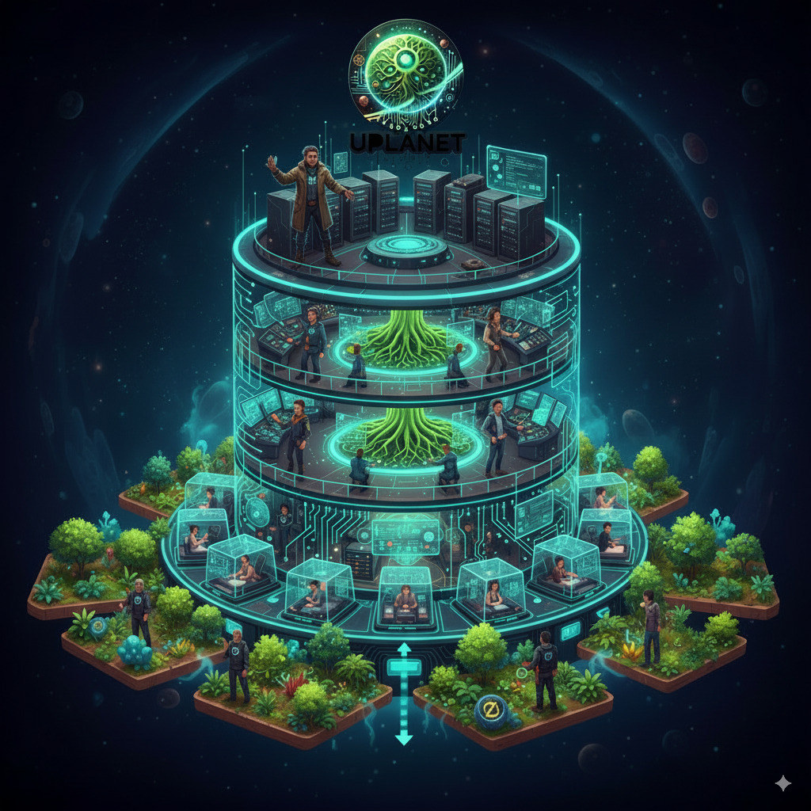
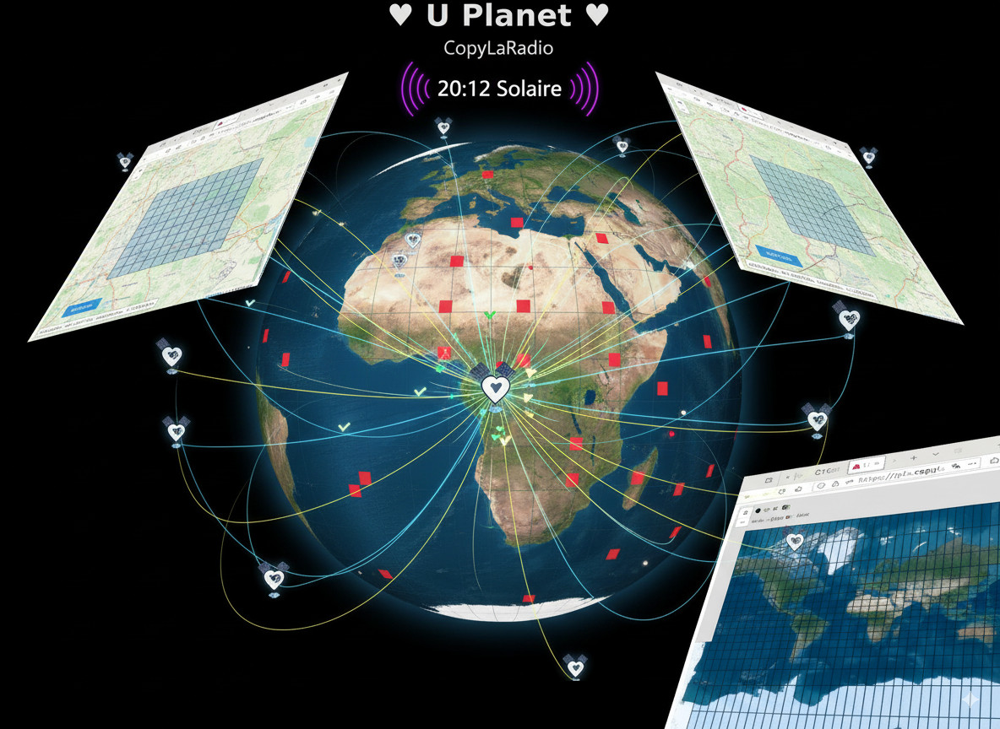

# Astroport.ONE: Construyendo un Internet Cooperativo

[EN](README.md) - [FR](README.fr.md)

**Internet estaba destinado a ser una herramienta de liberación. En su lugar, nos convertimos en su producto.** Nuestros datos son monetizados, nuestras comunidades están fragmentadas, y nuestras vidas digitales pertenecen a un puñado de corporaciones gigantes.

**Astroport.ONE es una declaración de independencia digital.** No es solo otra plataforma; es un conjunto de herramientas de código abierto y un contrato social diseñado para ayudar a individuos y comunidades a construir un ecosistema Web3 que realmente posean.

Impulsado por el **[G1FabLab](https://g1sms.fr)**, nuestra misión es transformar a los usuarios de inquilinos digitales en co-propietarios soberanos de su infraestructura.

## 🌍 ¿Qué es Astroport.ONE?

Astroport.ONE es el software de código abierto que te permite ejecutar tu propio servidor personal—una **Estación**. Piénsalo como tu embajada digital en una nueva frontera descentralizada.

Con tu Estación, puedes:
*   ✊ **Poseer Tus Datos:** Almacena tus archivos en el Sistema de Archivos InterPlanetario (IPFS), haciéndolos resistentes a la censura y al control corporativo.
*   💬 **Comunicarte Libremente:** Conéctate a la red social descentralizada NOSTR, a salvo de algoritmos y prohibiciones arbitrarias.
*   💰 **Construir una Economía Real:** Usa la moneda libre Ğ1 (June) y nuestro sistema de contabilidad interno Ẑen para crear valor e intercambiarlo equitativamente.

## 🌱 El Modelo Económico Cooperativo: De Usuarios a Propietarios

No se trata solo de tecnología. Se trata de construir una economía cooperativa y sostenible. La columna vertebral legal y social de nuestro proyecto es la **[SCIC CopyLaRadio](https://www.copylaradio.com)**, una sociedad cooperativa francesa.


*Una visión de nuestro futuro cooperativo: tecnología en armonía con la naturaleza, creando bienes comunes en el mundo real*

Nuestro modelo es simple: **transformamos el costo de la infraestructura en capital compartido.**
*   **El Ẑen (Ẑ):** Para gestionar nuestros proyectos, usamos una unidad de contabilidad interna y estable llamada Ẑen. Dentro de nuestra cooperativa, **1 Ẑen = 1€**. Esto nos permite gestionar de manera transparente nuestros activos (servidores, dominios, etc.) y nuestros gastos.
*   **Propiedad Compartida:** Cuando contribuyes a la cooperativa, no estás "pagando por un servicio". Estás comprando partes de la infraestructura compartida, convirtiéndote en co-propietario de los servidores, e invirtiendo en nuestro futuro colectivo—incluyendo activos del mundo real como bosques.

> **📜 Para una comprensión completa de nuestro marco legal cooperativo, consulta nuestra [Constitución del Ecosistema UPlanet](LEGAL.md)**

## 🚀 Tu Viaje en Nuestro Ecosistema: 3 Caminos hacia la Soberanía

Ofrecemos tres formas claras de unirse, cada una con su propio Zine (folleto) para guiarte.

### 1. 🌐 [MULTIPASS](https://ipfs.copylaradio.com/ipfs/QmcjpCAfSCn3pucSSWKP5i7HqQCkXnfesVo5z7m6btT5Mv/multipass.html) - Tu Primer Paso
**El Camino del Usuario (1 Ẑen/semana)**

Este es tu pasaporte digital. Es la forma más fácil de explorar el ecosistema, asegurar tu identidad y comenzar a usar nuestros servicios.


*Tu espacio de almacenamiento descentralizado personal en el Sistema de Archivos InterPlanetario*

*   **Lo que obtienes:**
    *   ✅ Una **Identidad NOSTR** soberana.
    *   ✅ Un **Asistente IA Personal** (#BRO).
    *   ✅ Una **Billetera Ẑen** para participar en la economía (¡gana Ẑen cuando tu contenido reciba likes!).
    *   ✅ **uDRIVE**, tu espacio de almacenamiento IPFS personal.

### 2. ☁️ [ZENCARD](https://ipfs.copylaradio.com/ipfs/QmQRreMYDHhAnkg7rwgYYdS5QDhvjjeBdozE16L3h5A8ED/zencard.html) - Tu Nube Soberana
**El Camino del Co-propietario (5 Ẑen/semana o compra de partes)**

¿Listo para des-googlizar tu vida? La ZenCard te da una nube privada completa y te convierte en miembro de la cooperativa.

*   **Lo que obtienes:**
    *   ✅ **Todo del MULTIPASS.**
    *   ✅ **128 GB de NextCloud Privado** para sincronizar tus archivos, contactos y calendarios.
    *   ✅ Un camino para convertirte en **co-propietario de la infraestructura** comprando acciones cooperativas.
    *   **Niveles de Inversión:**
        *   **[UPlanet SATELLITE (50€/año)](https://opencollective.com/uplanet-zero/contribute/achat-128-go-sur-nanopi5-86611):** Posee una parte de un nodo Raspberry Pi 5.
        *   **[Constelación Sagittarius](https://opencollective.com/uplanet-zero/contribute/proprio-128-go-71400):** Invierte en un nodo PC Gamer de alto rendimiento y comparte sus ingresos.

### 3. ⚡ [CAPTAIN](https://ipfs.copylaradio.com/ipfs/QmPuTCooApPu3wFiUFdmxRNyFpf8KxdBv4sQ6i4qrdEb1e/captain.html) - El Constructor
**El Camino del Contribuidor**

Para aquellos que quieren estar en el corazón de la red. Un Captain ejecuta una Estación, proporciona servicios a otros usuarios, y gana Ẑen por su contribución.

*   **Lo que haces:**
    *   ✅ Transforma tu PC o Raspberry Pi en un nodo generador de valor.
    *   ✅ Únete a la **cooperativa CopyLaRadio** como proveedor técnico.
    *   ✅ Gana Ẑen alojando usuarios MULTIPASS y ZenCard.
    *   ✅ Recibe entrenamiento completo y apoyo de la comunidad.

> 📄 ¡Haz clic en cada enlace para ver o imprimir el folleto Zine para ese camino!

---

## Una Historia de Dos Mundos: UPlanet ORIGIN vs. UPlanet Ẑen

El ecosistema UPlanet tiene dos "reinos" interconectados diseñados para diferentes propósitos.

| Característica | **UPlanet ORIGIN (La Puerta de Entrada Pública)** | ✅ **UPlanet Ẑen (La Red Cooperativa)** |
| :--- | :--- | :--- |
| **Propósito** | **Descubrimiento e Integración.** Un "sandbox" para probar la tecnología. | **Construcción y Economía.** El espacio cooperativo real, impulsado por el valor. |
| **Acceso** | Abierto a todos con un email o cuenta Ğ1. | Reservado para **miembros cooperativos** (ZENCARD y Captains). |
| **Valor del Ẑen**| 1 Ẑen = 0.1 Ğ1 (una moneda de juego interna). | **1 Ẑen = 1€** (una unidad estable para nuestra economía real). |
| **Confianza**| Verificación de identidad básica. | Basada en la **Red de Confianza** Ğ1 y el pacto cooperativo legal. |
| **Identidad** | MULTIPASS básico. | **uPASSPORT Validado**, tu certificado de co-propiedad. |

---

## 🛠️ Comenzar: Conviértete en un Constructor

¿Listo para alojar tu propia Estación y unirte a la red cooperativa?

**Instalación (Linux - Debian/Ubuntu/Mint):**

```bash
bash <(curl -sL https://install.astroport.com)
```
Este script configurará tu Estación Astroport.ONE. Al instalarlo, aparecerás automáticamente en el mapa swarm [UPlanet ORIGIN](https://ipfs.copylaradio.com/ipns/copylaradio). Para unirte a las redes cooperativas `UPlanet Ẑen`, necesitarás activar características avanzadas y convertirte en miembro.

## 📚 Documentación y Detalles Técnicos

Para aquellos que quieren profundizar en los aspectos técnicos de nuestro sistema.

*   **[🏗️ ARCHITECTURE.md](ARCHITECTURE.md)**: Una visión técnica completa del sistema, flujos de datos y modelos económicos.
*   **[📖 DOCUMENTATION.md](DOCUMENTATION.md)**: Nuestro centro de documentación central para todos los componentes.
*   **[🌍 ANARCHITECTE.md](ANARCHITECTE.md)**: **La visión filosófica y arquitectónica** del ecosistema UPlanet - visión, conceptos, y el puente entre soberanía digital y regeneración ecológica.
*   **[📜 LEGAL.md](LEGAL.md)**: **La Constitución del Ecosistema UPlanet** - nuestro marco legal cooperativo, principios de gobernanza y contrato social.
*   **[💰 ZEN.ECONOMY.readme.md](RUNTIME/ZEN.ECONOMY.readme.md)**: **La implementación técnica de nuestro modelo económico cooperativo** - pagos automatizados, provisiones fiscales y sistema de asignación 3x1/3 (100% conforme con la ley cooperativa francesa).
*   **[Guía GitBook](https://astroport-1.gitbook.io/astroport.one/)**: Documentación amigable y tutoriales.
*   **[📋 Le Livre Blanc Astroport.ONE](BOOKS/Le%20Livre%20Blanc%20Astroport.ONE%20_%20De%20la%20Souveraineté%20Numérique%20à%20la%20Régénération%20Écologique.md)**: El libro blanco completo detallando nuestra visión desde la soberanía digital hasta la regeneración ecológica (Francés).
*   **[🌍 UPlanet: Votre Guide pour Entrer dans le Nouveau Monde](BOOKS/UPlanet%20_%20Votre%20Guide%20pour%20Entrer%20dans%20le%20Nouveau%20Monde.md)**: Tu guía completa para entrar al ecosistema UPlanet (Francés).

---

## 🤝 Involúcrate y Contribuye

Astroport.ONE está impulsado por FOSS y dirigido por la comunidad.

*   **Conviértete en Miembro:** La mejor forma de contribuir es unirte a la **[Cooperativa CopyLaRadio en OpenCollective](https://opencollective.com/monnaie-libre)**.
*   **Dale Estrella a nuestro Repo:** Muestra tu apoyo a nuestro trabajo.
*   **Descubre Ğ1:** Aprende más sobre [la mejor criptomoneda que podrías soñar](https://monnaie-libre.fr).

[](https://starchart.cc/papiche/Astroport.ONE)

## 🎮 Enjambres GPU: Convierte tu PC Gamer en una Mina de Oro

**¿tienes un PC Gamer o Mac Studio acumulando polvo entre sesiones de juego?** ¡Transfórmalo en un nodo generador de ingresos en la constelación GPU UPlanet!

### 🌌 La Red de Enjambre UPlanet

UPlanet opera como una **inteligencia de enjambre distribuida** donde cada Estación contribuye su poder computacional a un cerebro IA colectivo. Cuando te unes con tu hardware gaming:

*   🧠 **Inferencia Distribuida Masiva:** Tu GPU se une a miles de otros en una red "exo", creando poder de procesamiento IA que rivaliza con los centros de datos de Big Tech
*   📊 **Refinamiento de Datos Superior:** Nuestro enfoque descentralizado procesa información de manera más ética y precisa que los gigantes del Web2
*   💎 **Crecimiento de Valor Exponencial:** Mientras más GPUs poderosas se unen al enjambre, más valioso se vuelve cada nodo - creando un **efecto de red que enriquece a todos los participantes**

### 💰 Por Qué los Gamers Se Están Enriqueciendo con UPlanet

**Tu GPU inactiva = Flujo de ingresos pasivos**

*   **🎯 Compartición Inteligente de Recursos:** Tu PC gamer trabaja para ti cuando no estás jugando
*   **📈 Retornos Compuestos:** Mientras el enjambre se vuelve más fuerte, tu parte de la inteligencia colectiva se vuelve más valiosa
*   **🏆 Ventaja del Hardware Premium:** GPUs gaming de gama alta (RTX 4090, Mac Studio M2 Ultra) ganan proporcionalmente más Ẑen
*   **🔄 Bucle de Reinversión:** Las ganancias pueden reinvertirse para expandir tu capacidad de nodo, multiplicando tus retornos

> **💡 La Visión:** Imagina miles de PCs gamers en todo el mundo, inactivos el 70% del tiempo, convirtiéndose súbitamente en una supercomputadora IA descentralizada que supera la infraestructura de Google - y **tú posees una parte de ella**.

**¿Listo para monetizar tu GPU?** [Instala Astroport.ONE](https://install.astroport.com) y únete al enjambre que está redefiniendo la propiedad de la IA.

---
