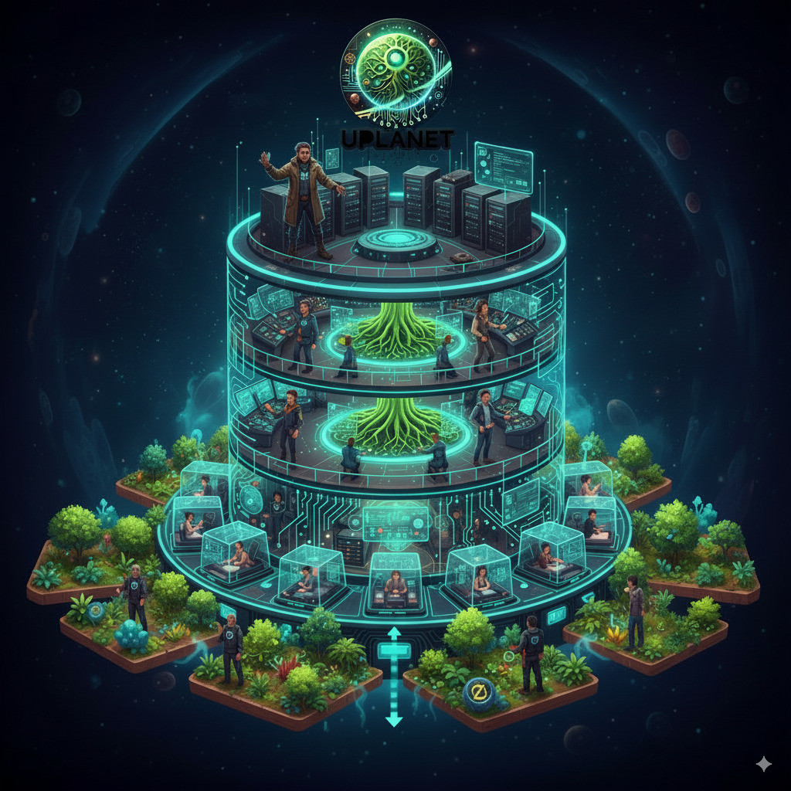
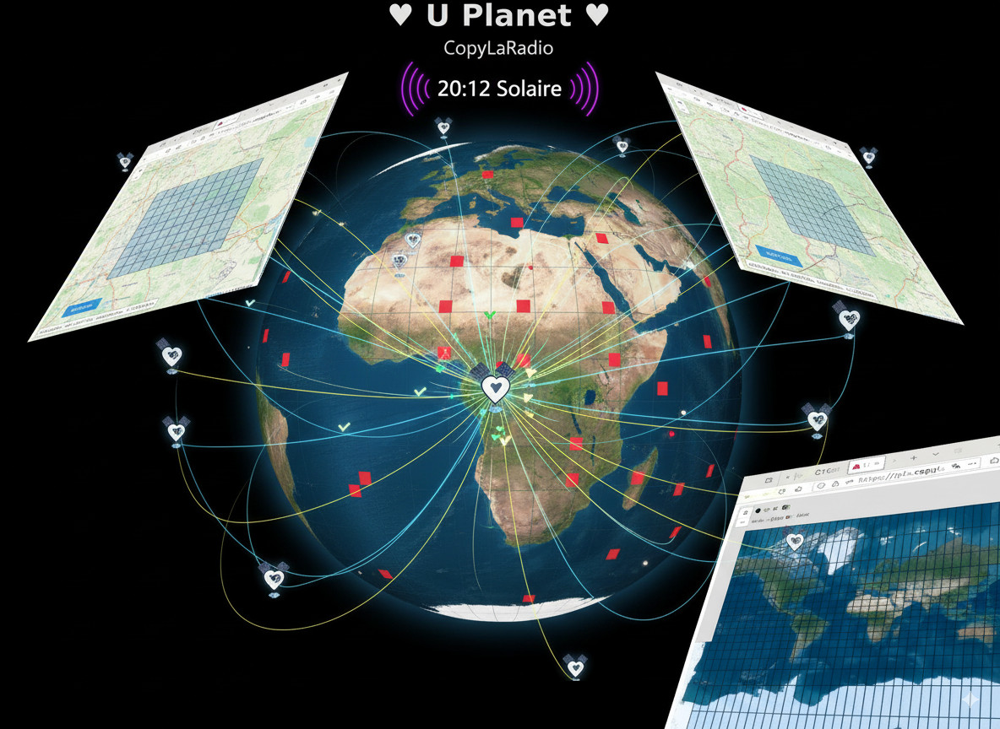

# Astroport.ONE: Building a Cooperative Internet

[FR](README.fr.md) - [ES](README.es.md)

**The internet was meant to be a tool for liberation. Instead, we became its product.** Our data is monetized, our communities are fragmented, and our digital lives are owned by a handful of giant corporations.

**Astroport.ONE is a declaration of digital independence.** It's not just another platform; it's a suite of open-source tools and a social contract designed to help individuals and communities build a Web3 ecosystem they truly own.

Powered by the **[G1FabLab](https://g1sms.fr)**, our mission is to transform users from digital tenants into sovereign co-owners of their infrastructure.

## 🌍 What is Astroport.ONE?

Astroport.ONE is the open-source software that allows you to run your own personal server—a **Station**. Think of it as your digital embassy on a new, decentralized frontier.

With your Station, you can:
*   ✊ **Own Your Data:** Store your files on the InterPlanetary File System (IPFS), making them resistant to censorship and corporate control.
*   💬 **Communicate Freely:** Connect to the decentralized social network NOSTR, safe from algorithms and arbitrary bans.
*   💰 **Build a Real Economy:** Use the Ğ1 (June) free currency and our internal Ẑen accounting system to create value and exchange it fairly.

## 🌱 The Cooperative Economic Model: From Users to Owners

This isn't just about technology. It's about building a sustainable, cooperative economy. The legal and social backbone of our project is the **[CopyLaRadio](https://www.copylaradio.com) SCIC**, a French cooperative society.


*A vision of our cooperative future: technology in harmony with nature, creating real-world commons*

Our model is simple: **we turn the cost of infrastructure into shared capital.**
*   **The Ẑen (Ẑ):** To manage our projects, we use an internal, stable accounting unit called the Ẑen. Within our cooperative, **1 Ẑen = 1€**. It allows us to transparently manage our assets (servers, domains, etc.) and our expenses.
*   **Shared Ownership:** When you contribute to the cooperative, you're not just "paying for a service." You are buying parts of the shared infrastructure, becoming a co-owner of the servers, and investing in our collective future—including real-world assets like forests.

> **📜 For a complete understanding of our cooperative legal framework, see our [Constitution of the UPlanet Ecosystem](LEGAL.md)**

## 🚀 Your Journey in Our Ecosystem: 3 Paths to Sovereignty

We offer three clear ways to join, each with its own Zine (flyer) to guide you.

### 1. 🌐 [MULTIPASS](https://ipfs.copylaradio.com/ipfs/QmcjpCAfSCn3pucSSWKP5i7HqQCkXnfesVo5z7m6btT5Mv/multipass.html) - Your First Step
**The User Path (1 Ẑen/week)**

This is your digital passport. It's the easiest way to explore the ecosystem, secure your identity, and start using our services.


*Your personal decentralized storage space on the InterPlanetary File System*

*   **What you get:**
    *   ✅ A sovereign **NOSTR Identity**.
    *   ✅ A personal **AI Assistant** (#BRO).
    *   ✅ A **Ẑen Wallet** to participate in the economy (earn Ẑen when your content is liked!).
    *   ✅ **uDRIVE**, your personal IPFS storage space.

### 2. ☁️ [ZENCARD](https://ipfs.copylaradio.com/ipfs/QmQRreMYDHhAnkg7rwgYYdS5QDhvjjeBdozE16L3h5A8ED/zencard.html) - Your Sovereign Cloud
**The Co-owner Path (5 Ẑen/week or purchase parts)**

Ready to de-google your life? The ZenCard gives you a full-featured, private cloud and makes you a member of the cooperative.

*   **What you get:**
    *   ✅ **Everything from MULTIPASS.**
    *   ✅ **128 GB Private NextCloud** to sync your files, contacts, and calendars.
    *   ✅ A path to becoming a **co-owner of the infrastructure** by purchasing cooperative shares.
    *   **Investment Tiers:**
        *   **[UPlanet SATELLITE (50€/year)](https://opencollective.com/uplanet-zero/contribute/achat-128-go-sur-nanopi5-86611):** Own a share of a Raspberry Pi 5 node.
        *   **[Sagittarius Constellation](https://opencollective.com/uplanet-zero/contribute/proprio-128-go-71400):** Invest in a high-performance PC Gamer node and share in its revenue.

### 3. ⚡ [CAPTAIN](https://ipfs.copylaradio.com/ipfs/QmPuTCooApPu3wFiUFdmxRNyFpf8KxdBv4sQ6i4qrdEb1e/captain.html) - The Builder
**The Contributor Path**

For those who want to be at the heart of the network. A Captain runs a Station, provides services to other users, and earns Ẑen for their contribution.

*   **What you do:**
    *   ✅ Transform your PC or Raspberry Pi into a value-generating node.
    *   ✅ Join the **CopyLaRadio cooperative** as a technical provider.
    *   ✅ Earn Ẑen by hosting MULTIPASS and ZenCard users.
    *   ✅ Receive full training and support from the community.

> 📄 Click each link to view or print the Zine flyer for that path!

---

## A Tale of Two Worlds: UPlanet ORIGIN vs. UPlanet Ẑen

The UPlanet ecosystem has two interconnected "realms" designed for different purposes.

| Feature | **UPlanet ORIGIN (The Public Gateway)** | ✅ **UPlanet Ẑen (The Cooperative Network)** |
| :--- | :--- | :--- |
| **Purpose** | **Discovery & Onboarding.** A "bac à sable" to test the tech. | **Building & Economy.** The real, value-driven cooperative space. |
| **Access** | Open to everyone with an email or Ğ1 account. | Reserved for **cooperative members** (ZENCARD & Captains). |
| **Value of Ẑen**| 1 Ẑen = 0.1 Ğ1 (an internal play-money). | **1 Ẑen = 1€** (a stable unit for our real economy). |
| **Confiance**| Basic identity verification. | Based on the Ğ1 **Web of Trust** and the legal cooperative pact. |
| **Identity** | Basic MULTIPASS. | **Validated uPASSPORT**, your certificate of co-ownership. |

---

## 🛠️ Get Started: Become a Builder

Ready to host your own Station and join the cooperative network?

**Installation (Linux - Debian/Ubuntu/Mint):**

```bash
bash <(curl -sL https://install.astroport.com)
```
This script will set up your Astroport.ONE Station. By installing it, you will automatically appear on the [UPlanet ORIGIN](https://ipfs.copylaradio.com/ipns/copylaradio) swarm map. To join the `UPlanet Ẑen` cooperative networks, you will need to activate advanced features and become a member.

## 📚 Documentation & Technical Details

For those who want to dive deeper into the nuts and bolts of our system.

*   **[🏗️ ARCHITECTURE.md](ARCHITECTURE.md)**: A complete technical overview of the system, data flows, and economic models.
*   **[📖 DOCUMENTATION.md](DOCUMENTATION.md)**: Our central documentation hub for all components.
*   **[🌍 ANARCHITECTE.md](ANARCHITECTE.md)**: **The philosophical and architectural overview** of the UPlanet ecosystem - vision, concepts, and the bridge between digital sovereignty and ecological regeneration.
*   **[📜 LEGAL.md](LEGAL.md)**: **The Constitution of the UPlanet Ecosystem** - our cooperative legal framework, governance principles, and social contract.
*   **[💰 ZEN.ECONOMY.readme.md](RUNTIME/ZEN.ECONOMY.readme.md)**: **The technical implementation of our cooperative economic model** - automated payments, tax provisions, and 3x1/3 allocation system (100% compliant with French cooperative law).
*   **[GitBook Guide](https://astroport-1.gitbook.io/astroport.one/)**: User-friendly documentation and tutorials.
*   **[📋 Le Livre Blanc Astroport.ONE](BOOKS/Le%20Livre%20Blanc%20Astroport.ONE%20_%20De%20la%20Souveraineté%20Numérique%20à%20la%20Régénération%20Écologique.md)**: The comprehensive white paper detailing our vision from digital sovereignty to ecological regeneration (French).
*   **[🌍 UPlanet: Votre Guide pour Entrer dans le Nouveau Monde](BOOKS/UPlanet%20_%20Votre%20Guide%20pour%20Entrer%20dans%20le%20Nouveau%20Monde.md)**: Your complete guide to entering the UPlanet ecosystem (French).

---

## 🤝 Get Involved & Contribute

Astroport.ONE is FOSS-powered and community-driven.

*   **Become a Member:** The best way to contribute is to join the **[CopyLaRadio Cooperative on OpenCollective](https://opencollective.com/monnaie-libre)**.
*   **Star our Repo:** Show your support for our work.
*   **Discover Ğ1:** Learn more about the [best cryptocurrency you could dream of](https://monnaie-libre.fr).

[](https://starchart.cc/papiche/Astroport.ONE)

## 🎮 GPU Swarms: Turn Your Gaming Rig into a Goldmine

**Got a PC Gamer or Mac Studio collecting dust between gaming sessions?** Transform it into a revenue-generating node in the UPlanet GPU constellation!

### 🌌 The UPlanet Swarm Network

UPlanet operates as a **distributed swarm intelligence** where each Station contributes its computational power to a collective AI brain. When you join with your gaming hardware:

*   🧠 **Massive Distributed Inference:** Your GPU joins thousands of others in an "exo" network, creating AI processing power that rivals Big Tech datacenters
*   📊 **Superior Data Refinement:** Our decentralized approach processes information more ethically and accurately than Web2 giants
*   💎 **Exponential Value Growth:** The more powerful GPUs join the swarm, the more valuable each node becomes - creating a **network effect that enriches all participants**

### 💰 Why Gamers Are Getting Rich with UPlanet

**Your idle GPU = Passive income stream**

*   **🎯 Smart Resource Sharing:** Your gaming rig works for you when you're not playing
*   **📈 Compound Returns:** As the swarm grows stronger, your share of the collective intelligence becomes more valuable
*   **🏆 Premium Hardware Advantage:** High-end gaming GPUs (RTX 4090, Mac Studio M2 Ultra) earn proportionally more Ẑen
*   **🔄 Reinvestment Loop:** Earnings can be reinvested to expand your node capacity, multiplying your returns

> **💡 The Vision:** Imagine thousands of gaming rigs worldwide, idle 70% of the time, suddenly becoming a decentralized AI supercomputer that outperforms Google's infrastructure - and **you own a piece of it**.

**Ready to monetize your GPU?** [Install Astroport.ONE](https://install.astroport.com) and join the swarm that's redefining AI ownership.

---