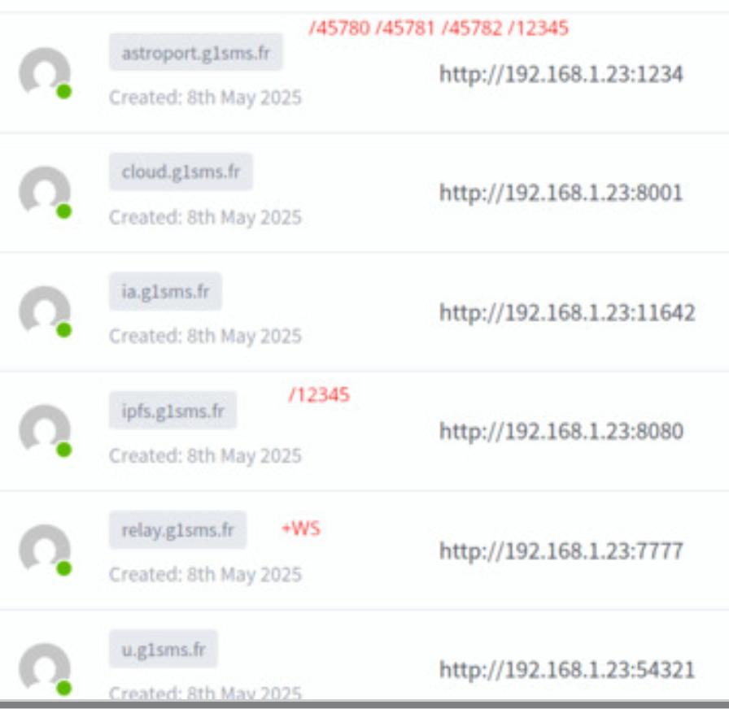

# Astroport.ONE: Your Decentralized Portal to a New Digital Frontier

[FR](README.fr.md) - [ES](README.es.md)

**Welcome to Astroport.ONE!** Imagine a digital world where you are in control, where data is secure, payments are seamless, and community thrives beyond borders. Astroport.ONE is building this future, and you are invited to be a part of it.

## 🌍 What is Astroport.ONE?

Astroport.ONE is a revolutionary platform designed to empower individuals and communities in the Web3 era. It's more than just software; it's a toolkit for creating your own decentralized digital embassy - a **Station** - where you can manage your digital identity, participate in a decentralized economy using the Ğ1 (June) cryptocurrency, and contribute to a global network of interconnected stations.

**Think of Astroport.ONE as:**

*   **Your Personal Data Haven:** Store and manage your data securely thanks to the InterPlanetary File System (IPFS), ensuring it is censorship-resistant and always accessible.
*   **A Commission-Free Payment System:** Use the Ğ1 (June) cryptocurrency for peer-to-peer transactions without intermediaries or fees, fostering a fair and equitable economy.
*   **A Digital Community Builder:** Connect with other Astroport.ONE Stations and users worldwide, sharing information, resources, and building trust-based networks.
*   **A "Construction Guide" for the Decentralized Web:** Leverage our open-source tools and software to create and deploy your own Web3 applications and services.

## 🚀 The UPlanet Ecosystem: Two Levels of Digital Sovereignty

Astroport.ONE powers the **UPlanet ecosystem**, which operates on two distinct levels with different capabilities and security requirements:

### 🌐 **UPlanet ORIGIN (EnfinLibre)**
- **Level**: Basic access level for all users
- **Security**: Standard Ğ1 transaction monitoring
- **Network**: Public network with no swarm key restrictions
- **Control**: Basic primal transaction verification (any primal source accepted)
- **Purpose**: Entry point for new users with MULTIPASS and ZENCARD services
- **Token Value**: 1 Ẑen = 0.1 Ğ1 (fixed rate)

### 🛡️ **UPlanet Ẑen (Private Network)**
- **Level**: Advanced level requiring Y-level activation (SSH<->IPFS key twin)
- **Security**: Enhanced primal transaction control with intrusion detection
- **Network**: Private network using custom `~/.ipfs/swarm.key` for secure isolation
- **Control**: **Real-time token capitalization tool** - controls input € = output Ẑen emissions
- **Purpose**: Secure financial operations and advanced services
- **Token Value**: Customizable based on community needs (technically still 0.1 Ğ1)

#### **ZEN Economy Stable COIN System**

UPlanet Ẑen operates as a **Stable COIN system** that can work with **any asset class** while maintaining proper value equity:

| **Asset Class** | **ZEN Representation** | **Example Community** |
|-----------------|----------------------|----------------------|
| **Fiat Currencies** | 1 Ẑen = 1€, 1$, 1¥ | Local Economy Networks |
| **Real Estate** | 1 Ẑen = 1m² land | Property Investment Groups |
| **Commodities** | 1 Ẑen = 1kg gold/silver | Precious Metals Collectives |
| **DeFi Tokens** | 1 Ẑen = 1 USDC/DAI | DeFi Integration Networks |
| **Energy Credits** | 1 Ẑen = 1 kWh | Renewable Energy Communities |
| **Carbon Credits** | 1 Ẑen = 1 ton CO2 | Environmental Conservation Groups |

**Learn more about the security system**: [Primal Wallet Control Documentation](tools/primal_wallet_control.README.md)

## 🎫 Three Identity Levels: Your Journey to Digital Sovereignty

### 1. 🌐 **MULTIPASS** - Your Basic Digital Identity

**Price**: 1 Ẑen/week (0.1 Ğ1)

**What you get:**
- ✅ **NOSTR Identity**: Secure public key for decentralized social network
- ✅ **uDRIVE IPFS**: Personal decentralized storage (128 GB)
- ✅ **UPlanet ORIGIN Wallet**: 1 Ẑen = 0.1 Ğ1
- ✅ **Personal AI Assistant**: #BRO for your questions and tasks
- ✅ **UMAP Geolocation**: Connect to your local community (0.01° precision)
- ✅ **Ẑen Exchanges**: Direct transfers between MULTIPASS holders

**Economy:**
- Each like received = 0.1 Ğ1 automatically transferred
- Rechargeable via Cesium Ginkgo on UPlanet ORIGIN
- Rechargeable via Open Collective on UPlanet Ẑen
- Captain receives 1 Ẑen/week for hosting

### 2. ☁️ **ZENCARD** - Liberate Your Cloud & Smartphone

**Price**: 4 Ẑen/week (4€)

**Available to members**: [CopyLaRadio](https://opencollective.com/monnaie-libre)

**What you get:**
- ✅ **Everything from MULTIPASS** included
- ✅ **Personal NextCloud**: 128 GB secure storage
- ✅ **De-googling**: Liberate your smartphone from GAFAM
- ✅ **Synchronization**: All your connected devices
- ✅ **Collaboration**: Secure document sharing
- ✅ **ZENCARD Exchanges**: Transfers between ZENCARD holders

**Recharge**: [UPlanet Ẑen](https://opencollective.com/uplanet-zero#category-CONTRIBUTE) - 1 Ẑen = 1€
Volunteer on UPlanet ORIGIN 1 Ẑen = 0.1 Ğ1

### 3. 🛡️ **uPASSPORT** - Your Validated Identity

**Access**: Via primary transaction from a Ğ1 member account

**What you get:**
- ✅ **ZEROCARD Wallet**: Uses DU (Universal Dividend)
- ✅ **Web of Trust Validation**: Community-verified identity
- ✅ **Advanced Services Access**: Premium features
- ✅ **N1/N2 Preparation**: Foundation for future level exploration

Option: **321 DU Organization**: [The DU Game](https://pad.p2p.legal/s/321DU.LeJeu#)

## 🚀 Progression from UPlanet ORIGIN to UPlanet Ẑen

### **Getting Started with UPlanet ORIGIN**
1. **Install Astroport.ONE** using the automated installation script
2. **Create your MULTIPASS** for basic digital identity and AI assistant
3. **Access public services** with standard Ğ1 transaction monitoring
4. **Join the community** and learn about decentralized technologies

### **Advancing to UPlanet Ẑen**
To access the advanced features and custom token valuations:

1. **Activate Y-Level**: Enable SSH<->IPFS key twin functionality
2. **Create Private Network**: Generate your custom `~/.ipfs/swarm.key`
3. **Join Specialized Communities**: Access asset-backed token networks
4. **Participate in Advanced Services**: Use DeFi integrations and custom valuations

### **Benefits of UPlanet Ẑen Advancement**
- **Enhanced Security**: Intrusion detection and automatic refund systems
- **Custom Token Values**: Define your community's economic model
- **Asset Backing**: Real-world asset representation (forest, energy, etc.)
- **DeFi Integration**: Seamless connection with existing DeFi protocols
- **Community Autonomy**: Control your own token valuation and economic rules

## Essential Features: The Power of Astroport.ONE

*   **ZenCard and AstroID: Your Access Keys**

    *   **ZenCard**: An innovative payment system based on the simplicity and security of QR Codes.
    *   **AstroID**: Your digital identity, inviolable and under your complete control.

*   **Decentralized and Organized Storage**

    *   **IPFS at its Core**: Benefit from distributed storage, resistant to censorship and centralized failures.
    *   **MBR and Allocation Table**: A Tiddlywiki data organization optimized for performance and reliability.

*   **Vœux: The Keywords that Animate AstroBot**

    *   **Vœux System**: More than just wishes, "Vœux" (Vows) are keywords that *you* define in your TiddlyWiki to trigger **AstroBot**, the automated heart of Astroport.ONE. These keywords activate BASH programs, rudimentary smart contracts, that allow you to automate actions, synchronize data, or perform specific tasks within your station. While Vœux can be supported by donations in the Ğ1 free currency, their primary function is to orchestrate automation via AstroBOT, not collaborative funding.

*   **Synchronization and P2P Communication**

    *   **Astroport.ONE Stations**: Your station communicates and synchronizes with a network of digital embassies, ensuring maximum data consistency and availability.
    *   **AstroBot: Intelligence Serving Your Data**: A system of smart contracts in BASH, reacting to events on the Ğ1 network and to "Vœux" to automate and optimize your experience.
    *   **G1PalPay.sh: The Ğ1 Transaction Monitor**: A crucial script that monitors the Ğ1 blockchain in real-time. It allows Astroport.ONE to react to transactions, execute commands based on transaction comments, and manage financial flows within the ecosystem.

## **Who is Astroport.ONE For?**

*   **Individuals seeking digital sovereignty:** Take back control of your data and your online presence.
*   **Communities building decentralized solutions:** Create and manage shared resources and collaborative projects.
*   **Developers and innovators:** Explore the potential of Web3 and build decentralized applications on a robust platform.
*   **Users of the Ğ1 (June) cryptocurrency:** Enhance your Ğ1 experience with secure payments and a thriving ecosystem.
*   **Anyone interested in a freer, safer, and more interconnected digital world.**

## **Get Started with Astroport.ONE:**

**Installation (Linux - Debian/Ubuntu/Mint):**

Setting up your Astroport.ONE Station is easy thanks to our automated installation script:

```bash
bash <(curl -sL https://install.astroport.com)
```

### Running Processes

After installation, you should find the following processes running:

```
/usr/local/bin/ipfs daemon --enable-pubsub-experiment --enable-namesys-pubsub
/bin/bash /home/fred/.zen/G1BILLET/G1BILLETS.sh daemon
/bin/bash /home/fred/.zen/Astroport.ONE/12345.sh
/bin/bash /home/fred/.zen/Astroport.ONE/_12345.sh
```

with directories & files in ~/.zen
```
$ ls ~/.zen
Astroport.ONE  [♥Box]  G1BILLET  game  [GPS]  strfry  tmp  UPassport  workspace
```
♥Box contains real external IP for NATed LAN stations
GPS contains Captain account geo location, it is used as "sun time consensus" between ♥Box giving UMAP data priority to closest official relay.

## Usage

### Creating a Player

To create a player, define the following parameters: email, salt, pepper, lat, lon and PASS.

```bash
~/.zen/Astroport.ONE/command.sh
```

### BASH API

Once your Astroport station is started, the following ports are activated:

- **Port 1234**: Publishes API v1 (/45780, /45781 and /45782 are the response ports)
- **Port 12345**: Publishes the station map.
- **Port 33101**: Commands the creation of G1BILLETS (:33102 allows their retrieval)
- **Ports 8080, 4001 and 5001**: IPFS gateway ports.
- **Port 54321**: Publishes API v2 ([UPassport](https://github.com/papiche/UPassport/)).



### UPLANET API (Port 54321)

The UPLANET API, provided by UPassport, is a comprehensive interface for managing digital identity and multimedia content within the Astroport.ONE ecosystem. It runs on port 54321 and offers the following endpoints:

#### Core Endpoints

- **`/scan` or `/`**: Main terminal for QR code scanning and UPassport actions
- **`/nostr`**: NOSTR Card management and interactions
- **`/rec`**: OBS Studio recording control and multimedia processing
- **`/webcam`**: Direct webcam recording and processing
- **`/api/upload`**: File upload to IPFS with NIP authentification
- **`/uplanet`**: UPlanet account creation and management

#### UPLANET Account Creation

To create a UPLANET account, send a GET request with the following parameters:

```http
GET /?uplanet=${EMAIL}&zlat=${LATITUDE}&zlon=${LONGITUDE}&g1pub=${LANGUAGE}
```

| Parameter | Type     | Description                       |
| :-------- | :------- | :-------------------------------- |
| `uplanet` | `email`  | **Required**. Player's email       |
| `zlat`    | `decimal`| **Required**. Latitude with 2 decimal places |
| `zlon`    | `decimal`| **Required**. Longitude with 2 decimal places |
| `g1pub`   | `string` | **Optional**. Origin language (fr, en, ...) |

#### Features

- **Identity Management**: Create and manage UPassports with QR code scanning
- **Multimedia Processing**: Record and process video/audio content
- **IPFS Integration**: Decentralized storage for all content
- **NOSTR Integration**: Publish events and manage NOSTR Cards
- **Ğ1 Integration**: Check balances and process transactions

For more detailed information about the UPLANET API and its capabilities, visit the [UPassport documentation](https://github.com/papiche/UPassport/).

## Documentation

### 📚 Documentation Hub

For complete access to all Astroport.ONE documentation, visit our **[Documentation Hub](DOCUMENTATION.md)** - your central guide to everything Astroport.ONE.

### Technical Architecture

For a comprehensive understanding of Astroport.ONE's technical architecture, including system components, data flows, economic models, and integration details, please refer to our detailed architecture documentation:

**[🏗️ ARCHITECTURE.md](ARCHITECTURE.md)** - Complete technical architecture with diagrams, flow charts, and implementation details

This document covers:
- System architecture and component interactions
- Economic system (ZEN.ECONOMY.sh) and payment flows
- NOSTR integration and filtering system (NIP-101)
- UPassport authentication and IPFS storage
- Swarm network and inter-node subscriptions
- Security, privacy, and monitoring systems

### User Documentation

https://astroport-1.gitbook.io/astroport.one/

## Contribution

FOSS Powered : This project is a selection of some of the most valuable free and open-source software.

By installing Astroport.ONE, you will appear on [UPlanet ORIGIN](https://ipfs.copylaradio.com/ipns/copylaradio) swarm map.

By activating Y level (SSH<->IPFS key twin) or Z level (PGP<->IPFS twins) you can join "UPlanet Ẑen"

> Become part of [Astroport #monnaie-libre](https://opencollective.com/monnaie-libre) DRAGON WoT 
maintained by [CopyLaRadio](https://copylaradio.com) : La coopérative des auto hébergeurs Web2 et Web3 

## Stargazers over time

[](https://starchart.cc/papiche/Astroport.ONE)

## Credits

Thank you to everyone who has contributed to making this software available to all. Do you know [Ğ1](https://monnaie-libre.fr)?

The best cryptocurrency you could dream of.

## Discover the 3 Main Usage Types

Astroport.ONE offers three main ways to join and benefit from the ecosystem. Each usage is explained in a dedicated Zine (flyer) for easy onboarding:

### 1. [🌐 MULTIPASS](https://ipfs.copylaradio.com/ipfs/QmcjpCAfSCn3pucSSWKP5i7HqQCkXnfesVo5z7m6btT5Mv/multipass.html)
**Your Digital Identity & AI Assistant**
- Access the decentralized NOSTR social network
- Get your secure digital identity (NOSTR Card)
- Enjoy a personal AI assistant (#BRO)
- 1 Ẑen per week

### 2. [☁️ ZENCARD](https://ipfs.copylaradio.com/ipfs/QmQRreMYDHhAnkg7rwgYYdS5QDhvjjeBdozE16L3h5A8ED/zencard.html)
**Liberate Your Cloud & Smartphone**
- 128 GB private NextCloud storage
- Smartphone "de-googling" and digital detox
- All the benefits of MULTIPASS included
- 4 Ẑen per week

### 3. [⚡ CAPTAIN](https://ipfs.copylaradio.com/ipfs/QmPuTCooApPu3wFiUFdmxRNyFpf8KxdBv4sQ6i4qrdEb1e/captain.html)
**Become a Node & Earn Ẑen**
- Transform your PC into a value node
- Join the CopyLaRadio cooperative
- Earn Ẑen by offering MULTIPASS and ZENCARD to others
- Full training and support

> 📄 Click each link to view or print the Zine flyer for that usage!

