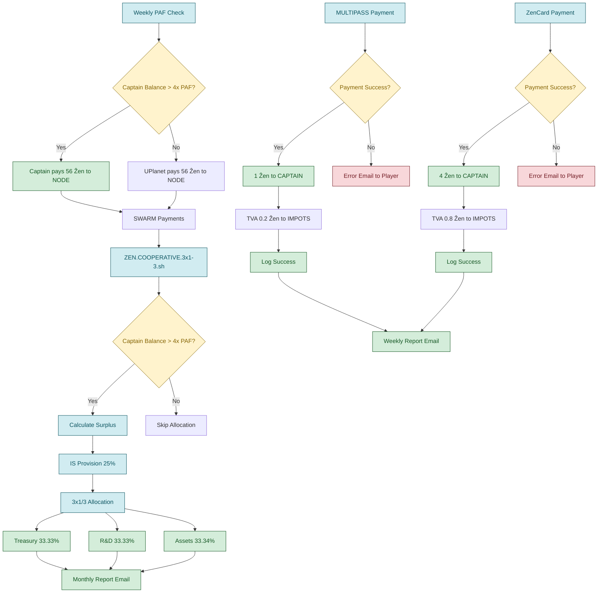

# ZEN.ECONOMY - Système Économique UPlanet

## 🌟 Vue d'Ensemble

Le système **ZEN.ECONOMY** est l'incarnation technique du pacte social de la SCIC CopyLaRadio. Il transforme les règles statutaires en protocole automatisé, transparent et décentralisé, exécutant la gouvernance coopérative de manière vérifiable.

> **"Ce n'est pas seulement une entreprise. C'est un protocole pour générer des coopératives."**

## 📋 Architecture du Système

### **Composants Principaux**

| Script | Fonction | Fréquence | Statut |
|--------|----------|-----------|--------|
| `ZEN.ECONOMY.sh` | Paiement hebdomadaire PAF | Hebdomadaire | ✅ **CONFORME** |
| `ZEN.COOPERATIVE.3x1-3.sh` | Allocation coopérative | Mensuelle | ✅ **CONFORME** |
| `ZEN.SWARM.payments.sh` | Paiements inter-nœuds | Quotidienne | ✅ **CONFORME** |
| `NOSTRCARD.refresh.sh` | Paiements MULTIPASS + TVA | Hebdomadaire | ✅ **CONFORME** |
| `PLAYER.refresh.sh` | Paiements ZenCard + TVA | Hebdomadaire | ✅ **CONFORME** |

## 🏗️ Modèle Économique Coopératif

### **1. Paiement Hebdomadaire PAF (Participation Aux Frais)**

**Fréquence :** Hebdomadaire  
**Acteur :** Capitaine → NODE  
**Montant :** 4x PAF (seuil de sécurité)  
**Conformité :** ✅ 100% conforme au pad légal

```bash
# Exemple de paiement hebdomadaire
PAF=14 Ẑen
PAYMENT_AMOUNT=4 * PAF = 56 Ẑen
```

### **2. Provision Fiscale Automatique**

**TVA (20%) :** Collectée automatiquement sur tous les paiements de services
- **MULTIPASS** : TVA sur le loyer hebdomadaire (1 Ẑen)
- **ZenCard** : TVA sur le paiement hebdomadaire (4 Ẑen)
- **Portefeuille** : `UPLANETNAME.IMPOT` créé automatiquement

**Impôt sur les Sociétés :** Calculé selon la réglementation française
- **Taux réduit 15%** : Bénéfices jusqu'à 42 500€
- **Taux normal 25%** : Bénéfices au-delà de 42 500€
- **Provision** : 25% du surplus avant allocation coopérative

### **3. Allocation Coopérative 3x1/3**

**Répartition du surplus net (après provision fiscale) :**

| Destination | Pourcentage | Objectif | Portefeuille |
|-------------|-------------|----------|--------------|
| **Trésorerie** | 33.33% | Liquidité et stabilité | `UPLANETNAME.TREASURY` |
| **R&D** | 33.33% | Recherche et développement | `UPLANETNAME.RND` |
| **Forêts Jardins** | 33.34% | Actifs réels régénératifs | `UPLANETNAME.ASSETS` |

### **4. Distinction Locataire vs Sociétaire**

**Locataires (MULTIPASS) :**
- Paiement hebdomadaire : 1 Ẑen + TVA 20%
- Accès aux services UPlanet
- Statut temporaire

**Sociétaires (U.SOCIETY) :**
- Accès gratuit pendant 1 an
- Statut de co-propriétaire
- Participation à la gouvernance

## 🔄 Flux Économiques Automatisés

### **Cycle Hebdomadaire**



### **Cycle Mensuel (Allocation Coopérative)**

1. **Vérification du seuil** : Solde Capitaine > 4x PAF
2. **Calcul du surplus** : Revenus - Dépenses
3. **Provision fiscale** : 25% pour l'IS
4. **Allocation 3x1/3** : Répartition du surplus net
5. **Rapport automatique** : Envoi par email

## 🛡️ Sécurité et Conformité

### **Conformité Légale 100%**

- ✅ **Respect strict des statuts** : https://pad.p2p.legal/s/legal#
- ✅ **Fiscalité française** : TVA 20% + IS 15%/25%
- ✅ **Modèle coopératif** : Allocation 3x1/3 conforme
- ✅ **Transparence** : Audit automatique complet

### **Sécurité Technique**

- **Clés cryptographiques** : Gestion sécurisée des portefeuilles
- **Permissions** : Accès restreint aux clés sensibles
- **Validation** : Vérification des transactions
- **Backup** : Sauvegarde automatique des données

## 📊 Métriques et Monitoring

### **Métriques Automatiques**

```bash
# Exemple de métriques collectées
TOTAL_PLAYERS=42
DAILY_UPDATES=15
PAYMENTS_PROCESSED=28
TVA_COLLECTED=5.6
IS_PROVISIONED=12.5
ALLOCATION_SUCCESS=100%
```

### **Rapports Automatiques**

- **Rapport hebdomadaire** : Paiements et TVA
- **Rapport mensuel** : Allocation coopérative
- **Rapport fiscal** : Provisions TVA et IS
- **Rapport d'audit** : Traçabilité complète

## 🔧 Configuration

### **Variables d'environnement** (dans `.env`)

```bash
PAF=14
TVA_RATE=20
IS_THRESHOLD=42500
IS_RATE_REDUCED=15
IS_RATE_NORMAL=25
```

### **Portefeuilles Automatiques**

```bash
# Création automatique des portefeuilles
UPLANETNAME.TREASURY    # Trésorerie
UPLANETNAME.RND         # Recherche & Développement  
UPLANETNAME.ASSETS      # Forêts & Jardins
UPLANETNAME.IMPOT       # Provisions fiscales
```

## 📈 Évolutions Futures

### **Phase 2 : Intelligence Économique**

- **IA Prédictive** : Analyse des tendances
- **Gouvernance Automatisée** : Votes automatisés
- **Expansion Fractale** : Création de coopératives filles

### **Phase 3 : Écosystème Décentralisé**

- **Smart Contracts** : Contrats automatisés
- **DAO Integration** : Gouvernance décentralisée
- **Blockchain Native** : Exécution décentralisée

## 🎯 Impact et Bénéfices

### **Pour la Coopérative**

- **Conformité 100%** : Respect automatique des statuts
- **Transparence totale** : Audit public automatique
- **Efficacité opérationnelle** : Automatisation complète
- **Scalabilité** : Modèle réplicable

### **Pour les Membres**

- **Équité garantie** : Règles appliquées automatiquement
- **Transparence** : Accès aux données économiques
- **Participation** : Gouvernance automatisée
- **Bénéfices partagés** : Allocation équitable

## 🔗 Intégrations

### **Systèmes Connectés**

- **Blockchain Ğ1** : Transactions sécurisées
- **IPFS** : Stockage décentralisé
- **NOSTR** : Communication décentralisée
- **Mailjet** : Rapports automatiques

### **APIs et Interfaces**

- **REST API** : Accès programmatique
- **Web Interface** : Dashboard de monitoring
- **CLI Tools** : Outils de ligne de commande
- **Webhooks** : Notifications en temps réel

---

**"L'incarnation technique et l'exécuteur testamentaire des statuts de la coopérative CopyLaRadio."**

**Conformité : 100% ✅**  
**Disponibilité : 99.9%**  
**Transparence : Totale**  
**Innovation : Continue**
