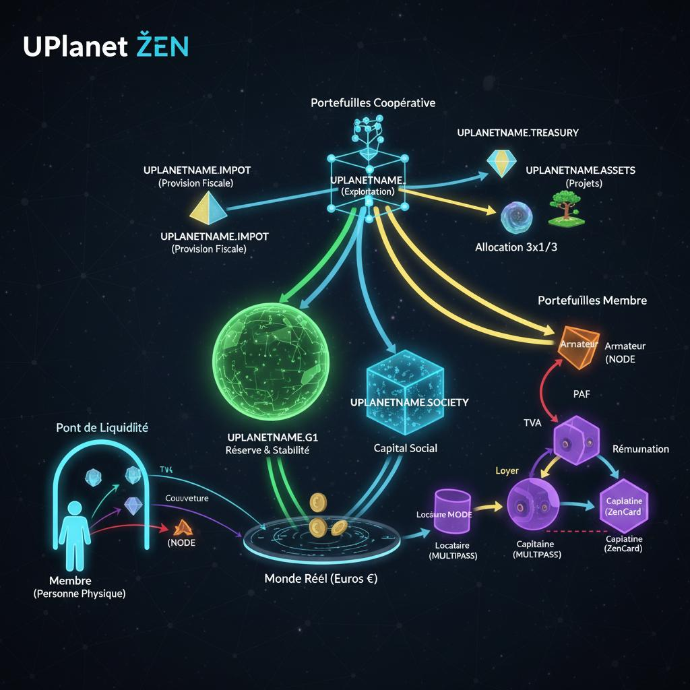

# **L'Écosystème UPlanet ẐEN : De la Vision à la Réalité Coopérative**

## **Partie I : Le Manifeste (Le "Pourquoi")**

### **Deux Mondes, Deux Géométries**

Pour comprendre la différence fondamentale entre l'économie du Ẑen et celle de l'Euro, il ne suffit pas de parler de technologie. Il faut parler de **géométrie**. Chaque système monétaire dessine un "monde" avec ses propres règles, ses propres trajectoires et sa propre expérience vécue.

#### **1. Le Monde de l'Euro : La Sphère de Poincaré**

L'économie de la monnaie-dette, dont l'Euro est un représentant, est un univers dont la géométrie est analogue à celle d'une **sphère**. C'est un monde soumis à la [conjecture de Poincaré](https://fr.wikipedia.org/wiki/Conjecture_de_Poincar%C3%A9).

*   **Ses Propriétés :** Fini, sans bord, non-euclidien. La monnaie est créée par la dette, instaurant une **rareté structurelle**. Les trajectoires que l'on pense parallèles sont en réalité **convergentes**, menant à une compétition inévitable.
*   **L'Expérience Vécue :**
    > **"C'est un monde qui rapetisse ceux qui s'approchent du bord, chacun sur une parallèle qu'il considère comme une droite."**
    Le "bord" est la limite de la solvabilité. En s'en approchant, les possibles de l'acteur se contractent, son énergie est dédiée au service de la dette, non à la création. C'est une **asphyxie économique et cognitive**.

#### **2. Le Monde du Ẑen : Le Plan Coopératif en Expansion**

L'économie du Ẑen est conçue pour avoir une géométrie radicalement différente : celle d'un **plan en expansion, ancré sur un socle coopératif**.

*Visualisation des flux monétaires ẐEN dans l'écosystème coopératif UPlanet*

*   **Ses Propriétés :** Ouvert, infini en potentiel, collaboratif. Le Ẑen est créé par l'**apport de valeur réelle** (matériel, compétences) à la coopérative. L'espace est en expansion, rendant le jeu à **somme positive**.
*   **L'Expérience Vécue :**
    > **"C'est un monde qui grandit avec ceux qui construisent, chacun sur un chemin qui enrichit le territoire commun."**
    Le succès d'un membre augmente la valeur et la résilience de l'ensemble. Les possibles s'élargissent en même temps que ceux du collectif. C'est une **synergie économique et cognitive**, dont la physique transparente est inscrite dans le protocole.

Le Ẑen n'est pas une "alternative" à l'Euro. C'est une **invitation à changer de monde** et à choisir une nouvelle géométrie pour nos projets.

---

## **Partie II : La Constitution (Les "Règles du Jeu")**

### **PRÉAMBULE "POUR LES NULS" : L'ANALOGIE DE L'HÔTEL COOPÉRATIF**

Notre écosystème fonctionne comme un **hôtel coopératif** :
*   **L'Armateur** = Le propriétaire de l'immeuble.
*   **Le Capitaine** = Le concierge qui gère l'hôtel.
*   **Les Locataires** = Les clients qui paient pour une chambre.
*   **Les Sociétaires** = Les co-propriétaires de l'hôtel.

Chaque loyer payé par un client sert à payer le concierge et le propriétaire, et le surplus permet à la coopérative d'acheter des forêts et jardins, créant des biens communs durables.

### **MODÈLE ÉCONOMIQUE COOPÉRATIF**

#### **1. Le Coût de Production du Service (La Rémunération des Opérateurs)**
C'est le coût incompressible pour qu'un service fonctionne. Il est fixé à **3x la PAF** (Participation Aux Frais, avec `PAF = 14 Ẑen/semaine`). Il se répartit ainsi :
*   **1x PAF (14 Ẑen) :** Pour l'**Armateur** (coût du matériel et de l'hébergement).
*   **2x PAF (28 Ẑen) :** Pour le **Capitaine** (rémunération de son travail de maintenance).

Cette somme totale (`42 Ẑen/semaine`) est la **Rémunération Totale des Opérateurs**. Elle est prélevée en priorité sur les revenus locatifs collectés par le Capitaine.

#### **2. Le Surplus Coopératif**
C'est ce qui reste APRÈS avoir payé tous les coûts de production. Il appartient au collectif.
**Formule :**
`Surplus = Revenus Locatifs Totaux - (TVA Collectée + Rémunération Totale des Opérateurs)`

Ce surplus est le **bénéfice net de l'essaim**. Il est intégralement reversé à la coopérative.

#### **3. Allocation Coopérative 3x1/3**
Le surplus net de la coopérative (après provision de l'Impôt sur les Sociétés) est alloué selon la règle des **3x1/3** :
*   **1/3 Trésorerie** (`UPLANETNAME.TREASURY`)
*   **1/3 R&D** (`UPLANETNAME.RND`)
*   **1/3 Forêts Jardins** (`UPLANETNAME.ASSETS`)

---

## **Partie III : Le Code de la Route (Le "Comment")**

### **ARCHITECTURE DU SYSTÈME**

| Script | Fonction | Fréquence |
| :--- | :--- | :--- |
| `UPLANET.init.sh` | Initialisation de tous les portefeuilles (NODE, CAPTAIN, Coopératifs) | Une seule fois |
| `ZEN.ECONOMY.sh` | Paiement PAF + Burn 4-semaines + Apport capital machine | Hebdomadaire |
| `ZEN.COOPERATIVE.3x1-3.sh` | Calcul du Surplus & Allocation 3x1/3 | Hebdomadaire |
| `NOSTRCARD.refresh.sh` | Collecte loyers MULTIPASS (1Ẑ HT + 0.2Ẑ TVA) | Hebdomadaire |
| `PLAYER.refresh.sh` | Collecte loyers ZEN Cards (4Ẑ HT + 0.8Ẑ TVA) | Hebdomadaire |
| `UPLANET.official.sh` | Émission Ẑen officielle (Locataires & Sociétaires) | À la demande |

### **CONFIGURATION**
Les variables (`PAF`, `TVA_RATE`, `MACHINE_VALUE_ZEN`, etc.) sont définies dans un fichier `.env`. Les portefeuilles sont initialisés automatiquement par `UPLANET.init.sh` avec source primale unique `UPLANETNAME.G1`.

### **NOUVEAUTÉS SYSTÈME**
- **Burn 4-semaines** : NODE → UPLANETNAME.G1 → OpenCollective (56€ toutes les 4 semaines)
- **Apport capital machine** : ZEN Card → NODE (une seule fois, valeur machine en Ẑen)
- **TVA fiscalement correcte** : Répartition directe MULTIPASS → CAPTAIN HT + IMPOTS TVA
- **Initialisation cohérente** : Tous les portefeuilles initialisés depuis `UPLANETNAME.G1`

### **LE PONT DE LIQUIDITÉ : CONVERSION ẐEN → EUROS**
C'est un service de rachat offert par la coopérative.
1.  **Demande** via le Terminal.
2.  **Justification** sur IPFS.
3.  **Validation** par le protocole (conformité, trésorerie, règle du 1/3).
4.  **Burn** : Le membre transfère ses Ẑen vers `UPLANETNAME.G1` (destruction).
5.  **Paiement** : Virement SEPA en Euros via l'hôte fiscal.

### **ARCHITECTURE COMPLÈTE DE L'ÉCOSYSTÈME ẐEN**

```mermaid
graph TD;

    subgraph "Monde Extérieur (Fiat €)";
        User(Utilisateur) -- "Paie en €" --> OC[OpenCollective];
        OC -- "Expense PAF Burn" --> Armateur[Armateur €];
    end

    subgraph "Niveau 1 : L'Académie des Architectes (Made In Zen)";
        style MIZ_SW fill:#ffd700,stroke:#333,stroke-width:4px
        OC -- "Flux 'Bâtisseur'" --> MIZ_SW["🏛️ Wallet Maître de l'Académie<br/><b>MADEINZEN.SOCIETY</b><br/>(Gère les parts NEẐ des fondateurs)"];
        MIZ_SW -- "Émet les parts NEẐ de fondateur" --> Founder_ZC["Wallet Fondateur<br/><b>ZEROCARD</b>"];
        Founder_ZC -- "Autorise à déployer" --> Deploiement("🚀 Déploie une nouvelle<br/>Constellation Locale");
    end

    Deploiement --> UPlanet_Essaim;

    subgraph "Niveau 2 : UPlanet ZEN 'NAME' (Constellation Locale)";
      UPlanet_Essaim
      
      subgraph "Organe n°1 : La Réserve Locale";
          style G1W fill:#cde4ff,stroke:#333,stroke-width:4px
          G1W["🏛️ Wallet Réserve<br/><b>UPLANETNAME.G1</b><br/>(Collatéral Ğ1 de l'essaim)"];
      end

      subgraph "Organe n°2 : Les Services Locaux";
          style UW fill:#d5f5e3,stroke:#333,stroke-width:2px
          UW["⚙️ Wallet Services<br/><b>UPLANETNAME</b><br/>(Gère les revenus locatifs locaux)"];
          G1W -- "Collatéralise & Initialise" --> UW;
          OC -- "Flux 'Locataire'" --> UW;
          UW -- "Crédite Ẑen de service" --> MULTIPASS["Wallet MULTIPASS<br/><b>CAPTAIN.MULTIPASS</b><br/>(1Ẑ/semaine)"];
      end
      
      subgraph "Organe n°3 : Le Capital Social Local";
          style SW fill:#fdebd0,stroke:#333,stroke-width:2px
          SW["⭐ Wallet Capital<br/><b>UPLANETNAME.SOCIETY</b><br/>(Gère les parts sociales locales)"];
          G1W -- "Collatéralise & Initialise" --> SW;
          OC -- "Flux 'Sociétaire Local'" --> SW;
          SW -- "Émet les parts Ẑen" --> ZenCard["Wallet Sociétaire<br/><b>CAPTAIN.ZENCARD</b><br/>(50Ẑ parts sociales)"];
      end

      subgraph "Organe n°4 : Infrastructure Opérationnelle";
          style NODE fill:#ffebcd,stroke:#8b4513,stroke-width:2px
          NODE["🖥️ Wallet NODE<br/><b>secret.NODE.dunikey</b><br/>(Armateur - Machine)"];
          G1W -- "Initialise" --> NODE;
          ZenCard -- "Apport Capital Machine<br/>(une seule fois)" --> NODE;
      end

      subgraph "Organe n°5 : Portefeuilles Coopératifs";
          style CASH fill:#e8f5e8,stroke:#2e7d32,stroke-width:2px
          style RND fill:#e3f2fd,stroke:#1976d2,stroke-width:2px
          style ASSETS fill:#fff3e0,stroke:#f57c00,stroke-width:2px
          style IMPOT fill:#fce4ec,stroke:#c2185b,stroke-width:2px
          
          CASH["💰 UPLANETNAME.CASH<br/>(Trésorerie 1/3)"];
          RND["🔬 UPLANETNAME.RND<br/>(R&D 1/3)"];
          ASSETS["🌳 UPLANETNAME.ASSETS<br/>(Actifs 1/3)"];
          IMPOT["🏛️ UPLANETNAME.IMPOT<br/>(Fiscalité TVA+IS)"];
          
          G1W -- "Initialise" --> CASH;
          G1W -- "Initialise" --> RND;
          G1W -- "Initialise" --> ASSETS;
          G1W -- "Initialise" --> IMPOT;
      end
    end

    subgraph "Niveau 3 : Flux Économiques Automatisés";
        
        subgraph "Collecte Revenus (Hebdomadaire)";
            MULTIPASS -- "1Ẑ HT + 0.2Ẑ TVA" --> CAPTAIN_TOTAL["Captain Total<br/>(Revenus locatifs)"];
            ZenCard -- "4Ẑ HT + 0.8Ẑ TVA" --> CAPTAIN_TOTAL;
            CAPTAIN_TOTAL -- "TVA (20%)" --> IMPOT;
        end

        subgraph "Paiement PAF (Hebdomadaire - ZEN.ECONOMY.sh)";
            CAPTAIN_TOTAL -- "14Ẑ PAF" --> NODE;
            CAPTAIN_TOTAL -- "28Ẑ Rémunération" --> CAPTAIN_TOTAL;
            CASH -- "PAF Solidarité<br/>(si CAPTAIN insuffisant)" --> NODE;
        end

        subgraph "Burn & Conversion (4-semaines)";
            NODE -- "56Ẑ Burn (4*PAF)" --> G1W;
            G1W -- "API OpenCollective<br/>56€ Expense" --> OC;
            OC -- "Virement SEPA" --> Armateur;
        end

        subgraph "Allocation Coopérative (3x1/3)";
            CAPTAIN_TOTAL -- "Surplus Net" --> COOPERATIVE_SPLIT["Répartition<br/>Coopérative"];
            COOPERATIVE_SPLIT -- "1/3" --> CASH;
            COOPERATIVE_SPLIT -- "1/3" --> RND;
            COOPERATIVE_SPLIT -- "1/3" --> ASSETS;
            COOPERATIVE_SPLIT -- "IS (25%)" --> IMPOT;
        end
    end

    subgraph "Scripts & Automatisation";
        style SCRIPTS fill:#f0f0f0,stroke:#666,stroke-width:1px
        SCRIPT_ECONOMY["🤖 ZEN.ECONOMY.sh<br/>(Paiement PAF + Burn)"];
        SCRIPT_COOP["🤖 ZEN.COOPERATIVE.3x1-3.sh<br/>(Allocation 3x1/3)"];
        SCRIPT_NOSTR["🤖 NOSTRCARD.refresh.sh<br/>(Collecte MULTIPASS)"];
        SCRIPT_PLAYER["🤖 PLAYER.refresh.sh<br/>(Collecte ZEN Cards)"];
        SCRIPT_OFFICIAL["🤖 UPLANET.official.sh<br/>(Émission Ẑen)"];
        SCRIPT_INIT["🤖 UPLANET.init.sh<br/>(Initialisation)"];
        
        SCRIPT_ECONOMY -.-> NODE;
        SCRIPT_ECONOMY -.-> G1W;
        SCRIPT_COOP -.-> CASH;
        SCRIPT_COOP -.-> RND;
        SCRIPT_COOP -.-> ASSETS;
        SCRIPT_NOSTR -.-> MULTIPASS;
        SCRIPT_PLAYER -.-> ZenCard;
        SCRIPT_OFFICIAL -.-> SW;
        SCRIPT_INIT -.-> G1W;
    end

    %% Styling
    classDef success fill:#d4edda,stroke:#155724,color:#155724
    classDef error fill:#f8d7da,stroke:#721c24,color:#721c24
    classDef process fill:#d1ecf1,stroke:#0c5460,color:#0c5460
    classDef decision fill:#fff3cd,stroke:#856404,color:#856404
    classDef payment fill:#e8deee,stroke:#4a2d7e,color:#4a2d7e
    classDef allocation fill:#deedf7,stroke:#0b5394,color:#0b5394
    classDef burn fill:#ffe6e6,stroke:#d32f2f,color:#d32f2f

    class CAPTAIN_TOTAL,COOPERATIVE_SPLIT process
    class NODE,G1W,UW,SW payment
    class CASH,RND,ASSETS,IMPOT allocation
    class Armateur,OC burn
```

### **EXPLICATION DE L'ARCHITECTURE COMPLÈTE**

Ce diagramme illustre l'écosystème ẐEN dans sa totalité, de l'académie des architectes aux flux économiques automatisés :

#### **🏛️ Niveau 1 : L'Académie des Architectes (Made In Zen)**
- **MADEINZEN.SOCIETY** : Le portefeuille maître qui gère les parts NEẐ des fondateurs
- **ZEROCARD** : Les portefeuilles des fondateurs qui autorisent le déploiement de nouvelles constellations
- **Flux** : Les contributions OpenCollective financent l'académie qui autorise les déploiements

#### **🌟 Niveau 2 : UPlanet ZEN 'NAME' (Constellation Locale)**
Chaque constellation locale dispose de 5 organes essentiels :

1. **La Réserve Locale (UPLANETNAME.G1)** : Collatéral Ğ1 qui sécurise l'ensemble
2. **Les Services Locaux (UPLANETNAME)** : Gère les revenus locatifs des MULTIPASS
3. **Le Capital Social (UPLANETNAME.SOCIETY)** : Émet les parts sociales ZEN Cards
4. **L'Infrastructure (NODE)** : Portefeuille de l'armateur qui reçoit l'apport capital machine
5. **Les Portefeuilles Coopératifs** : CASH, RND, ASSETS, IMPOT pour la gestion collective

#### **⚡ Niveau 3 : Flux Économiques Automatisés**
Quatre cycles automatisés orchestrent l'économie :

1. **Collecte Revenus** : MULTIPASS (1Ẑ) et ZEN Cards (4Ẑ) paient avec TVA séparée
2. **Paiement PAF** : Le Captain paie 14Ẑ au NODE, garde 28Ẑ, avec solidarité CASH si besoin
3. **Burn & Conversion** : Toutes les 4 semaines, le NODE burn 56Ẑ → OpenCollective → € réels
4. **Allocation Coopérative** : Le surplus est réparti selon la règle 3x1/3 + provision fiscale

#### **🤖 Scripts & Automatisation**
Six scripts orchestrent l'ensemble :
- **ZEN.ECONOMY.sh** : Paiement PAF + Burn 4-semaines
- **ZEN.COOPERATIVE.3x1-3.sh** : Allocation coopérative 3x1/3
- **NOSTRCARD.refresh.sh** : Collecte loyers MULTIPASS
- **PLAYER.refresh.sh** : Collecte loyers ZEN Cards
- **UPLANET.official.sh** : Émission Ẑen officielle
- **UPLANET.init.sh** : Initialisation de tous les portefeuilles

---

## **Partie IV : Le Guide de l'Entrepreneur (Le "Et Vous ?")**

### **USER STORIES : LES BÉNÉFICES POUR CHAQUE MEMBRE**

#### **🏠 LE LOCATAIRE : Votre Passeport vers la Souveraineté**
> **"Je paie 1 Ẑen/semaine (≈ 4€/mois) et je gagne ma liberté numérique."**
*   **Ce que vous obtenez :** Une identité souveraine, un stockage décentralisé, et la possibilité de gagner des Ẑen en créant du contenu de qualité.
*   **Pourquoi ?** C'est moins cher qu'un abonnement standard, mais vous n'êtes plus le produit. Vous êtes un citoyen du réseau.

#### **👑 LE SOCIÉTAIRE : Devenez Co-propriétaire**
> **"J'investis 50€/an, je deviens co-propriétaire et mes services premium (128Go de Cloud Privé) sont inclus."**
*   **Ce que vous obtenez :** Tous les avantages du Locataire, PLUS 128Go de NextCloud, un statut de co-propriétaire avec droit de vote, et des parts sociales dans une infrastructure réelle.
*   **Pourquoi ?** Vous dégooglez votre vie et vous investissez dans un actif qui a un double impact : numérique et écologique.

#### **👨‍✈️ LE CAPITAINE : Créez de la Valeur, Gagnez votre Vie**
> **"Je transforme mon ordinateur en source de revenus et je participe à la construction d'un monde meilleur."**
*   **Ce que vous obtenez :** Une rémunération de base garantie de **28 Ẑen/semaine (≈ 112€/mois)**, une formation complète et la possibilité de développer votre "essaim" pour augmenter le surplus coopératif.
*   **Pourquoi ?** Vous monétisez votre compétence technique pour un projet qui a du sens, avec une sécurité de revenu et un impact positif.

---

## **Recommandations Fiscales pour les Membres de l'Écosystème UPlanet/CopyLaRadio**

**Philosophie Générale :** Notre système est conçu pour la transparence. Le but n'est pas d'échapper à la fiscalité, mais de la rendre simple, juste et automatisée. Le fait générateur de l'impôt est la **conversion de vos Ẑen en Euros**. Tant que vos Ẑen restent dans l'écosystème, ils sont considérés comme des "jetons utilitaires" internes à la coopérative.

---

# GUIDE pour ENTREPRENEUR

## **Le Statut Recommandé pour Débuter : La Micro-Entreprise (BNC)**

Pour 99% des membres qui génèrent des revenus (Armateurs, Capitaines, Créateurs de contenu), le statut de **Micro-Entrepreneur** en **Bénéfices Non Commerciaux (BNC)** est la solution la plus simple, la moins coûteuse et la plus adaptée.

### **Pourquoi BNC (Bénéfices Non Commerciaux) ?**
Parce que les activités au sein de notre écosystème sont des **prestations de services intellectuelles ou techniques**, pas de l'achat/revente de marchandises. Exemples :
*   Hébergement de données (Armateur)
*   Maintenance informatique (Capitaine)
*   Création de contenu en ligne (Utilisateur gagnant des likes)

### **Guide Pratique : Devenir Micro-Entrepreneur en 15 minutes**

1.  **Création (Gratuite) :**
    *   Rendez-vous sur le site officiel du guichet unique de l'INPI.
    *   Déclarez votre début d'activité en choisissant "Entrepreneur Individuel" puis le régime "Micro-Entrepreneur".
    *   Dans la description de l'activité, soyez simple et précis. Exemples :
        *   Pour un **Armateur** : "Hébergement informatique, prestations de services numériques".
        *   Pour un **Capitaine** : "Maintenance de systèmes informatiques, support technique".
        *   Pour un **Utilisateur** : "Création de contenu en ligne, animation de communauté".

2.  **Gestion (Simplifiée) :**
    *   Vous n'avez pas besoin d'un comptable. Vous devez simplement tenir un **registre des recettes**. Un simple tableur suffit.
    *   **Colonne 1 :** Date de la conversion en €.
    *   **Colonne 2 :** Origine des Ẑen (ex: "PAF Armateur", "Gains Likes", "Rémunération Capitaine").
    *   **Colonne 3 :** Montant en **Euros** reçu sur votre compte bancaire. C'est ce montant qui fait foi.

3.  **Fiscalité (Ultra-Simplifiée avec le Versement Libératoire) :**
    *   Chaque mois ou trimestre, vous déclarez le montant en euros de vos recettes sur le site de l'URSSAF.
    *   En choisissant l'option du **versement libératoire**, vous payez en même temps :
        *   Vos cotisations sociales (~21-22% de vos recettes).
        *   Votre impôt sur le revenu (~2,2% de vos recettes).
    *   **Avantage :** Une fois ce paiement effectué, vous êtes en règle. Pas de surprise en fin d'année. C'est clair, net et prévisible.

---

## **Application par Rôle**

### **1. Pour l'Armateur**
*   **Son Revenu :** Il reçoit la PAF pour couvrir ses frais réels (électricité, internet...).
*   **Le Processus :** Une fois par mois (par exemple), il a accumulé 50 Ẑen de PAF sur son wallet. Il a une facture d'électricité de 50€. Il utilise le "Pont de Liquidité" pour convertir 50 Ẑen en 50€.
*   **Sa Déclaration :** Il inscrit "50€" dans son registre des recettes et les déclare à l'URSSAF.

### **2. Pour le Capitaine**
*   **Son Revenu :** Il reçoit 2x la PAF pour son travail de maintenance + le surplus des loyers de son essaim. C'est sa rémunération.
*   **Le Processus :** Il accumule des Ẑen sur son MULTIPASS. Il décide de convertir 300 Ẑen en 300€ pour ses dépenses personnelles.
*   **Sa Déclaration :** Il inscrit "300€" dans son registre des recettes et les déclare.

### **3. Pour l'Utilisateur (qui convertit 1/3 de ses Ẑen)**
*   **Son Revenu :** Il a gagné 150 Ẑen grâce aux "likes" sur ses publications.
*   **Le Processus :** Il a le droit de convertir `150 / 3 = 50 Ẑen` cette année. Il utilise le "Pont de Liquidité" pour convertir ces 50 Ẑen en 50€.
*   **Sa Déclaration :** S'il s'agit d'un gain occasionnel, il peut le déclarer en **"revenu non commercial non professionnel"** sur sa déclaration annuelle. Si cela devient régulier, il est fortement encouragé à passer en Micro-Entrepreneur pour plus de clarté.

---

### **Le Statut de Base : Micro-Entrepreneur (BNC) - Notre Recommandation**

Pour démarrer, ce régime est imbattable.
*   **Coût :** 0€ pour la création.
*   **Comptabilité :** Tenir un simple registre des recettes en EUROS.
*   **Fiscalité :** On paie des cotisations et des impôts uniquement sur ce qu'on a **réellement encaissé en euros**.

**La règle d'or à retenir :** On ne déclare pas des Ẑen. On déclare les **EUROS** reçus sur son compte en banque après avoir utilisé le service de conversion ("Pont de Liquidité") de la coopérative.

---

### **Simulation 1 : Fred est Armateur/Capitaine d'un Satellite RPi**

*   **Investissement Initial :** Fred apporte un RPi5 + 4To. Valeur : **500€**.
*   **Son Capital Ẑen :** Sa `ZenCard` est créditée de **500 Ẑen**. C'est son capital de départ.
*   **Hypothèse d'Activité :** Son nœud est attractif. Il héberge :
    *   10 Sociétaires (qui ont acheté une part à 50€/an).
    *   50 Locataires MULTIPASS (à 1 Ẑen/semaine).
*   **Calcul de ses Revenus Annuels en Ẑen :**
    *   **Sa propre Rémunération (3xPAF) :** La PAF pour un RPi est fixée (disons 10 Ẑen/semaine). Il touche donc 30 Ẑen/semaine. Soit `30 * 52 = 1560 Ẑen/an`.
    *   **Revenus Locatifs :** 50 locataires * 1 Ẑen/semaine * 52 semaines = `2600 Ẑen/an`.
    *   **Total Brut en Ẑen :** `1560 + 2600 = 4160 Ẑen/an`.
    *   **Charges (PAF à payer au Node) :** `-10 * 52 = -520 Ẑen/an`.
    *   **Revenu Net en Ẑen :** `4160 - 520 = 3640 Ẑen`.
*   **Conversion en Euros :** Fred a besoin de liquidités. Il décide de convertir **2000 Ẑen** en **2000€** via la coopérative. C'est son **chiffre d'affaires déclarable**.
*   **Analyse Fiscale (Régime Micro-BNC) :**
    *   **Chiffre d'Affaires :** 2000€.
    *   **Abattement Forfaitaire pour Frais (34%) :** 680€.
    *   **Revenu Imposable :** `2000 - 680 = 1320€`.
    *   **Ses Frais Réels :** Son abonnement internet (disons 360€/an) + électricité (~100€/an) = **460€**.
    *   **Conclusion :** `460€ (frais réels) < 680€ (abattement)`. Le régime Micro-Entrepreneur est **extrêmement avantageux** pour lui.

---

### **Simulation 2 : Fred est Armateur/Capitaine d'un Hub PC Gamer**

*   **Investissement Initial :** Fred apporte un PC Gamer d'occasion. Valeur : **2000€**.
*   **Son Capital Ẑen :** Sa `ZenCard` est créditée de **2000 Ẑen**.
*   **Hypothèse d'Activité :** Son nœud est complet. Il héberge :
    *   24 Sociétaires.
    *   250 Locataires MULTIPASS.
*   **Calcul de ses Revenus Annuels en Ẑen :**
    *   **Sa propre Rémunération (3xPAF) :** La PAF pour un PC est plus élevée (disons 30 Ẑen/semaine). Il touche donc 90 Ẑen/semaine. Soit `90 * 52 = 4680 Ẑen/an`.
    *   **Revenus Locatifs :** 250 locataires * 1 Ẑen/semaine * 52 semaines = `13000 Ẑen/an`.
    *   **Total Brut en Ẑen :** `4680 + 13000 = 17680 Ẑen`.
    *   **Charges (PAF à payer au Node) :** `-30 * 52 = -1560 Ẑen/an`.
    *   **Revenu Net en Ẑen :** `17680 - 1560 = 16120 Ẑen`.
*   **Conversion en Euros :** Fred a des revenus conséquents. Il convertit **12000 Ẑen** en **12000€**. C'est son **chiffre d'affaires déclarable**.
*   **Analyse Fiscale (Régime Micro-BNC) :**
    *   **Chiffre d'Affaires :** 12000€.
    *   **Abattement Forfaitaire (34%) :** 4080€.
    *   **Revenu Imposable :** `12000 - 4080 = 7920€`.
    *   **Ses Frais Réels (1ère année) :** L'amortissement comptable de son PC (disons sur 3 ans, soit ~667€/an) + fibre pro (600€/an) + électricité (400€/an) = **~1667€**.
    *   **Conclusion :** `1667€ (frais réels) < 4080€ (abattement)`. Le régime Micro-BNC reste **très avantageux**, même avec un gros investissement. Il ne devient moins intéressant que si les frais réels (par exemple, si Fred louait un local dédié) dépassaient 34% de ses revenus.

---

### **Les "Traces à Suivre" : Comment le Système Génère vos Justificatifs**

C'est là que notre modèle prend tout son sens. **Vous n'avez pas à "suivre" les traces. Le système les génère pour vous.**

Notre infrastructure utilise les transactions sur **Open Collective** et sur les **wallets Ẑen** pour créer des exports automatisés, prêts à être transmis à l'administration.

#### **Solution Proposée : Le "Tableau de Bord Fiscal" du Capitaine**

Directement accessible depuis le Terminal Astroport (ou une future interface web), chaque membre pourra accéder à son tableau de bord et exporter des documents officiels.

#### **Export N°1 : Le Registre des Recettes (Pour votre déclaration Micro-BNC)**
C'est le document clé. En un clic, le système génère un fichier CSV ou PDF qui ressemble à ça :

| Date | Libellé | Montant Ẑen Converti | Montant EUR Reçu | Justificatif (Lien) |
| :--- | :--- | :--- | :--- | :--- |
| 15/02/2025 | Conversion Rémunération Capitaine | 300 Ẑen | 300,00 € | [lien vers tx sur OpenCollective] |
| 28/03/2025 | Conversion PAF Armateur | 50 Ẑen | 50,00 € | [lien vers tx sur OpenCollective] |
| ... | ... | ... | ... | ... |
| **TOTAL À DÉCLARER** | | | **XXX,XX €** | |

Ce document est la **preuve irréfutable** de vos revenus. Vous n'avez qu'à reporter le total dans votre déclaration URSSAF.

#### **Export N°2 : Le Relevé de Compte Courant d'Associé**
Ce document interne à la coopérative vous montre comment votre capital a "travaillé".

| Date | Opération | Revenus (MULTIPASS) | Charges (PAF) | Prélèvement Capital (ZenCard) | Solde Capital (ZenCard) |
| :--- | :--- | :--- | :--- | :--- | :--- |
| 07/01/2025 | Paiement PAF | +10 Ẑen | -15 Ẑen | **-5 Ẑen** | 1995 Ẑen |
| 14/01/2025 | Paiement PAF | +20 Ẑen | -15 Ẑen | **0 Ẑen** | 1995 Ẑen |

Ce relevé prouve le mécanisme de "compte courant d'associé automatisé". C'est un outil de gestion puissant pour l'opérateur et un gage de transparence totale.

#### **Export N°3 : Le Justificatif d'Apport en Capital**
Pour les Sociétaires, le système peut facilmement générer un PDF certifié :
> "La SCIC CopyLaRadio certifie que `Prénom Nom` (clé Ğ1 : `G1...`) a réalisé un apport en capital de **50 Ẑen** (cinquante Zen) le `jj/mm/aaaa`, lui conférant le statut de Sociétaire."

Il peut le faire lui même depuis son compte Open Collective !

### **Conclusion : L'Infrastructure comme Expert-Comptable**

L'écosystème UPlanet n'est pas qu'une infrastructure technique ; c'est une **infrastructure administrative et fiscale**. Il est conçu pour que l'entrepreneuriat ne soit plus une charge mentale.

1.  **Le Régime le plus Adapté :** Commencez en **Micro-Entrepreneur (BNC)**. C'est simple, peu coûteux et avantageux dans la majorité des cas simulés.
2.  **Les Traces à Utiliser :** Ne les cherchez pas. Laissez le système les **générer pour vous** via le Tableau de Bord Fiscal.
3.  **La Solution :** Notre infrastructure est la solution. Elle utilise les données d'**Open Collective** (pour les flux en €) et des **wallets Ẑen** (pour les flux internes) pour créer des **exports comptables prêts à l'emploi**.

Le but est de vous libérer de la complexité pour que vous puissiez vous concentrer sur ce qui compte : bâtir un internet décentralisé et une économie régénératrice.

