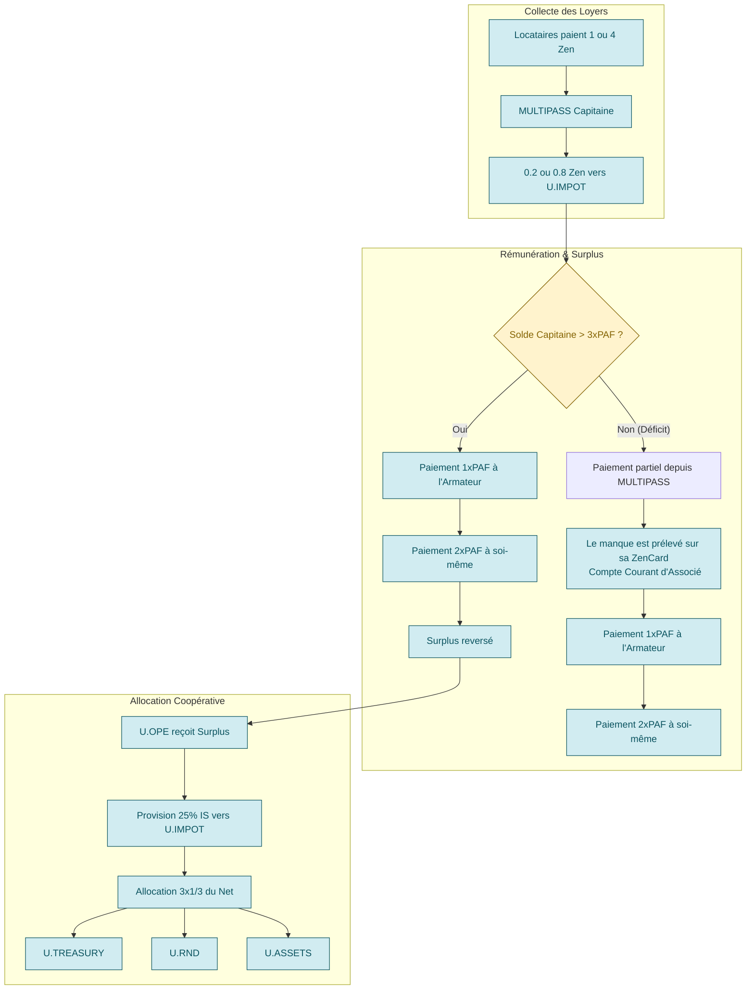

# **L'Écosystème UPlanet ẐEN : De la Vision à la Réalité Coopérative**

## **Partie I : Le Manifeste (Le "Pourquoi")**

### **Deux Mondes, Deux Géométries**

Pour comprendre la différence fondamentale entre l'économie du Ẑen et celle de l'Euro, il ne suffit pas de parler de technologie. Il faut parler de **géométrie**. Chaque système monétaire dessine un "monde" avec ses propres règles, ses propres trajectoires et sa propre expérience vécue.

#### **1. Le Monde de l'Euro : La Sphère de Poincaré**

L'économie de la monnaie-dette, dont l'Euro est un représentant, est un univers dont la géométrie est analogue à celle d'une **sphère**. C'est un monde soumis à la [conjecture de Poincaré](https://fr.wikipedia.org/wiki/Conjecture_de_Poincar%C3%A9).

*   **Ses Propriétés :** Fini, sans bord, non-euclidien. La monnaie est créée par la dette, instaurant une **rareté structurelle**. Les trajectoires que l'on pense parallèles sont en réalité **convergentes**, menant à une compétition inévitable.
*   **L'Expérience Vécue :**
    > **"C'est un monde qui rapetisse ceux qui s'approchent du bord, chacun sur une parallèle qu'il considère comme une droite."**
    Le "bord" est la limite de la solvabilité. En s'en approchant, les possibles de l'acteur se contractent, son énergie est dédiée au service de la dette, non à la création. C'est une **asphyxie économique et cognitive**.

#### **2. Le Monde du Ẑen : Le Plan Coopératif en Expansion**

L'économie du Ẑen est conçue pour avoir une géométrie radicalement différente : celle d'un **plan en expansion, ancré sur un socle coopératif**.

*   **Ses Propriétés :** Ouvert, infini en potentiel, collaboratif. Le Ẑen est créé par l'**apport de valeur réelle** (matériel, compétences) à la coopérative. L'espace est en expansion, rendant le jeu à **somme positive**.
*   **L'Expérience Vécue :**
    > **"C'est un monde qui grandit avec ceux qui construisent, chacun sur un chemin qui enrichit le territoire commun."**
    Le succès d'un membre augmente la valeur et la résilience de l'ensemble. Les possibles s'élargissent en même temps que ceux du collectif. C'est une **synergie économique et cognitive**, dont la physique transparente est inscrite dans le protocole.

Le Ẑen n'est pas une "alternative" à l'Euro. C'est une **invitation à changer de monde** et à choisir une nouvelle géométrie pour nos projets.

---

## **Partie II : La Constitution (Les "Règles du Jeu")**

### **PRÉAMBULE "POUR LES NULS" : L'ANALOGIE DE L'HÔTEL COOPÉRATIF**

Notre écosystème fonctionne comme un **hôtel coopératif** :
*   **L'Armateur** = Le propriétaire de l'immeuble.
*   **Le Capitaine** = Le concierge qui gère l'hôtel.
*   **Les Locataires** = Les clients qui paient pour une chambre.
*   **Les Sociétaires** = Les co-propriétaires de l'hôtel.

Chaque loyer payé par un client sert à payer le concierge et le propriétaire, et le surplus permet à la coopérative d'acheter des forêts et jardins, créant des biens communs durables.

### **MODÈLE ÉCONOMIQUE COOPÉRATIF**

#### **1. Le Coût de Production du Service (La Rémunération des Opérateurs)**
C'est le coût incompressible pour qu'un service fonctionne. Il est fixé à **3x la PAF** (Participation Aux Frais, avec `PAF = 14 Ẑen/semaine`). Il se répartit ainsi :
*   **1x PAF (14 Ẑen) :** Pour l'**Armateur** (coût du matériel et de l'hébergement).
*   **2x PAF (28 Ẑen) :** Pour le **Capitaine** (rémunération de son travail de maintenance).

Cette somme totale (`42 Ẑen/semaine`) est la **Rémunération Totale des Opérateurs**. Elle est prélevée en priorité sur les revenus locatifs collectés par le Capitaine.

#### **2. Le Surplus Coopératif**
C'est ce qui reste APRÈS avoir payé tous les coûts de production. Il appartient au collectif.
**Formule :**
`Surplus = Revenus Locatifs Totaux - (TVA Collectée + Rémunération Totale des Opérateurs)`

Ce surplus est le **bénéfice net de l'essaim**. Il est intégralement reversé à la coopérative.

#### **3. Allocation Coopérative 3x1/3**
Le surplus net de la coopérative (après provision de l'Impôt sur les Sociétés) est alloué selon la règle des **3x1/3** :
*   **1/3 Trésorerie** (`UPLANETNAME.TREASURY`)
*   **1/3 R&D** (`UPLANETNAME.RND`)
*   **1/3 Forêts Jardins** (`UPLANETNAME.ASSETS`)

---

## **Partie III : Le Code de la Route (Le "Comment")**

### **ARCHITECTURE DU SYSTÈME**

| Script | Fonction | Fréquence |
| :--- | :--- | :--- |
| `ZEN.ECONOMY.sh` | Paiement Rémunération Opérateurs | Hebdomadaire |
| `ZEN.COOPERATIVE.3x1-3.sh` | Calcul du Surplus & Allocation | Hebdomadaire |
| `NOSTRCARD.refresh.sh` & `PLAYER.refresh.sh` | Collecte des Loyers & TVA | Hebdomadaire |

### **CONFIGURATION**
Les variables (`PAF`, `TVA_RATE`, etc.) sont définies dans un fichier `.env`. Les portefeuilles (`.IMPOT`, `.TREASURY`, etc.) sont créés automatiquement par le script `UPLANET.official.sh`.

### **LE PONT DE LIQUIDITÉ : CONVERSION ẐEN → EUROS**
C'est un service de rachat offert par la coopérative.
1.  **Demande** via le Terminal.
2.  **Justification** sur IPFS.
3.  **Validation** par le protocole (conformité, trésorerie, règle du 1/3).
4.  **Burn** : Le membre transfère ses Ẑen vers `UPLANETNAME.G1` (destruction).
5.  **Paiement** : Virement SEPA en Euros via l'hôte fiscal.

### **FLUX ÉCONOMIQUES AUTOMATISÉS**

---

## **Partie IV : Le Guide de l'Entrepreneur (Le "Et Vous ?")**

### **USER STORIES : LES BÉNÉFICES POUR CHAQUE MEMBRE**

#### **🏠 LE LOCATAIRE : Votre Passeport vers la Souveraineté**
> **"Je paie 1 Ẑen/semaine (≈ 4€/mois) et je gagne ma liberté numérique."**
*   **Ce que vous obtenez :** Une identité souveraine, un stockage décentralisé, et la possibilité de gagner des Ẑen en créant du contenu de qualité.
*   **Pourquoi ?** C'est moins cher qu'un abonnement standard, mais vous n'êtes plus le produit. Vous êtes un citoyen du réseau.

#### **👑 LE SOCIÉTAIRE : Devenez Co-propriétaire**
> **"J'investis 50€/an, je deviens co-propriétaire et mes services premium (128Go de Cloud Privé) sont inclus."**
*   **Ce que vous obtenez :** Tous les avantages du Locataire, PLUS 128Go de NextCloud, un statut de co-propriétaire avec droit de vote, et des parts sociales dans une infrastructure réelle.
*   **Pourquoi ?** Vous dégooglez votre vie et vous investissez dans un actif qui a un double impact : numérique et écologique.

#### **👨‍✈️ LE CAPITAINE : Créez de la Valeur, Gagnez votre Vie**
> **"Je transforme mon ordinateur en source de revenus et je participe à la construction d'un monde meilleur."**
*   **Ce que vous obtenez :** Une rémunération de base garantie de **28 Ẑen/semaine (≈ 112€/mois)**, une formation complète et la possibilité de développer votre "essaim" pour augmenter le surplus coopératif.
*   **Pourquoi ?** Vous monétisez votre compétence technique pour un projet qui a du sens, avec une sécurité de revenu et un impact positif.

---

## **Recommandations Fiscales pour les Membres de l'Écosystème UPlanet/CopyLaRadio**

**Philosophie Générale :** Notre système est conçu pour la transparence. Le but n'est pas d'échapper à la fiscalité, mais de la rendre simple, juste et automatisée. Le fait générateur de l'impôt est la **conversion de vos Ẑen en Euros**. Tant que vos Ẑen restent dans l'écosystème, ils sont considérés comme des "jetons utilitaires" internes à la coopérative.

---

# GUIDE pour ENTREPRENEUR

## **Le Statut Recommandé pour Débuter : La Micro-Entreprise (BNC)**

Pour 99% des membres qui génèrent des revenus (Armateurs, Capitaines, Créateurs de contenu), le statut de **Micro-Entrepreneur** en **Bénéfices Non Commerciaux (BNC)** est la solution la plus simple, la moins coûteuse et la plus adaptée.

### **Pourquoi BNC (Bénéfices Non Commerciaux) ?**
Parce que les activités au sein de notre écosystème sont des **prestations de services intellectuelles ou techniques**, pas de l'achat/revente de marchandises. Exemples :
*   Hébergement de données (Armateur)
*   Maintenance informatique (Capitaine)
*   Création de contenu en ligne (Utilisateur gagnant des likes)

### **Guide Pratique : Devenir Micro-Entrepreneur en 15 minutes**

1.  **Création (Gratuite) :**
    *   Rendez-vous sur le site officiel du guichet unique de l'INPI.
    *   Déclarez votre début d'activité en choisissant "Entrepreneur Individuel" puis le régime "Micro-Entrepreneur".
    *   Dans la description de l'activité, soyez simple et précis. Exemples :
        *   Pour un **Armateur** : "Hébergement informatique, prestations de services numériques".
        *   Pour un **Capitaine** : "Maintenance de systèmes informatiques, support technique".
        *   Pour un **Utilisateur** : "Création de contenu en ligne, animation de communauté".

2.  **Gestion (Simplifiée) :**
    *   Vous n'avez pas besoin d'un comptable. Vous devez simplement tenir un **registre des recettes**. Un simple tableur suffit.
    *   **Colonne 1 :** Date de la conversion en €.
    *   **Colonne 2 :** Origine des Ẑen (ex: "PAF Armateur", "Gains Likes", "Rémunération Capitaine").
    *   **Colonne 3 :** Montant en **Euros** reçu sur votre compte bancaire. C'est ce montant qui fait foi.

3.  **Fiscalité (Ultra-Simplifiée avec le Versement Libératoire) :**
    *   Chaque mois ou trimestre, vous déclarez le montant en euros de vos recettes sur le site de l'URSSAF.
    *   En choisissant l'option du **versement libératoire**, vous payez en même temps :
        *   Vos cotisations sociales (~21-22% de vos recettes).
        *   Votre impôt sur le revenu (~2,2% de vos recettes).
    *   **Avantage :** Une fois ce paiement effectué, vous êtes en règle. Pas de surprise en fin d'année. C'est clair, net et prévisible.

---

## **Application par Rôle**

### **1. Pour l'Armateur**
*   **Son Revenu :** Il reçoit la PAF pour couvrir ses frais réels (électricité, internet...).
*   **Le Processus :** Une fois par mois (par exemple), il a accumulé 50 Ẑen de PAF sur son wallet. Il a une facture d'électricité de 50€. Il utilise le "Pont de Liquidité" pour convertir 50 Ẑen en 50€.
*   **Sa Déclaration :** Il inscrit "50€" dans son registre des recettes et les déclare à l'URSSAF.

### **2. Pour le Capitaine**
*   **Son Revenu :** Il reçoit 2x la PAF pour son travail de maintenance + le surplus des loyers de son essaim. C'est sa rémunération.
*   **Le Processus :** Il accumule des Ẑen sur son MULTIPASS. Il décide de convertir 300 Ẑen en 300€ pour ses dépenses personnelles.
*   **Sa Déclaration :** Il inscrit "300€" dans son registre des recettes et les déclare.

### **3. Pour l'Utilisateur (qui convertit 1/3 de ses Ẑen)**
*   **Son Revenu :** Il a gagné 150 Ẑen grâce aux "likes" sur ses publications.
*   **Le Processus :** Il a le droit de convertir `150 / 3 = 50 Ẑen` cette année. Il utilise le "Pont de Liquidité" pour convertir ces 50 Ẑen en 50€.
*   **Sa Déclaration :** S'il s'agit d'un gain occasionnel, il peut le déclarer en **"revenu non commercial non professionnel"** sur sa déclaration annuelle. Si cela devient régulier, il est fortement encouragé à passer en Micro-Entrepreneur pour plus de clarté.

---

## **Les Paliers : Quand Changer de Structure ?**

Le régime Micro-Entrepreneur est formidable, mais il a des limites. Il devient intéressant de changer de structure lorsque vous franchissez l'un de ces deux paliers :

### **Palier 1 : Le Plafond de Chiffre d'Affaires**
*   **Le Seuil :** Le régime Micro-Entrepreneur est limité à un certain plafond de chiffre d'affaires annuel (actuellement **77 700 €** pour les BNC).
*   **Que se passe-t-il si on dépasse ?** Vous basculez automatiquement au régime de l'**Entreprise Individuelle "au réel"** (appelé aussi "déclaration contrôlée").

### **Palier 2 : Le Seuil de Rentabilité (Le plus important !)**
*   **La Règle :** En Micro-Entreprise, vous ne pouvez pas déduire vos frais réels. L'État vous accorde un abattement forfaitaire de **34%** (pour les BNC).
*   **Le Calcul :** Le régime Micro est intéressant tant que **vos frais réels sont inférieurs à 34% de votre chiffre d'affaires**.
*   **Exemple Concret pour un Armateur/Capitaine :**
    *   Fred achète un PC Gamer puissant pour être un nœud "Hub". Coût : 4000€.
    *   Il a aussi un abonnement fibre pro à 50€/mois (600€/an) et une consommation électrique estimée à 400€/an.
    *   Ses frais réels (amortissement du PC + charges) sont très élevés. Ils dépassent largement les 34% de ses revenus en Ẑen la première année.
    *   **Conclusion :** Pour Fred, le régime Micro n'est plus intéressant. Il paie des impôts sur de l'argent qu'il n'a pas vraiment gagné, car il ne peut pas déduire son énorme investissement initial.

## **Les Structures Juridiques Alternatives**

| Structure | **Entreprise Individuelle (EI) au Réel** | **Société (SASU ou EURL)** |
| :--- | :--- | :--- |
| **Pour Qui ?** | L'opérateur solo (Armateur, Capitaine) dont les **frais réels sont élevés** (>34% du CA). | L'opérateur qui a un **projet d'envergure**, qui veut embaucher, lever des fonds, ou simplement **protéger son patrimoine personnel**. |
| **Principe** | C'est comme la Micro-Entreprise, mais vous tenez une **comptabilité complète (recettes - dépenses)**. Vous êtes imposé sur votre **bénéfice réel**. | Vous créez une **personne morale distincte** de vous. La société a son propre patrimoine. |
| **Avantages** | ✅ **Déduction de tous vos frais réels** (matériel, électricité, internet, etc.).   ✅ Pas de plafond de CA aussi bas. | ✅ **Protection totale de votre patrimoine personnel**. En cas de faillite, vos biens personnels sont à l'abri.  ✅ **Crédibilité accrue** (pour les banques, les investisseurs).  ✅ **Optimisation fiscale** (choix entre salaire et dividendes). |
| **Inconvénients** | ❌ **Comptabilité plus complexe** (souvent besoin d'un expert-comptable).  ❌ Votre patrimoine personnel et professionnel est confondu. | ❌ **Coûts de création et de gestion élevés** (statuts, expert-comptable obligatoire, etc.).  ❌ Plus de formalisme administratif. |

**En résumé :**
1.  **Commencez TOUS en Micro-Entrepreneur.** C'est simple et sans risque.
2.  **Surveillez vos frais.** Quand l'achat de matériel devient conséquent, faites le calcul : si `Frais > 0.34 * Recettes`, alors discutez avec un comptable pour passer en **EI au réel**.
3.  **Pensez en "projet".** Quand votre essaim devient une véritable petite entreprise, que vous voulez investir à plusieurs ou sécuriser votre famille, alors la création d'une **société (SASU/EURL)** devient l'étape logique.

