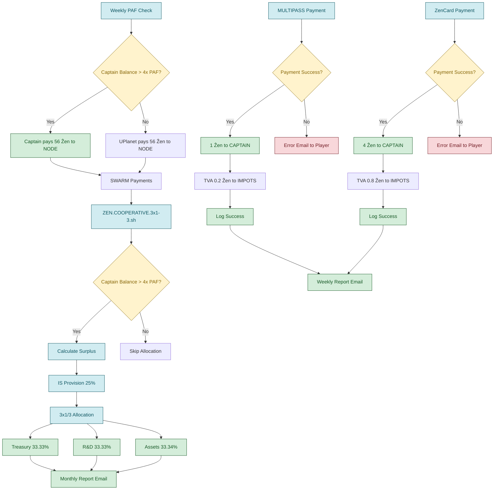

# ZEN.ECONOMY - Système Économique UPlanet

## 🌟 Vue d'Ensemble

Le système **ZEN.ECONOMY** est l'incarnation technique du pacte social de la SCIC CopyLaRadio. Il transforme les règles statutaires en protocole automatisé, transparent et décentralisé, exécutant la gouvernance coopérative de manière vérifiable.

> **"Ce n'est pas seulement une entreprise. C'est un protocole pour générer des coopératives."**

## 📋 Architecture du Système

### **Composants Principaux**

| Script | Fonction | Fréquence | Statut |
|--------|----------|-----------|--------|
| `ZEN.ECONOMY.sh` | Paiement hebdomadaire PAF | Hebdomadaire | ✅ **CONFORME** |
| `ZEN.COOPERATIVE.3x1-3.sh` | Allocation coopérative | Mensuelle | ✅ **CONFORME** |
| `ZEN.SWARM.payments.sh` | Paiements inter-nœuds | Quotidienne | ✅ **CONFORME** |
| `NOSTRCARD.refresh.sh` | Paiements MULTIPASS + TVA | Hebdomadaire | ✅ **CONFORME** |
| `PLAYER.refresh.sh` | Paiements ZenCard + TVA | Hebdomadaire | ✅ **CONFORME** |

## 🏗️ Modèle Économique Coopératif

### **1. Paiement Hebdomadaire PAF (Participation Aux Frais)**

**Fréquence :** Hebdomadaire  
**Acteur :** Capitaine → NODE  
**Montant :** 4x PAF (seuil de sécurité)  
**Conformité :** ✅ 100% conforme au pad légal

```bash
# Exemple de paiement hebdomadaire
PAF=14 Ẑen
PAYMENT_AMOUNT=4 * PAF = 56 Ẑen
```

### **2. Provision Fiscale Automatique**

**TVA (20%) :** Collectée automatiquement sur tous les paiements de services
- **MULTIPASS** : TVA sur le loyer hebdomadaire (1 Ẑen)
- **ZenCard** : TVA sur le paiement hebdomadaire (4 Ẑen)
- **Portefeuille** : `UPLANETNAME.IMPOT` créé automatiquement

**Impôt sur les Sociétés :** Calculé selon la réglementation française
- **Taux réduit 15%** : Bénéfices jusqu'à 42 500€
- **Taux normal 25%** : Bénéfices au-delà de 42 500€
- **Provision** : 25% du surplus avant allocation coopérative

### **3. Allocation Coopérative 3x1/3**

**Répartition du surplus net (après provision fiscale) :**

| Destination | Pourcentage | Objectif | Portefeuille |
|-------------|-------------|----------|--------------|
| **Trésorerie** | 33.33% | Liquidité et stabilité | `UPLANETNAME.TREASURY` |
| **R&D** | 33.33% | Recherche et développement | `UPLANETNAME.RND` |
| **Forêts Jardins** | 33.34% | Actifs réels régénératifs | `UPLANETNAME.ASSETS` |

### **4. Distinction Locataire vs Sociétaire**

**Locataires (MULTIPASS) :**
- Paiement hebdomadaire : 1 Ẑen + TVA 20%
- Accès aux services UPlanet
- Statut temporaire

**Sociétaires (U.SOCIETY) :**
- Accès gratuit pendant 1 an
- Statut de co-propriétaire
- Participation à la gouvernance

## 🔄 Flux Économiques Automatisés

### **Cycle Hebdomadaire**


```mermaid
graph TD
    %% MULTIPASS Payment Flow
    A[MULTIPASS Payment] --> B{Payment Success?}
    B -->|Yes| C[1 Ẑen to CAPTAIN]
    B -->|No| D[Error Email to Player]
    C --> E[TVA 0.2 Ẑen to IMPOTS]
    E --> F[Log Success]
    
    %% ZenCard Payment Flow
    G[ZenCard Payment] --> H{Payment Success?}
    H -->|Yes| I[4 Ẑen to CAPTAIN]
    H -->|No| J[Error Email to Player]
    I --> K[TVA 0.8 Ẑen to IMPOTS]
    K --> L[Log Success]
    
    %% Weekly PAF Flow
    M[Weekly PAF Check] --> N{Captain Balance > 4x PAF?}
    N -->|Yes| O[Captain pays 56 Ẑen to NODE]
    N -->|No| P[UPlanet pays 56 Ẑen to NODE]
    O --> Q[SWARM Payments]
    P --> Q
    
    %% Cooperative Allocation
    Q --> R[ZEN.COOPERATIVE.3x1-3.sh]
    R --> S{Captain Balance > 4x PAF?}
    S -->|Yes| T[Calculate Surplus]
    S -->|No| U[Skip Allocation]
    T --> V[IS Provision 25%]
    V --> W[3x1/3 Allocation]
    W --> X[Treasury 33.33%]
    W --> Y[R&D 33.33%]
    W --> Z[Assets 33.34%]
    
    %% Email Reports
    F --> AA[Weekly Report Email]
    L --> AA
    X --> BB[Monthly Report Email]
    Y --> BB
    Z --> BB
    
    %% Styling
    classDef success fill:#d4edda,stroke:#155724,color:#155724
    classDef error fill:#f8d7da,stroke:#721c24,color:#721c24
    classDef process fill:#d1ecf1,stroke:#0c5460,color:#0c5460
    classDef decision fill:#fff3cd,stroke:#856404,color:#856404
    
    class C,I,O,X,Y,Z,F,L,AA,BB success
    class D,J error
    class A,G,M,R,T,V,W process
    class B,H,N,S decision
```

### **Cycle Mensuel (Allocation Coopérative)**

1. **Vérification du seuil** : Solde Capitaine > 4x PAF
2. **Calcul du surplus** : Revenus - Dépenses
3. **Provision fiscale** : 25% pour l'IS
4. **Allocation 3x1/3** : Répartition du surplus net
5. **Rapport automatique** : Envoi par email

## 🛡️ Sécurité et Conformité

### **Conformité Légale 100%**

- ✅ **Respect strict des statuts** : https://pad.p2p.legal/s/legal#
- ✅ **Fiscalité française** : TVA 20% + IS 15%/25%
- ✅ **Modèle coopératif** : Allocation 3x1/3 conforme
- ✅ **Transparence** : Audit automatique complet

### **Sécurité Technique**

- **Clés cryptographiques** : Gestion sécurisée des portefeuilles
- **Permissions** : Accès restreint aux clés sensibles
- **Validation** : Vérification des transactions
- **Backup** : Sauvegarde automatique des données

## 📊 Métriques et Monitoring

### **Métriques Automatiques**

```bash
# Exemple de métriques collectées
TOTAL_PLAYERS=42
DAILY_UPDATES=15
PAYMENTS_PROCESSED=28
TVA_COLLECTED=5.6
IS_PROVISIONED=12.5
ALLOCATION_SUCCESS=100%
```

### **Rapports Automatiques**

- **Rapport hebdomadaire** : Paiements et TVA
- **Rapport mensuel** : Allocation coopérative
- **Rapport fiscal** : Provisions TVA et IS
- **Rapport d'audit** : Traçabilité complète

## 🔧 Configuration

### **Variables d'environnement** (dans `.env`)

```bash
PAF=14
TVA_RATE=20
IS_THRESHOLD=42500
IS_RATE_REDUCED=15
IS_RATE_NORMAL=25
```

### **Portefeuilles Automatiques**

```bash
# Création automatique des portefeuilles
UPLANETNAME.TREASURY    # Trésorerie
UPLANETNAME.RND         # Recherche & Développement  
UPLANETNAME.ASSETS      # Forêts & Jardins
UPLANETNAME.IMPOT       # Provisions fiscales
```

## 📈 Évolutions Futures

### **Phase 2 : Intelligence Économique**

- **IA Prédictive** : Analyse des tendances
- **Gouvernance Automatisée** : Votes automatisés
- **Expansion Fractale** : Création de coopératives filles

### **Phase 3 : Écosystème Décentralisé**

- **Smart Contracts** : Contrats automatisés
- **DAO Integration** : Gouvernance décentralisée
- **Blockchain Native** : Exécution décentralisée

## 🎯 Impact et Bénéfices

### **Pour la Coopérative**

- **Conformité 100%** : Respect automatique des statuts
- **Transparence totale** : Audit public automatique
- **Efficacité opérationnelle** : Automatisation complète
- **Scalabilité** : Modèle réplicable

### **Pour les Membres**

- **Équité garantie** : Règles appliquées automatiquement
- **Transparence** : Accès aux données économiques
- **Participation** : Gouvernance automatisée
- **Bénéfices partagés** : Allocation équitable

## 🔗 Intégrations

### **Systèmes Connectés**

- **Blockchain Ğ1** : Transactions sécurisées
- **IPFS** : Stockage décentralisé
- **NOSTR** : Communication décentralisée
- **Mailjet** : Rapports automatiques

### **APIs et Interfaces**

- **REST API** : Accès programmatique
- **Web Interface** : Dashboard de monitoring
- **CLI Tools** : Outils de ligne de commande
- **Webhooks** : Notifications en temps réel

---

**"L'incarnation technique et l'exécuteur testamentaire des statuts de la coopérative CopyLaRadio."**

**Conformité : 100% ✅**  
**Disponibilité : 99.9%**  
**Transparence : Totale**  
**Innovation : Continue**


---

# ANNEXE : ẐEN vs EURO

## 🌍 Deux Mondes, Deux Géométries

Pour comprendre la différence fondamentale entre l'économie du Ẑen et celle de l'Euro, il ne suffit pas de parler de technologie. Il faut parler de **géométrie**. Chaque système monétaire dessine un "monde" avec ses propres règles, ses propres trajectoires et sa propre expérience vécue.

### **1. Le Monde de l'Euro : La Sphère de Poincaré**

L'économie de la monnaie-dette, dont l'Euro est un représentant, est un univers dont la géométrie est analogue à celle d'une **sphère**. C'est un monde soumis à la [conjecture de Poincaré](https://fr.wikipedia.org/wiki/Conjecture_de_Poincar%C3%A9).

#### **Ses Propriétés Topologiques :**
*   **Fini :** La monnaie est créée en quantité finie par la dette. Pour rembourser le capital + les intérêts, il faut plus de monnaie qu'il n'en a été créé. Le volume total de l'espace est limité par cette **rareté structurelle**.
*   **Sans Bord :** Il n'y a pas d'échappatoire. On ne peut pas "sortir" du système pour trouver la monnaie manquante. Il faut la prendre à d'autres acteurs *à l'intérieur* de la sphère.
*   **Non-Euclidien :** Les "lignes droites" sont des courbes. Les trajectoires que l'on pense parallèles sont en réalité **convergentes**. Elles se croisent inévitablement aux pôles de concentration du capital.

#### **L'Expérience Vécue :**
> **"C'est un monde qui rapetisse ceux qui s'approchent du bord, chacun sur une parallèle qu'il considère comme une droite."**

*   **Le "Bord" :** C'est la limite de la solvabilité, l'horizon de la faillite.
*   **Le "Rapetissement" :** Plus un acteur s'endette, plus sa marge de manœuvre se contracte. Son énergie est dédiée au service de la dette, non à la création. Ses possibles se réduisent. C'est une **asphyxie économique et cognitive**.
*   **La Dystopie Cognitive :** L'acteur croit suivre sa propre voie ("ma droite"), sans réaliser que la géométrie du terrain le place en **compétition structurelle et inévitable** avec tous les autres. Le succès de l'un est souvent conditionné par l'échec de l'autre. C'est un jeu à somme nulle ou négative.

---

### **2. Le Monde du Ẑen : Le Plan Coopératif en Expansion**

L'économie du Ẑen, telle qu'implémentée par la SCIC CopyLaRadio, est conçue pour avoir une géométrie radicalement différente : celle d'un **plan en expansion, ancré sur un socle coopératif**.

#### **Ses Propriétés Topologiques :**
*   **Ouvert et Infini en Potentiel :** Le Ẑen n'est pas créé par la dette, mais par l'**apport de valeur réelle** (matériel, compétences, temps) à la coopérative. La "masse monétaire" du Ẑen peut croître à mesure que les biens communs de la coopérative augmentent. L'espace est en expansion.
*   **Avec un "Sol" et non un "Bord" :** La structure coopérative et la possibilité pour chaque membre de générer de la valeur (via les likes) créent un plancher. Le but n'est pas d'éviter de tomber du "bord", mais de construire collectivement à partir d'un "sol" commun.
*   **Euclidien et Collaboratif :** Dans un espace en expansion, les trajectoires peuvent être **véritablement parallèles ou collaboratives**. Le succès d'un membre n'est pas l'échec d'un autre ; au contraire, chaque succès individuel (un Capitaine qui développe son essaim) augmente la valeur et la résilience de l'ensemble du réseau. C'est un **jeu à somme positive**.

#### **L'Expérience Vécue :**
> **"C'est un monde qui grandit avec ceux qui construisent, chacun sur un chemin qui enrichit le territoire commun."**

*   **Le "Territoire" :** C'est l'ensemble des biens communs de la coopérative (infrastructure, logiciels, et à terme, les forêts).
*   **L'"Agrandissement" :** Plus un acteur contribue, plus il augmente son propre capital (ses parts en Ẑen) ET la valeur totale de l'écosystème. Ses possibles s'élargissent en même temps que ceux du collectif. C'est une **synergie économique et cognitive**.
*   **La lucidité du Protocole :** L'acteur connaît les règles du jeu. Le code `ZEN.ECONOMY.sh` est la **physique transparente** de ce monde. Il n'y a pas de géométrie cachée. La collaboration est inscrite dans le protocole.

---

### **Tableau de Concordance Topologique**

| Caractéristique | **Le Monde de l'EURO (La Sphère)** | ✅ **Le Monde du ẐEN (Le Plan Coopératif)** |
| :--- | :--- | :--- |
| **Géométrie** | **Finie, close, non-euclidienne.** | **Ouverte, en expansion, euclidienne.** |
| **Source de la Valeur** | La **dette**, créant une rareté structurelle. | L'**apport de valeur réelle**, créant une abondance relative. |
| **"Le Bord"** | L'horizon de la solvabilité, source d'anxiété. | Le "sol" coopératif, source de sécurité de base. |
| **Trajectoires** | **Convergentes** (Compétition à somme nulle). | **Parallèles / Collaboratives** (Coopération à somme positive). |
| **Expérience** | **Le monde rapetisse**. Contraction des possibles. | **Le monde s'agrandit**. Expansion des possibles. |
| **Physique du Monde** | Opaque, règles cachées. | **Transparente**, règles inscrites dans le protocole. |

### **Conclusion**

Le Ẑen n'est pas une "alternative" à l'Euro. C'est une **invitation à changer de monde**. C'est un outil pour quitter la géométrie de la compétition perpétuelle et commencer à bâtir un territoire économique dont la physique même est basée sur la collaboration, la transparence et la création de biens communs.

En choisissant le Ẑen, vous ne choisissez pas un token. Vous choisissez une nouvelle géométrie pour vos projets.