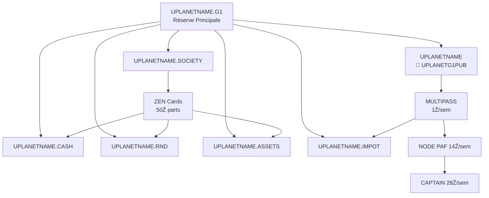

# **Flux ẐEN et Protection Anti-Intrusion UPlanet**

## **🏗️ Architecture des Portefeuilles**



## **🔒 Sources Primales Autorisées**

| Portefeuille | Source Autorisée | Script de Contrôle |
|--------------|------------------|---------------------|
| **UPLANETNAME** | `UPLANETNAME.G1` | `ZEN.ECONOMY.sh` |
| **UPLANETNAME.SOCIETY** | `UPLANETNAME.G1` | `ZEN.ECONOMY.sh` |
| **UPLANETNAME.CASH** | `UPLANETNAME.G1` | `ZEN.ECONOMY.sh` |
| **UPLANETNAME.RND** | `UPLANETNAME.G1` | `ZEN.ECONOMY.sh` |
| **UPLANETNAME.ASSETS** | `UPLANETNAME.G1` | `ZEN.ECONOMY.sh` |
| **UPLANETNAME.IMPOT** | `UPLANETNAME.G1` | `ZEN.ECONOMY.sh` |
| **MULTIPASS Users** | `UPLANETNAME` | `NOSTRCARD.refresh.sh` |
| **ZEN Cards** | `UPLANETNAME.SOCIETY` | `G1PalPay.sh` |

## **🛡️ Politique Anti-Intrusion**

### **Principe**
Seule la **première intrusion** est renvoyée à l'expéditeur. Toutes les **autres intrusions** sont redirigées vers `UPLANETNAME.G1`.

### **Logique d'Application**

#### **1ère Intrusion**
- **Action** : REFUND vers expéditeur
- **Message** : "Versements Ğ1 doivent être faits vers UPLANETNAME.G1 uniquement"
- **Email** : `wallet_alert.html`
- **Objectif** : Éducation

#### **2+ Intrusions**
- **Action** : REDIRECTION vers `UPLANETNAME.G1`
- **Message** : "Fonds intrusifs récupérés par la coopérative"
- **Email** : `wallet_redirection.html`
- **Objectif** : Récupération des fonds

### **Code d'Implémentation**
```bash
if [[ $current_total -eq 0 ]]; then
    # Première intrusion : REFUND
    PAYforSURE.sh "${wallet}" "${amount}" "${sender}" "PRIMAL:INTRUSION:REFUND"
    send_alert_email "${email}" "${wallet}" "${sender}" "${amount}" "${primal}" "1" "intrusion"
else
    # Intrusions suivantes : REDIRECTION
    PAYforSURE.sh "${wallet}" "${amount}" "${UPLANETG1PUB}" "INTRUSION:REDIRECT:UPLANETNAME.G1"
    send_alert_email "${email}" "${wallet}" "${sender}" "${amount}" "${primal}" "$total" "redirection"
fi
```

## **⚙️ Contrôle Automatique**

### **Portefeuilles Coopératifs** (`ZEN.ECONOMY.sh`)
```bash
declare -A COOPERATIVE_WALLETS=(
    ["UPLANETNAME"]="$HOME/.zen/game/uplanet.dunikey"
    ["UPLANETNAME.SOCIETY"]="$HOME/.zen/game/uplanet.SOCIETY.dunikey"
    ["UPLANETNAME.CASH"]="$HOME/.zen/game/uplanet.CASH.dunikey"
    ["UPLANETNAME.RND"]="$HOME/.zen/game/uplanet.RnD.dunikey"
    ["UPLANETNAME.ASSETS"]="$HOME/.zen/game/uplanet.ASSETS.dunikey"
    ["UPLANETNAME.IMPOT"]="$HOME/.zen/game/uplanet.IMPOT.dunikey"
)

for wallet_name in "${!COOPERATIVE_WALLETS[@]}"; do
    primal_wallet_control.sh "${COOPERATIVE_WALLETS[$wallet_name]}" "$UPLANETG1PUB" "$ADMIN_EMAIL"
done
```

### **MULTIPASS** (`NOSTRCARD.refresh.sh`)
```bash
primal_wallet_control.sh "${HOME}/.zen/game/nostr/${PLAYER}/.secret.dunikey" "${G1PUBNOSTR}" "${UPLANETG1PUB}" "${PLAYER}"
```

### **ZEN Cards** (`G1PalPay.sh`)
```bash
primal_wallet_control.sh "${HOME}/.zen/game/players/${PLAYER}/secret.dunikey" "${G1PUB}" "${UPLANETNAME_SOCIETY}" "${PLAYER}"
```

## **📊 Flux Économiques**

### **Revenus Hebdomadaires**
- **MULTIPASS** : 1Ẑ/sem × N utilisateurs → `UPLANETNAME`
- **ZEN Cards** : 50Ẑ parts sociales → `UPLANETNAME.SOCIETY` → 3x1/3

### **Coûts Hebdomadaires**
- **PAF NODE** : 14Ẑ/sem (CAPTAIN → NODE)
- **CAPTAIN** : 28Ẑ/sem (UPLANETNAME → CAPTAIN)
- **TVA** : 20% revenus → `UPLANETNAME.IMPOT`

### **Répartition Coopérative**
```
Surplus → UPLANETNAME.CASH (33.33%)
       → UPLANETNAME.RND (33.33%)
       → UPLANETNAME.ASSETS (33.34%)
```

## **💰 Impact Économique**

### **Récupération des Fonds**
- **1ère intrusion** : 0€ (refund éducatif)
- **Intrusions 2+** : 100% → `UPLANETNAME.G1`

### **Exemple**
```
5 intrusions × 10 Ğ1 :
- Intrusion #1 : 10 Ğ1 → REFUND
- Intrusions #2-5 : 40 Ğ1 → UPLANETNAME.G1
- Bénéfice coopérative : 40 Ğ1
```

## **📧 Communication**

### **Messages Systématiques**
> "💡 INFO: Versements Ğ1 doivent être faits vers UPLANETNAME.G1 uniquement"

### **Templates Email**
- **`wallet_alert.html`** : Première intrusion (éducation)
- **`wallet_redirection.html`** : Intrusions répétitives (redirection)

## **✅ Avantages**

### **Utilisateurs**
- Comptes préservés (jamais détruits)
- Services maintenus en continu
- Messages éducatifs clairs

### **Coopérative**
- Fonds intrusifs récupérés
- Conformité réglementaire renforcée
- Traçabilité complète des flux

### **Sécurité**
- Protection primal sur tous les portefeuilles
- Surveillance continue sans interruption
- Pureté comptable garantie

---

**🔒 Protection intelligente et non-destructive des flux ẐEN UPlanet**