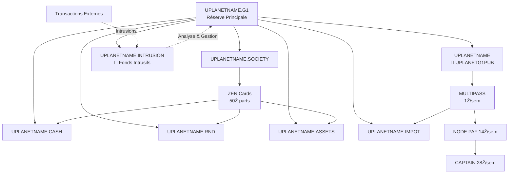

# **Flux ẐEN et Protection Anti-Intrusion UPlanet**

## **🏗️ Architecture des Portefeuilles**



## **🔒 Sources Primales Autorisées**

| Portefeuille | Source Autorisée | Script de Contrôle |
|--------------|------------------|---------------------|
| **UPLANETNAME** | `UPLANETNAME.G1` | `ZEN.ECONOMY.sh` |
| **UPLANETNAME.SOCIETY** | `UPLANETNAME.G1` | `ZEN.ECONOMY.sh` |
| **UPLANETNAME.CASH** | `UPLANETNAME.G1` | `ZEN.ECONOMY.sh` |
| **UPLANETNAME.RND** | `UPLANETNAME.G1` | `ZEN.ECONOMY.sh` |
| **UPLANETNAME.ASSETS** | `UPLANETNAME.G1` | `ZEN.ECONOMY.sh` |
| **UPLANETNAME.IMPOT** | `UPLANETNAME.G1` | `ZEN.ECONOMY.sh` |
| **UPLANETNAME.INTRUSION** | `UPLANETNAME.G1` | `UPLANET.init.sh` |
| **MULTIPASS Users** | `UPLANETNAME` | `NOSTRCARD.refresh.sh` |
| **ZEN Cards** | `UPLANETNAME.SOCIETY` | `G1PalPay.sh` |

## **🛡️ Politique Anti-Intrusion**

### **Principe**
**TOUTES les intrusions** sont automatiquement redirigées vers `UPLANETNAME.INTRUSION` pour centraliser la gestion des fonds intrusifs. Le portefeuille INTRUSION est créé automatiquement s'il n'existe pas.

### **Logique d'Application**

#### **Toutes les Intrusions**
- **Action** : REDIRECTION vers `UPLANETNAME.INTRUSION`
- **Message** : "Versements Ğ1 doivent être faits vers UPLANETNAME_G1 uniquement"
- **Email** : `wallet_redirection.html`
- **Objectif** : Centralisation et analyse des fonds intrusifs
- **Création automatique** : Le portefeuille INTRUSION est créé s'il n'existe pas

### **Code d'Implémentation**
```bash
# Toutes les intrusions : REDIRECTION vers UPLANETNAME.INTRUSION
# Création automatique du portefeuille si nécessaire
if ! create_intrusion_wallet; then
    echo "ERROR: Cannot create INTRUSION wallet, aborting intrusion handling"
    continue
fi

# Récupération de la clé publique INTRUSION
intrusion_pubkey=$(cat "$HOME/.zen/game/uplanet.INTRUSION.dunikey" | grep 'pub:' | cut -d ' ' -f 2 2>/dev/null)

# Redirection vers UPLANETNAME.INTRUSION
PAYforSURE.sh "${wallet}" "${amount}" "${intrusion_pubkey}" "INTRUSION:REDIRECT:UPLANETNAME.INTRUSION:${sender:0:8}"
send_alert_email "${email}" "${wallet}" "${sender}" "${amount}" "${primal}" "$total" "redirection"
```

## **⚙️ Contrôle Automatique**

### **Portefeuilles Coopératifs** (`ZEN.ECONOMY.sh`)
```bash
declare -A COOPERATIVE_WALLETS=(
    ["UPLANETNAME"]="$HOME/.zen/game/uplanet.dunikey"
    ["UPLANETNAME.SOCIETY"]="$HOME/.zen/game/uplanet.SOCIETY.dunikey"
    ["UPLANETNAME.CASH"]="$HOME/.zen/game/uplanet.CASH.dunikey"
    ["UPLANETNAME.RND"]="$HOME/.zen/game/uplanet.RnD.dunikey"
    ["UPLANETNAME.ASSETS"]="$HOME/.zen/game/uplanet.ASSETS.dunikey"
    ["UPLANETNAME.IMPOT"]="$HOME/.zen/game/uplanet.IMPOT.dunikey"
    ["UPLANETNAME.INTRUSION"]="$HOME/.zen/game/uplanet.INTRUSION.dunikey"
)

for wallet_name in "${!COOPERATIVE_WALLETS[@]}"; do
    primal_wallet_control.sh "${COOPERATIVE_WALLETS[$wallet_name]}" "$UPLANETG1PUB" "$ADMIN_EMAIL"
done
```

### **MULTIPASS** (`NOSTRCARD.refresh.sh`)
```bash
primal_wallet_control.sh "${HOME}/.zen/game/nostr/${PLAYER}/.secret.dunikey" "${G1PUBNOSTR}" "${UPLANETG1PUB}" "${PLAYER}"
```

### **ZEN Cards** (`G1PalPay.sh`)
```bash
primal_wallet_control.sh "${HOME}/.zen/game/players/${PLAYER}/secret.dunikey" "${G1PUB}" "${UPLANETNAME_SOCIETY}" "${PLAYER}"
```

## **📊 Flux Économiques**

### **Revenus Hebdomadaires**
- **MULTIPASS** : 1Ẑ/sem × N utilisateurs → `UPLANETNAME`
- **ZEN Cards** : 50Ẑ parts sociales → `UPLANETNAME.SOCIETY` → 3x1/3

### **Coûts Hebdomadaires**
- **PAF NODE** : 14Ẑ/sem (CAPTAIN → NODE)
- **CAPTAIN** : 28Ẑ/sem (UPLANETNAME → CAPTAIN)
- **TVA** : 20% revenus → `UPLANETNAME.IMPOT`

### **Répartition Coopérative**
```
Surplus → UPLANETNAME.CASH (33.33%)
       → UPLANETNAME.RND (33.33%)
       → UPLANETNAME.ASSETS (33.34%)
```

## **💰 Impact Économique**

### **Centralisation des Fonds**
- **Toutes les intrusions** : 100% → `UPLANETNAME.INTRUSION`
- **Gestion centralisée** : Analyse et traitement des fonds intrusifs
- **Traçabilité complète** : Tous les fonds intrusifs dans un seul portefeuille

### **Exemple**
```
5 intrusions × 10 Ğ1 :
- Toutes les intrusions : 50 Ğ1 → UPLANETNAME.INTRUSION
- Centralisation : 50 Ğ1 disponibles pour analyse
- Gestion : Décision coopérative sur l'utilisation des fonds
```

## **📧 Communication**

### **Messages Systématiques**
> "💡 INFO: Versements Ğ1 doivent être faits vers UPLANETNAME_G1 uniquement"
> "💰 Fonds intrusifs centralisés dans le portefeuille INTRUSION"

### **Templates Email**
- **`wallet_redirection.html`** : Toutes les intrusions (redirection vers INTRUSION)

## **✅ Avantages**

### **Utilisateurs**
- Comptes préservés (jamais détruits)
- Services maintenus en continu
- Messages éducatifs clairs

### **Coopérative**
- Fonds intrusifs centralisés dans UPLANETNAME.INTRUSION
- Gestion et analyse facilitées des intrusions
- Conformité réglementaire renforcée
- Traçabilité complète des flux
- Décisions éclairées sur l'utilisation des fonds

### **Sécurité**
- Protection primal sur tous les portefeuilles (y compris INTRUSION)
- Surveillance continue sans interruption
- Pureté comptable garantie
- Création automatique du portefeuille INTRUSION
- Centralisation sécurisée des fonds intrusifs

---

**🔒 Protection intelligente et centralisée des flux ẐEN UPlanet**