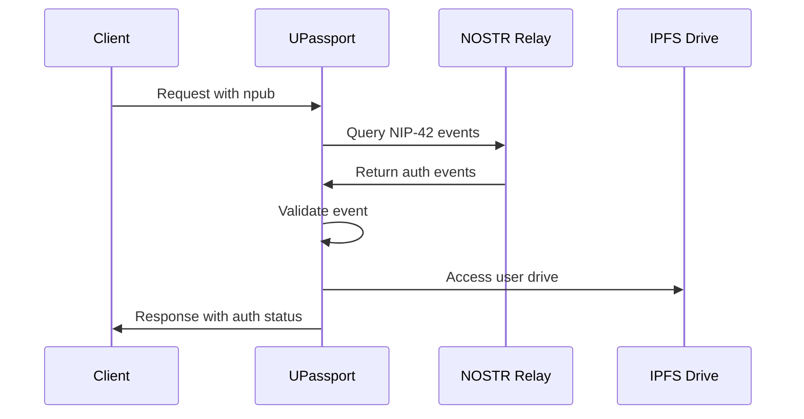

# UPassport API Documentation

## Overview

UPassport is a comprehensive digital identity and file management system integrated into Astroport.ONE. It provides a secure API (port 54321) for managing digital identities, uploading files to IPFS, and interacting with the NOSTR network.

## Table of Contents

1. [Installation & Setup](#installation--setup)
2. [Core Features](#core-features)
3. [API Endpoints](#api-endpoints)
4. [Authentication](#authentication)
5. [File Management](#file-management)
6. [NOSTR Integration](#nostr-integration)
7. [Security & Rate Limiting](#security--rate-limiting)
8. [Examples](#examples)
9. [Troubleshooting](#troubleshooting)

---

## Installation & Setup

### Automatic Installation

UPassport is automatically installed during Astroport.ONE setup:

```bash
# Installation via Astroport.ONE
~/.zen/Astroport.ONE/install_upassport.sh

# Manual installation
git clone https://github.com/papiche/UPassport.git ~/.zen/UPassport
cd ~/.zen/UPassport
pip install -U -r requirements.txt
./setup_systemd.sh
```

### Configuration

Create `.env` file in UPassport directory:

```bash
# .env configuration
myDUNITER="https://g1.cgeek.fr"
myCESIUM="https://g1.data.e-is.pro"
OBSkey="null"
```

### Service Management

```bash
# Start UPassport service
sudo systemctl start upassport

# Enable auto-start
sudo systemctl enable upassport

# Check status
sudo systemctl status upassport

# View logs
sudo journalctl -u upassport -f
```

---

## Core Features

### 🆔 Digital Identity Management
- **NOSTR Cards**: Create and manage NOSTR identities
- **QR Code Scanning**: Scan QR codes for identity verification
- **G1 Integration**: Link identities with Ğ1 cryptocurrency
- **Geolocation**: Associate identities with geographic coordinates

### 📁 IPFS File Management
- **Structured Storage**: Automatic file organization (Images, Music, Videos, Documents)
- **Twin-Key Security**: Files linked to NOSTR identities
- **IPFS Integration**: Decentralized storage with CID generation
- **Drive Synchronization**: Sync files between IPFS and local storage

### 🔐 Authentication System
- **NIP-42 Authentication**: Secure NOSTR-based authentication
- **Rate Limiting**: Protection against abuse
- **Trusted IP Management**: Whitelist for trusted networks
- **Session Management**: Secure session handling

---

## API Endpoints

### Base URL
```
http://localhost:54321
```

### Core Endpoints

#### 1. Main Interface
```http
GET /
```
**Description**: Main UPassport interface with QR scanning capabilities

#### 2. NOSTR Management
```http
GET /nostr
```
**Description**: NOSTR Card management interface

#### 3. Blog Interface
```http
GET /blog
```
**Description**: NOSTR blog interface

#### 4. G1 Integration
```http
GET /g1
```
**Description**: Ğ1 cryptocurrency integration interface

### File Management API

#### 1. Upload File to IPFS
```http
POST /api/upload
```

**Headers**:
```
Content-Type: multipart/form-data
```

**Parameters**:
- `file`: File to upload (required)
- `npub`: NOSTR public key for authentication (required)

**Response**:
```json
{
  "success": true,
  "message": "File uploaded successfully",
  "file_path": "Images/photo.jpg",
  "file_type": "image",
  "target_directory": "Images",
  "new_cid": "QmHash...",
  "timestamp": "2024-01-01T12:00:00Z",
  "auth_verified": true
}
```

#### 2. Upload from IPFS Drive
```http
POST /api/upload_from_drive
```

**Body**:
```json
{
  "ipfs_link": "QmHash/filename.ext",
  "npub": "npub1..."
}
```

**Response**:
```json
{
  "success": true,
  "message": "File synchronized successfully from IPFS",
  "file_path": "Videos/video.mp4",
  "file_type": "video",
  "new_cid": "QmHash...",
  "timestamp": "2024-01-01T12:00:00Z",
  "auth_verified": true
}
```

#### 3. Delete File
```http
POST /api/delete
```

**Body**:
```json
{
  "file_path": "Images/photo.jpg",
  "npub": "npub1..."
}
```

**Response**:
```json
{
  "success": true,
  "message": "File deleted successfully (authenticated NOSTR)",
  "deleted_file": "Images/photo.jpg",
  "new_cid": "QmHash...",
  "timestamp": "2024-01-01T12:00:00Z",
  "auth_verified": true
}
```

### Identity Management

#### 1. Create G1/NOSTR Identity
```http
POST /g1nostr
```

**Parameters**:
- `email`: User email (required)
- `lang`: Language code (required)
- `lat`: Latitude (required)
- `lon`: Longitude (required)
- `salt`: Random salt (optional, auto-generated)
- `pepper`: Random pepper (optional, auto-generated)

**Response**: HTML file with identity information

#### 2. UPassport QR Processing
```http
POST /upassport
```

**Parameters**:
- `parametre`: QR code data or identifier
- `imageData`: Base64 image data or PIN
- `zlat`: Latitude
- `zlon`: Longitude

**Response**: HTML file with processed identity

#### 3. SSSS Key Verification
```http
POST /ssss
```

**Parameters**:
- `cardns`: Card namespace
- `ssss`: SSSS key
- `zerocard`: Zero card data

**Response**: Verification result file

### Utility Endpoints

#### 1. Health Check
```http
GET /health
```

**Response**:
```json
{
  "status": "healthy",
  "timestamp": "2024-01-01T12:00:00Z",
  "rate_limiter_stats": {
    "active_ips": 5,
    "rate_limit": 12,
    "window_seconds": 60
  }
}
```

#### 2. Rate Limit Status
```http
GET /rate-limit-status
```

**Response**:
```json
{
  "client_ip": "192.168.1.100",
  "remaining_requests": 8,
  "rate_limit": 12,
  "window_seconds": 60,
  "reset_time": 1704110400,
  "reset_time_iso": "2024-01-01T12:00:00Z",
  "is_blocked": false
}
```

#### 3. NOSTR Authentication Test
```http
POST /api/test-nostr
```

**Parameters**:
- `npub`: NOSTR public key to test

**Response**:
```json
{
  "input_key": "npub1...",
  "input_format": "npub",
  "hex_pubkey": "abcdef...",
  "relay_url": "ws://127.0.0.1:7777",
  "relay_connected": true,
  "auth_verified": true,
  "timestamp": "2024-01-01T12:00:00Z",
  "checks": {
    "key_format_valid": true,
    "hex_conversion_success": true,
    "relay_connection": true,
    "nip42_events_found": true
  },
  "message": "✅ Authentification NOSTR réussie",
  "status": "success"
}
```

---

## Authentication

### NIP-42 Authentication

UPassport uses NIP-42 for secure authentication:

1. **Client Authentication**: User signs NIP-42 event with their NOSTR key
2. **Event Verification**: Server verifies event on local NOSTR relay
3. **Session Validation**: Authentication valid for 24 hours

### Authentication Flow



### Required Authentication

The following endpoints require NOSTR authentication:
- `/api/upload`
- `/api/upload_from_drive`
- `/api/delete`

### Authentication Headers

```http
Content-Type: multipart/form-data
# Include npub parameter in form data
```

---

## File Management

### File Organization

Files are automatically organized into directories based on type:

| File Type | Directory | Extensions |
|-----------|-----------|------------|
| Images | `Images/` | jpg, png, gif, webp, svg, etc. |
| Music | `Music/` | mp3, wav, ogg, flac, etc. |
| Videos | `Videos/` | mp4, avi, mov, webm, etc. |
| Documents | `Documents/` | pdf, doc, txt, zip, etc. |

### File Type Detection

The system detects file types using:
1. **Content Analysis**: Magic bytes detection
2. **Extension Mapping**: File extension analysis
3. **MIME Type**: HTTP content-type headers

### IPFS Integration

Each user has a personal IPFS drive:
```
~/.zen/game/nostr/{email}/APP/uDRIVE/
├── Images/
├── Music/
├── Videos/
├── Documents/
└── manifest.json
```

### File Security

- **Path Validation**: Prevents directory traversal attacks
- **Filename Sanitization**: Removes dangerous characters
- **Ownership Verification**: Files linked to NOSTR identity
- **Size Limits**: Configurable file size restrictions

---

## NOSTR Integration

### NOSTR Card Structure

```bash
~/.zen/game/nostr/{email}/
├── HEX                    # NOSTR public key (hex)
├── NPUB                   # NOSTR public key (bech32)
├── G1PUBNOSTR            # Ğ1 public key
├── .secret.nostr         # Private keys
├── GPS                   # Geolocation data
└── APP/uDRIVE/          # IPFS drive
```

### NOSTR Relay Configuration

UPassport connects to local NOSTR relay:
- **URL**: `ws://127.0.0.1:7777`
- **Protocol**: WebSocket
- **Authentication**: NIP-42 events
- **Event Types**: kind 22242 (authentication)

### Key Conversion

The system supports multiple key formats:
- **npub**: bech32 encoded public key
- **hex**: 64-character hexadecimal
- **nsec**: bech32 encoded private key

---

## Security & Rate Limiting

### Rate Limiting

- **Requests per minute**: 12
- **Time window**: 60 seconds
- **Trusted IPs**: Exempt from rate limiting
- **Cleanup interval**: 5 minutes

### Trusted IP Configuration

```python
TRUSTED_IPS = {
    "127.0.0.1",      # localhost
    "::1",            # localhost IPv6
    "192.168.1.1",    # Router
}

TRUSTED_IP_RANGES = [
    "10.99.99.0/24",  # Local network
]
```

### Security Features

- **Input Validation**: All inputs sanitized
- **Path Traversal Protection**: Prevents `../` attacks
- **File Type Validation**: MIME type checking
- **Authentication Required**: NOSTR auth for sensitive operations
- **Logging**: Comprehensive security logging

---

## Examples

### Python Client Example

```python
import requests
import json

# Upload file with NOSTR authentication
def upload_file(file_path, npub):
    url = "http://localhost:54321/api/upload"
    
    with open(file_path, 'rb') as f:
        files = {'file': f}
        data = {'npub': npub}
        
        response = requests.post(url, files=files, data=data)
        return response.json()

# Test NOSTR authentication
def test_auth(npub):
    url = "http://localhost:54321/api/test-nostr"
    data = {'npub': npub}
    
    response = requests.post(url, data=data)
    return response.json()

# Usage
npub = "npub1..."
result = upload_file("photo.jpg", npub)
print(f"File uploaded: {result['new_cid']}")
```

### JavaScript Client Example

```javascript
// Upload file with NOSTR authentication
async function uploadFile(file, npub) {
    const formData = new FormData();
    formData.append('file', file);
    formData.append('npub', npub);
    
    const response = await fetch('http://localhost:54321/api/upload', {
        method: 'POST',
        body: formData
    });
    
    return await response.json();
}

// Test NOSTR authentication
async function testAuth(npub) {
    const formData = new FormData();
    formData.append('npub', npub);
    
    const response = await fetch('http://localhost:54321/api/test-nostr', {
        method: 'POST',
        body: formData
    });
    
    return await response.json();
}

// Usage
const npub = "npub1...";
const file = document.getElementById('fileInput').files[0];
const result = await uploadFile(file, npub);
console.log(`File uploaded: ${result.new_cid}`);
```

### cURL Examples

```bash
# Upload file
curl -X POST http://localhost:54321/api/upload \
  -F "file=@photo.jpg" \
  -F "npub=npub1..."

# Test NOSTR authentication
curl -X POST http://localhost:54321/api/test-nostr \
  -F "npub=npub1..."

# Delete file
curl -X POST http://localhost:54321/api/delete \
  -H "Content-Type: application/json" \
  -d '{"file_path": "Images/photo.jpg", "npub": "npub1..."}'

# Health check
curl http://localhost:54321/health
```

---

## Troubleshooting

### Common Issues

#### 1. Authentication Failed
**Error**: `Nostr authentication failed or not provided`

**Solutions**:
- Verify NOSTR relay is running on port 7777
- Check NIP-42 event was sent within 24 hours
- Ensure npub format is correct
- Test authentication with `/api/test-nostr`

#### 2. Rate Limit Exceeded
**Error**: `Rate limit exceeded`

**Solutions**:
- Wait for rate limit window to reset
- Add IP to trusted IPs if local
- Reduce request frequency
- Check rate limit status with `/rate-limit-status`

#### 3. File Upload Failed
**Error**: `Failed to process file`

**Solutions**:
- Check file size limits
- Verify file type is supported
- Ensure user directory exists
- Check IPFS daemon is running

#### 4. NOSTR Relay Connection Failed
**Error**: `Connection to relay failed`

**Solutions**:
- Verify strfry relay is running
- Check WebSocket port 7777 is open
- Restart NOSTR relay service
- Check relay configuration

### Log Files

```bash
# UPassport logs
~/.zen/tmp/54321.log

# NOSTR relay logs
~/.zen/strfry/strfry.log

# System service logs
sudo journalctl -u upassport -f
```

### Debug Mode

Enable debug logging in UPassport:

```python
# In 54321.py
logging.basicConfig(level=logging.DEBUG)
```

### Health Checks

```bash
# Check UPassport service
curl http://localhost:54321/health

# Check NOSTR relay
curl http://localhost:7777

# Check IPFS daemon
ipfs swarm peers
```

---

## Integration with Astroport.ONE

### Automatic Installation

UPassport is automatically installed during Astroport.ONE setup:

```bash
# During Astroport.ONE installation
~/.zen/Astroport.ONE/install_upassport.sh
```

### Service Integration

UPassport integrates with other Astroport.ONE services:

- **NOSTR Relay**: Local relay on port 7777
- **IPFS**: File storage and CID generation
- **G1 Blockchain**: Identity and payment integration
- **Swarm Network**: Inter-node communication

### Configuration Files

```bash
# UPassport configuration
~/.zen/UPassport/.env

# Astroport.ONE integration
~/.zen/Astroport.ONE/tools/my.sh

# NOSTR relay configuration
~/.zen/strfry/strfry.conf
```

---

## API Reference Summary

| Endpoint | Method | Auth | Description |
|----------|--------|------|-------------|
| `/` | GET | No | Main interface |
| `/nostr` | GET | No | NOSTR management |
| `/g1` | GET | No | G1 integration |
| `/api/upload` | POST | Yes | Upload file |
| `/api/upload_from_drive` | POST | Yes | Sync from IPFS |
| `/api/delete` | POST | Yes | Delete file |
| `/api/test-nostr` | POST | No | Test authentication |
| `/health` | GET | No | Health check |
| `/rate-limit-status` | GET | No | Rate limit info |

---

*For more information, visit the [UPassport GitHub repository](https://github.com/papiche/UPassport) or consult the [Astroport.ONE documentation](ARCHITECTURE.md).* 