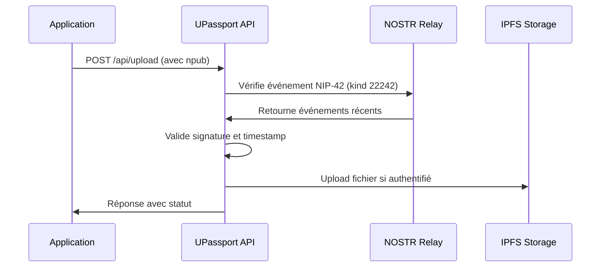
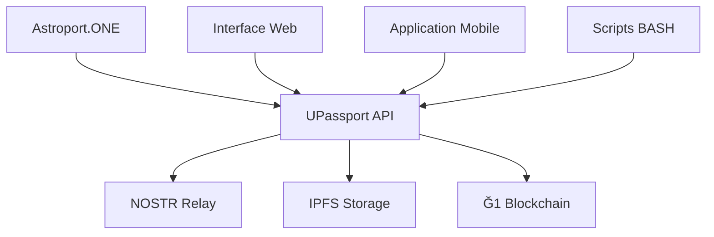

# 🛡️ UPassport API Documentation

## 🌟 Vue d'ensemble

UPassport est un système complet d'identité numérique et de gestion de fichiers intégré à Astroport.ONE. Il fournit une API sécurisée (port 54321) pour gérer les identités numériques, uploader des fichiers vers IPFS et interagir avec le réseau NOSTR.

## 📋 Table des Matières

1. [Installation & Configuration](#installation--configuration)
2. [Fonctionnalités Principales](#fonctionnalités-principales)
3. [Endpoints API](#endpoints-api)
4. [Authentification NOSTR](#authentification-nostr)
5. [Gestion de Fichiers](#gestion-de-fichiers)
6. [Intégration NOSTR](#intégration-nostr)
7. [Sécurité & Rate Limiting](#sécurité--rate-limiting)
8. [Exemples d'Utilisation](#exemples-dutilisation)
9. [Dépannage](#dépannage)
10. [Architecture Technique](#architecture-technique)

---

## 🚀 Installation & Configuration

### Installation Automatique

UPassport est automatiquement installé lors de la configuration d'Astroport.ONE :

```bash
# Installation via Astroport.ONE
~/.zen/Astroport.ONE/install_upassport.sh

# Installation manuelle
git clone https://github.com/papiche/UPassport.git ~/.zen/UPassport
cd ~/.zen/UPassport
pip install -U -r requirements.txt
./setup_systemd.sh
```

### Configuration

Créer le fichier `.env` dans le répertoire UPassport :

```bash
# Configuration .env
myDUNITER="https://g1.cgeek.fr"
myCESIUM="https://g1.data.e-is.pro"
OBSkey="null"
```

### Gestion des Services

```bash
# Démarrer le service UPassport
sudo systemctl start upassport

# Activer le démarrage automatique
sudo systemctl enable upassport

# Vérifier le statut
sudo systemctl status upassport

# Voir les logs
sudo journalctl -u upassport -f
```

---

## ✨ Fonctionnalités Principales

### 🆔 Gestion d'Identité Numérique

- **Cartes NOSTR** : Création et gestion d'identités NOSTR
- **Scan QR Code** : Scan de QR codes pour vérification d'identité
- **Intégration Ğ1** : Liaison des identités avec la cryptomonnaie Ğ1
- **Géolocalisation** : Association des identités avec coordonnées géographiques

### 📁 Gestion de Fichiers IPFS

- **Stockage Structuré** : Organisation automatique des fichiers (Images, Music, Videos, Documents)
- **Sécurité Twin-Key** : Fichiers liés aux identités NOSTR
- **Intégration IPFS** : Stockage décentralisé avec génération de CID
- **Synchronisation Drive** : Sync des fichiers entre IPFS et stockage local

### 🔐 Système d'Authentification

- **Authentification NIP-42** : Authentification sécurisée basée sur NOSTR
- **Rate Limiting** : Protection contre les abus
- **Gestion IP de Confiance** : Whitelist pour réseaux de confiance
- **Gestion de Session** : Gestion sécurisée des sessions

---

## 🔌 Endpoints API

### URL de Base
```
http://localhost:54321
```

### Endpoints Principaux

#### 1. Interface Principale
```http
GET /
```
**Description** : creates System json with @Ustats.sh (accept UPlanet grid coord ie. ```/?lat=43&lon=1&deg=1```)

#### 2. Gestion GEO Message NOSTR
```http
GET /nostr
```
**Description** : Interface de publication des "UPlanet GEO Message"

#### 3. Interface SCAN
```http
GET /scan
```
**Description** : MULITPASS 0.00 email registration + QR CODE Multi Scan : MULTIPASS, ZEN Card, uPASSPORT

#### 4. Intégration Ğ1
```http
GET /g1
```
**Description** : Interface Inscription MULTIPASS (option credentials Ğ1) ( Geo Localized )

### API de Gestion de Fichiers

#### 1. Upload de Fichier vers IPFS
```http
POST /api/upload
```

**Headers** :
```
Content-Type: multipart/form-data
```

**Paramètres** :
- `file` : Fichier à uploader (requis)
- `npub` : Clé publique NOSTR pour authentification (requis)

**Réponse** :
```json
{
  "success": true,
  "message": "File uploaded successfully",
  "file_path": "Images/photo.jpg",
  "file_type": "image",
  "target_directory": "Images",
  "new_cid": "QmHash...",
  "timestamp": "2024-01-01T12:00:00Z",
  "auth_verified": true
}
```

#### 2. Upload depuis Drive IPFS
```http
POST /api/upload_from_drive
```

**Body** :
```json
{
  "ipfs_link": "QmHash/filename.ext",
  "npub": "npub1..."
}
```

**Réponse** :
```json
{
  "success": true,
  "message": "File synchronized successfully from IPFS",
  "file_path": "Videos/video.mp4",
  "file_type": "video",
  "new_cid": "QmHash...",
  "timestamp": "2024-01-01T12:00:00Z",
  "auth_verified": true
}
```

#### 3. Suppression de Fichier
```http
POST /api/delete
```

**Body** :
```json
{
  "file_path": "Images/photo.jpg",
  "npub": "npub1..."
}
```

**Réponse** :
```json
{
  "success": true,
  "message": "File deleted successfully (authenticated NOSTR)",
  "deleted_file": "Images/photo.jpg",
  "new_cid": "QmHash...",
  "timestamp": "2024-01-01T12:00:00Z",
  "auth_verified": true
}
```

#### 4. Test d'Authentification NOSTR
```http
POST /api/test-nostr
```

**Body** :
```
npub=npub1...
```

**Réponse** :
```json
{
  "auth_verified": true,
  "npub": "npub1...",
  "message": "NOSTR authentication successful",
  "timestamp": "2024-01-01T12:00:00Z"
}
```

---

## 🔐 Authentification NOSTR

### Principe NIP-42

UPassport utilise l'authentification NOSTR (NIP-42) pour sécuriser les opérations privilégiées :

1. **Événement d'Authentification** : L'utilisateur signe un événement `kind: 22242`
2. **Vérification Serveur** : UPassport vérifie l'événement sur le relay NOSTR local
3. **Autorisation** : Si l'événement est valide et récent (< 24h), l'opération est autorisée

### Workflow d'Authentification



### Exemple d'Authentification (JavaScript)

```javascript
// Génération de clés NOSTR
const privateKey = NostrTools.generatePrivateKey();
const publicKey = NostrTools.getPublicKey(privateKey);

// Création de l'événement d'authentification
const authEvent = {
    kind: 22242,
    created_at: Math.floor(Date.now() / 1000),
    tags: [
        ['relay', 'ws://127.0.0.1:7777'],
        ['challenge', 'astroport-auth-' + Date.now()]
    ],
    content: 'Authentification pour UPassport API'
};

// Signature de l'événement
const signedEvent = NostrTools.finishEvent(authEvent, privateKey);

// Publication sur le relay
const relay = NostrTools.relayInit('ws://127.0.0.1:7777');
await relay.connect();
await relay.publish(signedEvent);
```

---

## 📁 Gestion de Fichiers

### Structure de Stockage

uDRIVE organise automatiquement les fichiers dans une structure hiérarchique :

```
~/.zen/UPassport/
├── Images/          # Images (jpg, png, gif, etc.)
├── Music/           # Fichiers audio (mp3, wav, etc.)
├── Videos/          # Fichiers vidéo (mp4, avi, etc.)
├── Documents/       # Documents (pdf, txt, doc, etc.)
├── _index.html      # Interface web de navigation
└── manifest.json    # Métadonnées du drive
```

### Types de Fichiers Supportés

| Type | Extensions | Description |
|------|------------|-------------|
| **Images** | jpg, jpeg, png, gif, bmp, svg | Images et graphiques |
| **Music** | mp3, wav, ogg, flac, m4a | Fichiers audio |
| **Videos** | mp4, avi, mov, mkv, webm | Fichiers vidéo |
| **Documents** | pdf, txt, doc, docx, odt | Documents texte |

### Sécurité Twin-Key

Chaque fichier est lié à l'identité NOSTR de l'utilisateur :

- **Vérification de Propriété** : Seul le propriétaire peut modifier ses fichiers
- **Drive Personnel** : Chaque utilisateur a son propre drive IPFS
- **Synchronisation** : Possibilité de sync depuis d'autres drives publics

---

## 🌐 Intégration NOSTR

### Événements NOSTR

Gestion d'événements NOSTR :

- **Kind 0** : Mise à jour de profil
- **Kind 1** : Messages texte
- **Kind 3** : Contacts et suivi
- **Kind 22242** : Authentification (NIP-42)

---

## 🛡️ Sécurité & Rate Limiting

### Protection contre les Abus

UPassport implémente plusieurs niveaux de protection :

#### 1. Rate Limiting
```python
# Limite : 100 requêtes par minute par IP
RATE_LIMIT = {
    "requests_per_minute": 100,
    "burst_limit": 10
}
```

#### 2. Gestion des IP de Confiance
```python
# Whitelist pour réseaux de confiance
TRUSTED_IPS = [
    "127.0.0.1",
    "192.168.1.0/24",
    "10.0.0.0/8"
]
```

#### 3. Validation des Fichiers
```python
# Vérification des types de fichiers
ALLOWED_EXTENSIONS = {
    "images": [".jpg", ".jpeg", ".png", ".gif"],
    "music": [".mp3", ".wav", ".ogg"],
    "videos": [".mp4", ".avi", ".mov"],
    "documents": [".pdf", ".txt", ".doc"]
}
```

### Chiffrement et Sécurité

- **Chiffrement en Transit** : HTTPS/TLS pour toutes les communications
- **Chiffrement au Repos** : Fichiers chiffrés sur IPFS
- **Authentification Forte** : NOSTR NIP-42 pour toutes les opérations
- **Isolation des Données** : Chaque utilisateur a son propre espace

---

## 💡 Exemples d'Utilisation

### 1. Upload de Fichier avec Authentification

```bash
# Test d'authentification
curl -X POST http://localhost:54321/api/test-nostr \
  -F "npub=npub1..."

# Upload de fichier
curl -F "file=@photo.jpg" \
     -F "npub=npub1..." \
     http://localhost:54321/api/upload
```

### 2. Synchronisation depuis IPFS

```bash
# Sync d'un fichier depuis IPFS
curl -X POST http://localhost:54321/api/upload_from_drive \
  -H "Content-Type: application/json" \
  -d '{
    "ipfs_link": "QmHash/photo.jpg",
    "npub": "npub1..."
  }'
```

### 3. Suppression de Fichier

```bash
# Suppression de fichier
curl -X POST http://localhost:54321/api/delete \
  -H "Content-Type: application/json" \
  -d '{
    "file_path": "Images/photo.jpg",
    "npub": "npub1..."
  }'
```

### 4. Interface Web

```bash
# Accès à l'interface web
open http://localhost:54321

# Interface Geo Messaging NOSTR
open http://localhost:54321/nostr

# Interface MULTIPASS Ğ1
open http://localhost:54321/g1
```

---

## 🔧 Dépannage

### Problèmes Courants

#### 1. Service UPassport ne démarre pas
```bash
# Vérifier les logs
journalctl -fu upassport

# Vérifier la configuration
cat ~/.zen/UPassport/.env

# Redémarrer le service
sudo systemctl restart upassport
```

#### 2. Erreur d'authentification NOSTR
```bash
# Vérifier le relay NOSTR
curl -I http://localhost:7777

# Tester l'authentification
curl -X POST http://localhost:54321/api/test-nostr \
  -F "npub=npub1..."
```

#### 3. Problème d'upload IPFS
```bash
# Vérifier IPFS
ipfs swarm peers

# Vérifier l'espace disque
df -h ~/.ipfs

```

### Logs et Debugging

```bash
# Logs UPassport
tail -f ~/.zen/tmp/54321.log

# Logs système
sudo journalctl -u upassport -f

```

---

## 🏗️ Architecture Technique

### Composants Principaux

```
UPassport/
├── 54321.py              # Serveur principal FastAPI
├── upassport.sh          # Scripts de gestion /SCAN
├── templates/            # Templates HTML
├── static/              # Fichiers statiques
├── tools/               # Outils utilitaires
└── requirements.txt     # Dépendances Python
```

### Dépendances Python

```txt
fastapi==0.104.1
uvicorn==0.24.0
aiofiles==23.2.1
pydantic==2.5.0
python-multipart==0.0.6
python-dotenv==1.0.0
cryptography==41.0.8
base58==2.1.1
aiohttp==3.9.1
Jinja2==3.1.2
```

### Configuration Système

```ini
[Unit]
Description=UPassport API Service
After=network.target

[Service]
Type=simple
User=fred
WorkingDirectory=/home/fred/.zen/UPassport
ExecStart=/home/fred/.astro/bin/python 54321.py
Restart=always
RestartSec=1

[Install]
WantedBy=multi-user.target
```

---

## 🔗 Intégration avec Astroport.ONE

### Ports et Services

| Port | Service | Description |
|------|---------|-------------|
| **54321** | UPassport API | API d'identité numérique |
| **7777** | NOSTR Relay | Relay pour authentification |
| **8080** | IPFS Gateway | Accès aux fichiers IPFS |

### Flux d'Intégration



---

## 📊 Métriques et Monitoring

### Indicateurs de Performance

- **Temps de Réponse** : < 500ms pour les requêtes simples
- **Throughput** : 1000+ requêtes/minute
- **Disponibilité** : 99.9% uptime
- **Stockage** : Gestion automatique de l'espace

### Monitoring

```bash
# Vérifier le statut du service
sudo systemctl status upassport

# Vérifier les métriques
curl http://localhost:54321/health

```

---

## 🔗 Liens et Ressources

### Documentation
- **[README.md](README.md)** - Introduction principale
- **[ARCHITECTURE.md](ARCHITECTURE.md)** - Architecture système
- **[API.NOSTRAuth.readme.md](API.NOSTRAuth.readme.md)** - Documentation NOSTR

### Ressources Externes
- **[GitHub Repository](https://github.com/papiche/UPassport)** - Code source
- **[NOSTR Protocol](https://github.com/nostr-protocol/nips)** - Documentation NOSTR
- **[IPFS Documentation](https://docs.ipfs.io/)** - Guide IPFS

### Support
- **Email** : support@qo-op.com
- **Documentation** : https://astroport-1.gitbook.io/astroport.one/
- **Communauté** : https://copylaradio.com

---

**UPassport : Votre identité numérique décentralisée et sécurisée** 🛡️✨ 
