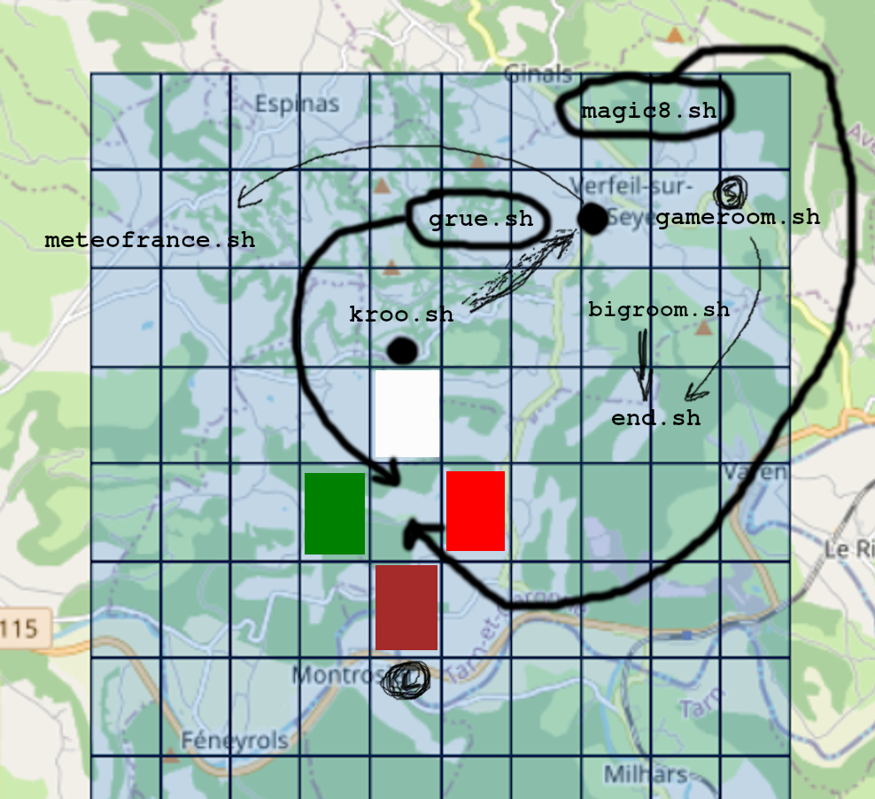

# BashVenture

> - ou tout jeu que vous créez avec -

est un simple ensemble de fichiers de script bash qui affichent des illustrations et du texte, attendent les données de l'utilisateur et agissent en conséquence. En général, le joueur se déplace sur une "carte" de fichiers scripts interconnectés, appelés salles, pour découvrir où il se trouve, ce qu'il doit faire et où il doit se rendre ensuite.

Les jeux peuvent également comporter une logique plus ou moins complexe, allant d'un simple ensemble d'interrupteurs et de leviers (comme dans la démo) jusqu'à un système complexe de décryptage ou de partage de secrets. Dans BashVenture, la logique est entièrement basée sur des fichiers - lorsque vous actionnez un interrupteur, par exemple, une entrée du fichier logique correspondant est modifiée. Cela signifie que les états logiques transcendent les salles et la mort du joueur - vous pouvez réinitialiser la logique quand vous le souhaitez, plutôt que de la lier à une salle ou à une zone spécifique, ou à la durée de vie si vous êtes le genre de joueur qui meurt souvent.

Le joueur se déplace dans le jeu en lançant des commandes. Les commandes par défaut sont aller vers le nord, le sud, l'est, l'ouest, utiliser et observer.

L'utilisateur décide de la marche à suivre en tapant respectivement n, s, e, w, u ou h. Vous pouvez personnaliser complètement le jeu en ajoutant vos propres commandes.

Il y a une introduction et plusieurs fin - et quelques méchants et choses qui peuvent vous tuer en cours de route. Je vous suggère fortement, avant de forker et d'essayer d'écrire votre propre jeu, de jouer à la démo et de vous faire une idée de la façon dont les mécanismes de jeu fonctionnent.

La magie d'un bon jeu d'aventure réside dans la narration ! Rédigez bien, testez souvent et ne compliquez pas trop les choses.

## Contenu du code ?

Il y a quatre types de fichiers dans ce projet, répartis dans leurs sous-répertoires respectifs :

### art

Tout le monde aime un peu d'art ASCII, n'est-ce pas ? Il y a quelques fichiers d'exemple avec des illustrations ici - mais si vous construisez un jeu vous-même et que vous voulez inclure plus d'illustrations, c'est l'endroit où il faut les mettre. Le titre est affiché dans chaque pièce, par souci de cohérence.

### rooms

Chaque "pièce" du jeu est stockée dans un fichier de pièce séparé. Il s'agit d'une pièce métaphorique - il peut s'agir d'une zone boisée, d'une grotte, de la lune, de la spaaaaaace, peu importe. Dans cette démo, il y a des pièces et des couloirs - les fichiers sont identiques. Tout est dans la formulation.

### script

Alors que les fichiers des salles contiennent la majorité des mots spéciaux de chaque salle, les fichiers de ce dossier contiennent des morceaux d'histoire plus longs et le texte d'introduction. Si vous souhaitez afficher de gros morceaux de texte provenant de fichiers dans votre jeu, c'est dans le dossier scripts qu'il faut les placer.

### logic

Ce qui fait d'une aventure en mode texte plus qu'un simple jeu de labyrinthe, c'est la logique. Vous pouvez placer des interrupteurs, demander aux utilisateurs de faire correspondre des mots ou de trouver des secrets. Vous pouvez en ajouter autant que vous le souhaitez !

---

SOURCE CODE : https://github.com/apetro/BashVenture/
