# ARCHITECTURE

## 🏗️ Architecture Astroport.ONE

### 📋 Table des Matières

1. Vue d'ensemble
2. Architecture Système
3. Composants Principaux
4. Flux de Données
5. Sécurité et Cryptographie
6. Économie et Paiements
7. Stockage et Cache
8. APIs et Services
9. Maintenance et Monitoring
10. Déploiement

***

### 🌟 Vue d'ensemble

Astroport.ONE est une plateforme décentralisée qui combine **monnaie libre (Ğ1)**, **stockage IPFS**, **identité numérique NOSTR** et **automatisation intelligente** pour créer un écosystème Web3 complet.

#### 🎯 Objectifs

* **Souveraineté Numérique** : Contrôle total des données utilisateur
* **Économie Libre** : Transactions sans intermédiaires via Ğ1
* **Identité Décentralisée** : Gestion d'identité basée sur NOSTR et IPFS
* **Résilience** : Architecture distribuée sans point de défaillance unique

***

### 🏗️ Architecture Système

#### Diagramme d'Architecture Générale

```
┌─────────────────────────────────────────────────────────────────┐
│                        Astroport.ONE                           │
│                    Écosystème Décentralisé                     │
└─────────────────────────────────────────────────────────────────┘
                                │
                ┌───────────────┼───────────────┐
                │               │               │
        ┌───────▼──────┐ ┌──────▼──────┐ ┌─────▼─────┐
        │   Interface  │ │   Services  │ │ Stockage  │
        │     Web      │ │   Métier    │ │Décentralisé│
        └──────────────┘ └─────────────┘ └───────────┘
                │               │               │
        ┌───────▼──────┐ ┌──────▼──────┐ ┌─────▼─────┐
        │   Port 1234  │ │  RUNTIME/   │ │   IPFS    │
        │  API Gateway │ │  Services   │ │  Storage  │
        └──────────────┘ └─────────────┘ └───────────┘
                │               │               │
        ┌───────▼──────┐ ┌──────▼──────┐ ┌─────▼─────┐
        │   Port 12345 │ │  ASTROBOT/  │ │  ~/.zen/  │
        │ Station Map  │ │ Automation  │ │   Cache   │
        └──────────────┘ └─────────────┘ └───────────┘
```

#### Architecture en Couches

| Couche           | Composants                | Description                       |
| ---------------- | ------------------------- | --------------------------------- |
| **Présentation** | Ports 1234, 12345, 54321  | Interfaces web et APIs            |
| **Application**  | API/, RUNTIME/, ASTROBOT/ | Services métier et automatisation |
| **Données**      | IPFS, \~/.zen/game/       | Stockage décentralisé et cache    |
| **Réseau**       | Ğ1, NOSTR, IPFS           | Protocoles de communication       |

***

### 🔧 Composants Principaux

#### 1. Scripts de Gestion Principaux

| Script                 | Taille | Port  | Rôle                            |
| ---------------------- | ------ | ----- | ------------------------------- |
| `command.sh`           | 51KB   | -     | Interface principale de gestion |
| `12345.sh`             | 10KB   | 1234  | Serveur API principal           |
| `_12345.sh`            | 23KB   | 12345 | Cartographie des stations       |
| `20h12.process.sh`     | 11KB   | -     | Maintenance quotidienne         |
| `NOSTRCARD.refresh.sh` | 34KB   | -     | Gestion des cartes NOSTR        |

#### 2. Services et Ports

| Port                 | Service      | Description                 | Protocole |
| -------------------- | ------------ | --------------------------- | --------- |
| **1234**             | API Gateway  | Point d'entrée principal    | HTTP      |
| **12345**            | Station Map  | Cartographie UPlanet        | HTTP      |
| **45780-90**         | API Response | Ports de réponse dynamiques | HTTP      |
| **33101**            | G1Billet     | Service de paiement Ğ1      | HTTP      |
| **54321**            | UPassport    | API d'identité numérique    | HTTP      |
| **8080, 4001, 5001** | IPFS Gateway | Accès stockage décentralisé | HTTP      |
| **7777**             | NOSTR Relay  | Réseau social décentralisé  | WebSocket |

#### 3. Structure des Répertoires

```
Astroport.ONE/
├── command.sh              # Interface principale
├── 12345.sh               # Serveur API
├── _12345.sh              # Cartographie stations
├── 20h12.process.sh       # Maintenance quotidienne
├── install.sh             # Installation automatique
├── tools/                 # Utilitaires système
│   ├── my.sh             # Bibliothèque de fonctions
│   ├── keygen            # Générateur de clés
│   └── heartbox_analysis.sh # Analyse système
├── API/                   # Endpoints spécialisés
│   ├── QRCODE.sh         # Gestion QR codes
│   ├── SALT.sh           # Authentification
│   └── UPLANET.sh        # Données UPlanet
├── RUNTIME/               # Services en arrière-plan
│   ├── G1PalPay.sh       # Surveillance Ğ1
│   ├── NOSTRCARD.refresh.sh # Cartes NOSTR
│   └── PLAYER.refresh.sh # Rafraîchissement joueurs
├── ASTROBOT/              # Automatisation
│   └── N1*.sh            # Commandes N1
├── templates/             # Templates HTML
└── docker/               # Configuration Docker
```

***

### 🔄 Flux de Données

#### 1. Flux de Requête API Typique

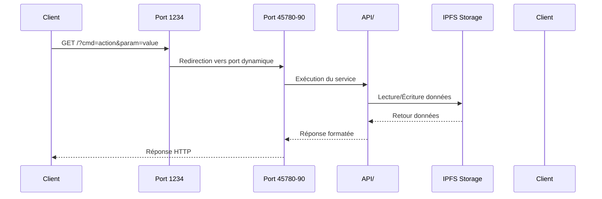

#### 2. Flux de Synchronisation Swarm

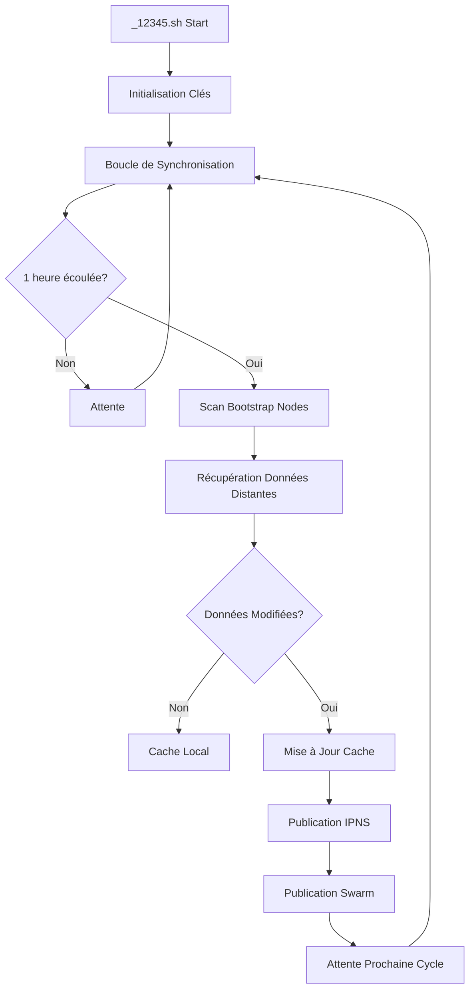

#### 3. Flux de Maintenance Quotidienne

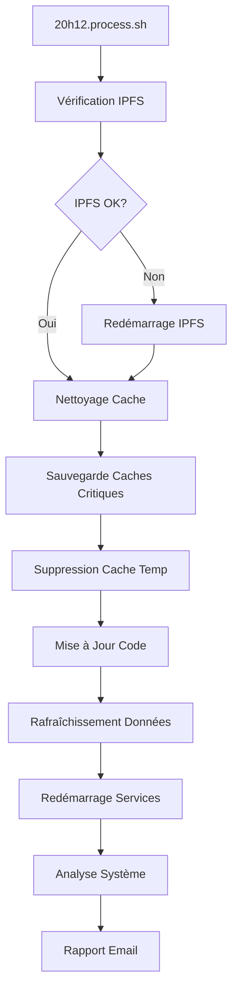

***

### 🔐 Sécurité et Cryptographie

#### 1. Gestion des Clés

| Type de Clé   | Format | Usage                     | Stockage                               |
| ------------- | ------ | ------------------------- | -------------------------------------- |
| **Dunikey**   | Ğ1     | Paiements et transactions | `~/.zen/game/players/*/secret.dunikey` |
| **IPFS Key**  | IPFS   | Identité décentralisée    | `~/.ipfs/keystore/`                    |
| **NOSTR Key** | NOSTR  | Réseau social             | `~/.zen/game/nostr/*/.secret.nostr`    |
| **SSSS Keys** | Shamir | Partage de secrets        | `~/.zen/game/nostr/*/.secret.disco`    |

#### 2. Validation des Transactions

```bash
# Vérification des transactions primaires
function validate_primal_transaction() {
    local g1pub="$1"
    local cache_file="~/.zen/tmp/coucou/${g1pub}.primal"
    
    if [[ ! -s "$cache_file" ]]; then
        # Récupération de l'historique
        silkaj_output=$(silkaj --endpoint "$BMAS_NODE" --json money history ${g1pub})
        g1prime=$(echo "$silkaj_output" | jq -r '.history[0].pubkey')
        
        # Cache du résultat
        [[ ! -z ${g1prime} ]] && echo "${g1prime}" > "$cache_file"
    fi
    
    return $(cat "$cache_file")
}
```

#### 3. Contrôle d'Intrusion

| Type d'Attaque                | Détection           | Action                     |
| ----------------------------- | ------------------- | -------------------------- |
| **Transaction Non-Autorisée** | Vérification primal | Remboursement automatique  |
| **Portefeuille Intrus**       | Validation source   | Alerte email + destruction |
| **Données Corrompues**        | Checksum IPFS       | Régénération depuis backup |
| **Relai Malveillant**         | Validation NOSTR    | Blacklist automatique      |

***

### 💰 Économie et Paiements

#### **Système Économique ZEN**

**Composants Économiques**

* **UPlanet** : "Banque centrale" coopérative
* **Node** : Serveur physique (PC Gamer ou RPi5)
* **Captain** : Gestionnaire du Node
* **Players** : Utilisateurs avec cartes NOSTR/ZEN

**Architecture Économique ZEN.ECONOMY.sh**

| **Acteur**    | **Rôle**        | **Balance**    | **Responsabilité**  |
| ------------- | --------------- | -------------- | ------------------- |
| **UPlanet**   | Banque centrale | `UPLANETG1PUB` | Gestion coopérative |
| **Node**      | Infrastructure  | `NODEG1PUB`    | Services réseau     |
| **Captain**   | Administrateur  | `CAPTAING1PUB` | Paiement PAF        |
| **Multipass** | Utilisateur     | `G1PUBNOSTR`   | Paiement PAF        |

**Coûts Hebdomadaires**

```bash
PAF=14        # Participation Aux Frais NODE (par semaine)
NCARD=1       # Coût carte NOSTR/semaine
ZCARD=4       # Coût carte ZEN/semaine
DAILYPAF=2    # PAF quotidien versé au NODE depuis le compte Capitaine (ou UPlanet)
```

**Logique de Paiement PAF**

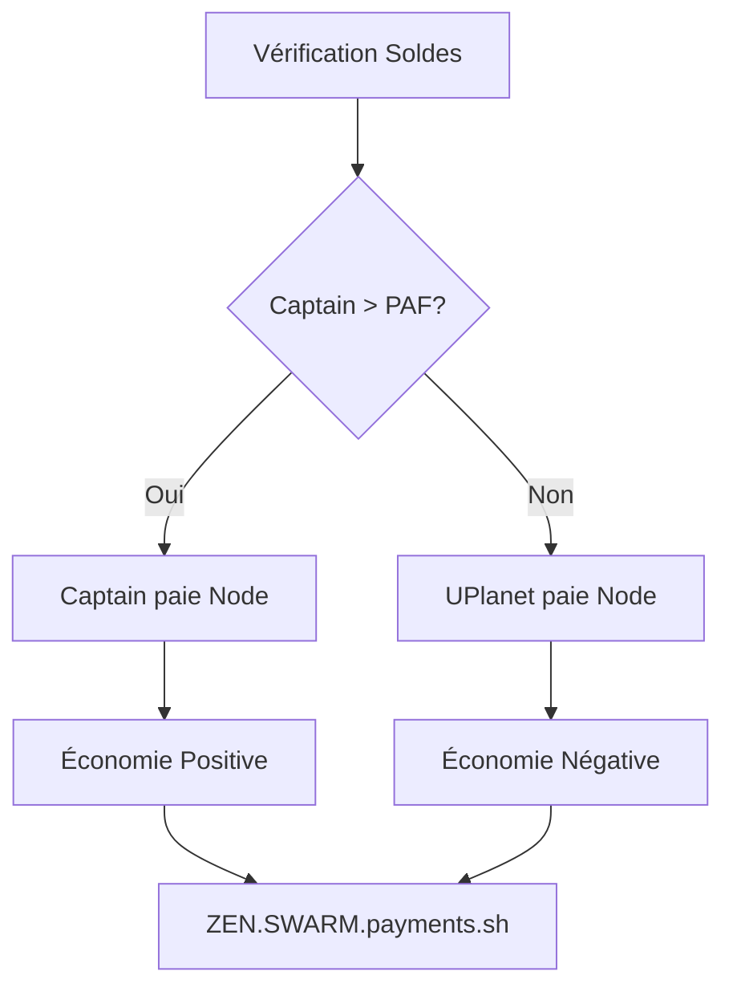

**Système de Réactions et Micro-paiements**

**Filtre Kind 7 (filter/7.sh)**

```bash
# Types de réactions
LIKE: "+", "👍", "❤️", "♥️"     # Paiement 0.1 Ğ1
DISLIKE: "-", "👎", "💔"        # Pas de paiement
CUSTOM: Autres emojis          # Pas de paiement
```

**Flux de Paiement Automatique**

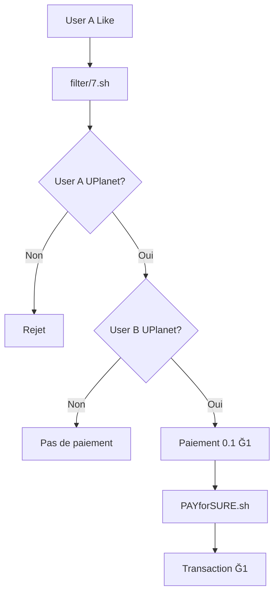

**Abonnements Inter-nodes (ZEN.SWARM.payments.sh)**

| **Type**     | **Coût** | **Fréquence** | **Source**     |
| ------------ | -------- | ------------- | -------------- |
| **Y Level**  | Variable | Hebdomadaire  | Node Wallet    |
| **Standard** | Variable | Hebdomadaire  | Captain Wallet |

```bash
# Calcul paiement hebdomadaire
WEEKLY_COST = NCARD + ZCARD  # Exemple: 1 + 4 = 5 Ẑen/semaine
WEEKLY_G1 = WEEKLY_COST / 10 # Conversion Ẑen → Ğ1
NEXT_PAYMENT = CURRENT_DATE + 7 days  # Échéance suivante
```

**Logique de Paiement Hebdomadaire**

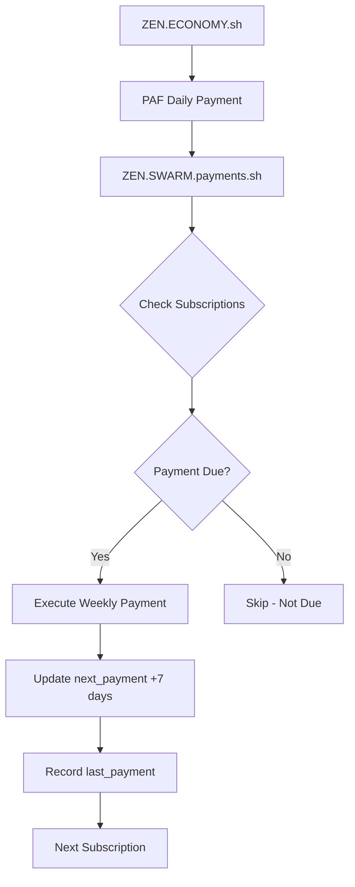

#### 1. Système de Paiement Ğ1

| Type de Paiement   | Montant | Fréquence    | Destinataire |
| ------------------ | ------- | ------------ | ------------ |
| **MULTIPASS**      | 1 Ẑen   | Hebdomadaire | Captain      |
| **ZENCARD**        | 4 Ẑen   | Hebdomadaire | Captain      |
| **NOSTR Card**     | 1 Ẑen   | Hebdomadaire | Captain      |
| **UPlanet ORIGIN** | 0.1 Ğ1  | Quotidien    | UPlanet      |

#### 2. Calcul des Soldes

```bash
# Conversion Ğ1 vers Ẑen
COINS=$(${MY_PATH}/../tools/COINScheck.sh ${G1PUB} | tail -n 1)
if [[ -n "$COINS" && "$COINS" != "null" ]]; then
    ZEN=$(echo "($COINS - 1) * 10" | bc | cut -d '.' -f 1)
else
    ZEN=-10
fi
```

#### 3. Automatisation des Paiements

```bash
# Cycle de paiement hebdomadaire
if [ $((DIFF_DAYS % 7)) -eq 0 ]; then
    if [[ $(echo "$COINS > 1" | bc -l) -eq 1 ]]; then
        # Paiement automatique
        ${MY_PATH}/../tools/PAYforSURE.sh \
            "$HOME/.zen/tmp/${MOATS}/nostr.${PLAYER}.dunikey" \
            "$Gpaf" "${CAPTAING1PUB}" \
            "NOSTR:${UPLANETG1PUB:0:8}:PAF"
    else
        # Destruction de la carte
        ${MY_PATH}/../tools/nostr_DESTROY_TW.sh "${PLAYER}"
    fi
fi
```

***

### 🔐 Filtres NIP-101 et Intégration UPassport

#### **Architecture des Filtres NOSTR**

**Système de Filtrage Multi-niveaux**

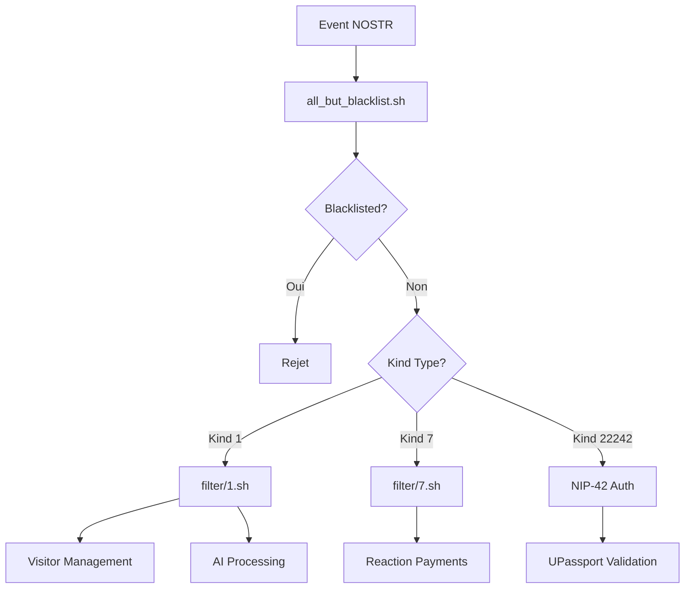

**Filtre Principal (all\_but\_blacklist.sh)**

| **Fonction**  | **Action**                      | **Fichier**                   |
| ------------- | ------------------------------- | ----------------------------- |
| **Whitelist** | Accepte tous les événements     | Par défaut                    |
| **Blacklist** | Rejette les clés bannies        | `~/.zen/strfry/blacklist.txt` |
| **Routing**   | Dirige vers filtres spécialisés | Selon kind                    |

**Filtre Kind 1 - Messages Texte (filter/1.sh)**

**Classification des Utilisateurs**

```bash
# Types d'utilisateurs
nobody    # Visiteur non autorisé
player    # Joueur UPlanet avec carte
uplanet   # Clé géographique UPlanet
```

**Gestion des Visiteurs**

```bash
# Limite de messages pour visiteurs
MESSAGE_LIMIT=3
WARNING_MESSAGE_TTL=172800  # 48 heures

# Message d'avertissement automatique
"Hello NOSTR visitor. You have X message(s) left before being blocked."
```

**Intégration IA**

```bash
# Tags déclencheurs IA
#search    # Recherche web
#image     # Génération d'image
#video     # Génération vidéo
#music     # Génération musique
#youtube   # Téléchargement YouTube
#pierre    # Text-to-speech
#mem       # Affichage mémoire
#rec       # Enregistrement mémoire
#reset     # Reset mémoire
```

**Filtre Kind 7 - Réactions (filter/7.sh)**

**Types de Réactions**

| **Réaction**          | **Type** | **Action**      |
| --------------------- | -------- | --------------- |
| `+`, `👍`, `❤️`, `♥️` | LIKE     | Paiement 0.1 Ğ1 |
| `-`, `👎`, `💔`       | DISLIKE  | Aucune action   |
| Autres emojis         | CUSTOM   | Aucune action   |

**Flux de Paiement Automatique**

```bash
# Vérification autorisation
AUTHORIZED = check_uplanet_membership(reactor)
TARGET_AUTHORIZED = check_uplanet_membership(target_author)

# Paiement automatique
if AUTHORIZED && TARGET_AUTHORIZED:
    PAYforSURE.sh(reactor_key, "0.1", target_g1pub, "_like_${event_id}")
```

#### **Intégration UPassport et NIP-42**

**Architecture d'Authentification**

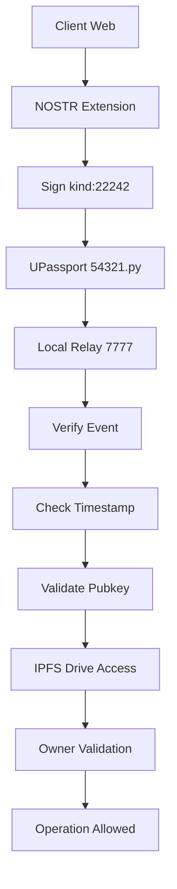

**Twin-Key Mechanism**

**Structure des Clés Jumelles**

```bash
# Clés dérivées de la même graine
NOSTR_HEX      # Identité NOSTR
IPFS_NODEID    # Stockage IPFS
G1_PUBKEY      # Portefeuille Ğ1
BITCOIN_KEY    # Clé Bitcoin (optionnel)
```

**Validation de Propriété**

```json
// manifest.json dans IPFS Drive
{
  "owner_hex_pubkey": "user_nostr_hex",
  "drive_type": "uDRIVE",
  "created_at": "2024-01-01T00:00:00Z"
}
```

**Système de Mémoire IA**

**Types de Mémoire**

| **Type**        | **Localisation**                                          | **Contenu**                 |
| --------------- | --------------------------------------------------------- | --------------------------- |
| **User Memory** | `~/.zen/tmp/flashmem/uplanet_memory/pubkey/{pubkey}.json` | Conversations utilisateur   |
| **UMAP Memory** | `~/.zen/tmp/flashmem/uplanet_memory/{lat}_{lon}.json`     | Conversations géographiques |

**Contrôle de Mémoire**

```bash
# Tags de contrôle
#rec       # Enregistrer le message (requis)
#mem       # Afficher la mémoire
#reset     # Effacer la mémoire
```

**Structure de Mémoire**

```json
{
  "pubkey": "user_public_key",
  "messages": [
    {
      "timestamp": "2024-01-01T12:00:00Z",
      "event_id": "event_hash",
      "latitude": "48.8534",
      "longitude": "-2.3412",
      "content": "Message content"
    }
  ]
}
```

#### **Sécurité et Privacy**

**Contrôles de Sécurité**

* **Authentification NIP-42** : Vérification cryptographique
* **Blacklist dynamique** : Protection contre spam
* **Limite de messages** : Contrôle des visiteurs
* **Validation propriété** : Protection des données IPFS

**Protection de la Vie Privée**

* **Contrôle mémoire** : Tags explicites pour l'enregistrement
* **Géolocalisation optionnelle** : Coordonnées non obligatoires
* **Nettoyage automatique** : Suppression des anciens messages
* **Isolation des données** : Séparation user/UMAP memory

***

### 🔄 Flux de Données Intégrés

#### **Flux Principal Astroport.ONE**

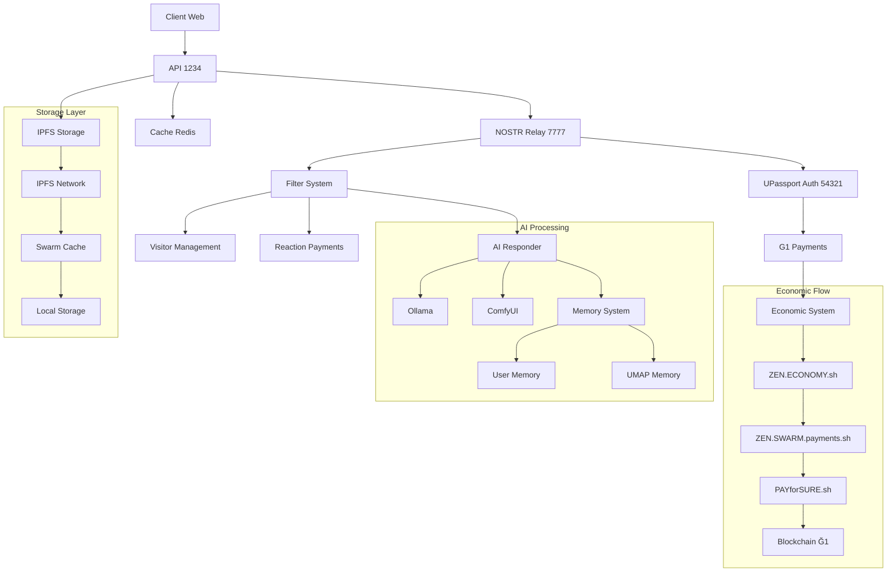

#### **Flux d'Authentification Complète**

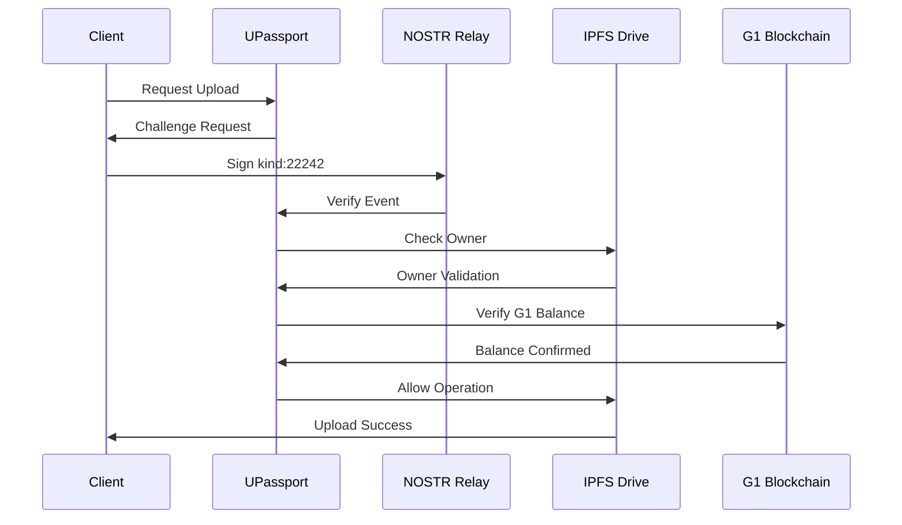

#### **Flux Économique Automatique**

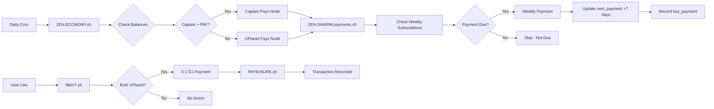

#### **Intégration des Composants**

| **Composant**     | **Rôle**              | **Intégration**      | **Dépendances**    |
| ----------------- | --------------------- | -------------------- | ------------------ |
| **Astroport.ONE** | Plateforme principale | Orchestrateur        | Tous les services  |
| **UPassport**     | Identité numérique    | Auth NIP-42          | NOSTR Relay        |
| **NOSTR Relay**   | Communication         | Filtrage événements  | IPFS, G1           |
| **ZEN.ECONOMY**   | Économie automatique  | Paiements quotidiens | G1 Blockchain      |
| **IPFS**          | Stockage décentralisé | Données utilisateurs | Twin-Key           |
| **G1 Blockchain** | Monnaie libre         | Transactions         | Tous les paiements |

#### **Synchronisation des Données**

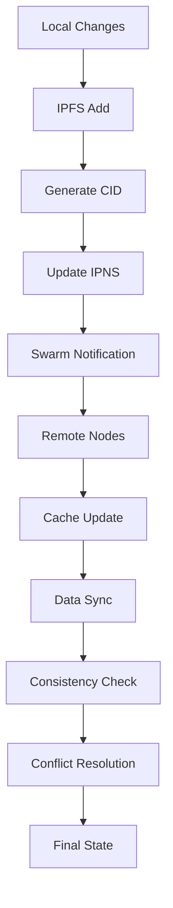

***

### 📊 Métriques et Monitoring

#### **Indicateurs de Performance**

| **Métrique**        | **Source**         | **Seuil** | **Action**       |
| ------------------- | ------------------ | --------- | ---------------- |
| **IPFS Peers**      | `ipfs swarm peers` | < 10      | Redémarrage IPFS |
| **NOSTR Events**    | `strfry stats`     | > 1000/h  | Analyse trafic   |
| **G1 Transactions** | `COINScheck.sh`    | < 1       | Alerte solde     |
| **Memory Usage**    | `uplanet_memory/`  | > 100MB   | Nettoyage        |
| **Response Time**   | API endpoints      | > 5s      | Optimisation     |

#### **Logs et Debugging**

```bash
# Logs principaux
~/.zen/tmp/uplanet_messages.log    # Messages NOSTR
~/.zen/tmp/nostr_likes.log         # Réactions et paiements
~/.zen/tmp/IA.log                  # IA interactions
~/.zen/tmp/strfry.log           # Relay NOSTR
~/.zen/tmp/54321.log             # UPassport API
```

***

### 🔮 Évolutions Futures

#### **Roadmap Technique**

| **Phase**   | **Fonctionnalité** | **Priorité** |
| ----------- | ------------------ | ------------ |
| **Phase 1** | IA décentralisée   | Haute        |
| **Phase 2** | Métavers uWORLD    | Moyenne      |
| **Phase 3** | IoT Integration    | Basse        |
| **Phase 4** | DeFi Services      | Moyenne      |

#### **Améliorations Prévues**

* **IA Distribuée** : Assistant personnel #BRO multi-nodes
* **Métavers Étendu** : Monde virtuel uWORLD avec géolocalisation
* **IoT Connecté** : Intégration objets connectés UPlanet
* **Services DeFi** : Prêts, épargne, assurance décentralisés
* **Niveaux N1/N2** : Système de validation des compétences

***

### 📚 Références

* [Documentation UPlanet](https://astroport-1.gitbook.io/astroport.one/)
* [Protocole NOSTR](https://github.com/nostr-protocol/nostr)
* [NIP-101: UPlanet Geographic Keys](https://github.com/papiche/NIP-101)
* [Monnaie Libre Ğ1](https://monnaie-libre.fr)
* [IPFS Documentation](https://docs.ipfs.io/)
* [UPassport API](https://github.com/papiche/UPassport)

***

_Document généré automatiquement (et corrigé) - Astroport.ONE v3.6_
