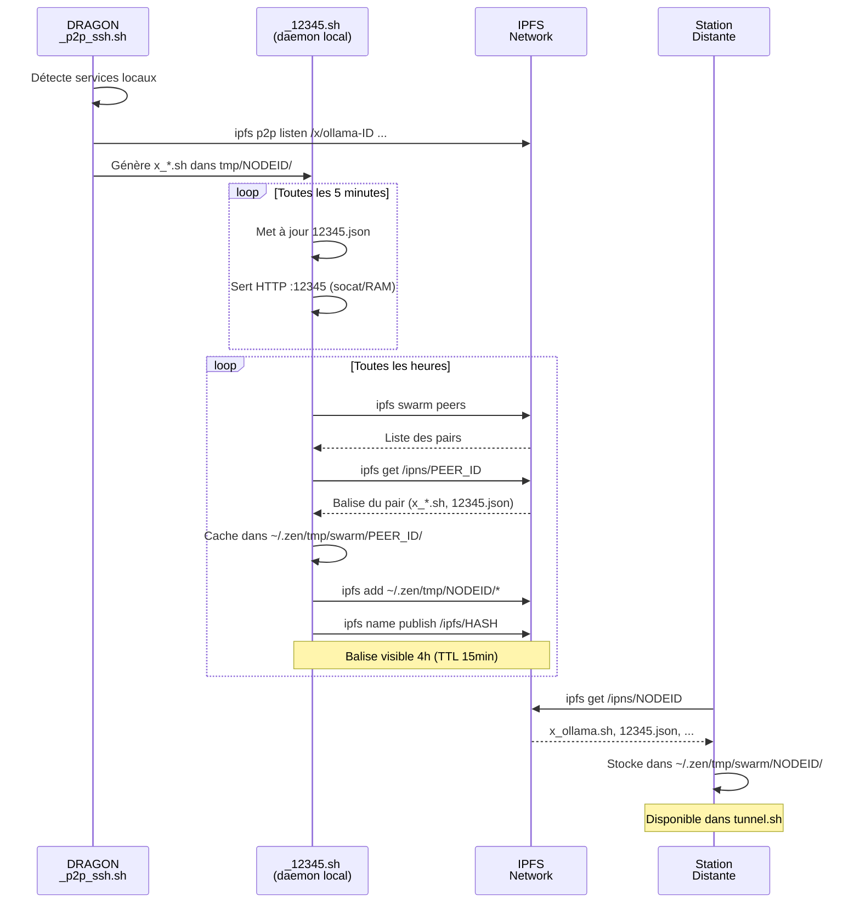

# 🐉 DRAGONS & TUNNELS — Système de Services P2P Astroport

> Documentation technique du système de tunnels IPFS P2P, de son activation automatique et de son utilisation manuelle.

---

## Table des matières

1. [Vue d'ensemble](#vue-densemble)
2. [Les deux orchestrateurs](#les-deux-orchestrateurs)
3. [Cycle de vie automatique (20H12)](#cycle-de-vie-automatique-20h12)
4. [DRAGON : publication des services](#dragon--publication-des-services)
5. [La Balise IPNS et le Swarm](#la-balise-ipns-et-le-swarm)
6. [tunnel.sh : interface de contrôle](#tunnelsh--interface-de-contrôle)
7. [Les scripts ME — connexion intelligente](#les-scripts-me--connexion-intelligente)
8. [Configuration avancée (.env)](#configuration-avancée-env)
9. [Utilisation manuelle — recettes](#utilisation-manuelle--recettes)
10. [Dépannage](#dépannage)

---

## Vue d'ensemble

Le système DRAGONS & TUNNELS permet à chaque station Astroport de **publier ses services IA dans l'essaim** et aux autres stations de **s'y connecter** via IPFS P2P, sans configuration réseau complexe ni ouverture de ports.

```
┌─────────────────────────────────────────────────────────────────────┐
│                     CONSTELLATION ASTROPORT                         │
│                                                                     │
│  ┌──────────────┐       IPFS P2P        ┌──────────────┐           │
│  │  SAGITTARIUS │◄─────/x/ollama-ID────►│  PROMETHEUS  │           │
│  │              │◄─────/x/ssh-ID────────│              │           │
│  │  ollama:11434│       Swarm           │  tunnel.sh   │           │
│  │  comfyui:8188│◄─────/x/comfyui-ID──►│  IA/*.me.sh  │           │
│  └──────────────┘                       └──────────────┘           │
│         │                                       │                  │
│         │           IPNS Balise                 │                  │
│         └──────────/ipns/NODEID──────────────►  │                  │
│                   (12345.json + x_*.sh)          │                  │
└─────────────────────────────────────────────────────────────────────┘
```

### Principe fondamental

Chaque station gère **deux rôles** :
- **Serveur** : publie ses services locaux via `ipfs p2p listen`
- **Client** : se connecte aux services distants via `ipfs p2p forward`

Le protocole IPFS P2P (`/x/SERVICE-NODEID`) traverses les NAT et ne nécessite **aucune ouverture de port** côté client — seul le port `4001` (IPFS Swarm) doit être accessible.

---

## Les deux orchestrateurs

### `20h12.process.sh` — Maintenance quotidienne (cron)

Script lancé **une fois par jour** à l'heure solaire (~20h12 locale) par le cron géré par [`tools/cron_VRFY.sh`](../tools/cron_VRFY.sh). Il :

1. Vérifie l'état du démon IPFS
2. Met à jour le code (git pull)
3. **Réinitialise le DRAGON** (off → on)
4. Redémarre les services système
5. Lance `_12345.sh` (balise IPNS)
6. Envoie un rapport email

### `_12345.sh` — Démon Swarm (boucle permanente)

Script qui tourne **en permanence** (service `astroport` systemd ou PID dans `~/.zen/.pid`). Il :

1. Sert le `12345.json` via HTTP sur le port `12345` (socat)
2. Scanne les pairs IPFS chaque heure
3. Download les balises des autres stations dans `~/.zen/tmp/swarm/`
4. **Réactive le DRAGON** si les tunnels sont manquants
5. Publie/rafraîchit la balise IPNS toutes les 4h

---

## Cycle de vie automatique (20H12)

```
Timeline : Exécution quotidienne de 20h12.process.sh
═══════════════════════════════════════════════════════════════════

t+0m    ┌─ DÉMARRAGE ─────────────────────────────────────────────
        │  Source tools/my.sh (.env, variables système)
        │  Vérification IPFS daemon (redémarrage si KO)
        │
t+2m    ├─ NETTOYAGE ─────────────────────────────────────────────
        │  find ~/.zen/tmp/ -mindepth 1 ! swarm ! coucou -delete
        │  sudo systemctl stop astroport
        │
t+5m    ├─ MISES À JOUR ──────────────────────────────────────────
        │  git pull (G1BILLET, UPassport, NIP-101, UPlanet, Astroport)
        │  install_gcli.sh
        │  yt-dlp -U
        │
t+15m   ├─ RÉSEAU SOCIAL ─────────────────────────────────────────
        │  ping_bootstrap.sh
        │  NOSTRCARD.refresh.sh
        │  PLAYER.refresh.sh
        │  UPLANET.refresh.sh
        │
t+45m   ├─ 🐉 RESET DRAGON ────────────────────────────────────────
        │  DRAGON_p2p_ssh.sh OFF          ← fermeture tunnels
        │  ipfs p2p close --all           ← nettoyage complet
        │  rm ~/.zen/tmp/NODEID/x_*.sh   ← suppression scripts clients
        │
t+47m   ├─ ♻️  IPFS RESTART ─────────────────────────────────────
        │  sudo systemctl restart ipfs
        │  sleep 30 (bootstrap reconnect)
        │
t+48m   ├─ 🐉 EVEIL DRAGON ─────────────────────────────────────────
        │  DRAGON_p2p_ssh.sh ON
        │  ├─ Détection services locaux (ss -tln)
        │  ├─ ipfs p2p listen /x/SERVICE-ID /ip4/127.0.0.1/tcp/PORT
        │  └─ Génération x_SERVICE.sh dans ~/.zen/tmp/NODEID/
        │
t+50m   ├─ REDÉMARRAGE SERVICES ────────────────────────────────
        │  sudo systemctl restart astroport  → _12345.sh
        │  sudo systemctl restart upassport
        │  sudo systemctl restart comfyui (si tunnel actif)
        │
t+55m   ├─ PUBLICATION IPNS ──────────────────────────────────────
        │  _12345.sh démarre sa boucle
        │  Publie ~/.zen/tmp/NODEID/* via ipfs name publish
        │  (inclut 12345.json + tous les x_*.sh)
        │
t+65m   └─ RAPPORT ────────────────────────────────────────────────
           heartbox_analysis.sh export --json
           mailjet.sh → rapport email au captain
```

### Schéma de déclenchement cron

```
CRON (cron_VRFY.sh)
        │
        │  Heure solaire calculée (coucher soleil - offset)
        │  Ajustée au changement d'heure (DST detection)
        ▼
  [~20h12 locale]
        │
        ▼
 20h12.process.sh ──────────────────────────────────────────────────►
        │                                                            │
        ├──► DRAGON OFF ──► IPFS restart ──► DRAGON ON              │
        │                                        │                  │
        │                                        ▼                  │
        └──► astroport service restart ──► _12345.sh daemon ────────┘
```

---

## DRAGON : publication des services

### Qu'est-ce que le DRAGON ?

[`RUNTIME/DRAGON_p2p_ssh.sh`](../RUNTIME/DRAGON_p2p_ssh.sh) est le script qui :
1. **Détecte** les services locaux actifs (ollama, comfyui, qdrant, etc.)
2. **Ouvre** les canaux IPFS P2P pour les exposer à l'essaim
3. **Génère** les scripts clients `x_SERVICE.sh` pour les autres stations
4. **Met à jour** les clés SSH autorisées (Web of Trust)

### La fonction `generate_p2p_service`

```bash
generate_p2p_service PORT_DISTANT SLUG NOM [PORT_LOCAL_PREFERE]
```

**Côté serveur (DRAGON local)** :
1. Calcule un `NODE_OFFSET` unique (0-499) basé sur son `IPFSNODEID`.
2. Détecte le service local (ex: port 11434).
3. Ouvre le canal `/x/SLUG-NODEID`.
4. Génère le script client `x_SLUG.sh` incluant l'évitement intelligent.

**Structure du script `x_SLUG.sh` généré (Intelligent)** :
```bash
#!/bin/bash
NODE_ID="12D3KooW..."        # NODEID de la station serveur
PROTO="/x/ollama-12D3KooW..." # Canal IPFS P2P
NATIVE_PORT="11434"          # Port standard (ou préféré)
ALT_PORT="21345"            # Port alternatif (21220 + offset + slug_id)

# LOGIQUE D'ÉVITEMENT :
# Si NATIVE_PORT est occupé localement, on bascule sur ALT_PORT.
if ss -tln | grep -qw ":$NATIVE_PORT"; then
    # Sauf si c'est déjà un tunnel IPFS pour ce même protocole
    if ipfs p2p ls | grep -q "$PROTO" | grep -q "tcp/$NATIVE_PORT"; then
        LPORT="$NATIVE_PORT"
    else
        LPORT="$ALT_PORT"
    fi
else
    LPORT="$NATIVE_PORT"
fi

export LPORT=$LPORT

# Double tunnel : localhost + docker0 bridge
ipfs p2p forward "$PROTO" "/ip4/127.0.0.1/tcp/$LPORT"   "/p2p/$NODE_ID"
ipfs p2p forward "$PROTO" "/ip4/172.17.0.1/tcp/$LPORT"  "/p2p/$NODE_ID"
```

### Services publiés par DRAGON

| Slug | Port | Service | Condition de publication |
|------|------|---------|--------------------------|
| `ollama` | 11434 | Ollama LLM API | `pgrep ollama` + processus natif |
| `comfyui` | 8188 | ComfyUI | `systemctl is-active comfyui` |
| `open-webui` | 8000 | Open WebUI IA | processus natif sur port |
| `qdrant` | 6333 | Qdrant VectorDB | processus natif sur port |
| `orpheus` | 5005 | Orpheus TTS | `docker ps \| grep orpheus` |
| `perplexica` | 3002 | Perplexica Search | `docker ps \| grep perplexica` |
| `ssh` | 22 | SSH Remote | processus natif sur port |
| `npm` | 81 | Nginx Proxy Manager | processus natif sur port |
| `nextcloud-aio` | 8443 | NextCloud AIO Admin | processus natif sur port |
| `nextcloud-app` | 8001 | NextCloud Apache | processus natif sur port |
| `webtop-http` | 3000 | KasmVNC HTTP | docker linuxserver/webtop |
| `webtop-https` | 3001 | KasmVNC HTTPS | docker linuxserver/webtop |

> ⚠️ **Protection anti-tunnel→tunnel** : DRAGON utilise `_is_native_process(PORT)` qui vérifie non seulement que le port est en écoute, mais aussi que le **processus propriétaire n'est pas `ipfs`**. Si `ipfs p2p forward` tient déjà le port (tunnel client entrant d'une autre station), DRAGON refuse de le republier — évitant des cascades inefficaces de tunnels imbriqués qui dégraderaient les performances du réseau.

```
Station A ─── ipfs forward ──► local:11434 [ipfs process]
                                     │
                                     │ _is_native_process(11434) → RETOURNE FALSE (process=ipfs)
                                     │
                                     └─ DRAGON refuse de publier → pas de tunnel→tunnel
```

### Page de statut — `status.html`

`_12345.sh` génère un `status.html` dans la balise IPNS à chaque cycle de publication (~toutes les heures). Accessible via :

```
https://ipfs.DOMAIN/ipns/NODEID/status.html
```

La page affiche (snapshot mis à jour toutes les ~4h) :
- Identité : hostname, captain, UPlanet, santé économique colorée
- Réseau : stations swarm connues, pairs IPFS, tunnels actifs
- Services DRAGON publiés (`x_*.sh` présents dans la balise)
- Liens vers `12345.json` et la balise IPNS complète

### Wrapper `publish_service` et services privés

Le wrapper `publish_service()` vérifie `DRAGON_PRIVATE_SERVICES` avant de publier :

```bash
# Dans ~/.zen/Astroport.ONE/.env
DRAGON_PRIVATE_SERVICES="qdrant nextcloud-app"

# DRAGON skipera silencieusement ces deux services
# → ils ne seront pas visibles depuis les autres stations
```

---

## La Balise IPNS et le Swarm

### Structure du répertoire de balise

```
~/.zen/tmp/NODEID/
├── 12345.json              ← Carte complète de la station (économie, services, coordonnées GPS)
├── _MySwarm.moats          ← Timestamp Unix (fraîcheur, max 12h)
├── _MySwarm.HOST.html      ← Redirect /ipns/CHAN (swarm key)
├── myIPFS.txt              ← Multiaddr IPFS de la station
├── HEX                     ← Clé NOSTR hex du nœud
├── HEX_CAPTAIN             ← Clé NOSTR hex du captain
├── x_ollama.sh             ← Script connexion OLLAMA (généré par DRAGON)
├── x_comfyui.sh            ← Script connexion COMFYUI
├── x_ssh.sh                ← Script connexion SSH
├── y_ssh.pub               ← Clé SSH publique Y-level
├── z_ssh.pub               ← Clé SSH PGP (UBiKEY/DRAGONz)
├── status.html             ← Page de santé du nœud (générée par _12345.sh)
└── heartbox_analysis.json  ← Analyse capacités/services
```

### Cycle de publication et synchronisation



### Découverte du swarm (cascade)

```
Station X
    │
    ├─► ipfs swarm peers → [Y, Z, W...]
    │         │
    │         ├─► is_astroport_node(Y) ?
    │         │       └─ ipfs cat /ipns/Y/_MySwarm.moats → timestamp OK
    │         │
    │         └─► ipfs get /ipns/Y/ → cache ~/.zen/tmp/swarm/Y/
    │                   │
    │                   └─► 12345.json → g1swarm: /ipns/CHAN_Y
    │                               │
    │                               └─► ipfs ls /ipns/CHAN_Y → [A, B, C...]
    │                                       │
    │                                       └─► ipfs get /ipns/A, B, C...
    │                                           (extension transitive du swarm)
    │
    └─► ~/.zen/tmp/swarm/
            ├── Y/  x_ollama.sh, 12345.json
            ├── Z/  x_comfyui.sh, x_ssh.sh
            ├── A/  x_ollama.sh, x_qdrant.sh
            └── B/  x_open-webui.sh
```

---

## tunnel.sh : interface de contrôle

### Lancement

```bash
~/.zen/Astroport.ONE/tunnel.sh
```

### Interface

```
  tunnel v2.0 - [Q]->Quit [Entrée]->CONNECT [R]->RESET [X]->STOP [W]->WebOpen
ID LOCAL: 12D3KooWAJxX... | Port: 11434 (Alt: 21345) | Auto-refresh ON

  SAGITTARIUS - COMFYUI     [  ACTIF ipfs  ]  P:8188      ... wyFntbpxPX ...
  SAGITTARIUS - OLLAMA      [  ACTIF ipfs  ]  P:11434     ... wyFntbpxPX ...
> ALIENWARE - OLLAMA        [  OFF  ]  P:11434     ... AFLSPRKPXt ...
  ALIENWARE - ORPHEUS       [  OFF  ]  P:5005      ... AFLSPRKPXt ...
  LIBRA - QDRANT            [  OFF  ]  P:6333      ... ikSHoDD581 ...
```

### Lecture des statuts

| Statut | Couleur | Signification |
|--------|---------|---------------|
| `[  ACTIF ipfs  ]` | 🟢 Vert | Tunnel IPFS actif — canal `/x/SERVICE-NODEID` vérifié sur port Natif ou Alt |
| `[ ACTIF process ]` | 🟡 Jaune | Port occupé localement (service natif ou autre tunnel) |
| `[  OFF  ]` | 🔴 Rouge | Aucune connexion active |

**Logique de détection intelligente** :
```bash
# 1. Recherche dans ipfs p2p ls par protocole
active_line=$(ipfs p2p ls | grep "$proto")

# 2. Si tunnel actif sur NATIVE_PORT ou ALT_PORT → VERT
# Sinon si NATIVE_PORT ou ALT_PORT est occupé par un process natif → JAUNE
# Sinon → ROUGE (OFF)
```

### Commandes clavier

| Touche | Action | Détail |
|--------|--------|--------|
| `↑` `↓` | Navigation | Déplace le curseur dans la liste |
| `Entrée` | **CONNECT** | Lance `x_SERVICE.sh` si le port est libre |
| `R` | **RESET** | Ferme puis rouvre le tunnel |
| `X` | **STOP** | Ferme le tunnel, libère le port local |
| `W` | **WebOpen** | Ouvre `http(s)://localhost:PORT` dans le navigateur |
| `Q` | **Quit** | Quitte `tunnel.sh` (tunnels restent actifs) |

### Logique CONNECT (Entrée)

```
Touche Entrée sur "ALIENWARE - OLLAMA"
    │
    ├─ Port 11434 libre localement ?
    │   ├─ NON → "Port déjà occupé localement" (service natif actif)
    │   └─ OUI → bash ~/.zen/tmp/swarm/ALIENWARE_ID/x_ollama.sh
    │                   │
    │                   ├─ ipfs ping /p2p/ALIENWARE_ID (timeout 10s)
    │                   ├─ ipfs p2p forward /x/ollama-ID /ip4/127.0.0.1/tcp/11434 /p2p/ALIENWARE_ID
    │                   └─ ipfs p2p forward /x/ollama-ID /ip4/172.17.0.1/tcp/11434 /p2p/ALIENWARE_ID
    │
    └─ Rafraîchissement ipfs p2p ls → affichage "ACTIF ipfs"
```

### Protocole HTTP pour les services via W

| Port | Protocole | Service |
|------|-----------|---------|
| `3001` | **https** | Webtop KasmVNC (nativement HTTPS) |
| `8443` | **https** | NextCloud AIO Admin (auto-signé) |
| `443` | **https** | générique |
| `6333` | http + `/dashboard` | Qdrant (interface web) |
| **tous les autres** | **http** | Services IA (ollama, comfyui, open-webui…) |

> **Note** : Le HTTPS public est géré par NPM (port 443). Via IPFS P2P, on accède directement aux ports HTTP internes (zone `localhost` protégée par le firewall UFW).

---

## Les scripts ME — connexion intelligente

### Principe de la cascade de connexion

Les scripts `IA/*.me.sh` sont les **outils de haut niveau** pour utiliser les services distants. Ils tentent les connexions dans l'ordre suivant :

```
IA/ollama.me.sh
    │
    ├─ 1. Service LOCAL running ?
    │       └─ pgrep ollama || systemctl is-active ollama
    │           ├─ OUI → API ready at http://localhost:11434 ✓
    │           └─ NON ─────────────────────────────────────────────┐
    │                                                               │
    ├─ 2. SSH Tunnel (fallback) ◄──────────────────────────────────┘
    │       └─ Paramètres depuis ~/.zen/Astroport.ONE/.env
    │           SWARM_REMOTE_HOST / USER / PORT_IPV4 / PORT_IPV6
    │           ├─ IPv6 disponible → ssh -6 frd@scorpio... -L 11434:...
    │           ├─ IPv4 disponible → ssh -4 frd@scorpio... -p 2122 -L 11434:...
    │           └─ Échec ──────────────────────────────────────────┐
    │                                                               │
    └─ 3. IPFS P2P Swarm ◄─────────────────────────────────────────┘
            └─ Scan ~/.zen/tmp/swarm/*/x_ollama.sh
                ├─ Liste les nœuds disponibles
                ├─ Sélection automatique / manuelle
                └─ bash x_ollama.sh → tunnel IPFS
```

### Scripts disponibles

| Script | Service | Port | Particularité |
|--------|---------|------|---------------|
| [`IA/ollama.me.sh`](../IA/ollama.me.sh) | Ollama LLM | 11434 | Test latence + modèles requis |
| [`IA/comfyui.me.sh`](../IA/comfyui.me.sh) | ComfyUI | 8188 | Stats GPU (VRAM) |
| [`IA/perplexica.me.sh`](../IA/perplexica.me.sh) | Perplexica | 3002 | Recherche web IA |
| [`IA/orpheus.me.sh`](../IA/orpheus.me.sh) | Orpheus TTS | 5005 | P2P only (pas de SSH) |
| [`IA/open-webui.me.sh`](../IA/open-webui.me.sh) | Open WebUI | 8000 | Interface IA centrale |
| [`IA/qdrant.me.sh`](../IA/qdrant.me.sh) | Qdrant | 6333 | Liste collections |

### Commandes communes à tous les ME

```bash
SERVICE.me.sh               # Auto-connect (LOCAL → SSH → P2P)
SERVICE.me.sh STATUS        # Statut de connexion actif
SERVICE.me.sh SCAN          # Inventaire de toutes les méthodes disponibles
SERVICE.me.sh LOCAL         # Forcer connexion locale
SERVICE.me.sh SSH           # Forcer tunnel SSH (auto IPv6/IPv4)
SERVICE.me.sh SSH6          # Forcer IPv6
SERVICE.me.sh SSH4          # Forcer IPv4
SERVICE.me.sh P2P           # Lister et connecter les nœuds P2P
SERVICE.me.sh P2P 2         # Connecter au nœud #2
SERVICE.me.sh P2P auto      # Nœud aléatoire (load balancing)
SERVICE.me.sh OFF           # Déconnecter tout
SERVICE.me.sh TEST          # Tester l'API active
SERVICE.me.sh HELP          # Aide complète
```

---

## Configuration avancée (.env)

Le fichier [`~/.zen/Astroport.ONE/.env`](../.env.template) centralise la configuration. Les variables DRAGON/tunnels :

```bash
## ─── Passerelle SSH fallback ─────────────────────────────────────────────
## Utilisée par les *.me.sh quand IPFS P2P n'est pas disponible
SWARM_REMOTE_HOST="scorpio.copylaradio.com"  # Hôte SSH de secours
SWARM_REMOTE_USER="frd"                       # Utilisateur SSH
SWARM_REMOTE_PORT_IPV4=2122                   # Port NAT IPv4 (derrière routeur)
SWARM_REMOTE_PORT_IPV6=22                     # Port SSH direct IPv6

## ─── Services DRAGON privés ──────────────────────────────────────────────
## Slugs séparés par espaces → non publiés dans le swarm
## Ex: garder Qdrant et NextCloud inaccessibles depuis les pairs
DRAGON_PRIVATE_SERVICES="qdrant nextcloud-app"
```

> **Note** : `my.sh` source `.env` au démarrage de chaque script. Les variables sont donc disponibles dans DRAGON, `_12345.sh` et tous les `*.me.sh` sans import supplémentaire.

### Priorité des variables (ordre de résolution)

```
~/.zen/Astroport.ONE/.env
    SWARM_REMOTE_HOST="scorpio.copylaradio.com"
         ↓ surchargé par
    export SWARM_REMOTE_HOST="mon-serveur.example.com"  (shell courant)
         ↓ fallback dans *.me.sh si non défini
    REMOTE_HOST="${SWARM_REMOTE_HOST:-scorpio.copylaradio.com}"
```

---

## Utilisation manuelle — recettes

### 🔍 Voir l'état des tunnels IPFS P2P actifs

```bash
ipfs p2p ls
```
Exemple de sortie :
```
/x/ollama-12D3KooWAvW...  /ip4/127.0.0.1/tcp/11434   /p2p/12D3KooWAvW...
/x/ssh-12D3KooWAJx...     /p2p/12D3KooWAJx...         /ip4/127.0.0.1/tcp/22
```

### 🐉 Relancer DRAGON manuellement

```bash
# Fermer tous les tunnels et nettoyer les scripts
~/.zen/Astroport.ONE/RUNTIME/DRAGON_p2p_ssh.sh off

# Redétecter les services et rouvrir les tunnels
~/.zen/Astroport.ONE/RUNTIME/DRAGON_p2p_ssh.sh

# Voir ce qui est publié
ipfs p2p ls
ls ~/.zen/tmp/${IPFSNODEID}/x_*.sh
```

### 🔗 Se connecter manuellement à un service distant

```bash
# Méthode 1 : via tunnel.sh (interactif)
~/.zen/Astroport.ONE/tunnel.sh

# Méthode 2 : exécuter directement le script client
bash ~/.zen/tmp/swarm/12D3KooWAvW.../x_ollama.sh

# Méthode 3 : via un script .me.sh (recommandé)
~/.zen/Astroport.ONE/IA/ollama.me.sh P2P
```

### 🔌 Fermer un tunnel spécifique

```bash
# Par protocole (le plus propre)
ipfs p2p close -p "/x/ollama-12D3KooWAvW..."

# Tout fermer
ipfs p2p close --all

# Via tunnel.sh : sélectionner le service → touche X
```

### 📡 Voir les balises des autres stations

```bash
# Lister les stations connues dans le swarm local
ls ~/.zen/tmp/swarm/

# Voir la carte d'une station spécifique
cat ~/.zen/tmp/swarm/12D3KooWAvW.../12345.json | jq '{hostname, captain, myIPFS}'

# Voir les services disponibles sur une station
ls ~/.zen/tmp/swarm/12D3KooWAvW.../x_*.sh
```

### 🔄 Forcer la resynchronisation du swarm

```bash
# Supprimer le cache swarm local (sera rechargé au prochain cycle _12345.sh)
rm -Rf ~/.zen/tmp/swarm/*/

# Forcer un ping bootstrap immédiat
~/.zen/Astroport.ONE/ping_bootstrap.sh

# Puis attendre le prochain cycle de _12345.sh (max 5 minutes)
# ou tuer/relancer le démon
sudo systemctl restart astroport
```

### 🏥 Vérifier la santé du système complet

```bash
# État du démon IPFS
sudo systemctl status ipfs
ipfs swarm peers | wc -l

# État des tunnels P2P
ipfs p2p ls

# Dernière publication IPNS
ipfs name resolve $(ipfs id -f "<id>")

# Balise locale actuelle
cat ~/.zen/tmp/${IPFSNODEID}/12345.json | jq '{hostname, myIPFS, ipfsnodeid}'

# Services publiés par DRAGON
ls -la ~/.zen/tmp/${IPFSNODEID}/x_*.sh 2>/dev/null

# Stations connues dans le swarm
ls ~/.zen/tmp/swarm/ | wc -l
```

---

## Dépannage

### ❌ "ACTIF local" en jaune dans tunnel.sh au lieu de "ACTIF ipfs"

**Cause** : Le port est occupé localement par un service natif (pas un tunnel IPFS de ce nœud).

**Action** :
```bash
# Vérifier quel processus occupe le port
lsof -Pi :11434 -sTCP:LISTEN
# Si c'est ollama lui-même → normal, service local actif (prioritaire)
# Si c'est un autre nœud déjà tunnelisé → tunnel d'un autre nœud
```

### ❌ Tunnel "OFF" alors que le service tourne sur la station distante

**Cause** : La balise IPNS de la station distante n'est pas encore mise à jour ou le nœud n'est pas joignable.

**Action** :
```bash
# Tester la connectivité au nœud
ipfs --timeout=15s ping -n 2 /p2p/NODEID_DISTANT

# Forcer le téléchargement de la balise
ipfs --timeout=60s get -o /tmp/test_balise /ipns/NODEID_DISTANT

# Vérifier que x_SERVICE.sh est bien dans la balise
ls /tmp/test_balise/x_*.sh
```

### ❌ DRAGON ne publie pas un service

**Cause** : Le service n'écoute pas sur `127.0.0.1` ou est dans `DRAGON_PRIVATE_SERVICES`.

**Diagnostic** :
```bash
# Vérifier que le service écoute
ss -tln | grep ":11434"

# Vérifier DRAGON_PRIVATE_SERVICES
grep DRAGON_PRIVATE_SERVICES ~/.zen/Astroport.ONE/.env

# Lancer DRAGON en mode verbeux
bash -x ~/.zen/Astroport.ONE/RUNTIME/DRAGON_p2p_ssh.sh 2>&1 | grep -E "Publie|SKIP"
```

### ❌ `ipfs p2p ls` vide après DRAGON

**Cause** : IPFS daemon non opérationnel ou `ipfs p2p` désactivé dans la configuration.

**Action** :
```bash
# Vérifier si ipfs p2p est activé
ipfs config Experimental.Libp2pStreamMounting
# Doit retourner: true

# Si false :
ipfs config --json Experimental.Libp2pStreamMounting true
sudo systemctl restart ipfs
```

### ❌ Tunnel SSH (*.me.sh) échoue

**Cause** : `scorpio.copylaradio.com` inaccessible ou clé SSH non autorisée.

**Action** :
```bash
# Tester la connectivité SSH directe
ssh -v frd@scorpio.copylaradio.com -p 2122 exit

# Vérifier/mettre à jour SWARM_REMOTE_HOST dans .env
cat ~/.zen/Astroport.ONE/.env | grep SWARM_REMOTE

# Utiliser directement P2P en sautant SSH
~/.zen/Astroport.ONE/IA/ollama.me.sh P2P
```

---

## Annexe : Carte des flux de fichiers

```
Processus                Fichiers générés/lus
═══════════════════════════════════════════════════════════════

DRAGON_p2p_ssh.sh
    ├── ÉCRIT ──────────► ~/.zen/tmp/NODEID/x_*.sh
    ├── LIT ────────────► ~/.zen/Astroport.ONE/.env (DRAGON_PRIVATE_SERVICES)
    ├── APPELLE ────────► ipfs p2p listen /x/SLUG-ID ...
    └── APPELLE ────────► ipfs p2p close --all (mode OFF)

_12345.sh (daemon)
    ├── ÉCRIT ──────────► ~/.zen/tmp/NODEID/12345.json
    ├── ÉCRIT ──────────► ~/.zen/tmp/NODEID/_MySwarm.moats
    ├── ÉCRIT ──────────► /dev/shm/astroport_12345.http
    ├── LIT ─────────────► ~/.zen/tmp/swarm/*/12345.json (balises pairs)
    ├── ÉCRIT ──────────► ~/.zen/tmp/swarm/NODEID/ (balises téléchargées)
    └── PUBLIE ─────────► ipfs name publish → /ipns/NODEID

tunnel.sh
    ├── LIT ─────────────► ~/.zen/tmp/swarm/*/x_*.sh
    ├── APPELLE ────────► bash x_SLUG.sh (CONNECT)
    └── APPELLE ────────► ipfs p2p close -p PROTO (STOP)

*.me.sh
    ├── LIT ─────────────► ~/.zen/tmp/swarm/*/x_SERVICE.sh
    ├── LIT ─────────────► ~/.zen/Astroport.ONE/.env (SWARM_REMOTE_*)
    ├── APPELLE ────────► bash x_SERVICE.sh (P2P mode)
    └── APPELLE ────────► ssh ... -L PORT:... (SSH mode)

20h12.process.sh
    ├── APPELLE ────────► DRAGON_p2p_ssh.sh OFF
    ├── APPELLE ────────► DRAGON_p2p_ssh.sh (ON)
    └── DÉCLENCHE ──────► sudo systemctl restart astroport → _12345.sh
```

---

*Documentation générée depuis le code source d'[Astroport.ONE](https://github.com/papiche/Astroport.ONE) — AGPL-3.0*
