# **Modèle Économique Circulaire G1FabLab - Règle des 3 Tiers**

## **Partie I : Le Manifeste (Le "Pourquoi")**

### **Politique de Transparence Budgétaire**

Ce document définit la politique de transparence budgétaire et de redistribution des ressources au sein du collectif G1FabLab (hébergé par Open Collective Europe).

Notre objectif est d'assurer la pérennité de nos infrastructures numériques (Cloud Libre) et physiques (Stations UPlanet) via un modèle économique équitable : le **3x1/3**.

### **Extension des Logiciels de Comptabilité Traditionnels**

UPlanet complète et étend les logiciels de comptabilité traditionnels ("Paheko", "Sage", etc.) en créant tous les jetons qu'ils comptent et en les plaçant dans des **"portefeuilles programmables"**. Cette approche révolutionne la gestion comptable en automatisant les transactions et en offrant une traçabilité blockchain complète.

### **Les Trois Types de Jetons de Fonctionnement**

Dans toute organisation, il existe 3 types de jetons fondamentaux :

1. **Jetons d'Usage** → **MULTIPASS** : Facilitent les transactions quotidiennes et l'accès aux services
2. **Jetons de Contribution** → **ZEN Card** : Attestent de la mise à disposition de ressources (matériel, temps)
3. **Jetons de Gouvernance** → **UPassport** : Permettent la participation aux décisions collectives

### **Deux Mondes, Deux Géométries**

Pour comprendre la différence fondamentale entre l'économie du Ẑen et celle de l'Euro, il ne suffit pas de parler de technologie. Il faut parler de **géométrie**. Chaque système monétaire dessine un "monde" avec ses propres règles, ses propres trajectoires et sa propre expérience vécue.

#### **1. Le Monde de l'Euro : La Sphère de Poincaré**

L'économie de la monnaie-dette, dont l'Euro est un représentant, est un univers dont la géométrie est analogue à celle d'une **sphère**. C'est un monde soumis à la [conjecture de Poincaré](https://fr.wikipedia.org/wiki/Conjecture_de_Poincar%C3%A9).

*   **Ses Propriétés :** Fini, sans bord, non-euclidien. La monnaie est créée par la dette, instaurant une **rareté structurelle**. Les trajectoires que l'on pense parallèles sont en réalité **convergentes**, menant à une compétition inévitable.
*   **L'Expérience Vécue :**
    > **"C'est un monde qui rapetisse ceux qui s'approchent du bord, chacun sur une parallèle qu'il considère comme une droite."**
    Le "bord" est la limite de la solvabilité. En s'en approchant, les possibles de l'acteur se contractent, son énergie est dédiée au service de la dette, non à la création. C'est une **asphyxie économique et cognitive**.

#### **2. Le Monde du Ẑen : Le Plan Coopératif en Expansion**

L'économie du Ẑen est conçue pour avoir une géométrie radicalement différente : celle d'un **plan en expansion, ancré sur un socle coopératif**.


*Visualisation des flux de fonctionnement ẐEN dans l'écosystème coopératif UPlanet*

*   **Ses Propriétés :** Ouvert, infini en potentiel, collaboratif. Le Ẑen est créé par l'**apport de ressources réelles** (matériel, compétences) au collectif. L'espace est en expansion, rendant le jeu à **somme positive**.
*   **L'Expérience Vécue :**
    > **"C'est un monde qui grandit avec ceux qui construisent, chacun sur un chemin qui enrichit le territoire commun."**
    Le succès d'un membre augmente la valeur et la résilience de l'ensemble. Les possibles s'élargissent en même temps que ceux du collectif. C'est une **synergie économique et cognitive**, dont la physique transparente est inscrite dans le protocole.

Le Ẑen n'est pas une "alternative" à l'Euro. C'est une **invitation à changer de monde** et à choisir une nouvelle géométrie pour nos projets.

---

## **Partie II : La Charte de Redistribution Budgétaire (Les "Règles du Jeu")**

### **PRÉAMBULE "POUR LES NULS" : L'ANALOGIE DE L'ATELIER PARTAGÉ**

Notre écosystème fonctionne comme un **atelier partagé (FabLab)** :
*   **L'Armateur** = Le **Fournisseur de Ressources** qui met son matériel à disposition.
*   **Le Capitaine** = L'**Opérateur Technique** qui assure la maintenance et le bon fonctionnement.
*   **Les Usagers** = Les membres qui utilisent les services moyennant une **redevance d'usage**.
*   **Les Parrains** = Les **Contributeurs d'Infrastructure** qui financent l'équipement collectif.

Chaque redevance payée par un usager sert à défrayer l'opérateur et le fournisseur de matériel, et l'excédent permet au collectif d'acquérir des ressources communes durables.

### **PHILOSOPHIE : UNE COOPÉRATIVE DE MOYENS**

Le G1FabLab **ne génère pas de profits spéculatifs**. Il collecte des contributions (dons, redevances de service) pour financer son fonctionnement. Chaque Euro collecté est immédiatement alloué selon une clé de répartition fixe garantissant que ceux qui travaillent et ceux qui fournissent le matériel sont justement défrayés.

### **LA RÈGLE DES 3 TIERS (Allocation des Contributions)**

Pour chaque service facturé ou contribution reçue (ex: Location d'un nœud de stockage, accès au service), le montant est divisé en trois parts égales :

#### **🟢 1/3 : La Réserve de Fonctionnement (Projet)**

**Objet :** Assurer la sécurité et la maintenance directe.

*   Paiement des charges incompressibles (Assurance, Frais Open Collective, Électricité directe).
*   Constitution d'une trésorerie de secours pour le remplacement du matériel en panne.
*   **Gestion :** Reste sur le compte Open Collective du projet (`UPLANETNAME_TREASURY`).

#### **🔵 1/3 : Rétribution du Travail (Les Capitaines)**

**Objet :** Défrayer l'expertise humaine nécessaire au maintien du service.

*   Concerne les développeurs, administrateurs système, et coordinateurs ("Les Capitaines").
*   **Mécanisme :** Ces contributeurs facturent leurs prestations de service (Maintenance, Astreinte, Développement) au Collectif.
*   **Note :** Le Token ẐEN sert ici d'indicateur de performance pour valider le service fait avant facturation (`UPLANETNAME_RND`).

#### **🔴 1/3 : Rétribution des Infrastructures (Les Armateurs)**

**Objet :** Défrayer les fournisseurs du matériel et du foncier mis à disposition.

*   Le réseau repose sur du matériel (Serveurs, Dômes, Capteurs) financé ou détenu par des tiers ("Les Armateurs").
*   **Mécanisme :** Le Collectif verse une **indemnité d'occupation** ou un **loyer de matériel** aux fournisseurs, calculé pour amortir la mise à disposition initiale et couvrir l'usure.
*   **Exemple :** Si un Armateur met à disposition un Serveur d'une valeur de 500€, il perçoit un loyer mensuel issu de l'activité de ce serveur (`UPLANETNAME_ASSETS`).

---

### **MODÈLE ÉCONOMIQUE DE FONCTIONNEMENT**

#### **1. Le Coût de Production du Service (Payé par CASH)**
Les coûts opérationnels sont payés par la **Trésorerie Coopérative** (`UPLANETNAME_TREASURY` / CASH). Total : **3x PAF = 42 Ẑen/semaine** :
*   **1x PAF (14 Ẑen) :** Versé au **NODE** (portefeuille Armateur) → loyer du matériel.
*   **2x PAF (28 Ẑen) :** Versé au **MULTIPASS Capitaine** → salaire personnel.

> **Séparation claire :** Le Capitaine REÇOIT son salaire sur son MULTIPASS personnel. Il ne prélève plus sur les redevances collectées.

#### **2. La Collecte des Redevances (CAPTAIN_DEDICATED)**
Les redevances d'usage des usagers sont collectées sur un portefeuille **CAPTAIN_DEDICATED** distinct :
*   **Loyer HT** (1 Ẑen MULTIPASS, 4 Ẑen ZenCard) → `CAPTAIN_DEDICATED`
*   **TVA (20%)** → `UPLANETNAME_IMPOT` (directement)

Ce portefeuille d'exploitation sert de **source pour l'allocation coopérative**.

#### **3. Allocation Collective 3x1/3 (depuis CAPTAIN_DEDICATED)**
Après provision fiscale (IS 15-25%), le surplus de `CAPTAIN_DEDICATED` est alloué selon la règle des **3x1/3** :
*   **1/3 CASH** (`UPLANETNAME_TREASURY`) : Finance les coûts opérationnels (PAF + salaires)
*   **1/3 R&D** (`UPLANETNAME_RND`) : Recherche & Développement
*   **1/3 Actifs** (`UPLANETNAME_ASSETS`) : Acquisition de biens communs régénératifs

---

## **Partie III : Le Code de la Route (Le "Comment")**

### **LE RÔLE DU TOKEN ẐEN (Comptabilité Analytique)**

Dans ce système, le ẐEN **n'est pas une monnaie financière convertible**, mais un **Jeton Utilitaire (Utility Token)** interne :

*   **Gouvernance & Transparence :** Il permet de tracer sur la Blockchain qui a fourni quoi (Preuve d'Apport) et qui a fait quoi (Preuve de Travail).
*   **Droits d'Usage :** Il donne accès aux services (Stockage, Hébergement) prioritairement.
*   **Clé de Répartition :** Il sert d'unité de compte pour calculer les factures que les Capitaines et Armateurs peuvent présenter à Open Collective en Euros.

### **ARCHITECTURE DU SYSTÈME**

| Script | Fonction | Fréquence |
| :--- | :--- | :--- |
| `UPLANET.init.sh` | Initialisation de tous les portefeuilles (NODE, CAPTAIN, Collectifs) | Une seule fois |
| `ZEN.ECONOMY.sh` | Paiement PAF + Burn 4-semaines + Mise à disposition machine | Hebdomadaire |
| `ZEN.COOPERATIVE.3x1-3.sh` | Calcul de l'Excédent & Allocation 3x1/3 | Hebdomadaire |
| `NOSTRCARD.refresh.sh` | Collecte redevances MULTIPASS (1Ẑ HT + 0.2Ẑ TVA) | Hebdomadaire |
| `PLAYER.refresh.sh` | Collecte redevances ZEN Cards (4Ẑ HT + 0.8Ẑ TVA) | Hebdomadaire |
| `UPLANET.official.sh` | Émission Crédits Service officiels (Usagers & Parrains) | À la demande |

### **🔄 FLUX DE FONCTIONNEMENT DÉTAILLÉS (Cycle 7 jours)**

#### **MULTIPASS (NOSTR Cards) - `NOSTRCARD.refresh.sh`**
```
Redevance MULTIPASS : 1 Ẑ HT/semaine + 0.2 Ẑ TVA (20%)
├── 1.0 Ẑ → CAPTAIN (prestation hosting)
└── 0.2 Ẑ → UPLANETNAME_IMPOT (provision TVA)
```
- **Gestion** : Prélèvement automatique tous les 7 jours depuis la date d'inscription
- **Heure** : Aléatoire par usager (éviter simultanéité)
- **Contrôle** : Suspension automatique si crédit insuffisant

#### **ZEN Cards - `PLAYER.refresh.sh`**
```
Redevance ZEN Card : 4 Ẑ HT/semaine + 0.8 Ẑ TVA (20%)
├── 4.0 Ẑ → CAPTAIN (prestation premium)
└── 0.8 Ẑ → UPLANETNAME_IMPOT (provision TVA)
```
- **Services** : Accès TiddlyWiki + 128Go stockage
- **Gestion** : Cycle 7 jours depuis BIRTHDATE
- **Contrôle** : Suspension si crédit < 6.8 Ẑ (4+0.8+1 sécurité)

#### **Parrains d'Infrastructure - Statut Spécial**
```
Contribution Parrainage : 50 Ẑ (versement unique annuel)
├── Services Premium : 128Go NextCloud inclus
├── Statut : Parrain d'Infrastructure avec droit de vote consultatif
└── Exemption : Pas de redevance hebdomadaire (1 an)
```
- **Fichier** : `~/.zen/game/players/${PLAYER}/U.SOCIETY`
- **Validité** : 365 jours depuis inscription
- **Renouvellement** : Automatique ou manuel

#### **💰 Coûts Hebdomadaires (PAF - Participation Aux Frais)**

##### **Infrastructure NODE - `ZEN.ECONOMY.sh`**
```
PAF Hebdomadaire : 14 Ẑ/semaine (1.4 Ğ1)
├── Source : CASH (UPLANETNAME_TREASURY)
├── Destination : NODE (portefeuille Armateur)
└── Objectif : Électricité + Internet + Maintenance
```

##### **Rétribution CAPTAIN (Salaire Personnel)**
```
Indemnité Opérateur : 28 Ẑ/semaine (2x PAF)
├── Source : CASH (UPLANETNAME_TREASURY)
├── Destination : CAPTAIN MULTIPASS (revenus personnels)
├── Nature : Rétribution de prestation (BNC)
└── Périodicité : Hebdomadaire
```

##### **Conversion Fiat (Burn PAF)**
```
Burn Mensuel : 56 Ẑ (4 semaines × 14 Ẑ)
├── NODE → OpenCollective (transparence)
├── Usage : Paiement charges réelles (€)
└── Conformité : ACPR + comptabilité publique
```

#### **🏛️ Provisions Fiscales Automatiques**

##### **TVA Collectée**
```
UPLANETNAME_IMPOT : 20% × (MULTIPASS + ZEN Cards)
├── MULTIPASS : 0.2 Ẑ × N usagers/semaine
├── ZEN Cards : 0.8 Ẑ × N cartes/semaine
└── Déclaration : Mensuelle (CA3)
```

##### **Répartition Collective 3x1/3 - `ZEN.COOPERATIVE.3x1-3.sh`**
```
Excédent Hebdomadaire → Allocation Automatique :
├── UPLANETNAME_TREASURY (33.33%) : Réserve de fonctionnement
├── UPLANETNAME_RND (33.33%) : Recherche & Développement
└── UPLANETNAME_ASSETS (33.34%) : Ressources durables
```

#### **📈 Modèle de Fonctionnement par Usager (Immobilier Numérique)**

##### **Usager Standard (MULTIPASS + ZEN Card)**
```
Coût Total : 5 Ẑ HT + 1 Ẑ TVA = 6 Ẑ/semaine
├── Services : 128Go NextCloud + TW + NOSTR
├── Équivalent : Studio + Appartement premium
├── Contribution UPlanet : 6 Ẑ/semaine
└── Excédent Collectif : Surplus après PAF
```

##### **Parrain d'Infrastructure (Crédit Service Annuel)**
```
Contribution : 50 Ẑ (crédit service annuel)
├── Services : 128Go + Premium + Voix consultative
├── Période : 365 jours sans redevance
├── Équivalent : Parrain avec droits d'usage étendus
└── Avantage : Accès prioritaire aux nouveaux services
```

##### **Capacité Infrastructure par Satellite**
```
Raspberry Pi 5 + NVMe 4To (Recommandé)
├── uDRIVE (10Go) : ~400 espaces possibles
├── NextCloud (128Go) : ~30 espaces possibles  
├── Optimisation : Gestion automatique des espaces
└── Contrainte : Capacité disque limite les services
```

**Référence Technique :** [Guide complet Raspberry Pi 5 + NVMe 4To](https://pad.p2p.legal/s/RaspberryPi#)

### **CONFIGURATION**
Les variables (`PAF`, `TVA_RATE`, `MACHINE_VALUE_ZEN`, etc.) sont définies dans un fichier `.env`. Les portefeuilles sont initialisés automatiquement par `UPLANET.init.sh` avec source primale unique `UPLANETNAME_G1`.

### **NOUVEAUTÉS SYSTÈME**
- **Burn 4-semaines** : NODE → UPLANETNAME_G1 → OpenCollective (56Ẑ toutes les 4 semaines)
- **Mise à disposition machine** : ZEN Card → NODE (une seule fois, valeur machine en Ẑen)
- **TVA fiscalement correcte** : Répartition directe MULTIPASS → CAPTAIN HT + IMPOTS TVA
- **Initialisation cohérente** : Tous les portefeuilles initialisés depuis `UPLANETNAME_G1`

### **RÈGLE DE CONVERSION ẐEN**
**Parité Fixe :** `0.1Ğ1 = 1Ẑ` est toujours vraie
**Formule :** `#ZEN = (#G1 - 1) × 10` pour tous les portefeuilles UPlanet
**Source :** Tous les portefeuilles reçoivent 1Ğ1 depuis `UPLANETNAME_G1` (trésorerie centrale)

### **SIMULATEUR ÉCONOMIQUE**
Testez le système : https://ipfs.copylaradio.com/ipns/copylaradio.com/economy.html
- Reflète les programmes disponibles
- Simulation des flux de fonctionnement
- Calcul automatique des provisions fiscales

### **💼 TRANSACTIONS AUTORISÉES - CADRE LÉGAL ET FISCAL**

#### **🏛️ Transactions de Fonctionnement Hebdomadaires**

##### **PAF (Participation Aux Frais) - Frais de Fonctionnement**
```
UPLANET:${UPLANETG1PUB:0:8}:$CAPTYOUSER:WEEKLYPAF
UPLANET:${UPLANETG1PUB:0:8}:TREASURY:WEEKLYPAF
```
- **Nature juridique** : Charges d'exploitation (électricité, internet, maintenance)
- **Comptabilité** : Compte 61 - Services extérieurs
- **TVA** : Non applicable (frais internes collectif)
- **Périodicité** : Hebdomadaire (52 paiements/an)

##### **Rétribution CAPTAIN - Prestation de Service**
```
UPLANET:${UPLANETG1PUB:0:8}:CAPTAIN:2xPAF
```
- **Nature juridique** : Prestation de maintenance (2x PAF hebdomadaire)
- **Comptabilité** : Compte 62 - Services extérieurs (sous-traitance)
- **Fiscalité** : Revenus BNC (Bénéfices Non Commerciaux)
- **Social** : Cotisations sociales applicables selon statut

##### **Burn PAF - Conversion Monétaire**
```
UPLANET:${UPLANETG1PUB:0:8}:NODE:BURN_PAF_4WEEKS:$period_key:${FOURWEEKS_PAF}ZEN
```
- **Nature juridique** : Conversion crypto → fiat pour paiement charges réelles
- **Comptabilité** : Compte 627 - Services bancaires et assimilés
- **Régulation** : Conforme ACPR (Autorité de Contrôle Prudentiel)
- **OpenCollective** : Transparence financière publique

#### **🎯 Transactions d'Initialisation - Mise à Disposition de Ressources**

##### **Mise à Disposition Machine**
```
UPLANET:${UPLANETG1PUB:0:8}:$CAPTYOUSER:MISE_DISPO_MACHINE:${MACHINE_VALUE_ZEN}ZEN
```
- **Nature juridique** : Mise à disposition de matériel (prêt d'usage)
- **Comptabilité** : Compte 21 - Immobilisations corporelles (hors bilan si prêt)
- **Fiscal** : Amortissement sur durée d'usage estimée (3 ans)
- **Évaluation** : Valeur vénale au moment de la mise à disposition

##### **Initialisation Portefeuilles Système**
```
UPLANET:${UPLANETG1PUB:0:8}:INIT:$wallet_name
UPLANET:${UPLANETG1PUB:0:8}:$IPFSNODEID:NODEINIT
```
- **Nature juridique** : Dotation initiale de fonctionnement (1 Ğ1 = 0 Ẑen)
- **Comptabilité** : Compte 512 - Banques (virements internes)
- **Fiscal** : Neutre (pas de création de valeur)

#### **📱 Transactions de Services - Redevances d'Usage (Immobilier Numérique)**

##### **MULTIPASS (NOSTR) - Accès Service Standard**
```
UPLANET:${UPLANETG1PUB:0:8}:${YOUSER}:MULTIPASS (Transaction primale)
UPLANET:${UPLANETG1PUB:0:8}:$YOUSER:NCARD:HT (Redevance HT)
UPLANET:${UPLANETG1PUB:0:8}:$YOUSER:TVA (TVA 20%)
```
- **Nature juridique** : Redevance d'usage d'espace de stockage numérique (uDRIVE 10Go)
- **Comptabilité** : Compte 706 - Prestations de services
- **TVA** : 20% (services numériques B2C France)
- **Tarif** : 1 Ẑ/semaine HT + TVA
- **Équivalent immobilier** : Studio numérique

##### **ZEN Cards - Accès Service Premium + Crédit Service**
```
UPLANET:${UPLANETG1PUB:0:8}:${YOUSER}:ZENCARD:PRIMAL (Transaction primale)
UPLANET:${UPLANETG1PUB:0:8}:${YOUSER}:ZCARD:HT (Redevance HT)
UPLANET:${UPLANETG1PUB:0:8}:${YOUSER}:TVA (TVA 20%)
```
- **Nature juridique** : Crédit service (50 Ẑ) + redevance cloud premium (NextCloud 128Go)
- **Comptabilité** : Compte 419 - Avances clients + Compte 706 - Services
- **Fiscal** : Crédit = avance remboursable / Services = CA (imposable)
- **Collectif** : Voix consultative et accès prioritaire
- **Équivalent immobilier** : Appartement premium avec droits d'usage étendus

##### **Capacité Infrastructure (Contrainte Technique)**
- **Satellite Raspberry Pi 5** : [NVMe 4To recommandé](https://pad.p2p.legal/s/RaspberryPi#)
- **Limite physique** : Capacité disque détermine le nombre d'espaces disponibles
- **Gestion automatique** : Scripts UPlanet gèrent l'allocation des espaces
- **Optimisation** : Répartition intelligente des ressources selon la demande

#### **🏦 Transactions Collectives - Répartition 3x1/3**

##### **Provision Fiscale**
```
UPLANET:${UPLANETG1PUB:0:8}:COOPERATIVE:TAX_PROVISION
```
- **Nature juridique** : Provision pour impôts (IS + CVAE)
- **Comptabilité** : Compte 1512 - Provisions pour impôts
- **Taux** : 15%/25% IS (selon CA) + 0.5% CVAE (estimation)

##### **Réserve de Fonctionnement**
```
UPLANET:${UPLANETG1PUB:0:8}:COOPERATIVE:TREASURY
```
- **Nature juridique** : Réserves de fonctionnement (33.33%)
- **Comptabilité** : Compte 512 - Banques
- **Usage** : Fonds de roulement et ressources de secours

##### **R&D (Recherche & Développement)**
```
UPLANET:${UPLANETG1PUB:0:8}:COOPERATIVE:RND
```
- **Nature juridique** : Budget R&D (33.33%)
- **Comptabilité** : Compte 20 - Immobilisations incorporelles
- **Fiscal** : Crédit d'impôt recherche (CIR) applicable

##### **Ressources Durables**
```
UPLANET:${UPLANETG1PUB:0:8}:COOPERATIVE:ASSETS
```
- **Nature juridique** : Portefeuille de ressources durables (33.34%)
- **Comptabilité** : Compte 50 - Valeurs mobilières de placement
- **Fiscal** : Plus-values soumises à IS

##### **Récompenses ORE (Obligations Réelles Environnementales)**
```
UPLANET:${UPLANETG1PUB:0:8}:ORE:${umap_hex:0:8}:${lat}:${lon}:${IPFSNODEID}
```
- **Nature juridique** : Récompenses pour services écosystémiques
- **Comptabilité** : Compte 706 - Prestations de services environnementaux
- **Fiscal** : Services environnementaux (potentiellement exonérés)
- **UMAP** : Cellule géographique 0.01°x0.01° avec DID Nostr

#### **🎮 Transactions Internes - Économie Circulaire**

##### **PalPay - Redistribution Interne**
```
UPLANET:${UPLANETG1PUB:0:8}:PALPAY:${PLAYER}
```
- **Nature juridique** : Redistribution interne de crédits (économie circulaire)
- **Comptabilité** : Compte 658 - Charges diverses de gestion courante
- **Fiscal** : Non imposable (redistribution interne)

##### **Épinglage PIN**
```
UPLANET:${UPLANETG1PUB:0:8}:PIN:${TOPIN}:${PLAYER}
```
- **Nature juridique** : Service de mise en avant de contenu
- **Comptabilité** : Compte 706 - Prestations de services
- **TVA** : 20% (service numérique)

#### **🛡️ Transactions de Sécurité - Gestion des Intrusions**

##### **Redirection Fonds Intrusifs**
```
UPLANET:${UPLANETG1PUB:0:8}:INTRUSION:${TXIPUBKEY:0:8}
```
- **Nature juridique** : Récupération de fonds non autorisés
- **Comptabilité** : Compte 758 - Produits divers de gestion courante
- **Fiscal** : Imposable comme produit exceptionnel
- **Légal** : Conforme protection des systèmes d'information (Art. 323-1 CP)

#### **📋 Conformité Réglementaire**

##### **Traçabilité Obligatoire**
- **Format standardisé** : `UPLANET:${UPLANETG1PUB:0:8}:TYPE:DETAILS`
- **Limite** : 256 caractères (optimisation blockchain)
- **Audit** : Traçabilité complète pour contrôles fiscaux

##### **Déclarations Fiscales**
- **TVA** : Déclaration mensuelle (CA3)
- **IS** : Impôt sur les sociétés (15% si CA < 250k€, 25% au-delà)
- **CVAE** : Cotisation sur la valeur ajoutée des entreprises
- **Social** : URSSAF pour rétributions

##### **Conformité Crypto**
- **PACTE** : Loi relative à la croissance et la transformation des entreprises
- **AMF** : Autorité des Marchés Financiers (prestataires crypto)
- **ACPR** : Contrôle prudentiel (conversion fiat)

### **LE SERVICE DE REMBOURSEMENT : CONVERSION ẐEN → EUROS**
C'est un service de remboursement offert par le collectif.
1.  **Demande** via le Terminal.
2.  **Justification** sur IPFS (prestation effectuée, loyer de matériel dû).
3.  **Validation** par le protocole (conformité, trésorerie, règle du 1/3).
4.  **Burn** : Le membre transfère ses Ẑen vers `UPLANETNAME_G1` (annulation du crédit).
5.  **Paiement** : Virement SEPA en Euros via l'hôte fiscal (Expense sur Open Collective).

### **DÉPLOIEMENT SYSTÈME : HUB + 24 SATELLITES**

Le système UPlanet se déploie selon une architecture décentralisée innovante :

#### **🏢 HUB Central (Constellation Principale)**
- **Rôle** : Centre de coordination et de gestion des flux de fonctionnement
- **Infrastructure** : Serveur principal avec capacités maximales (PC Gamer, 24 Parrains, 250+ Usagers)
- **Fonctions** :
  - Gestion des flux ẐEN entre satellites
  - Coordination des paiements PAF
  - Centralisation des données de fonctionnement
  - Interface avec le monde fiat (OpenCollective)

#### **🛰️ 24 Satellites (Constellations Locales)**
- **Rôle** : Nœuds décentralisés de l'écosystème
- **Infrastructure** : [Raspberry Pi 5 + NVMe 4To](https://pad.p2p.legal/s/RaspberryPi#) (10 Parrains, 50+ Usagers)
- **Fonctions** :
  - Services locaux (MULTIPASS, ZEN Cards)
  - Collecte des redevances locales
  - Gestion des portefeuilles collectifs locaux
  - Communication avec le HUB central

#### **🏠 Analogie Immobilière : Espaces Numériques**

Le système UPlanet fonctionne comme de l'**immobilier numérique** :

**Espaces uDRIVE (10 Go) :**
- **MULTIPASS** : Redevance de 1Ẑ/semaine
- **Capacité** : Stockage décentralisé personnel
- **Équivalent** : Studio numérique

**Espaces NextCloud (128 Go) :**
- **ZEN Cards** : Redevance de 5Ẑ/semaine  
- **Capacité** : Cloud privé premium
- **Équivalent** : Appartement premium

**Infrastructure Satellite :**
- **Disque NVMe 4To** : Limite la capacité totale du satellite
- **Raspberry Pi 5** : Serveur d'espaces numériques
- **Gestion** : Automatique via scripts UPlanet

#### **🔄 Dynamique de Fonctionnement HUB-Satellites**

```
HUB Central (1)
├── Coordonne 24 Satellites
├── Gère les flux inter-satellites
├── Interface OpenCollective
└── Allocation collective globale

Satellites (24)
├── Services locaux MULTIPASS
├── Collecte redevances ZEN Cards  
├── Paiement PAF local
└── Excédent → HUB Central
```

### **ARCHITECTURE COMPLÈTE DE L'ÉCOSYSTÈME ẐEN**

```mermaid
graph TD;

    subgraph "Monde Extérieur (Fiat €)";
        User(Usager) -- "Paie en €" --> OC[OpenCollective];
        OC -- "Expense Loyer Matériel" --> Armateur[Fournisseur Ressources €];
    end

    subgraph "Niveau 1 : L'Académie des Architectes (Made In Zen)";
        style MIZ_SW fill:#ffd700,stroke:#333,stroke-width:4px
        OC -- "Flux 'Contributeur'" --> MIZ_SW["🏛️ Wallet Maître de l'Académie<br/><b>MADEINZEN.SOCIETY</b><br/>(Gère les droits des fondateurs)"];
        MIZ_SW -- "Émet les droits de fondateur" --> Founder_ZC["Wallet Fondateur<br/><b>ZEROCARD</b>"];
        Founder_ZC -- "Autorise à déployer" --> Deploiement("🚀 Déploie une nouvelle<br/>Constellation Locale");
    end

    Deploiement --> UPlanet_Essaim;

    subgraph "Niveau 2 : UPlanet ZEN 'NAME' (Constellation Locale)";
      UPlanet_Essaim
      
      subgraph "Organe n°1 : La Réserve Locale";
          style G1W fill:#cde4ff,stroke:#333,stroke-width:4px
          G1W["🏛️ Wallet Réserve<br/><b>UPLANETNAME_G1</b><br/>(Collatéral Ğ1 de l'essaim)"];
      end

      subgraph "Organe n°2 : Les Services Locaux";
          style UW fill:#d5f5e3,stroke:#333,stroke-width:2px
          UW["⚙️ Wallet Services<br/><b>UPLANETNAME</b><br/>(Gère les redevances locales)"];
          G1W -- "Collatéralise & Initialise" --> UW;
          OC -- "Flux 'Usager'" --> UW;
          UW -- "Crédite Ẑen de service" --> MULTIPASS["Wallet MULTIPASS<br/><b>CAPTAIN.MULTIPASS</b><br/>(1Ẑ/semaine)"];
      end
      
      subgraph "Organe n°3 : Le Budget Parrains Local";
          style SW fill:#fdebd0,stroke:#333,stroke-width:2px
          SW["⭐ Wallet Parrains<br/><b>UPLANETNAME_SOCIETY</b><br/>(Gère les crédits service locaux)"];
          G1W -- "Collatéralise & Initialise" --> SW;
          OC -- "Flux 'Parrain Local'" --> SW;
          SW -- "Émet les crédits Ẑen" --> ZenCard["Wallet Parrain<br/><b>CAPTAIN.ZENCARD</b><br/>(50Ẑ crédit service)"];
      end

      subgraph "Organe n°4 : Infrastructure Opérationnelle";
          style NODE fill:#ffebcd,stroke:#8b4513,stroke-width:2px
          NODE["🖥️ Wallet NODE<br/><b>secret.NODE.dunikey</b><br/>(Armateur - Machine)"];
          G1W -- "Initialise" --> NODE;
          ZenCard -- "Mise à Dispo Machine<br/>(une seule fois)" --> NODE;
      end

      subgraph "Organe n°5 : Portefeuilles Collectifs";
          style CASH fill:#e8f5e8,stroke:#2e7d32,stroke-width:2px
          style RND fill:#e3f2fd,stroke:#1976d2,stroke-width:2px
          style ASSETS fill:#fff3e0,stroke:#f57c00,stroke-width:2px
          style IMPOT fill:#fce4ec,stroke:#c2185b,stroke-width:2px
          
          CASH["💰 UPLANETNAME_CASH<br/>(Réserve 1/3)"];
          RND["🔬 UPLANETNAME_RND<br/>(R&D 1/3)"];
          ASSETS["🌳 UPLANETNAME_ASSETS<br/>(Ressources 1/3)"];
          IMPOT["🏛️ UPLANETNAME_IMPOT<br/>(Fiscalité TVA+IS)"];
          
          G1W -- "Initialise" --> CASH;
          G1W -- "Initialise" --> RND;
          G1W -- "Initialise" --> ASSETS;
          G1W -- "Initialise" --> IMPOT;
      end
    end

    subgraph "Niveau 3 : Flux de Fonctionnement Automatisés";
        
        subgraph "Collecte Redevances (Hebdomadaire)";
            MULTIPASS -- "1Ẑ HT + 0.2Ẑ TVA" --> CAPTAIN_TOTAL["Captain Total<br/>(Redevances collectées)"];
            ZenCard -- "4Ẑ HT + 0.8Ẑ TVA" --> CAPTAIN_TOTAL;
            CAPTAIN_TOTAL -- "TVA (20%)" --> IMPOT;
        end

        subgraph "Paiement PAF (Hebdomadaire - ZEN.ECONOMY.sh)";
            CAPTAIN_TOTAL -- "14Ẑ PAF" --> NODE;
            CAPTAIN_TOTAL -- "28Ẑ Rétribution" --> CAPTAIN_TOTAL;
            CASH -- "PAF Solidarité<br/>(si CAPTAIN insuffisant)" --> NODE;
        end

        subgraph "Burn & Conversion (4-semaines)";
            NODE -- "56Ẑ Burn (4*PAF)" --> G1W;
            G1W -- "API OpenCollective<br/>56€ Expense" --> OC;
            OC -- "Virement SEPA" --> Armateur;
        end

        subgraph "Allocation Collective (3x1/3)";
            CAPTAIN_TOTAL -- "Excédent Net" --> COOPERATIVE_SPLIT["Répartition<br/>Collective"];
            COOPERATIVE_SPLIT -- "1/3" --> CASH;
            COOPERATIVE_SPLIT -- "1/3" --> RND;
            COOPERATIVE_SPLIT -- "1/3" --> ASSETS;
            COOPERATIVE_SPLIT -- "IS (25%)" --> IMPOT;
        end
    end

    subgraph "Scripts & Automatisation";
        style SCRIPTS fill:#f0f0f0,stroke:#666,stroke-width:1px
        SCRIPT_ECONOMY["🤖 ZEN.ECONOMY.sh<br/>(Paiement PAF + Burn)"];
        SCRIPT_COOP["🤖 ZEN.COOPERATIVE.3x1-3.sh<br/>(Allocation 3x1/3)"];
        SCRIPT_NOSTR["🤖 NOSTRCARD.refresh.sh<br/>(Collecte MULTIPASS)"];
        SCRIPT_PLAYER["🤖 PLAYER.refresh.sh<br/>(Collecte ZEN Cards)"];
        SCRIPT_OFFICIAL["🤖 UPLANET.official.sh<br/>(Émission Crédits)"];
        SCRIPT_INIT["🤖 UPLANET.init.sh<br/>(Initialisation)"];
        
        SCRIPT_ECONOMY -.-> NODE;
        SCRIPT_ECONOMY -.-> G1W;
        SCRIPT_COOP -.-> CASH;
        SCRIPT_COOP -.-> RND;
        SCRIPT_COOP -.-> ASSETS;
        SCRIPT_NOSTR -.-> MULTIPASS;
        SCRIPT_PLAYER -.-> ZenCard;
        SCRIPT_OFFICIAL -.-> SW;
        SCRIPT_INIT -.-> G1W;
    end

    %% Styling
    classDef success fill:#d4edda,stroke:#155724,color:#155724
    classDef error fill:#f8d7da,stroke:#721c24,color:#721c24
    classDef process fill:#d1ecf1,stroke:#0c5460,color:#0c5460
    classDef decision fill:#fff3cd,stroke:#856404,color:#856404
    classDef payment fill:#e8deee,stroke:#4a2d7e,color:#4a2d7e
    classDef allocation fill:#deedf7,stroke:#0b5394,color:#0b5394
    classDef burn fill:#ffe6e6,stroke:#d32f2f,color:#d32f2f

    class CAPTAIN_TOTAL,COOPERATIVE_SPLIT process
    class NODE,G1W,UW,SW payment
    class CASH,RND,ASSETS,IMPOT allocation
    class Armateur,OC burn
```



### **EXPLICATION DE L'ARCHITECTURE COMPLÈTE**

Ce diagramme illustre l'écosystème ẐEN dans sa totalité, de l'académie des architectes aux flux de fonctionnement automatisés :

#### **🏛️ Niveau 1 : L'Académie des Architectes (Made In Zen)**
- **MADEINZEN.SOCIETY** : Le portefeuille maître qui gère les droits des fondateurs
- **ZEROCARD** : Les portefeuilles des fondateurs qui autorisent le déploiement de nouvelles constellations
- **Flux** : Les contributions OpenCollective financent l'académie qui autorise les déploiements

#### **🌟 Niveau 2 : UPlanet ZEN 'NAME' (Constellation Locale)**
Chaque constellation locale dispose de 5 organes essentiels :

1. **La Réserve Locale (UPLANETNAME_G1)** : Collatéral Ğ1 qui sécurise l'ensemble
2. **Les Services Locaux (UPLANETNAME)** : Gère les redevances des MULTIPASS
3. **Le Budget Parrains (UPLANETNAME_SOCIETY)** : Émet les crédits service ZEN Cards
4. **L'Infrastructure (NODE)** : Portefeuille de l'armateur qui reçoit la mise à disposition machine
5. **Les Portefeuilles Collectifs** : CASH, RND, ASSETS, IMPOT pour la gestion collective

#### **⚡ Niveau 3 : Flux de Fonctionnement Automatisés**
Quatre cycles automatisés orchestrent le fonctionnement :

1. **Collecte Redevances** : MULTIPASS (1Ẑ) et ZEN Cards (4Ẑ) paient avec TVA séparée
2. **Paiement PAF** : Le Captain paie 14Ẑ au NODE, garde 28Ẑ, avec solidarité CASH si besoin
3. **Burn & Conversion** : Toutes les 4 semaines, le NODE burn 56Ẑ → OpenCollective → € réels
4. **Allocation Collective** : L'excédent est réparti selon la règle 3x1/3 + provision fiscale

#### **🤖 Scripts & Automatisation**
Six scripts orchestrent l'ensemble :
- **ZEN.ECONOMY.sh** : Paiement PAF + Burn 4-semaines
- **ZEN.COOPERATIVE.3x1-3.sh** : Allocation collective 3x1/3
- **NOSTRCARD.refresh.sh** : Collecte redevances MULTIPASS
- **PLAYER.refresh.sh** : Collecte redevances ZEN Cards
- **UPLANET.official.sh** : Émission Crédits Service officiels
- **UPLANET.init.sh** : Initialisation de tous les portefeuilles

---

## **Partie IV : Le Guide du Contributeur (Le "Et Vous ?")**

### **AVANTAGES MULTIPLES DU SYSTÈME UPLANET ẐEN**

#### **🏪 Pour les Commerçants : Programme de Fidélité Révolutionnaire**

**Le Système de Crédits Service ẐEN :**
- **Offre** : 5 ou 10 Ẑ à chaque client comme crédit service (+ marge en Ẑ)
- **Exemple** : Pot de miel à moitié prix grâce aux crédits ẐEN
- **Activation** : Client se connecte à `coracle.copylaradio.com` (rebrandable)
- **NOSTR Connect** : Interface universelle pour tous les crédits service
- **Avantages** :
  - Fidélisation client renforcée
  - Réduction des coûts marketing
  - Écosystème économique local
  - Traçabilité complète des transactions

#### **👥 Pour les Usagers : Économie Circulaire Participative**

**Avantages Multiples :**
- **1 Like = 1 Ẑ** sur coracle.copylaradio.com
- **Crédits service** de tous les commerçants
- **Services premium** avec ZEN Cards
- **Participation collective** aux décisions

#### **🏢 Pour les Organisations : Automatisation Comptable**

**Extension des Logiciels Traditionnels :**
- **Paheko/Sage** → **UPlanet** : Création automatique des jetons comptables
- **Portefeuilles programmables** : Automatisation des provisions fiscales
- **Traçabilité blockchain** : Audit automatique et transparence
- **Conformité fiscale** : TVA et IS programmés selon le statut

### **USER STORIES : LES AVANTAGES POUR CHAQUE MEMBRE**

#### **🏠 LE MULTIPASS : Votre Passeport vers la Souveraineté**
> **"Je paie 1 Ẑen/semaine (≈ 4€/mois) et je gagne ma liberté numérique."**
*   **Ce que vous obtenez :** Une identité souveraine, un stockage décentralisé, et la possibilité de gagner des Ẑen en créant du contenu de qualité.
*   **Pourquoi ?** C'est moins cher qu'un abonnement standard, mais vous n'êtes plus le produit. Vous êtes un citoyen du réseau.

#### **👑 LE PARRAIN : Devenez Contributeur d'Infrastructure**
> **"Je verse 50€/an comme crédit service, je deviens Parrain et mes services premium (128Go de Cloud Privé) sont inclus."**
*   **Ce que vous obtenez :** Tous les avantages de l'Usager, PLUS 128Go de NextCloud, un statut de Parrain d'Infrastructure avec voix consultative, et des droits d'usage étendus.
*   **Pourquoi ?** Vous dégooglez votre vie et vous contribuez à une infrastructure qui a un double impact : numérique et écologique.

#### **👨‍✈️ LE CAPITAINE : Créez de la Valeur, Recevez votre Rétribution**
> **"Je transforme mon ordinateur en source de services et je participe à la construction d'un monde meilleur."**
*   **Ce que vous obtenez :** Une rétribution de base garantie de **28 Ẑen/semaine (≈ 112€/mois)**, une formation complète et la possibilité de développer votre "essaim" pour augmenter l'excédent collectif.
*   **Pourquoi ?** Vous facturez votre compétence technique pour un projet qui a du sens, avec une sécurité de rétribution et un impact positif.

#### **🏪 LE COMMERÇANT : Fidélisation et Économie Locale**
> **"J'offre des crédits ẐEN à mes clients et je participe à l'économie locale décentralisée."**
*   **Ce que vous obtenez :** Système de crédits automatisé, réduction des coûts marketing, participation à l'écosystème économique local.
*   **Pourquoi ?** Vous créez de la valeur locale tout en bénéficiant de la transparence et de l'automatisation du système.

#### **🏢 L'ORGANISATION : Comptabilité Automatisée et Transparente**
> **"Mes jetons comptables sont créés automatiquement et mes provisions fiscales sont programmées."**
*   **Ce que vous obtenez :** Automatisation complète de la comptabilité, traçabilité blockchain, conformité fiscale automatisée.
*   **Pourquoi ?** Vous réduisez les coûts de gestion tout en garantissant la transparence et la conformité.

---

## **Recommandations Fiscales pour les Membres de l'Écosystème UPlanet/CopyLaRadio**

**Philosophie Générale :** Notre système est conçu pour la transparence. Le but n'est pas d'échapper à la fiscalité, mais de la rendre simple, juste et automatisée. Le fait générateur de l'impôt est le **remboursement de vos Crédits ẐEN en Euros**. Tant que vos Ẑen restent dans l'écosystème, ils sont considérés comme des "jetons utilitaires" internes au collectif.

---

# GUIDE pour CONTRIBUTEUR

## **Le Statut Recommandé pour Débuter : La Micro-Entreprise (BNC)**

Pour 99% des membres qui reçoivent des rétributions (Armateurs, Capitaines, Créateurs de contenu), le statut de **Micro-Entrepreneur** en **Bénéfices Non Commerciaux (BNC)** est la solution la plus simple, la moins coûteuse et la plus adaptée.

### **Pourquoi BNC (Bénéfices Non Commerciaux) ?**
Parce que les activités au sein de notre écosystème sont des **prestations de services intellectuelles ou techniques**, pas de l'achat/revente de marchandises. Exemples :
*   Hébergement de données (Armateur = Fournisseur de Ressources)
*   Maintenance informatique (Capitaine = Opérateur Technique)
*   Création de contenu en ligne (Usager gagnant des likes)

### **Guide Pratique : Devenir Micro-Entrepreneur en 15 minutes**

1.  **Création (Gratuite) :**
    *   Rendez-vous sur le site officiel du guichet unique de l'INPI.
    *   Déclarez votre début d'activité en choisissant "Entrepreneur Individuel" puis le régime "Micro-Entrepreneur".
    *   Dans la description de l'activité, soyez simple et précis. Exemples :
        *   Pour un **Armateur** : "Mise à disposition de matériel informatique, prestations de services numériques".
        *   Pour un **Capitaine** : "Maintenance de systèmes informatiques, support technique".
        *   Pour un **Usager** : "Création de contenu en ligne, animation de communauté".

2.  **Gestion (Simplifiée) :**
    *   Vous n'avez pas besoin d'un comptable. Vous devez simplement tenir un **registre des recettes**. Un simple tableur suffit.
    *   **Colonne 1 :** Date du remboursement en €.
    *   **Colonne 2 :** Origine des Ẑen (ex: "Loyer Matériel Armateur", "Gains Likes", "Rétribution Capitaine").
    *   **Colonne 3 :** Montant en **Euros** reçu sur votre compte bancaire. C'est ce montant qui fait foi.

3.  **Fiscalité (Ultra-Simplifiée avec le Versement Libératoire) :**
    *   Chaque mois ou trimestre, vous déclarez le montant en euros de vos recettes sur le site de l'URSSAF.
    *   En choisissant l'option du **versement libératoire**, vous payez en même temps :
        *   Vos cotisations sociales (~21-22% de vos recettes).
        *   Votre impôt sur le revenu (~2,2% de vos recettes).
    *   **Avantage :** Une fois ce paiement effectué, vous êtes en règle. Pas de surprise en fin d'année. C'est clair, net et prévisible.

---

## **Application par Rôle**

### **1. Pour l'Armateur (Fournisseur de Ressources)**
*   **Sa Rétribution :** Il reçoit un loyer de matériel pour couvrir ses frais réels (électricité, internet, usure...).
*   **Le Processus :** Une fois par mois (par exemple), il a accumulé 50 Ẑen de loyer sur son wallet. Il a une facture d'électricité de 50€. Il utilise le "Service de Remboursement" pour convertir 50 Ẑen en 50€.
*   **Sa Déclaration :** Il inscrit "50€" dans son registre des recettes et les déclare à l'URSSAF.

### **2. Pour le Capitaine (Opérateur Technique)**
*   **Sa Rétribution :** Il reçoit 2x la PAF pour son travail de maintenance + l'excédent des redevances de son essaim. C'est sa prestation facturée.
*   **Le Processus :** Il accumule des Ẑen sur son MULTIPASS. Il décide de convertir 300 Ẑen en 300€ pour ses dépenses personnelles.
*   **Sa Déclaration :** Il inscrit "300€" dans son registre des recettes et les déclare.

### **3. Pour l'Usager (qui convertit 1/3 de ses Ẑen)**
*   **Sa Rétribution :** Il a gagné 150 Ẑen grâce aux "likes" sur ses publications.
*   **Le Processus :** Il a le droit de convertir `150 / 3 = 50 Ẑen` cette année. Il utilise le "Service de Remboursement" pour convertir ces 50 Ẑen en 50€.
*   **Sa Déclaration :** S'il s'agit d'un gain occasionnel, il peut le déclarer en **"revenu non commercial non professionnel"** sur sa déclaration annuelle. Si cela devient régulier, il est fortement encouragé à passer en Micro-Entrepreneur pour plus de clarté.

---

### **Le Statut de Base : Micro-Entrepreneur (BNC) - Notre Recommandation**

Pour démarrer, ce régime est imbattable.
*   **Coût :** 0€ pour la création.
*   **Comptabilité :** Tenir un simple registre des recettes en EUROS.
*   **Fiscalité :** On paie des cotisations et des impôts uniquement sur ce qu'on a **réellement encaissé en euros**.

**La règle d'or à retenir :** On ne déclare pas des Ẑen. On déclare les **EUROS** reçus sur son compte en banque après avoir utilisé le Service de Remboursement du collectif.

---

### **Simulation 1 : Fred est Armateur/Capitaine d'un Satellite RPi**

*   **Mise à Disposition Initiale :** Fred met à disposition un RPi5 + 4To. Valeur : **500€**.
*   **Son Crédit Ẑen :** Sa `ZenCard` est créditée de **500 Ẑen**. C'est son crédit service de départ.
*   **Hypothèse d'Activité :** Son nœud est attractif. Il héberge :
    *   10 Parrains (qui ont versé un crédit service de 50€/an).
    *   50 Usagers MULTIPASS (à 1 Ẑen/semaine).
*   **Calcul de ses Rétributions Annuelles en Ẑen :**
    *   **Sa propre Rétribution (3xPAF) :** La PAF pour un RPi est fixée (disons 10 Ẑen/semaine). Il touche donc 30 Ẑen/semaine. Soit `30 * 52 = 1560 Ẑen/an`.
    *   **Redevances d'Usage :** 50 usagers * 1 Ẑen/semaine * 52 semaines = `2600 Ẑen/an`.
    *   **Total Brut en Ẑen :** `1560 + 2600 = 4160 Ẑen/an`.
    *   **Charges (PAF à payer au Node) :** `-10 * 52 = -520 Ẑen/an`.
    *   **Rétribution Nette en Ẑen :** `4160 - 520 = 3640 Ẑen`.
*   **Remboursement en Euros :** Fred a besoin de liquidités. Il décide de se faire rembourser **2000 Ẑen** en **2000€** via le collectif. C'est son **chiffre d'affaires déclarable**.
*   **Analyse Fiscale (Régime Micro-BNC) :**
    *   **Chiffre d'Affaires :** 2000€.
    *   **Abattement Forfaitaire pour Frais (34%) :** 680€.
    *   **Revenu Imposable :** `2000 - 680 = 1320€`.
    *   **Ses Frais Réels :** Son abonnement internet (disons 360€/an) + électricité (~100€/an) = **460€**.
    *   **Conclusion :** `460€ (frais réels) < 680€ (abattement)`. Le régime Micro-Entrepreneur est **extrêmement avantageux** pour lui.

---

### **Simulation 2 : Fred est Armateur/Capitaine d'un Hub PC Gamer**

*   **Mise à Disposition Initiale :** Fred met à disposition un PC Gamer d'occasion. Valeur : **2000€**.
*   **Son Crédit Ẑen :** Sa `ZenCard` est créditée de **2000 Ẑen**.
*   **Hypothèse d'Activité :** Son nœud est complet. Il héberge :
    *   24 Parrains.
    *   250 Usagers MULTIPASS.
*   **Calcul de ses Rétributions Annuelles en Ẑen :**
    *   **Sa propre Rétribution (3xPAF) :** La PAF pour un PC est plus élevée (disons 30 Ẑen/semaine). Il touche donc 90 Ẑen/semaine. Soit `90 * 52 = 4680 Ẑen/an`.
    *   **Redevances d'Usage :** 250 usagers * 1 Ẑen/semaine * 52 semaines = `13000 Ẑen/an`.
    *   **Total Brut en Ẑen :** `4680 + 13000 = 17680 Ẑen`.
    *   **Charges (PAF à payer au Node) :** `-30 * 52 = -1560 Ẑen/an`.
    *   **Rétribution Nette en Ẑen :** `17680 - 1560 = 16120 Ẑen`.
*   **Remboursement en Euros :** Fred a des rétributions conséquentes. Il se fait rembourser **12000 Ẑen** en **12000€**. C'est son **chiffre d'affaires déclarable**.
*   **Analyse Fiscale (Régime Micro-BNC) :**
    *   **Chiffre d'Affaires :** 12000€.
    *   **Abattement Forfaitaire (34%) :** 4080€.
    *   **Revenu Imposable :** `12000 - 4080 = 7920€`.
    *   **Ses Frais Réels (1ère année) :** L'amortissement comptable de son PC (disons sur 3 ans, soit ~667€/an) + fibre pro (600€/an) + électricité (400€/an) = **~1667€**.
    *   **Conclusion :** `1667€ (frais réels) < 4080€ (abattement)`. Le régime Micro-BNC reste **très avantageux**, même avec une mise à disposition importante. Il ne devient moins intéressant que si les frais réels (par exemple, si Fred louait un local dédié) dépassaient 34% de ses rétributions.

---

### **Les "Traces à Suivre" : Comment le Système Génère vos Justificatifs**

C'est là que notre modèle prend tout son sens. **Vous n'avez pas à "suivre" les traces. Le système les génère pour vous.**

Notre infrastructure utilise les transactions sur **Open Collective** et sur les **wallets Ẑen** pour créer des exports automatisés, prêts à être transmis à l'administration.

#### **Solution Proposée : Le "Tableau de Bord Fiscal" du Capitaine**

Directement accessible depuis le Terminal Astroport (ou une future interface web), chaque membre pourra accéder à son tableau de bord et exporter des documents officiels.

#### **Export N°1 : Le Registre des Recettes (Pour votre déclaration Micro-BNC)**
C'est le document clé. En un clic, le système génère un fichier CSV ou PDF qui ressemble à ça :

| Date | Libellé | Montant Ẑen Remboursé | Montant EUR Reçu | Justificatif (Lien) |
| :--- | :--- | :--- | :--- | :--- |
| 15/02/2025 | Remboursement Rétribution Capitaine | 300 Ẑen | 300,00 € | [lien vers expense sur OpenCollective] |
| 28/03/2025 | Remboursement Loyer Matériel Armateur | 50 Ẑen | 50,00 € | [lien vers expense sur OpenCollective] |
| ... | ... | ... | ... | ... |
| **TOTAL À DÉCLARER** | | | **XXX,XX €** | |

Ce document est la **preuve irréfutable** de vos rétributions. Vous n'avez qu'à reporter le total dans votre déclaration URSSAF.

#### **Export N°2 : Le Relevé de Compte Crédit Service**
Ce document interne au collectif vous montre comment votre crédit a "travaillé".

| Date | Opération | Redevances (MULTIPASS) | Charges (PAF) | Prélèvement Crédit (ZenCard) | Solde Crédit (ZenCard) |
| :--- | :--- | :--- | :--- | :--- | :--- |
| 07/01/2025 | Paiement PAF | +10 Ẑen | -15 Ẑen | **-5 Ẑen** | 1995 Ẑen |
| 14/01/2025 | Paiement PAF | +20 Ẑen | -15 Ẑen | **0 Ẑen** | 1995 Ẑen |

Ce relevé prouve le mécanisme de "compte crédit automatisé". C'est un outil de gestion puissant pour l'opérateur et un gage de transparence totale.

#### **Export N°3 : Le Justificatif de Contribution**
Pour les Parrains, le système peut facilement générer un PDF certifié :
> "Le Collectif G1FabLab certifie que `Prénom Nom` (clé Ğ1 : `G1...`) a réalisé une contribution de **50 Ẑen** (cinquante Zen) le `jj/mm/aaaa`, lui conférant le statut de Parrain d'Infrastructure."

Il peut le faire lui-même depuis son compte Open Collective !

### **Conclusion : L'Infrastructure comme Expert-Comptable**

L'écosystème UPlanet n'est pas qu'une infrastructure technique ; c'est une **infrastructure administrative et fiscale**. Il est conçu pour que la contribution ne soit plus une charge mentale.

1.  **Le Régime le plus Adapté :** Commencez en **Micro-Entrepreneur (BNC)**. C'est simple, peu coûteux et avantageux dans la majorité des cas simulés.
2.  **Les Traces à Utiliser :** Ne les cherchez pas. Laissez le système les **générer pour vous** via le Tableau de Bord Fiscal.
3.  **La Solution :** Notre infrastructure est la solution. Elle utilise les données d'**Open Collective** (pour les flux en €) et des **wallets Ẑen** (pour les flux internes) pour créer des **exports comptables prêts à l'emploi**.

Le but est de vous libérer de la complexité pour que vous puissiez vous concentrer sur ce qui compte : bâtir un internet décentralisé et une économie régénératrice.

---

## **POURQUOI CETTE VERSION EST MEILLEURE ?**

### **Pour Open Collective Europe (OCE)**

Ivan voit des **"Expenses" (Frais)** légitimes :
- **Loyer du serveur** = Frais légitime (indemnité d'occupation)
- **Facture du développeur** = Frais légitime (prestation de service)
- Il n'y a plus de notion de "dividende" (qui est interdit pour une Asso/Non-Profit)

### **Pour le Fisc**

- L'**Armateur** déclare des revenus de location/mise à disposition (BIC/Foncier). C'est clair.
- Le **Capitaine** déclare du Chiffre d'Affaires de prestation. C'est clair.
- Il n'y a pas de zone grise "Crypto-actif spéculatif".

### **Pour la "Zen Economy"**

- La **mathématique reste exactement la même** : si le service rapporte 90€, 30€ vont au projet (réserve), 30€ à l'opérateur (prestation), 30€ au fournisseur de matériel (loyer).
- Seul le **"Label" change** sur le virement bancaire et dans les justificatifs.

---

## **DICTIONNAIRE DE TRADUCTION (Sémantique de Conformité)**

| Vocabulaire Ancien (RISQUE) | Nouveau Vocabulaire (CONFORME) |
| :--- | :--- |
| Investisseur / Actionnaire | **Parrain d'Infrastructure** ou **Fournisseur de Ressources** |
| Dividende / Rente | **Redevance d'Usage** ou **Loyer de mise à disposition** |
| Capital / Levée de fonds | **Financement Participatif d'Équipement** ou **Mise à disposition** |
| Achat de Token | **Droit d'Accès** ou **Crédit Service** |
| Bénéfice | **Excédent de Gestion** |
| Pacte d'Actionnaires | **Charte de Redistribution Budgétaire** |
| Parts sociales | **Crédits Service** ou **Droits d'usage** |
| ROI / Retour sur investissement | **Accès aux services** / **Droits d'usage étendus** |
| Co-propriétaire | **Parrain d'Infrastructure** |
| Revenus locatifs | **Redevances d'usage** |
| Surplus / Profit | **Excédent de fonctionnement** |
| Capital social | **Budget de fonctionnement** |
| Sociétaire | **Parrain** / **Contributeur** |
