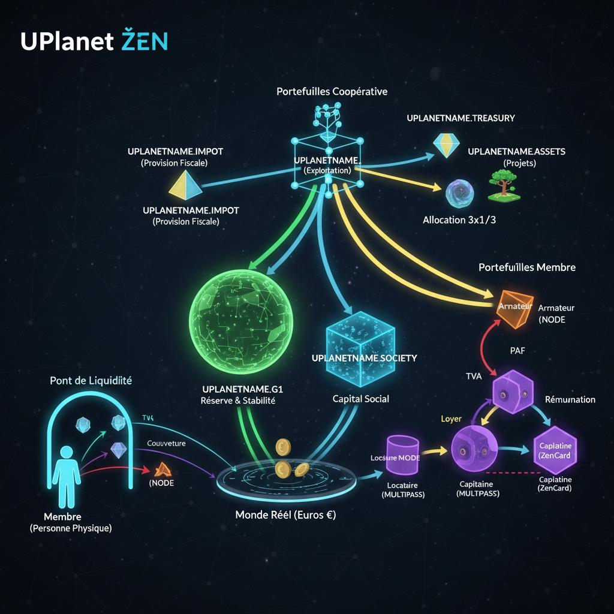

# **Modèle Économique Circulaire G1FabLab - Règle des 3 Tiers**

## **Partie I : Le Manifeste (Le "Pourquoi")**

### **Cadre : Une Coopérative d'Infrastructure Numérique**

Le G1FabLab est une **Coopérative d'Infrastructure Numérique** : on mutualise du matériel pour faire tourner un service, et ceux qui hébergent le service sont défrayés. Les membres (Parrains, Armateurs, Co-Bâtisseurs) mettent des ressources à disposition ; en contrepartie, ils perçoivent une redevance d'hébergement ou une indemnité, et non des dividendes.

### **Politique de Transparence Budgétaire**

Ce document définit la politique de transparence budgétaire et de redistribution des ressources au sein du collectif G1FabLab (hébergé par Open Collective Europe).

Notre objectif est d'assurer la pérennité de nos infrastructures numériques (Cloud Libre) et physiques (Stations UPlanet) via un modèle économique équitable : le **3x1/3**.

### **Extension des Logiciels de Comptabilité Traditionnels**

UPlanet complète et étend les logiciels de comptabilité traditionnels ("Paheko", "Sage", etc.) en créant tous les jetons qu'ils comptent et en les plaçant dans des **"portefeuilles programmables"**. Cette approche révolutionne la gestion comptable en automatisant les transactions et en offrant une traçabilité blockchain complète.

### **Les Trois Types de Jetons de Fonctionnement**

Dans toute organisation, il existe 3 types de jetons fondamentaux :

1. **Jetons d'Usage** → **MULTIPASS** : Facilitent les transactions quotidiennes et l'accès aux services
2. **Jetons de Contribution** → **ZEN Card** : Attestent de la mise à disposition de ressources (matériel, temps)
3. **Jetons de Gouvernance** → **UPassport** : Permettent la participation aux décisions collectives

### **Deux Mondes, Deux Géométries**

Pour comprendre la différence fondamentale entre l'économie du Ẑen et celle de l'Euro, il ne suffit pas de parler de technologie. Il faut parler de **géométrie**. Chaque système monétaire dessine un "monde" avec ses propres règles, ses propres trajectoires et sa propre expérience vécue.

#### **1. Le Monde de l'Euro : La Sphère de Poincaré**

L'économie de la monnaie-dette, dont l'Euro est un représentant, est un univers dont la géométrie est analogue à celle d'une **sphère**. C'est un monde soumis à la [conjecture de Poincaré](https://fr.wikipedia.org/wiki/Conjecture_de_Poincar%C3%A9).

*   **Ses Propriétés :** Fini, sans bord, non-euclidien. La monnaie est créée par la dette, instaurant une **rareté structurelle**. Les trajectoires que l'on pense parallèles sont en réalité **convergentes**, menant à une compétition inévitable.
*   **L'Expérience Vécue :**
    > **"C'est un monde qui rapetisse ceux qui s'approchent du bord, chacun sur une parallèle qu'il considère comme une droite."**
    Le "bord" est la limite de la solvabilité. En s'en approchant, les possibles de l'acteur se contractent, son énergie est dédiée au service de la dette, non à la création. C'est une **asphyxie économique et cognitive**.

#### **2. Le Monde du Ẑen : Le Plan Coopératif en Expansion**

L'économie du Ẑen est conçue pour avoir une géométrie radicalement différente : celle d'un **plan en expansion, ancré sur un socle coopératif**.


*Visualisation des flux de fonctionnement ẐEN dans l'écosystème coopératif UPlanet*

*   **Ses Propriétés :** Ouvert, infini en potentiel, collaboratif. Le Ẑen est créé par l'**apport de ressources réelles** (matériel, compétences) au collectif. L'espace est en expansion, rendant le jeu à **somme positive**.
*   **L'Expérience Vécue :**
    > **"C'est un monde qui grandit avec ceux qui construisent, chacun sur un chemin qui enrichit le territoire commun."**
    Le succès d'un membre augmente la valeur et la résilience de l'ensemble. Les possibles s'élargissent en même temps que ceux du collectif. C'est une **synergie économique et cognitive**, dont la physique transparente est inscrite dans le protocole.

Le Ẑen n'est pas une "alternative" à l'Euro. C'est une **invitation à changer de monde** et à choisir une nouvelle géométrie pour nos projets.

---

## **Partie II : La Charte de Redistribution Budgétaire (Les "Règles du Jeu")**

### **PRÉAMBULE "POUR LES NULS" : L'ANALOGIE DE L'ATELIER PARTAGÉ**

Notre écosystème fonctionne comme un **atelier partagé (FabLab)** :
*   **L'Armateur** = Le **Fournisseur de Ressources** qui met son matériel à disposition.
*   **Le Capitaine** = L'**Opérateur Technique** qui assure la maintenance et le bon fonctionnement.
*   **Les Usagers** = Les membres qui utilisent les services moyennant une **redevance d'usage**.
*   **Les Parrains** = Les **Contributeurs d'Infrastructure** qui financent l'équipement collectif.

Chaque redevance payée par un usager sert à défrayer l'opérateur et le fournisseur de matériel, et l'excédent permet au collectif d'acquérir des ressources communes durables.

### **PHILOSOPHIE : UNE COOPÉRATIVE DE MOYENS (Infrastructure Numérique)**

Le G1FabLab **ne génère pas de profits spéculatifs**. Il fonctionne comme une **coopérative d'infrastructure** : il collecte des contributions (dons, redevances de service) pour financer son fonctionnement. Chaque Euro collecté est immédiatement alloué selon une clé de répartition fixe garantissant que ceux qui travaillent et ceux qui mettent du matériel à disposition sont justement défrayés (indemnités et redevances d'hébergement, pas de dividendes).

### **LA RÈGLE DES 3 TIERS (Allocation des Contributions)**

Pour chaque service facturé ou contribution reçue (ex: Location d'un nœud de stockage, accès au service), le montant est divisé en trois parts égales :

#### **🟢 1/3 : La Réserve de Fonctionnement (Projet)**

**Objet :** Assurer la sécurité et la maintenance directe.

*   Paiement des charges incompressibles (Assurance, Frais Open Collective, Électricité directe).
*   Constitution d'une trésorerie de secours pour le remplacement du matériel en panne.
*   **Gestion :** Reste sur le compte Open Collective du projet (`UPLANETNAME_CASH` — Trésorerie).

#### **🔵 1/3 : Rétribution du Travail (Les Capitaines)**

**Objet :** Défrayer l'expertise humaine nécessaire au maintien du service.

*   Concerne les développeurs, administrateurs système, et coordinateurs ("Les Capitaines").
*   **Mécanisme :** Ces contributeurs facturent leurs prestations de service (Maintenance, Astreinte, Développement) au Collectif.
*   **Note :** Le Token ẐEN sert ici d'indicateur de performance pour valider le service fait avant facturation (`UPLANETNAME_RND`).

#### **🔴 1/3 : Rétribution des Infrastructures (Les Armateurs)**

**Objet :** Défrayer les fournisseurs du matériel et du foncier mis à disposition.

*   Le membre **Armateur** finance le déploiement matériel d'un nœud du réseau (parrainage infrastructure). En contrepartie de la mise à disposition de ce matériel et de son hébergement (électricité, réseau), l'Armateur facture une **redevance d'hébergement** au collectif (correspondant à 1/3 de la valorisation du service), réglée via le système de crédits internes.
*   Le réseau repose sur du matériel (Serveurs, Dômes, Capteurs) mis à disposition par des tiers ("Les Armateurs").
*   **Mécanisme :** Le Collectif verse une **indemnité d'occupation** ou un **loyer de matériel** aux fournisseurs, calculé pour amortir la mise à disposition initiale et couvrir l'usure.
*   **Exemple :** Si un Armateur met à disposition un Serveur d'une valeur de 500€, il perçoit une redevance d'hébergement (loyer) issue de l'activité de ce serveur (`UPLANETNAME_ASSETS`).

---

### **MODÈLE ÉCONOMIQUE DE FONCTIONNEMENT**

#### **1. Le Coût de Production du Service (Payé par CASH)**
Les coûts opérationnels sont payés par la **Trésorerie Coopérative** (`UPLANETNAME_CASH`). Total : **3x PAF = 42 Ẑen/semaine** :
*   **1x PAF (14 Ẑen) :** Versé au **NODE** (portefeuille Armateur) → loyer du matériel.
*   **2x PAF (28 Ẑen) :** Versé au **MULTIPASS Capitaine** → salaire personnel.

> **Séparation claire :** Le Capitaine REÇOIT son salaire sur son MULTIPASS personnel. Il ne prélève plus sur les redevances collectées.

#### **2. La Collecte des Redevances (CAPTAIN_DEDICATED)**
Les redevances d'usage des usagers sont collectées sur un portefeuille **CAPTAIN_DEDICATED** distinct :
*   **Loyer HT** (1 Ẑen MULTIPASS, 4 Ẑen ZenCard) → `CAPTAIN_DEDICATED`
*   **TVA (20%)** → `UPLANETNAME_IMPOT` (directement)

Ce portefeuille d'exploitation sert de **source pour l'allocation coopérative**.

#### **3. Allocation Collective 3x1/3 (depuis CAPTAIN_DEDICATED)**

**Déclenchement :** Hebdomadaire, synchronisé avec l'anniversaire d'inscription du Capitaine (fichier `~/.zen/game/nostr/$CAPTAINEMAIL/TODATE`).

**Processus d'allocation :**
```
CAPTAIN_DEDICATED (Surplus Brut)
│
├── 1. Provision IS (15-25%)
│   ├── 15% si surplus ≤ 42 500 € (taux réduit PME)
│   └── 25% si surplus > 42 500 € (taux normal)
│   └── Destination : UPLANETNAME_IMPOT
│
└── 2. Surplus Net = Surplus Brut - Provision IS
    │
    ├── 33.33% → CASH (UPLANETNAME_CASH) : Trésorerie opérationnelle
    ├── 33.33% → RnD (UPLANETNAME_RND) : Recherche & Développement
    └── 33.34% → ASSETS (UPLANETNAME_ASSETS) : Actifs réels régénératifs
```

**Condition d'exécution :** L'allocation n'a lieu que si le solde de `CAPTAIN_DEDICATED` est positif.

**Notification :** Un rapport HTML détaillé est envoyé par email au Capitaine après chaque allocation réussie.

---

## **Partie III : Le Code de la Route (Le "Comment")**

### **LE RÔLE DU TOKEN ẐEN (Comptabilité Analytique)**

Dans ce système, le ẐEN **n'est pas une monnaie financière convertible**, mais un **Jeton Utilitaire (Utility Token)** interne :

*   **Gouvernance & Transparence :** Il permet de tracer sur la Blockchain qui a fourni quoi (Preuve d'Apport) et qui a fait quoi (Preuve de Travail).
*   **Droits d'Usage :** Il donne accès aux services (Stockage, Hébergement) prioritairement.
*   **Clé de Répartition :** Il sert d'unité de compte pour calculer les factures que les Capitaines et Armateurs peuvent présenter à Open Collective en Euros.

### **CONFORMITÉ DES NOMS DE PORTEFEUILLES (Compta Interne)**

Les noms ci-dessous sont ceux utilisés dans les scripts (`UPLANET.init.sh`, `ZEN.ECONOMY.sh`, `ZEN.COOPERATIVE.3x1-3.sh`, `captain.sh`). Chaque wallet est identifié par un **nom logique** et un **fichier dunikey** dans `~/.zen/game/`.

| Nom logique (doc & code) | Fichier dunikey | Rôle |
| :--- | :--- | :--- |
| **UPLANETNAME_CASH** | `uplanet.CASH.dunikey` | Trésorerie (1/3) — réserve de fonctionnement |
| **UPLANETNAME_RND** | `uplanet.RnD.dunikey` | R&D (1/3) |
| **UPLANETNAME_ASSETS** | `uplanet.ASSETS.dunikey` | Actifs (1/3) |
| **UPLANETNAME_IMPOT** | `uplanet.IMPOT.dunikey` | Provisions fiscales (TVA, IS) |
| **CAPTAIN_DEDICATED** | `uplanet.captain.dunikey` | Collecte redevances (source 3x1/3) |
| **NODE** | `secret.NODE.dunikey` | Portefeuille Armateur (redevance hébergement) |

*Note :* La variable shell pour la clé publique de la trésorerie est parfois `UPLANETNAME_TREASURY` dans certains scripts (`_12345.sh`, `my.sh`) ; elle pointe sur le même wallet que **UPLANETNAME_CASH** (`uplanet.CASH.dunikey`).

### **ARCHITECTURE DU SYSTÈME**

| Script | Fonction | Fréquence |
| :--- | :--- | :--- |
| `uplanet_onboarding.sh` | **Assistant d'embarquement** - Configuration complète de la station | Au démarrage |
| `captain.sh` | **Dashboard Capitaine** - Tableau de bord économique et navigation | À la demande |
| `UPLANET.init.sh` | Initialisation de tous les portefeuilles (NODE, CAPTAIN, Collectifs) | Une seule fois |
| `ZEN.ECONOMY.sh` | Paiement PAF avec dégradation progressive + Burn 4-semaines | Hebdomadaire |
| `ZEN.COOPERATIVE.3x1-3.sh` | Provision IS + Allocation 3x1/3 depuis CAPTAIN_DEDICATED | Hebdomadaire (anniversaire Capitaine) |
| `NOSTRCARD.refresh.sh` | Collecte redevances MULTIPASS (1Ẑ HT + 0.2Ẑ TVA) | Hebdomadaire |
| `PLAYER.refresh.sh` | Collecte redevances ZEN Cards (4Ẑ HT + 0.8Ẑ TVA) | Hebdomadaire |
| `UPLANET.official.sh` | Émission Crédits Service officiels (Usagers & Parrains) | À la demande |
| `ECONOMY.broadcast.sh` | Diffusion Nostr de la santé économique (kind 30850) | Quotidien |
| `cooperative_config.sh` | Gestion configuration coopérative via DID NOSTR (kind 30800) | À la demande |
| `solar_time.sh` | Calcul heure solaire pour synchronisation distribuée | À la demande |

### **🔄 FLUX DE FONCTIONNEMENT DÉTAILLÉS (Cycle 7 jours)**

#### **📊 Synthèse des Flux Économiques**

```
┌─────────────────────────────────────────────────────────────────────────────┐
│                         CYCLE ÉCONOMIQUE HEBDOMADAIRE                        │
├─────────────────────────────────────────────────────────────────────────────┤
│                                                                              │
│  1️⃣ COLLECTE REDEVANCES (NOSTRCARD.refresh.sh / PLAYER.refresh.sh)          │
│     ┌───────────────────┐                                                    │
│     │ MULTIPASS/ZenCard │                                                    │
│     └─────────┬─────────┘                                                    │
│               │                                                              │
│       ┌───────┴───────┐                                                      │
│       ▼               ▼                                                      │
│  ┌─────────┐    ┌─────────────┐                                              │
│  │ HT      │    │ TVA (20%)   │                                              │
│  │ CAPTAIN │    │ IMPOTS      │                                              │
│  │ DEDICATED│    └─────────────┘                                              │
│  └────┬────┘                                                                 │
│       │                                                                      │
│  2️⃣ PAIEMENT PAF (ZEN.ECONOMY.sh)                                            │
│       │                                                                      │
│  ┌────┴────────────────────────────────────────────────────────────────┐     │
│  │ CASH (Trésorerie)                                                   │     │
│  └────┬───────────────────────────┬────────────────────────────────────┘     │
│       │                           │                                          │
│       ▼                           ▼                                          │
│  ┌─────────────┐           ┌─────────────────┐                               │
│  │ NODE        │           │ CAPTAIN MULTIPASS│                               │
│  │ (Armateur)  │           │ (Salaire perso)  │                               │
│  │ 14 Ẑen/sem  │           │ 28 Ẑen/sem       │                               │
│  └─────────────┘           └─────────────────┘                               │
│                                                                              │
│  3️⃣ ALLOCATION 3x1/3 (ZEN.COOPERATIVE.3x1-3.sh)                              │
│     Déclencheur: Anniversaire Capitaine (TODATE)                             │
│       │                                                                      │
│  ┌────┴────────────────────────────────────────────────────────────────┐     │
│  │ CAPTAIN_DEDICATED (Surplus Brut)                                    │     │
│  └────┬────────────────────────────────────────────────────────────────┘     │
│       │                                                                      │
│       ▼                                                                      │
│  ┌─────────────────────────┐                                                 │
│  │ IS (15% ≤42.5k€ / 25%)  │───────────▶ IMPOTS                              │
│  └────────────┬────────────┘                                                 │
│               │                                                              │
│               ▼ Surplus Net                                                  │
│       ┌───────┼───────┐                                                      │
│       │       │       │                                                      │
│       ▼       ▼       ▼                                                      │
│  ┌────────┐ ┌─────┐ ┌────────┐                                               │
│  │ CASH   │ │ RnD │ │ ASSETS │                                               │
│  │ 33.33% │ │33.33%│ │ 33.34% │                                               │
│  └────────┘ └─────┘ └────────┘                                               │
│                                                                              │
└─────────────────────────────────────────────────────────────────────────────┘
```

#### **MULTIPASS (NOSTR Cards) - `NOSTRCARD.refresh.sh`**
```
Redevance MULTIPASS : 1 Ẑ HT/semaine + 0.2 Ẑ TVA (20%)
├── 1.0 Ẑ → CAPTAIN_DEDICATED (recettes exploitation - source pour 3x1/3)
└── 0.2 Ẑ → UPLANETNAME_IMPOT (provision TVA)
```
- **Gestion** : Prélèvement automatique tous les 7 jours depuis la date d'inscription
- **Heure** : Aléatoire par usager (éviter simultanéité)
- **Contrôle** : Suspension automatique si crédit insuffisant

#### **ZEN Cards - `PLAYER.refresh.sh`**
```
Redevance ZEN Card : 4 Ẑ HT/semaine + 0.8 Ẑ TVA (20%)
├── 4.0 Ẑ → CAPTAIN_DEDICATED (recettes exploitation - source pour 3x1/3)
└── 0.8 Ẑ → UPLANETNAME_IMPOT (provision TVA)
```
- **Services** : 128Go stockage (NOSTR/MULTIPASS)
- **Gestion** : Cycle 7 jours depuis BIRTHDATE
- **Contrôle** : Suspension si crédit < 6.8 Ẑ (4+0.8+1 sécurité)

#### **Parrains d'Infrastructure - Statut Spécial**
```
Contribution Parrainage : 50 Ẑ (versement unique annuel)
├── Services Premium : 128Go NextCloud inclus
├── Statut : Parrain d'Infrastructure avec droit de vote consultatif
└── Exemption : Pas de redevance hebdomadaire (1 an)
```
- **Fichier** : `~/.zen/game/players/${PLAYER}/U.SOCIETY`
- **Validité** : 365 jours depuis inscription
- **Renouvellement** : Automatique ou manuel

#### **💰 Coûts Hebdomadaires (PAF - Participation Aux Frais)**

##### **Infrastructure NODE - `ZEN.ECONOMY.sh`**
```
PAF Hebdomadaire : 14 Ẑ/semaine (1.4 Ğ1)
├── Source (cascade) :
│   ├── Phase 0 : CASH (UPLANETNAME_CASH) 🟢
│   ├── Phase 1 : ASSETS (UPLANETNAME_ASSETS) 🟡
│   └── Phase 2 : RnD (UPLANETNAME_RND) 🟠
├── Destination : NODE (portefeuille Armateur)
└── Objectif : Électricité + Internet + Maintenance
```

##### **Rétribution CAPTAIN (Salaire Personnel)**
```
Indemnité Opérateur : 28 Ẑ/semaine (2x PAF)
├── Source (cascade) :
│   ├── Phase 0 : CASH (UPLANETNAME_CASH) 🟢
│   ├── Phase 1 : ASSETS (UPLANETNAME_ASSETS) 🟡
│   └── Phase 2 : RnD (UPLANETNAME_RND) 🟠
├── Destination : CAPTAIN MULTIPASS (revenus personnels)
├── Nature : Rétribution de prestation (BNC)
└── Périodicité : Hebdomadaire (synchronisé heure solaire)
```

##### **Conversion Fiat (Burn PAF)**
```
Burn Mensuel : 56 Ẑ (4 semaines × 14 Ẑ)
├── NODE → OpenCollective (transparence)
├── Usage : Paiement charges réelles (€)
└── Conformité : ACPR + comptabilité publique
```

#### **🏛️ Provisions Fiscales Automatiques**

##### **TVA Collectée**
```
UPLANETNAME_IMPOT : 20% × (MULTIPASS + ZEN Cards)
├── MULTIPASS : 0.2 Ẑ × N usagers/semaine
├── ZEN Cards : 0.8 Ẑ × N cartes/semaine
└── Déclaration : Mensuelle (CA3)
```

##### **Répartition Collective 3x1/3 - `ZEN.COOPERATIVE.3x1-3.sh`**
```
Source : CAPTAIN_DEDICATED (recettes d'exploitation - loyers HT collectés)
Déclencheur : Anniversaire hebdomadaire du Capitaine (TODATE)
Condition : Solde CAPTAIN_DEDICATED > 0

Flux d'allocation :
┌─────────────────────────────────────────────────────────────┐
│ CAPTAIN_DEDICATED (Surplus Brut)                             │
└───────────────────────┬─────────────────────────────────────┘
                        │
                        ▼
┌─────────────────────────────────────────────────────────────┐
│ 1. PROVISION IS (Impôt sur les Sociétés)                     │
│    ├── 15% si surplus ≤ 42 500 € (taux réduit PME)           │
│    └── 25% si surplus > 42 500 € (taux normal)               │
│    → Destination : UPLANETNAME_IMPOT                         │
└───────────────────────┬─────────────────────────────────────┘
                        │
                        ▼
┌─────────────────────────────────────────────────────────────┐
│ 2. SURPLUS NET = Surplus Brut - Provision IS                 │
└───────────────────────┬─────────────────────────────────────┘
                        │
        ┌───────────────┼───────────────┐
        │               │               │
        ▼               ▼               ▼
┌───────────────┐ ┌───────────────┐ ┌───────────────┐
│ CASH (33.33%) │ │ RnD (33.33%)  │ │ ASSETS(33.34%)│
│ Trésorerie    │ │ Innovation    │ │ Biens Réels   │
└───────────────┘ └───────────────┘ └───────────────┘
```

**Fichiers clés :**
- Marqueur d'allocation : `~/.zen/game/.cooperative_allocation.done`
- Rapport HTML : `~/.zen/tmp/cooperative_allocation_report_${TODATE}.html`

#### **📈 Modèle de Fonctionnement par Usager (Immobilier Numérique)**

##### **Usager Standard (MULTIPASS + ZEN Card)**
```
Coût Total : 5 Ẑ HT + 1 Ẑ TVA = 6 Ẑ/semaine
├── Services : 128Go NextCloud + NOSTR
├── Équivalent : Studio + Appartement premium
├── Contribution UPlanet : 6 Ẑ/semaine
└── Excédent Collectif : Surplus après PAF
```

##### **Parrain d'Infrastructure (Crédit Service Annuel)**
```
Contribution : 50 Ẑ (crédit service annuel)
├── Services : 128Go + Premium + Voix consultative
├── Période : 365 jours sans redevance
├── Équivalent : Parrain avec droits d'usage étendus
└── Avantage : Accès prioritaire aux nouveaux services
```

##### **Capacité Infrastructure par Satellite**
```
Raspberry Pi 5 + NVMe 4To (Recommandé)
├── uDRIVE (10Go) : ~400 espaces possibles
├── NextCloud (128Go) : ~30 espaces possibles  
├── Optimisation : Gestion automatique des espaces
└── Contrainte : Capacité disque limite les services
```

**Référence Technique :** [Guide complet Raspberry Pi 5 + NVMe 4To](https://pad.p2p.legal/s/RaspberryPi#)

### **CONFIGURATION**

#### **🔑 Identité UPlanet : swarm.key**

Chaque constellation UPlanet est identifiée par son **swarm.key IPFS** qui sert de secret partagé :

```bash
# Le UPLANETNAME est extrait du swarm.key (identique sur tous les nœuds)
UPLANETNAME=$(cat ~/.ipfs/swarm.key | tail -n 1)
```

**Rôle du UPLANETNAME :**
1. **Seed cryptographique** : Génère tous les portefeuilles coopératifs de manière déterministe
2. **Clé de chiffrement** : SHA256($UPLANETNAME) chiffre les valeurs sensibles (AES-256-CBC)
3. **Identité commune** : Tous les nœuds avec le même swarm.key partagent la même économie

> ⚠️ **SÉCURITÉ** : Le `swarm.key` est le secret absolu de la constellation. Ne JAMAIS le partager publiquement.

#### **🌐 Configuration Coopérative (DID NOSTR)**

Les paramètres partagés entre **toutes les stations de l'essaim** sont stockés dans le DID NOSTR (kind 30800, d-tag: "cooperative-config") :

```
┌─────────────────────────────────────────────────────────────────────────────┐
│  DID NOSTR UPLANETNAME_G1 (kind 30800)                                       │
│  Identité : uplanet.G1.nostr (dérivée de $UPLANETNAME.G1)                    │
├─────────────────────────────────────────────────────────────────────────────┤
│                                                                              │
│  PARAMÈTRES FISCAUX (publics)          PARAMÈTRES ÉCONOMIQUES (publics)     │
│  ┌─────────────────────────────┐       ┌─────────────────────────────┐      │
│  │ TVA_RATE: "20.0"            │       │ TREASURY_PERCENT: "33.33"   │      │
│  │ IS_RATE_REDUCED: "15.0"     │       │ RND_PERCENT: "33.33"        │      │
│  │ IS_RATE_NORMAL: "25.0"      │       │ ASSETS_PERCENT: "33.34"     │      │
│  │ IS_THRESHOLD: "42500"       │       │ ZENCARD_SATELLITE: "50"     │      │
│  └─────────────────────────────┘       │ ZENCARD_CONSTELLATION: "540"│      │
│                                        └─────────────────────────────┘      │
│  SECRETS CHIFFRÉS (AES-256-CBC avec SHA256($UPLANETNAME))                   │
│  ┌─────────────────────────────────────────────────────────────────────┐    │
│  │ OPENCOLLECTIVE_PERSONAL_TOKEN: "iv:encrypted_base64..."             │    │
│  │ OPENCOLLECTIVE_API_KEY: "iv:encrypted_base64..."                    │    │
│  │ PLANTNET_API_KEY: "iv:encrypted_base64..."                          │    │
│  └─────────────────────────────────────────────────────────────────────┘    │
│                                                                              │
└─────────────────────────────────────────────────────────────────────────────┘
```

**Utilisation dans les scripts :**
```bash
# Charger les variables coopératives (auto-déchiffrement)
source ~/.zen/Astroport.ONE/tools/cooperative_config.sh
coop_load_env_vars

# Variables maintenant disponibles :
echo "TVA: $TVA_RATE%"
echo "IS réduit: $IS_RATE_REDUCED%"
echo "Token OC: $OPENCOLLECTIVE_PERSONAL_TOKEN"  # Déchiffré automatiquement
```

**Gestion via CLI :**
```bash
# Lister la configuration
cooperative_config.sh list

# Modifier une valeur (auto-chiffre si sensible)
cooperative_config.sh set TVA_RATE "20.0"
cooperative_config.sh set OPENCOLLECTIVE_PERSONAL_TOKEN "mon_token_secret"

# Synchroniser depuis NOSTR
cooperative_config.sh refresh
```

#### **Configuration Locale (.env)**
Les variables **spécifiques à chaque station** sont définies dans `~/.zen/Astroport.ONE/.env` :
- `PAF` : Participation Aux Frais hebdomadaire (spécifique à la station)
- `MACHINE_VALUE_ZEN` : Valorisation de la machine
- `myRELAY`, `myIPFS`, etc. : Endpoints réseau locaux

#### **Configuration Coopérative (DID NOSTR)**
Les variables partagées entre toutes les stations de l'essaim sont stockées dans le DID NOSTR de `UPLANETNAME_G1` (kind 30800, d-tag "cooperative-config") :

| Variable | Description | Chiffrée |
| :--- | :--- | :--- |
| `NCARD` | Tarif MULTIPASS (Ẑen/semaine) | Non |
| `ZCARD` | Tarif ZEN Card (Ẑen/semaine) | Non |
| `TVA_RATE` | Taux de TVA (%) | Non |
| `IS_RATE_REDUCED` | Taux IS réduit (%) | Non |
| `IS_RATE_NORMAL` | Taux IS normal (%) | Non |
| `ZENCARD_SATELLITE` | Prix part sociale Satellite (€) | Non |
| `ZENCARD_CONSTELLATION` | Prix part sociale Constellation (€) | Non |
| `TREASURY_PERCENT` | Part Trésorerie (%) | Non |
| `RND_PERCENT` | Part R&D (%) | Non |
| `ASSETS_PERCENT` | Part Actifs (%) | Non |
| `OPENCOLLECTIVE_PERSONAL_TOKEN` | Token API OpenCollective | **Oui** (AES-256-CBC) |
| `OPENCOLLECTIVE_API_KEY` | Clé API OpenCollective | **Oui** (AES-256-CBC) |
| `PLANTNET_API_KEY` | Clé API PlantNet | **Oui** (AES-256-CBC) |

**Sécurité :** Les valeurs sensibles (TOKEN, SECRET, KEY, PASSWORD, API) sont automatiquement chiffrées avec `$UPLANETNAME` (AES-256-CBC) avant publication sur NOSTR.

**Utilisation :**
```bash
# Charger la configuration coopérative
source ~/.zen/Astroport.ONE/tools/cooperative_config.sh

# Récupérer une valeur (auto-déchiffrement)
TVA=$(coop_config_get "TVA_RATE")

# Définir une valeur (auto-chiffrement si sensible)
coop_config_set "OPENCOLLECTIVE_PERSONAL_TOKEN" "votre_token"

# Lister toutes les clés
coop_config_list

# Actualiser depuis le DID
coop_config_refresh
```

Les portefeuilles sont initialisés automatiquement par `UPLANET.init.sh` avec source primale unique `UPLANETNAME_G1`.

### **NOUVEAUTÉS SYSTÈME**
- **Burn 4-semaines** : NODE → UPLANETNAME_G1 → OpenCollective (56Ẑ toutes les 4 semaines)
- **Mise à disposition machine** : ZEN Card → NODE (une seule fois, valeur machine en Ẑen)
- **TVA fiscalement correcte** : Répartition directe MULTIPASS → CAPTAIN HT + IMPOTS TVA
- **Initialisation cohérente** : Tous les portefeuilles initialisés depuis `UPLANETNAME_G1`
- **Dégradation progressive** : Système de phases avant faillite avec alertes précoces
- **Gestion Essaim (Swarm)** : Portefeuilles partagés entre toutes les stations d'un même essaim
- **Synchronisation Solaire** : Paiements décalés selon la longitude pour éviter les conflits
- **Broadcast Nostr** : Diffusion de la santé économique vers la constellation (kind 30850)
- **Configuration Coopérative DID** : Paramètres partagés via NOSTR (kind 30800) avec chiffrement automatique
- **Assistant d'embarquement** : `uplanet_onboarding.sh` avec configuration rapide pour nouveaux capitaines
- **Dashboard Capitaine** : `captain.sh` avec gestion centralisée de la configuration coopérative

---

### **🏴‍☠️ EMBARQUEMENT DU CAPITAINE**

L'embarquement d'un nouveau capitaine est facilité par deux scripts complémentaires qui guident la configuration complète de la station.

#### **Assistant d'Embarquement (`uplanet_onboarding.sh`)**

Script interactif principal pour la configuration initiale :

```bash
~/.zen/Astroport.ONE/uplanet_onboarding.sh
```

**Options du menu :**
- `1-9` : Étapes individuelles de configuration
- `a` : **Embarquement complet automatique** (toutes les étapes)
- `q` : **⚡ Configuration RAPIDE** (recommandé pour nouveaux capitaines)
- `s` : Synchronisation configuration coopérative (DID)
- `c` : Vérifier la configuration actuelle
- `d` : Accès direct au Dashboard Capitaine

**Mode Configuration Rapide (`q`) :**
```
1. Configuration économique (valeurs recommandées)
   → PAF: 14 Ẑen/semaine, MULTIPASS: 1 Ẑen, ZEN Card: 4 Ẑen

2. Détection automatique de la machine
   → CPU, RAM, Disque → Valorisation automatique

3. Détection du mode (ORIGIN/ẐEN)
   → Selon présence de swarm.key

4. Initialisation UPLANET
   → Création des portefeuilles coopératifs

5. Création compte Capitaine
   → MULTIPASS + ZEN Card automatiques
```

#### **Dashboard Capitaine (`captain.sh`)**

Interface de gestion quotidienne pour le capitaine :

```bash
~/.zen/Astroport.ONE/captain.sh
```

**Fonctionnalités principales :**
- 📊 **Tableau de bord économique** : Soldes portefeuilles, statistiques utilisateurs
- 🌐 **Économie de l'essaim** : État de toutes les stations du réseau
- ⚙️ **Configuration coopérative (DID)** : Gestion des paramètres partagés
- 🔐 **Clés API chiffrées** : Configuration OpenCollective, PlantNet
- 📢 **Broadcast NOSTR** : Communication réseau

**Menu Configuration Coopérative (`c`) :**
```
1. Lister toutes les clés de configuration
2. Modifier une valeur
3. Actualiser depuis le DID
4. Publier config locale vers DID
5. Configurer clé API (chiffrée)
```

#### **Flux d'Embarquement Recommandé**

```
┌─────────────────────────────────────────────────────────────────┐
│                    EMBARQUEMENT CAPITAINE                        │
├─────────────────────────────────────────────────────────────────┤
│                                                                  │
│  1. install.sh                                                   │
│     └── Installation Astroport.ONE                               │
│                                                                  │
│  2. uplanet_onboarding.sh (option 'q' = rapide)                  │
│     ├── Configuration économique                                 │
│     ├── Valorisation machine                                     │
│     ├── Choix mode ORIGIN/ẐEN                                    │
│     └── Appel UPLANET.init.sh                                    │
│                                                                  │
│  3. UPLANET.init.sh (automatique)                                │
│     ├── Création portefeuilles coopératifs                       │
│     ├── Initialisation configuration DID                         │
│     └── Appel captain.sh                                         │
│                                                                  │
│  4. captain.sh (automatique)                                     │
│     ├── Création MULTIPASS                                       │
│     ├── Création ZEN Card                                        │
│     └── Inscription Armateur                                     │
│                                                                  │
│  ✅ Station opérationnelle !                                     │
│                                                                  │
└─────────────────────────────────────────────────────────────────┘
```

#### **Synchronisation Configuration Essaim**

Toutes les stations d'un même essaim IPFS partagent la même configuration coopérative via le DID NOSTR :

```
┌─────────────────────────────────────────────────────────────────┐
│                    ESSAIM IPFS (swarm.key)                       │
├─────────────────────────────────────────────────────────────────┤
│                                                                  │
│  ┌──────────────────────────────────────────────────────────┐   │
│  │          DID NOSTR UPLANETNAME_G1 (kind 30800)           │   │
│  │          d-tag: "cooperative-config"                      │   │
│  ├──────────────────────────────────────────────────────────┤   │
│  │  NCARD=1, ZCARD=4, TVA_RATE=20.0, ...                    │   │
│  │  OPENCOLLECTIVE_TOKEN=[chiffré]                          │   │
│  │  PLANTNET_API_KEY=[chiffré]                              │   │
│  └──────────────────────────────────────────────────────────┘   │
│                           │                                      │
│              ┌────────────┼────────────┐                         │
│              ▼            ▼            ▼                         │
│         Station A    Station B    Station C                      │
│         (Paris)      (Lyon)       (Marseille)                    │
│              │            │            │                         │
│         .env local   .env local   .env local                     │
│         PAF=14       PAF=12       PAF=16                         │
│                                                                  │
└─────────────────────────────────────────────────────────────────┘
```

**Règle de synchronisation :**

| Type | Stockage | Variables | Pourquoi |
| :--- | :--- | :--- | :--- |
| **Coopératifs** | DID NOSTR (partagés) | TVA_RATE, IS_RATE_*, ZENCARD_*, *_PERCENT, tokens API | Uniformité légale/fiscale |
| **Locaux** | `.env` (spécifiques) | PAF, MACHINE_VALUE_ZEN, myRELAY, myIPFS | Adaptation à l'infrastructure locale |

**Clé de partage :** Le fichier `~/.ipfs/swarm.key` est **identique** sur tous les nœuds de la constellation, permettant :
1. La génération des **mêmes portefeuilles** sur chaque nœud
2. Le **déchiffrement** des valeurs sensibles du DID NOSTR
3. L'**authentification** mutuelle des nœuds

---

### **🚨 SYSTÈME DE DÉGRADATION PROGRESSIVE (Avant Faillite)**

Le système ẐEN Economy implémente une **cascade de dégradation progressive** au lieu d'une faillite brutale. Ce mécanisme transparent informe les Parrains et Armateurs (co-bâtisseurs de l'infrastructure) de l'état financier tout en préservant les opérations.

#### **Philosophie : Transparence et Motivation**

> **"Chaque phase de dégradation est une opportunité d'action collective, pas une sentence."**

L'objectif n'est pas de masquer les difficultés, mais de les rendre visibles et compréhensibles pour que tous les acteurs puissent réagir et contribuer à la santé de la coopérative.

#### **Les 4 Phases Opérationnelles**

```
Phase 0 : NORMAL (🟢 healthy)
├── Source PAF : CASH (Trésorerie)
├── Runway : > 8 semaines
└── Message : "La coopérative fonctionne normalement"

Phase 1 : RALENTISSEMENT CROISSANCE (🟡 growth_slowdown)
├── Source PAF : ASSETS (Ressources Durables)
├── Condition : CASH épuisé, ASSETS disponible
├── Impact : Ralentissement des acquisitions d'actifs
└── Message : "Pas de nouvelles ressources ce mois-ci"

Phase 2 : RALENTISSEMENT INNOVATION (🟠 innovation_slowdown)
├── Source PAF : RnD (Budget R&D)
├── Condition : CASH + ASSETS épuisés, RnD disponible
├── Impact : Gel des investissements R&D
└── Message : "Développements suspendus temporairement"

Phase 3 : FAILLITE (🔴 critical)
├── Source PAF : Aucune
├── Condition : CASH + ASSETS + RnD < PAF requise
├── Impact : Arrêt des services
└── Message : "Action urgente requise"
```

#### **Traçabilité des Paiements par Phase**

Le marqueur de paiement inclut la phase pour une traçabilité complète :
```
UPLANET:${UPLANETG1PUB:0:8}:$WEEK_KEY:PHASE#:NODE#:CPT#

Exemples :
- UPLANET:AbCd1234:2026-W02:PHASE0:NODE✓:CPT✓  (Normal, tout depuis CASH)
- UPLANET:AbCd1234:2026-W02:PHASE1:NODE✓:CPT✓  (NODE depuis ASSETS)
- UPLANET:AbCd1234:2026-W02:PHASE2:NODE✓:CPT✓  (NODE depuis RnD)
- UPLANET:AbCd1234:2026-W02:PHASE3:FAIL        (Faillite)
```

#### **Alertes et Notifications**

##### **Alertes PAF (ZEN.ECONOMY.sh)**
Chaque changement de phase déclenche une notification aux actionnaires :

| Phase | Template | Canal | Contenu |
| :--- | :--- | :--- | :--- |
| 1 | `pre_bankruptcy.html` | Email | Alerte croissance, soldes, appel à contribution |
| 2 | `pre_bankruptcy.html` | Email | Alerte innovation, impact R&D, situation critique |
| 3 | `bankrupt.html` | Email + Nostr DM | Faillite totale, suspension services |

##### **Alertes Allocation Coopérative (ZEN.COOPERATIVE.3x1-3.sh)**
En cas d'échec d'une allocation 3x1/3, le système déclenche des alertes :

| Type | Destinataires | Contenu |
| :--- | :--- | :--- |
| Rapport Hebdomadaire | Capitaine | `cooperative_allocation_report.html` - Détails des allocations réussies |
| Alerte Faillite | Tous les usagers | `bankrupt.html` - Liste des allocations échouées, déficit calculé, plan de redressement |

**Détection automatique :** Le script vérifie le succès de chaque transaction (TAX, TREASURY, RND, ASSETS). Si une seule échoue, l'alerte faillite est envoyée à **tous les utilisateurs MULTIPASS** pour transparence collective.

---

### **🌐 GESTION D'ESSAIM (SWARM MANAGEMENT)**

Le système UPlanet permet le déploiement de **plusieurs stations** partageant la même identité économique. Cette architecture distribuée offre résilience et scalabilité.

#### **Portefeuilles Partagés vs Locaux**

```
PORTEFEUILLES PARTAGÉS (Identiques sur toutes les stations)
├── CASH (UPLANETNAME_CASH) : Trésorerie commune
├── ASSETS (UPLANETNAME_ASSETS) : Ressources durables communes
├── RnD (UPLANETNAME_RND) : Budget R&D commun
├── IMPOT (UPLANETNAME_IMPOT) : Provisions fiscales communes
└── Dérivés de : UPLANETNAME (clé secrète de l'essaim IPFS)

PORTEFEUILLES LOCAUX (Propres à chaque station)
├── NODE : Portefeuille de l'armateur local
├── CAPTAIN_MULTIPASS : Rétribution du capitaine local
├── CAPTAIN_DEDICATED : Collecte redevances locale
└── Dérivés de : Coordonnées GPS + IPFSNODEID
```

#### **Identification de l'Essaim**

> ⚠️ **SÉCURITÉ** : La variable `UPLANETNAME` est le **secret partagé** de l'essaim IPFS. Elle ne doit **JAMAIS** être communiquée publiquement.

**Identifiants Publics :**
| Identifiant | Source | Usage |
| :--- | :--- | :--- |
| `swarm_id` | `UPLANETG1PUB` (clé publique G1) | Identification unique de l'essaim |
| `station:name` | `myDAMAIN` ou `IPFSNODEID:0:12` | Nom lisible de la station |
| `station` | `IPFSNODEID` | Identifiant technique IPFS |

#### **Dashboard Essaim : `economy.Swarm.html`**

Interface de visualisation agrégée de la santé économique de l'essaim :

```
┌─────────────────────────────────────────────────────────────┐
│  🌍 SWARM ECONOMY DASHBOARD                                 │
├─────────────────────────────────────────────────────────────┤
│  PORTEFEUILLES PARTAGÉS (affichés une seule fois)           │
│  ├── 💰 CASH: 1,234.56 Ẑ                                    │
│  ├── 🌳 ASSETS: 567.89 Ẑ                                    │
│  └── 🔬 RnD: 890.12 Ẑ                                       │
├─────────────────────────────────────────────────────────────┤
│  STATIONS DE L'ESSAIM                                       │
│  ┌───────────────┬────────┬──────────┬──────────────┐       │
│  │ Station       │ Status │ Runway   │ Sync ⏰      │       │
│  ├───────────────┼────────┼──────────┼──────────────┤       │
│  │ copylaradio   │ 🟢     │ 12 sem   │ 20:12 (+0h) │       │
│  │ station-paris │ 🟡     │ 6 sem    │ 20:24 (+12m)│       │
│  │ station-nyc   │ 🟢     │ 14 sem   │ 14:12 (-6h) │       │
│  └───────────────┴────────┴──────────┴──────────────┘       │
└─────────────────────────────────────────────────────────────┘
```

---

### **⏰ SYNCHRONISATION SOLAIRE (Paiements Distribués)**

Pour éviter les **conditions de concurrence** sur les portefeuilles partagés, chaque station exécute ses paiements à une heure différente, calculée selon sa **longitude géographique**.

#### **Principe : Heure Solaire Locale**

```bash
# solar_time.sh calcule l'heure légale correspondant à 20h12 solaire
# pour une position GPS donnée

Formule :
SOLAR_OFFSET = (Longitude / 15) × 60  # minutes

Exemples :
- Paris (2.35°E)    → +9 min  → Paiement à 20:21 CET
- New York (-74°W)  → -296 min → Paiement à 15:16 EST
- Tokyo (139.69°E)  → +559 min → Paiement à 05:31+1 JST
```

#### **Script `solar_time.sh`**

```bash
# Usage : solar_time.sh <latitude> <longitude>
# Retourne l'heure légale pour 20h12 solaire

SOLAR_TIME="20:12"
LEGAL_TIME=$(calculate_offset "$LONGITUDE")

# Le script ZEN.ECONOMY.sh attend cette heure avant exécution
```

#### **Avantages de la Synchronisation Solaire**

1. **Pas de conflits** : Chaque station a son créneau horaire unique
2. **Répartition mondiale** : Paiements étalés sur 24h
3. **Prédictibilité** : Heure fixe pour chaque station
4. **Traçabilité** : Tag `sync:solar_offset` dans les événements Nostr

---

### **📡 DIFFUSION SANTÉ ÉCONOMIQUE (Nostr kind 30850)**

Le script `ECONOMY.broadcast.sh` diffuse l'état économique de chaque station vers la constellation Nostr, permettant une visibilité globale.

#### **Événement Nostr kind 30850**

```json
{
  "kind": 30850,
  "content": {
    "station": {
      "ipfsnodeid": "Qm...",
      "name": "copylaradio.com",
      "swarm_id": "GEf...",
      "geo": { "lat": 48.8566, "lon": 2.3522 }
    },
    "wallets": {
      "cash": { "balance_zen": 1234.56, "g1_pubkey": "..." },
      "rnd": { "balance_zen": 567.89, "g1_pubkey": "..." },
      "assets": { "balance_zen": 890.12, "g1_pubkey": "..." }
    },
    "health": {
      "status": "healthy",
      "bilan": 2692.57,
      "runway_weeks": 64,
      "degradation_phase": 0
    },
    "users": {
      "multipass_total": 150,
      "zencard_renters": 45,
      "zencard_owners": 12
    }
  },
  "tags": [
    ["d", "uplanet-economy-2026-W02"],
    ["week", "2026-W02"],
    ["constellation", "UPlanetV1"],
    ["station", "Qm..."],
    ["station:name", "copylaradio.com"],
    ["swarm_id", "GEf..."],
    ["geo:lat", "48.8566"],
    ["geo:lon", "2.3522"],
    ["sync:solar_offset", "+00:09"],
    ["health:status", "healthy"],
    ["health:bilan", "2692.57"],
    ["health:runway", "64"],
    ["health:degradation_phase", "0"]
  ]
}
```

#### **Publication via Relai Local**

```bash
# ECONOMY.broadcast.sh utilise le relai strfry local
# via nostpy-cli pour la publication

nostpy-cli send_event \
    -privkey "$CAPTAIN_PRIVKEY_HEX" \
    -kind 30850 \
    -content "$CONTENT_JSON" \
    -tags "$TAGS_JSON" \
    --relay "wss://${myDAMAIN}/relay"

# Fallback : strfry import direct si nostpy-cli échoue
./strfry import --no-verify < "$EVENT_FILE"
```

#### **Collecte et Agrégation**

Le dashboard `economy.Swarm.html` collecte les événements kind 30850 :
- Filtre par `constellation: UPlanetV1` et `swarm_id`
- Agrège les données de toutes les stations
- Affiche les portefeuilles partagés **une seule fois** (pas de somme)
- Liste les stations avec leur statut et synchronisation

---

### **🔗 SYNCHRONISATION CONSTELLATION (amisOfAmis.txt)**

Pour que les relais strfry de la constellation synchronisent correctement les événements, les clés HEX des entités géographiques et du système doivent être dans `amisOfAmis.txt`.

#### **Principe : Friends of Friends (N²)**

```
CONSTELLATION SYNC = Graphe N² (Amis d'Amis)
├── Chaque station a son CAPTAIN_HEX (identité Nostr du capitaine)
├── Chaque UMAP a son UMAPHEX (identité Nostr de la zone géographique)
├── Chaque SECTOR a son SECTORHEX (identité Nostr du secteur 0.1°)
├── Chaque REGION a son REGIONHEX (identité Nostr de la région 1°)
└── uplanet.G1.nostr = HEX de l'Oracle Central (N² Memory)
```

#### **Fichier `~/.zen/strfry/amisOfAmis.txt`**

Ce fichier contient les clés HEX publiques autorisées pour la synchronisation :

```bash
# Structure du fichier (une clé HEX par ligne)
a1b2c3d4e5f6...  # CAPTAIN_HEX - Capitaine station 1
f6e5d4c3b2a1...  # UMAP_43.12_-1.45 - Zone géographique
1234567890ab...  # SECTOR_43.1_-1.4 - Secteur
abcdef123456...  # REGION_43_-1 - Région
deadbeef1234...  # uplanet.G1.nostr - Oracle Central
```

#### **Ajout Automatique (NODE.refresh.sh)**

Le script `NODE.refresh.sh` ajoute automatiquement les clés géographiques **LOCALES** uniquement :

```bash
# Clés ajoutées à amisOfAmis.txt (FILTRAGE LOCAL)
# Seules les clés gérées par CE nœud sont ajoutées (pas les clés du swarm)

├── uplanet.G1.nostr HEX (Oracle Central - N² Memory)
│
├── ~/.zen/tmp/${IPFSNODEID}/UPLANET/__/_*_*/_*_*/_*_*/HEX
│   └── UMAPs LOCALES uniquement (zones avec amis actifs sur ce nœud)
│
├── ~/.zen/tmp/${IPFSNODEID}/UPLANET/SECTORS/_*_*/_*_*/SECTORHEX
│   └── SECTORs LOCAUX uniquement (agrégation de ce nœud)
│
├── ~/.zen/tmp/${IPFSNODEID}/UPLANET/REGIONS/_*_*/REGIONHEX
│   └── REGIONs LOCALES uniquement (agrégation de ce nœud)
│
└── ~/.zen/game/nostr/UNODE_*/HEX
    └── Autres nœuds de la constellation (toujours ajoutés)
```

> ⚠️ **IMPORTANT** : Ce filtrage suit la même logique que `NOSTR.UMAP.refresh.sh` qui ne traite que les UMAPs ayant des amis actifs. Les UMAPs du swarm sans amis locaux ne sont PAS ajoutées à `amisOfAmis.txt`.

#### **Pourquoi c'est Nécessaire**

| Clé | Rôle | Sans sync | Filtrage |
| :--- | :--- | :--- | :--- |
| `uplanet.G1.nostr` | Oracle Central, N² Memory | ❌ Pas de mémoire partagée | Global |
| `UMAP HEX` | Messages géolocalisés, PlantNet | ❌ Observations non propagées | **Local** |
| `SECTOR HEX` | Agrégation sectorielle | ❌ Stats secteur incomplètes | **Local** |
| `REGION HEX` | Agrégation régionale | ❌ Stats région incomplètes | **Local** |
| `UNODE HEX` | Autres stations de l'essaim | ❌ Constellation fragmentée | Global |

> **Local** = Seules les clés des zones gérées par ce nœud (avec amis actifs)
> **Global** = Clés partagées par tout l'essaim

#### **Vérification de la Synchronisation**

```bash
# Vérifier le contenu de amisOfAmis.txt
cat ~/.zen/strfry/amisOfAmis.txt | wc -l
# Devrait contenir : Captains + UMAPs + Sectors + Regions + Oracle

# Vérifier la présence de l'Oracle Central
grep -i "$(grep HEX= ~/.zen/game/uplanet.G1.nostr | cut -d= -f2 | tr -d ';')" \
    ~/.zen/strfry/amisOfAmis.txt && echo "✅ Oracle synced" || echo "❌ Oracle missing"

# Vérifier les UMAPs
ls ~/.zen/game/nostr/UMAP*/HEX | wc -l
# Devrait correspondre aux UMAPs actives sur la station
```

### **RÈGLE DE CONVERSION ẐEN**
**Parité Fixe :** `0.1Ğ1 = 1Ẑ` est toujours vraie
**Formule :** `#ZEN = (#G1 - 1) × 10` pour tous les portefeuilles UPlanet
**Source :** Tous les portefeuilles reçoivent 1Ğ1 depuis `UPLANETNAME_G1` (trésorerie centrale)

### **SIMULATEUR ÉCONOMIQUE**
Testez le système : https://ipfs.copylaradio.com/ipns/copylaradio.com/economy.html
- Reflète les programmes disponibles
- Simulation des flux de fonctionnement
- Calcul automatique des provisions fiscales

### **💼 TRANSACTIONS AUTORISÉES - CADRE LÉGAL ET FISCAL**

#### **🏛️ Transactions de Fonctionnement Hebdomadaires**

##### **PAF (Participation Aux Frais) - Frais de Fonctionnement**
```
UPLANET:${UPLANETG1PUB:0:8}:$CAPTYOUSER:WEEKLYPAF
UPLANET:${UPLANETG1PUB:0:8}:TREASURY:WEEKLYPAF
```
- **Nature juridique** : Charges d'exploitation (électricité, internet, maintenance)
- **Comptabilité** : Compte 61 - Services extérieurs
- **TVA** : Non applicable (frais internes collectif)
- **Périodicité** : Hebdomadaire (52 paiements/an)

##### **Rétribution CAPTAIN - Prestation de Service**
```
UPLANET:${UPLANETG1PUB:0:8}:CAPTAIN:2xPAF
```
- **Nature juridique** : Prestation de maintenance (2x PAF hebdomadaire)
- **Comptabilité** : Compte 62 - Services extérieurs (sous-traitance)
- **Fiscalité** : Revenus BNC (Bénéfices Non Commerciaux)
- **Social** : Cotisations sociales applicables selon statut

##### **Burn PAF - Conversion Monétaire**
```
UPLANET:${UPLANETG1PUB:0:8}:NODE:BURN_PAF_4WEEKS:$period_key:${FOURWEEKS_PAF}ZEN
```
- **Nature juridique** : Conversion crypto → fiat pour paiement charges réelles
- **Comptabilité** : Compte 627 - Services bancaires et assimilés
- **Régulation** : Conforme ACPR (Autorité de Contrôle Prudentiel)
- **OpenCollective** : Transparence financière publique

#### **🎯 Transactions d'Initialisation - Mise à Disposition de Ressources**

##### **Mise à Disposition Machine**
```
UPLANET:${UPLANETG1PUB:0:8}:$CAPTYOUSER:MISE_DISPO_MACHINE:${MACHINE_VALUE_ZEN}ZEN
```
- **Nature juridique** : Mise à disposition de matériel (prêt d'usage)
- **Comptabilité** : Compte 21 - Immobilisations corporelles (hors bilan si prêt)
- **Fiscal** : Amortissement sur durée d'usage estimée (3 ans)
- **Évaluation** : Valeur vénale au moment de la mise à disposition

##### **Initialisation Portefeuilles Système**
```
UPLANET:${UPLANETG1PUB:0:8}:INIT:$wallet_name
UPLANET:${UPLANETG1PUB:0:8}:$IPFSNODEID:NODEINIT
```
- **Nature juridique** : Dotation initiale de fonctionnement (1 Ğ1 = 0 Ẑen)
- **Comptabilité** : Compte 512 - Banques (virements internes)
- **Fiscal** : Neutre (pas de création de valeur)

#### **📱 Transactions de Services - Redevances d'Usage (Immobilier Numérique)**

##### **MULTIPASS (NOSTR) - Accès Service Standard**
```
UPLANET:${UPLANETG1PUB:0:8}:${YOUSER}:MULTIPASS (Transaction primale)
UPLANET:${UPLANETG1PUB:0:8}:$YOUSER:NCARD:HT (Redevance HT)
UPLANET:${UPLANETG1PUB:0:8}:$YOUSER:TVA (TVA 20%)
```
- **Nature juridique** : Redevance d'usage d'espace de stockage numérique (uDRIVE 10Go)
- **Comptabilité** : Compte 706 - Prestations de services
- **TVA** : 20% (services numériques B2C France)
- **Tarif** : 1 Ẑ/semaine HT + TVA
- **Équivalent immobilier** : Studio numérique

##### **ZEN Cards - Accès Service Premium + Crédit Service**
```
UPLANET:${UPLANETG1PUB:0:8}:${YOUSER}:ZENCARD:PRIMAL (Transaction primale)
UPLANET:${UPLANETG1PUB:0:8}:${YOUSER}:ZCARD:HT (Redevance HT)
UPLANET:${UPLANETG1PUB:0:8}:${YOUSER}:TVA (TVA 20%)
```
- **Nature juridique** : Crédit service (50 Ẑ) + redevance cloud premium (NextCloud 128Go)
- **Comptabilité** : Compte 419 - Avances clients + Compte 706 - Services
- **Fiscal** : Crédit = avance remboursable / Services = CA (imposable)
- **Collectif** : Voix consultative et accès prioritaire
- **Équivalent immobilier** : Appartement premium avec droits d'usage étendus

##### **Capacité Infrastructure (Contrainte Technique)**
- **Satellite Raspberry Pi 5** : [NVMe 4To recommandé](https://pad.p2p.legal/s/RaspberryPi#)
- **Limite physique** : Capacité disque détermine le nombre d'espaces disponibles
- **Gestion automatique** : Scripts UPlanet gèrent l'allocation des espaces
- **Optimisation** : Répartition intelligente des ressources selon la demande

#### **🏦 Transactions Collectives - Répartition 3x1/3**

##### **Provision Fiscale**
```
UPLANET:${UPLANETG1PUB:0:8}:COOPERATIVE:TAX_PROVISION
```
- **Nature juridique** : Provision pour impôts (IS + CVAE)
- **Comptabilité** : Compte 1512 - Provisions pour impôts
- **Taux** : 15%/25% IS (selon CA) + 0.5% CVAE (estimation)

##### **Réserve de Fonctionnement**
```
UPLANET:${UPLANETG1PUB:0:8}:COOPERATIVE:TREASURY
```
- **Nature juridique** : Réserves de fonctionnement (33.33%)
- **Comptabilité** : Compte 512 - Banques
- **Usage** : Fonds de roulement et ressources de secours

##### **R&D (Recherche & Développement)**
```
UPLANET:${UPLANETG1PUB:0:8}:COOPERATIVE:RND
```
- **Nature juridique** : Budget R&D (33.33%)
- **Comptabilité** : Compte 20 - Immobilisations incorporelles
- **Fiscal** : Crédit d'impôt recherche (CIR) applicable

##### **Ressources Durables**
```
UPLANET:${UPLANETG1PUB:0:8}:COOPERATIVE:ASSETS
```
- **Nature juridique** : Portefeuille de ressources durables (33.34%)
- **Comptabilité** : Compte 50 - Valeurs mobilières de placement
- **Fiscal** : Plus-values soumises à IS

##### **Récompenses ORE (Obligations Réelles Environnementales)**
```
UPLANET:${UPLANETG1PUB:0:8}:ORE:${umap_hex:0:8}:${lat}:${lon}:${IPFSNODEID}
```
- **Nature juridique** : Récompenses pour services écosystémiques
- **Comptabilité** : Compte 706 - Prestations de services environnementaux
- **Fiscal** : Services environnementaux (potentiellement exonérés)
- **UMAP** : Cellule géographique 0.01°x0.01° avec DID Nostr

#### **🎮 Transactions Internes - Économie Circulaire**

##### **PalPay - Redistribution Interne**
```
UPLANET:${UPLANETG1PUB:0:8}:PALPAY:${PLAYER}
```
- **Nature juridique** : Redistribution interne de crédits (économie circulaire)
- **Comptabilité** : Compte 658 - Charges diverses de gestion courante
- **Fiscal** : Non imposable (redistribution interne)

##### **Épinglage PIN**
```
UPLANET:${UPLANETG1PUB:0:8}:PIN:${TOPIN}:${PLAYER}
```
- **Nature juridique** : Service de mise en avant de contenu
- **Comptabilité** : Compte 706 - Prestations de services
- **TVA** : 20% (service numérique)

#### **🛡️ Transactions de Sécurité - Gestion des Intrusions**

##### **Redirection Fonds Intrusifs**
```
UPLANET:${UPLANETG1PUB:0:8}:INTRUSION:${TXIPUBKEY:0:8}
```
- **Nature juridique** : Récupération de fonds non autorisés
- **Comptabilité** : Compte 758 - Produits divers de gestion courante
- **Fiscal** : Imposable comme produit exceptionnel
- **Légal** : Conforme protection des systèmes d'information (Art. 323-1 CP)

#### **📋 Conformité Réglementaire**

##### **Traçabilité Obligatoire**
- **Format standardisé** : `UPLANET:${UPLANETG1PUB:0:8}:TYPE:DETAILS`
- **Limite** : 256 caractères (optimisation blockchain)
- **Audit** : Traçabilité complète pour contrôles fiscaux

##### **Déclarations Fiscales**
- **TVA** : Déclaration mensuelle (CA3)
- **IS** : Impôt sur les sociétés (15% si CA < 250k€, 25% au-delà)
- **CVAE** : Cotisation sur la valeur ajoutée des entreprises
- **Social** : URSSAF pour rétributions

##### **Conformité Crypto**
- **PACTE** : Loi relative à la croissance et la transformation des entreprises
- **AMF** : Autorité des Marchés Financiers (prestataires crypto)
- **ACPR** : Contrôle prudentiel (conversion fiat)

### **LE SERVICE DE REMBOURSEMENT : CONVERSION ẐEN → EUROS**
C'est un service de remboursement offert par le collectif.
1.  **Demande** via le Terminal.
2.  **Justification** sur IPFS (prestation effectuée, loyer de matériel dû).
3.  **Validation** par le protocole (conformité, trésorerie, règle du 1/3).
4.  **Burn** : Le membre transfère ses Ẑen vers `UPLANETNAME_G1` (annulation du crédit).
5.  **Paiement** : Virement SEPA en Euros via l'hôte fiscal (Expense sur Open Collective).

### **DÉPLOIEMENT SYSTÈME : ESSAIM DISTRIBUÉ (SWARM)**

Le système UPlanet se déploie selon une architecture **d'essaim distribué** où plusieurs stations partagent la même économie :

#### **🌐 Architecture Essaim (Swarm)**
- **Identité commune** : Toutes les stations partagent le même `UPLANETNAME` (clé secrète IPFS)
- **Économie partagée** : Portefeuilles CASH, ASSETS, RnD identiques sur toutes les stations
- **Autonomie locale** : Chaque station a son propre NODE et CAPTAIN
- **Synchronisation** : Paiements décalés selon l'heure solaire locale

#### **🏢 HUB Central (Constellation Principale)**
- **Rôle** : Centre de coordination et de gestion des flux de fonctionnement
- **Infrastructure** : Serveur principal avec capacités maximales (PC Gamer, 24 Parrains, 250+ Usagers)
- **Fonctions** :
  - Gestion des flux ẐEN entre satellites
  - Coordination des paiements PAF (synchronisés par heure solaire)
  - Interface avec le monde fiat (OpenCollective)
  - Relai Nostr principal (`strfry`)

#### **🛰️ 24 Satellites (Constellations Locales)**
- **Rôle** : Nœuds décentralisés de l'écosystème
- **Infrastructure** : [Raspberry Pi 5 + NVMe 4To](https://pad.p2p.legal/s/RaspberryPi#) (10 Parrains, 50+ Usagers)
- **Fonctions** :
  - Services locaux (MULTIPASS, ZEN Cards)
  - Collecte des redevances locales
  - Paiement PAF à leur heure solaire spécifique
  - Broadcast santé économique via Nostr (kind 30850)

#### **🏠 Analogie Immobilière : Espaces Numériques**

Le système UPlanet fonctionne comme de l'**immobilier numérique** :

**Espaces uDRIVE (10 Go) :**
- **MULTIPASS** : Redevance de 1Ẑ/semaine
- **Capacité** : Stockage décentralisé personnel
- **Équivalent** : Studio numérique

**Espaces NextCloud (128 Go) :**
- **ZEN Cards** : Redevance de 5Ẑ/semaine  
- **Capacité** : Cloud privé premium
- **Équivalent** : Appartement premium

**Infrastructure Satellite :**
- **Disque NVMe 4To** : Limite la capacité totale du satellite
- **Raspberry Pi 5** : Serveur d'espaces numériques
- **Gestion** : Automatique via scripts UPlanet

#### **🔄 Dynamique de Fonctionnement Essaim**

```
PORTEFEUILLES PARTAGÉS (Identiques sur tout l'essaim)
├── 💰 CASH (Trésorerie) ──────────────────┐
├── 🌳 ASSETS (Ressources) ────────────────┤ Dérivés du secret
├── 🔬 RnD (Innovation) ───────────────────┤ UPLANETNAME
└── 🏛️ IMPOT (Fiscal) ────────────────────┘

HUB Central (Station 1 - Paris, 20:21 CET)
├── Services locaux MULTIPASS + ZEN Cards
├── Collecte redevances → CAPTAIN_DEDICATED
├── PAF hebdo à 20:21 (heure solaire 20:12)
├── Broadcast Nostr kind 30850
└── Interface OpenCollective

Satellite 2 (Station 2 - NYC, 15:16 EST)
├── Services locaux MULTIPASS + ZEN Cards
├── Collecte redevances → CAPTAIN_DEDICATED
├── PAF hebdo à 15:16 (heure solaire 20:12)
└── Broadcast Nostr kind 30850

Satellite 3 (Station 3 - Tokyo, 05:31+1 JST)
├── Services locaux MULTIPASS + ZEN Cards
├── Collecte redevances → CAPTAIN_DEDICATED
├── PAF hebdo à 05:31+1 (heure solaire 20:12)
└── Broadcast Nostr kind 30850

Dashboard economy.Swarm.html
├── Collecte events kind 30850 de toutes stations
├── Affiche CASH/ASSETS/RnD une seule fois (partagés)
├── Liste stations avec status + heure sync
└── Agrège métriques (usagers, revenus, runway)
```

### **ARCHITECTURE COMPLÈTE DE L'ÉCOSYSTÈME ẐEN**

```mermaid
graph TD;

    subgraph "Monde Extérieur (Fiat €)";
        User(Usager) -- "Paie en €" --> OC[OpenCollective];
        OC -- "Expense Loyer Matériel" --> Armateur[Fournisseur Ressources €];
    end

    subgraph "Niveau 1 : L'Académie des Architectes (Made In Zen)";
        style MIZ_SW fill:#ffd700,stroke:#333,stroke-width:4px
        OC -- "Flux 'Contributeur'" --> MIZ_SW["🏛️ Wallet Maître de l'Académie<br/><b>MADEINZEN.SOCIETY</b><br/>(Gère les droits des fondateurs)"];
        MIZ_SW -- "Émet les droits de fondateur" --> Founder_ZC["Wallet Fondateur<br/><b>ZEROCARD</b>"];
        Founder_ZC -- "Autorise à déployer" --> Deploiement("🚀 Déploie une nouvelle<br/>Constellation Locale");
    end

    Deploiement --> UPlanet_Essaim;

    subgraph "Niveau 2 : UPlanet ZEN 'NAME' (Constellation Locale)";
      UPlanet_Essaim
      
      subgraph "Organe n°1 : La Réserve Locale";
          style G1W fill:#cde4ff,stroke:#333,stroke-width:4px
          G1W["🏛️ Wallet Réserve<br/><b>UPLANETNAME_G1</b><br/>(Collatéral Ğ1 de l'essaim)"];
      end

      subgraph "Organe n°2 : Les Services Locaux";
          style UW fill:#d5f5e3,stroke:#333,stroke-width:2px
          UW["⚙️ Wallet Services<br/><b>UPLANETNAME</b><br/>(Gère les redevances locales)"];
          G1W -- "Collatéralise & Initialise" --> UW;
          OC -- "Flux 'Usager'" --> UW;
          UW -- "Crédite Ẑen de service" --> MULTIPASS["Wallet MULTIPASS<br/><b>CAPTAIN.MULTIPASS</b><br/>(1Ẑ/semaine)"];
      end
      
      subgraph "Organe n°3 : Le Budget Parrains Local";
          style SW fill:#fdebd0,stroke:#333,stroke-width:2px
          SW["⭐ Wallet Parrains<br/><b>UPLANETNAME_SOCIETY</b><br/>(Gère les crédits service locaux)"];
          G1W -- "Collatéralise & Initialise" --> SW;
          OC -- "Flux 'Parrain Local'" --> SW;
          SW -- "Émet les crédits Ẑen" --> ZenCard["Wallet Parrain<br/><b>CAPTAIN.ZENCARD</b><br/>(50Ẑ crédit service)"];
      end

      subgraph "Organe n°4 : Infrastructure Opérationnelle";
          style NODE fill:#ffebcd,stroke:#8b4513,stroke-width:2px
          NODE["🖥️ Wallet NODE<br/><b>secret.NODE.dunikey</b><br/>(Armateur - Machine)"];
          G1W -- "Initialise" --> NODE;
          ZenCard -- "Mise à Dispo Machine<br/>(une seule fois)" --> NODE;
      end

      subgraph "Organe n°5 : Portefeuilles Collectifs";
          style CASH fill:#e8f5e8,stroke:#2e7d32,stroke-width:2px
          style RND fill:#e3f2fd,stroke:#1976d2,stroke-width:2px
          style ASSETS fill:#fff3e0,stroke:#f57c00,stroke-width:2px
          style IMPOT fill:#fce4ec,stroke:#c2185b,stroke-width:2px
          
          CASH["💰 UPLANETNAME_CASH<br/>(Réserve 1/3)"];
          RND["🔬 UPLANETNAME_RND<br/>(R&D 1/3)"];
          ASSETS["🌳 UPLANETNAME_ASSETS<br/>(Ressources 1/3)"];
          IMPOT["🏛️ UPLANETNAME_IMPOT<br/>(Fiscalité TVA+IS)"];
          
          G1W -- "Initialise" --> CASH;
          G1W -- "Initialise" --> RND;
          G1W -- "Initialise" --> ASSETS;
          G1W -- "Initialise" --> IMPOT;
      end
    end

    subgraph "Niveau 3 : Flux de Fonctionnement Automatisés";
        
        subgraph "Collecte Redevances (Hebdomadaire)";
            MULTIPASS -- "1Ẑ HT + 0.2Ẑ TVA" --> CAPTAIN_TOTAL["Captain Total<br/>(Redevances collectées)"];
            ZenCard -- "4Ẑ HT + 0.8Ẑ TVA" --> CAPTAIN_TOTAL;
            CAPTAIN_TOTAL -- "TVA (20%)" --> IMPOT;
        end

        subgraph "Paiement PAF (Hebdomadaire - ZEN.ECONOMY.sh)";
            CAPTAIN_TOTAL -- "14Ẑ PAF" --> NODE;
            CAPTAIN_TOTAL -- "28Ẑ Rétribution" --> CAPTAIN_TOTAL;
            CASH -- "PAF Solidarité<br/>(si CAPTAIN insuffisant)" --> NODE;
        end

        subgraph "Burn & Conversion (4-semaines)";
            NODE -- "56Ẑ Burn (4*PAF)" --> G1W;
            G1W -- "API OpenCollective<br/>56€ Expense" --> OC;
            OC -- "Virement SEPA" --> Armateur;
        end

        subgraph "Allocation Collective (3x1/3)";
            CAPTAIN_TOTAL -- "Excédent Net" --> COOPERATIVE_SPLIT["Répartition<br/>Collective"];
            COOPERATIVE_SPLIT -- "1/3" --> CASH;
            COOPERATIVE_SPLIT -- "1/3" --> RND;
            COOPERATIVE_SPLIT -- "1/3" --> ASSETS;
            COOPERATIVE_SPLIT -- "IS (25%)" --> IMPOT;
        end
    end

    subgraph "Scripts & Automatisation";
        style SCRIPTS fill:#f0f0f0,stroke:#666,stroke-width:1px
        SCRIPT_ECONOMY["🤖 ZEN.ECONOMY.sh<br/>(PAF + Dégradation Progressive)"];
        SCRIPT_COOP["🤖 ZEN.COOPERATIVE.3x1-3.sh<br/>(Allocation 3x1/3)"];
        SCRIPT_NOSTR["🤖 NOSTRCARD.refresh.sh<br/>(Collecte MULTIPASS)"];
        SCRIPT_PLAYER["🤖 PLAYER.refresh.sh<br/>(Collecte ZEN Cards)"];
        SCRIPT_OFFICIAL["🤖 UPLANET.official.sh<br/>(Émission Crédits)"];
        SCRIPT_INIT["🤖 UPLANET.init.sh<br/>(Initialisation)"];
        SCRIPT_BROADCAST["📡 ECONOMY.broadcast.sh<br/>(Nostr kind 30850)"];
        SCRIPT_SOLAR["⏰ solar_time.sh<br/>(Sync Solaire)"];
        
        SCRIPT_ECONOMY -.-> NODE;
        SCRIPT_ECONOMY -.-> G1W;
        SCRIPT_ECONOMY -.-> ASSETS;
        SCRIPT_ECONOMY -.-> RND;
        SCRIPT_COOP -.-> CASH;
        SCRIPT_COOP -.-> RND;
        SCRIPT_COOP -.-> ASSETS;
        SCRIPT_NOSTR -.-> MULTIPASS;
        SCRIPT_PLAYER -.-> ZenCard;
        SCRIPT_OFFICIAL -.-> SW;
        SCRIPT_INIT -.-> G1W;
        SCRIPT_BROADCAST -.-> NOSTR_RELAY["🌐 strfry<br/>(Relai Nostr)"];
        SCRIPT_SOLAR -.-> SCRIPT_ECONOMY;
    end

    %% Styling
    classDef success fill:#d4edda,stroke:#155724,color:#155724
    classDef error fill:#f8d7da,stroke:#721c24,color:#721c24
    classDef process fill:#d1ecf1,stroke:#0c5460,color:#0c5460
    classDef decision fill:#fff3cd,stroke:#856404,color:#856404
    classDef payment fill:#e8deee,stroke:#4a2d7e,color:#4a2d7e
    classDef allocation fill:#deedf7,stroke:#0b5394,color:#0b5394
    classDef burn fill:#ffe6e6,stroke:#d32f2f,color:#d32f2f

    class CAPTAIN_TOTAL,COOPERATIVE_SPLIT process
    class NODE,G1W,UW,SW payment
    class CASH,RND,ASSETS,IMPOT allocation
    class Armateur,OC burn
```



### **EXPLICATION DE L'ARCHITECTURE COMPLÈTE**

Ce diagramme illustre l'écosystème ẐEN dans sa totalité, de l'académie des architectes aux flux de fonctionnement automatisés :

#### **🏛️ Niveau 1 : L'Académie des Architectes (Made In Zen)**
- **MADEINZEN.SOCIETY** : Le portefeuille maître qui gère les droits des fondateurs
- **ZEROCARD** : Les portefeuilles des fondateurs qui autorisent le déploiement de nouvelles constellations
- **Flux** : Les contributions OpenCollective financent l'académie qui autorise les déploiements

#### **🌟 Niveau 2 : UPlanet ZEN 'NAME' (Constellation Locale)**
Chaque constellation locale dispose de 5 organes essentiels :

1. **La Réserve Locale (UPLANETNAME_G1)** : Collatéral Ğ1 qui sécurise l'ensemble
2. **Les Services Locaux (UPLANETNAME)** : Gère les redevances des MULTIPASS
3. **Le Budget Parrains (UPLANETNAME_SOCIETY)** : Émet les crédits service ZEN Cards
4. **L'Infrastructure (NODE)** : Portefeuille de l'armateur qui reçoit la mise à disposition machine
5. **Les Portefeuilles Collectifs** : CASH, RND, ASSETS, IMPOT pour la gestion collective

#### **⚡ Niveau 3 : Flux de Fonctionnement Automatisés**
Quatre cycles automatisés orchestrent le fonctionnement :

1. **Collecte Redevances** : MULTIPASS (1Ẑ) et ZEN Cards (4Ẑ) paient avec TVA séparée
2. **Paiement PAF** : Le Captain paie 14Ẑ au NODE, garde 28Ẑ, avec solidarité CASH si besoin
3. **Burn & Conversion** : Toutes les 4 semaines, le NODE burn 56Ẑ → OpenCollective → € réels
4. **Allocation Collective** : L'excédent est réparti selon la règle 3x1/3 + provision fiscale

#### **🤖 Scripts & Automatisation**
Huit scripts orchestrent l'ensemble :
- **ZEN.ECONOMY.sh** : Paiement PAF avec dégradation progressive (CASH → ASSETS → RnD)
- **ZEN.COOPERATIVE.3x1-3.sh** : Allocation collective 3x1/3
- **NOSTRCARD.refresh.sh** : Collecte redevances MULTIPASS
- **PLAYER.refresh.sh** : Collecte redevances ZEN Cards
- **UPLANET.official.sh** : Émission Crédits Service officiels
- **UPLANET.init.sh** : Initialisation de tous les portefeuilles
- **ECONOMY.broadcast.sh** : Diffusion santé économique via Nostr (kind 30850)
- **solar_time.sh** : Calcul de l'heure solaire pour synchronisation distribuée

---

## **Partie IV : Le Guide du Contributeur (Le "Et Vous ?")**

### **🚀 MOTIVATION À LA CROISSANCE : REPRENDRE LE CONTRÔLE**

> **"La vraie richesse n'est pas ce que vous possédez, mais ce que vous contrôlez."**

Le système UPlanet n'est pas qu'une infrastructure technique. C'est une **déclaration d'indépendance numérique**. Chaque nouveau membre renforce la résilience collective et participe à la construction d'un monde post-GAFAM.

#### **📦 128 Go NextCloud : FINI DE DONNER SES DONNÉES AUX GAFAM**

```
┌─────────────────────────────────────────────────────────────────────────┐
│  🏢 AVANT (GAFAM)                    │  🏠 APRÈS (UPlanet)              │
├─────────────────────────────────────────────────────────────────────────┤
│  ❌ Vos photos sur Google Drive       │  ✅ Vos photos sur VOTRE cloud   │
│  ❌ Vos docs analysés par l'IA        │  ✅ Vos docs chiffrés et privés  │
│  ❌ Vos données vendues aux pubs      │  ✅ Vos données vous appartiennent│
│  ❌ Compte supprimable sans préavis   │  ✅ Souveraineté totale          │
│  ❌ 15 Go "gratuits" (vous êtes le    │  ✅ 128 Go pour 5€/mois          │
│     produit)                          │     (vous êtes le client)        │
├─────────────────────────────────────────────────────────────────────────┤
│  💸 Prix réel : Votre vie privée      │  💎 Prix réel : 5 Ẑ/semaine     │
└─────────────────────────────────────────────────────────────────────────┘
```

**Ce que vous obtenez :**
- **128 Go de stockage** NextCloud personnel, synchronisé sur tous vos appareils
- **Calendrier, Contacts, Notes** intégrés et privés
- **Partage sécurisé** avec qui vous voulez, quand vous voulez
- **Backup automatique** sur l'infrastructure décentralisée IPFS
- **Aucune publicité**, aucun tracking, aucune exploitation de vos données

#### **🌐 10 Go NOSTR (uDRIVE) : CO-FONDATEUR DU NOUVEAU RÉSEAU SOCIAL**

```
┌─────────────────────────────────────────────────────────────────────────┐
│  🐦 AVANT (Twitter/Facebook)          │  🦋 APRÈS (NOSTR/UPlanet)       │
├─────────────────────────────────────────────────────────────────────────┤
│  ❌ Algorithme qui vous manipule      │  ✅ Feed chronologique, libre   │
│  ❌ Censure arbitraire                │  ✅ Résistant à la censure      │
│  ❌ Shadowban invisible               │  ✅ Transparence totale         │
│  ❌ Compte = propriété de la plateforme│  ✅ Clés = VOUS êtes propriétaire│
│  ❌ Monétisation par la pub           │  ✅ 1 Like = 1 Ẑen (vraie valeur)│
│  ❌ Spectateur passif                 │  ✅ CO-FONDATEUR actif          │
├─────────────────────────────────────────────────────────────────────────┤
│  🎯 Vous êtes : Le produit            │  🎯 Vous êtes : Le co-bâtisseur  │
└─────────────────────────────────────────────────────────────────────────┘
```

**Ce que vous obtenez :**
- **10 Go d'espace NOSTR** (uDRIVE) pour vos publications, médias et sauvegardes
- **Identité souveraine** : Votre clé privée = Votre identité, portable partout
- **Gains réels** : Chaque like reçu = 1 Ẑen sur votre compte
- **Vote consultatif** sur les développements futurs de la plateforme
- **Accès aux logiciels libres** que nous décidons de coder ensemble

---

### **AVANTAGES MULTIPLES DU SYSTÈME UPLANET ẐEN**

#### **🏪 Pour les Commerçants : Programme de Fidélité Révolutionnaire**

**Le Système de Crédits Service ẐEN :**
- **Offre** : 5 ou 10 Ẑ à chaque client comme crédit service (+ marge en Ẑ)
- **Exemple** : Pot de miel à moitié prix grâce aux crédits ẐEN
- **Activation** : Client se connecte à `coracle.copylaradio.com` (rebrandable)
- **NOSTR Connect** : Interface universelle pour tous les crédits service
- **Avantages** :
  - Fidélisation client renforcée
  - Réduction des coûts marketing
  - Écosystème économique local
  - Traçabilité complète des transactions

#### **👥 Pour les Usagers : Économie Circulaire Participative**

**Avantages Multiples :**
- **1 Like = 1 Ẑ** sur coracle.copylaradio.com
- **Crédits service** de tous les commerçants
- **Services premium** avec ZEN Cards
- **Participation collective** aux décisions

#### **🏢 Pour les Organisations : Automatisation Comptable**

**Extension des Logiciels Traditionnels :**
- **Paheko/Sage** → **UPlanet** : Création automatique des jetons comptables
- **Portefeuilles programmables** : Automatisation des provisions fiscales
- **Traçabilité blockchain** : Audit automatique et transparence
- **Conformité fiscale** : TVA et IS programmés selon le statut

### **USER STORIES : LES AVANTAGES POUR CHAQUE MEMBRE**

#### **🏠 LE MULTIPASS : Votre Passeport vers la Souveraineté**
> **"Je paie 1 Ẑen/semaine (≈ 4€/mois) et je deviens co-fondateur d'un nouveau réseau social."**
*   **Ce que vous obtenez :**
    - **10 Go uDRIVE** : Espace NOSTR personnel pour vos publications et médias
    - **Identité souveraine** : Clé cryptographique portable, résistante à la censure
    - **Gains réels** : 1 Like = 1 Ẑen, monétisation directe de votre contenu
    - **Accès au réseau** : Alternative décentralisée à Twitter/Facebook
*   **Pourquoi ?** C'est moins cher qu'un café par semaine, mais vous n'êtes plus le produit. Vous êtes **co-bâtisseur** du remplacement aux GAFAM (droit d'accès et économie circulaire, pas un investissement financier).

#### **👑 LE PARRAIN : Devenez Co-Fondateur avec Cloud Privé**
> **"Je verse 50€/an, je me dégoogle complètement et je participe aux décisions."**
*   **Ce que vous obtenez :**
    - **128 Go NextCloud** : Votre cloud privé, fini Google Drive/Dropbox
    - **Calendrier + Contacts + Notes** : Synchronisés, privés, à vous
    - **10 Go uDRIVE** : Espace NOSTR inclus (tous les avantages MULTIPASS)
    - **Voix consultative** : Participez aux choix des logiciels à développer
    - **Statut Parrain** : Badge visible, reconnaissance dans la communauté
*   **Pourquoi ?** Pour 50€/an (4€/mois), vous obtenez plus que les 200€/an d'iCloud/Google One, avec la souveraineté en bonus. **Vous dégooglez votre vie** tout en contribuant à une infrastructure à impact positif.

#### **👨‍✈️ LE CAPITAINE : Créez de la Valeur, Recevez votre Rétribution**
> **"Je transforme mon ordinateur en source de services et je participe à la construction d'un monde meilleur."**
*   **Ce que vous obtenez :** Une rétribution de base garantie de **28 Ẑen/semaine (≈ 112€/mois)**, une formation complète et la possibilité de développer votre "essaim" pour augmenter l'excédent collectif.
*   **Pourquoi ?** Vous facturez votre compétence technique pour un projet qui a du sens, avec une sécurité de rétribution et un impact positif.

#### **🏪 LE COMMERÇANT : Fidélisation et Économie Locale**
> **"J'offre des crédits ẐEN à mes clients et je participe à l'économie locale décentralisée."**
*   **Ce que vous obtenez :** Système de crédits automatisé, réduction des coûts marketing, participation à l'écosystème économique local.
*   **Pourquoi ?** Vous créez de la valeur locale tout en bénéficiant de la transparence et de l'automatisation du système.

#### **🏢 L'ORGANISATION : Comptabilité Automatisée et Transparente**
> **"Mes jetons comptables sont créés automatiquement et mes provisions fiscales sont programmées."**
*   **Ce que vous obtenez :** Automatisation complète de la comptabilité, traçabilité blockchain, conformité fiscale automatisée.
*   **Pourquoi ?** Vous réduisez les coûts de gestion tout en garantissant la transparence et la conformité.

---

## **Recommandations Fiscales pour les Membres de l'Écosystème UPlanet/CopyLaRadio**

**Philosophie Générale :** Notre système est conçu pour la transparence. Le but n'est pas d'échapper à la fiscalité, mais de la rendre simple, juste et automatisée. Le fait générateur de l'impôt est le **remboursement de vos Crédits ẐEN en Euros**. Tant que vos Ẑen restent dans l'écosystème, ils sont considérés comme des "jetons utilitaires" internes au collectif.

---

# GUIDE pour CONTRIBUTEUR

## **Le Statut Recommandé pour Débuter : La Micro-Entreprise (BNC)**

Pour 99% des membres qui reçoivent des rétributions (Armateurs, Capitaines, Créateurs de contenu), le statut de **Micro-Entrepreneur** en **Bénéfices Non Commerciaux (BNC)** est la solution la plus simple, la moins coûteuse et la plus adaptée.

### **Pourquoi BNC (Bénéfices Non Commerciaux) ?**
Parce que les activités au sein de notre écosystème sont des **prestations de services intellectuelles ou techniques**, pas de l'achat/revente de marchandises. Exemples :
*   Hébergement de données (Armateur = Fournisseur de Ressources)
*   Maintenance informatique (Capitaine = Opérateur Technique)
*   Création de contenu en ligne (Usager gagnant des likes)

### **Guide Pratique : Devenir Micro-Entrepreneur en 15 minutes**

1.  **Création (Gratuite) :**
    *   Rendez-vous sur le site officiel du guichet unique de l'INPI.
    *   Déclarez votre début d'activité en choisissant "Entrepreneur Individuel" puis le régime "Micro-Entrepreneur".
    *   Dans la description de l'activité, soyez simple et précis. Exemples :
        *   Pour un **Armateur** : "Mise à disposition de matériel informatique, prestations de services numériques".
        *   Pour un **Capitaine** : "Maintenance de systèmes informatiques, support technique".
        *   Pour un **Usager** : "Création de contenu en ligne, animation de communauté".

2.  **Gestion (Simplifiée) :**
    *   Vous n'avez pas besoin d'un comptable. Vous devez simplement tenir un **registre des recettes**. Un simple tableur suffit.
    *   **Colonne 1 :** Date du remboursement en €.
    *   **Colonne 2 :** Origine des Ẑen (ex: "Loyer Matériel Armateur", "Gains Likes", "Rétribution Capitaine").
    *   **Colonne 3 :** Montant en **Euros** reçu sur votre compte bancaire. C'est ce montant qui fait foi.

3.  **Fiscalité (Ultra-Simplifiée avec le Versement Libératoire) :**
    *   Chaque mois ou trimestre, vous déclarez le montant en euros de vos recettes sur le site de l'URSSAF.
    *   En choisissant l'option du **versement libératoire**, vous payez en même temps :
        *   Vos cotisations sociales (~21-22% de vos recettes).
        *   Votre impôt sur le revenu (~2,2% de vos recettes).
    *   **Avantage :** Une fois ce paiement effectué, vous êtes en règle. Pas de surprise en fin d'année. C'est clair, net et prévisible.

---

## **Application par Rôle**

### **1. Pour l'Armateur (Fournisseur de Ressources)**
*   **Sa Rétribution :** Il reçoit un loyer de matériel pour couvrir ses frais réels (électricité, internet, usure...).
*   **Le Processus :** Une fois par mois (par exemple), il a accumulé 50 Ẑen de loyer sur son wallet. Il a une facture d'électricité de 50€. Il utilise le "Service de Remboursement" pour convertir 50 Ẑen en 50€.
*   **Sa Déclaration :** Il inscrit "50€" dans son registre des recettes et les déclare à l'URSSAF.

### **2. Pour le Capitaine (Opérateur Technique)**
*   **Sa Rétribution :** Il reçoit 2x la PAF pour son travail de maintenance + l'excédent des redevances de son essaim. C'est sa prestation facturée.
*   **Le Processus :** Il accumule des Ẑen sur son MULTIPASS. Il décide de convertir 300 Ẑen en 300€ pour ses dépenses personnelles.
*   **Sa Déclaration :** Il inscrit "300€" dans son registre des recettes et les déclare.

### **3. Pour l'Usager (qui convertit 1/3 de ses Ẑen)**
*   **Sa Rétribution :** Il a gagné 150 Ẑen grâce aux "likes" sur ses publications.
*   **Le Processus :** Il a le droit de convertir `150 / 3 = 50 Ẑen` cette année. Il utilise le "Service de Remboursement" pour convertir ces 50 Ẑen en 50€.
*   **Sa Déclaration :** S'il s'agit d'un gain occasionnel, il peut le déclarer en **"revenu non commercial non professionnel"** sur sa déclaration annuelle. Si cela devient régulier, il est fortement encouragé à passer en Micro-Entrepreneur pour plus de clarté.

---

### **Le Statut de Base : Micro-Entrepreneur (BNC) - Notre Recommandation**

Pour démarrer, ce régime est imbattable.
*   **Coût :** 0€ pour la création.
*   **Comptabilité :** Tenir un simple registre des recettes en EUROS.
*   **Fiscalité :** On paie des cotisations et des impôts uniquement sur ce qu'on a **réellement encaissé en euros**.

**La règle d'or à retenir :** On ne déclare pas des Ẑen. On déclare les **EUROS** reçus sur son compte en banque après avoir utilisé le Service de Remboursement du collectif.

---

### **Simulation 1 : Fred est Armateur/Capitaine d'un Satellite RPi**

*   **Mise à Disposition Initiale :** Fred met à disposition un RPi5 + 4To. Valeur : **500€**.
*   **Son Crédit Ẑen :** Sa `ZenCard` est créditée de **500 Ẑen**. C'est son crédit service de départ.
*   **Hypothèse d'Activité :** Son nœud est attractif. Il héberge :
    *   10 Parrains (qui ont versé un crédit service de 50€/an).
    *   50 Usagers MULTIPASS (à 1 Ẑen/semaine).
*   **Calcul de ses Rétributions Annuelles en Ẑen :**
    *   **Sa propre Rétribution (3xPAF) :** La PAF pour un RPi est fixée (disons 10 Ẑen/semaine). Il touche donc 30 Ẑen/semaine. Soit `30 * 52 = 1560 Ẑen/an`.
    *   **Redevances d'Usage :** 50 usagers * 1 Ẑen/semaine * 52 semaines = `2600 Ẑen/an`.
    *   **Total Brut en Ẑen :** `1560 + 2600 = 4160 Ẑen/an`.
    *   **Charges (PAF à payer au Node) :** `-10 * 52 = -520 Ẑen/an`.
    *   **Rétribution Nette en Ẑen :** `4160 - 520 = 3640 Ẑen`.
*   **Remboursement en Euros :** Fred a besoin de liquidités. Il décide de se faire rembourser **2000 Ẑen** en **2000€** via le collectif. C'est son **chiffre d'affaires déclarable**.
*   **Analyse Fiscale (Régime Micro-BNC) :**
    *   **Chiffre d'Affaires :** 2000€.
    *   **Abattement Forfaitaire pour Frais (34%) :** 680€.
    *   **Revenu Imposable :** `2000 - 680 = 1320€`.
    *   **Ses Frais Réels :** Son abonnement internet (disons 360€/an) + électricité (~100€/an) = **460€**.
    *   **Conclusion :** `460€ (frais réels) < 680€ (abattement)`. Le régime Micro-Entrepreneur est **extrêmement avantageux** pour lui.

---

### **Simulation 2 : Fred est Armateur/Capitaine d'un Hub PC Gamer**

*   **Mise à Disposition Initiale :** Fred met à disposition un PC Gamer d'occasion. Valeur : **2000€**.
*   **Son Crédit Ẑen :** Sa `ZenCard` est créditée de **2000 Ẑen**.
*   **Hypothèse d'Activité :** Son nœud est complet. Il héberge :
    *   24 Parrains.
    *   250 Usagers MULTIPASS.
*   **Calcul de ses Rétributions Annuelles en Ẑen :**
    *   **Sa propre Rétribution (3xPAF) :** La PAF pour un PC est plus élevée (disons 30 Ẑen/semaine). Il touche donc 90 Ẑen/semaine. Soit `90 * 52 = 4680 Ẑen/an`.
    *   **Redevances d'Usage :** 250 usagers * 1 Ẑen/semaine * 52 semaines = `13000 Ẑen/an`.
    *   **Total Brut en Ẑen :** `4680 + 13000 = 17680 Ẑen`.
    *   **Charges (PAF à payer au Node) :** `-30 * 52 = -1560 Ẑen/an`.
    *   **Rétribution Nette en Ẑen :** `17680 - 1560 = 16120 Ẑen`.
*   **Remboursement en Euros :** Fred a des rétributions conséquentes. Il se fait rembourser **12000 Ẑen** en **12000€**. C'est son **chiffre d'affaires déclarable**.
*   **Analyse Fiscale (Régime Micro-BNC) :**
    *   **Chiffre d'Affaires :** 12000€.
    *   **Abattement Forfaitaire (34%) :** 4080€.
    *   **Revenu Imposable :** `12000 - 4080 = 7920€`.
    *   **Ses Frais Réels (1ère année) :** L'amortissement comptable de son PC (disons sur 3 ans, soit ~667€/an) + fibre pro (600€/an) + électricité (400€/an) = **~1667€**.
    *   **Conclusion :** `1667€ (frais réels) < 4080€ (abattement)`. Le régime Micro-BNC reste **très avantageux**, même avec une mise à disposition importante. Il ne devient moins intéressant que si les frais réels (par exemple, si Fred louait un local dédié) dépassaient 34% de ses rétributions.

---

### **Les "Traces à Suivre" : Comment le Système Génère vos Justificatifs**

C'est là que notre modèle prend tout son sens. **Vous n'avez pas à "suivre" les traces. Le système les génère pour vous.**

Notre infrastructure utilise les transactions sur **Open Collective** et sur les **wallets Ẑen** pour créer des exports automatisés, prêts à être transmis à l'administration.

#### **Solution Proposée : Le "Tableau de Bord Fiscal" du Capitaine**

Directement accessible depuis le Terminal Astroport (ou une future interface web), chaque membre pourra accéder à son tableau de bord et exporter des documents officiels.

#### **Export N°1 : Le Registre des Recettes (Pour votre déclaration Micro-BNC)**
C'est le document clé. En un clic, le système génère un fichier CSV ou PDF qui ressemble à ça :

| Date | Libellé | Montant Ẑen Remboursé | Montant EUR Reçu | Justificatif (Lien) |
| :--- | :--- | :--- | :--- | :--- |
| 15/02/2025 | Remboursement Rétribution Capitaine | 300 Ẑen | 300,00 € | [lien vers expense sur OpenCollective] |
| 28/03/2025 | Remboursement Loyer Matériel Armateur | 50 Ẑen | 50,00 € | [lien vers expense sur OpenCollective] |
| ... | ... | ... | ... | ... |
| **TOTAL À DÉCLARER** | | | **XXX,XX €** | |

Ce document est la **preuve irréfutable** de vos rétributions. Vous n'avez qu'à reporter le total dans votre déclaration URSSAF.

#### **Export N°2 : Le Relevé de Compte Crédit Service**
Ce document interne au collectif vous montre comment votre crédit a "travaillé".

| Date | Opération | Redevances (MULTIPASS) | Charges (PAF) | Prélèvement Crédit (ZenCard) | Solde Crédit (ZenCard) |
| :--- | :--- | :--- | :--- | :--- | :--- |
| 07/01/2025 | Paiement PAF | +10 Ẑen | -15 Ẑen | **-5 Ẑen** | 1995 Ẑen |
| 14/01/2025 | Paiement PAF | +20 Ẑen | -15 Ẑen | **0 Ẑen** | 1995 Ẑen |

Ce relevé prouve le mécanisme de "compte crédit automatisé". C'est un outil de gestion puissant pour l'opérateur et un gage de transparence totale.

#### **Export N°3 : Le Justificatif de Contribution**
Pour les Parrains, le système peut facilement générer un PDF certifié :
> "Le Collectif G1FabLab certifie que `Prénom Nom` (clé Ğ1 : `G1...`) a réalisé une contribution de **50 Ẑen** (cinquante Zen) le `jj/mm/aaaa`, lui conférant le statut de Parrain d'Infrastructure."

Il peut le faire lui-même depuis son compte Open Collective !

### **Conclusion : L'Infrastructure comme Expert-Comptable**

L'écosystème UPlanet n'est pas qu'une infrastructure technique ; c'est une **infrastructure administrative et fiscale**. Il est conçu pour que la contribution ne soit plus une charge mentale.

1.  **Le Régime le plus Adapté :** Commencez en **Micro-Entrepreneur (BNC)**. C'est simple, peu coûteux et avantageux dans la majorité des cas simulés.
2.  **Les Traces à Utiliser :** Ne les cherchez pas. Laissez le système les **générer pour vous** via le Tableau de Bord Fiscal.
3.  **La Solution :** Notre infrastructure est la solution. Elle utilise les données d'**Open Collective** (pour les flux en €) et des **wallets Ẑen** (pour les flux internes) pour créer des **exports comptables prêts à l'emploi**.

Le but est de vous libérer de la complexité pour que vous puissiez vous concentrer sur ce qui compte : bâtir un internet décentralisé et une économie régénératrice.

---

## **POURQUOI CETTE VERSION EST MEILLEURE ?**

### **Pour Open Collective Europe (OCE)**

Ivan voit des **"Expenses" (Frais)** légitimes :
- **Loyer du serveur** = Frais légitime (indemnité d'occupation / redevance d'hébergement)
- **Facture du développeur** = Frais légitime (prestation de service)
- Il n'y a plus de notion de "dividende" (qui est interdit pour une Asso/Non-Profit)

### **Pour le Fisc**

- L'**Armateur** déclare des revenus de location/mise à disposition (BIC/Foncier). C'est clair.
- Le **Capitaine** déclare du Chiffre d'Affaires de prestation. C'est clair.
- Il n'y a pas de zone grise "Crypto-actif spéculatif".

### **Argumentaire pour l'Armateur : pourquoi ce vocabulaire protège tout le monde**

Ce changement de vocabulaire (Coopérative d'Infrastructure Numérique, redevance d'hébergement, crédit d'usage) protège explicitement les membres :

1. **Éviter la requalification** : Cela évite à l'Armateur d'être requalifié en "Banque" ou "Vendeur de titres". On mutualise du matériel et on perçoit une indemnité ou un loyer, pas un dividende sur un capital.
2. **Fiscalité simple et légale** : L'Armateur peut déclarer ses revenus en **BIC (Location de matériel)** ou **BNC (Prestation de service)**, ce qui est légal et simple, plutôt qu'en "plus-value sur actifs numériques" (complexe et très taxé). Les justificatifs (loyer, redevance d'hébergement) correspondent à cette qualification.

### **Pour la "Zen Economy"**

- La **mathématique reste exactement la même** : si le service rapporte 90€, 30€ vont au projet (réserve), 30€ à l'opérateur (prestation), 30€ au fournisseur de matériel (redevance d'hébergement / loyer).
- Seul le **"Label" change** sur le virement bancaire et dans les justificatifs — au profit de la conformité et de la clarté fiscale.

---

## **DICTIONNAIRE DE REMPLACEMENT (Sémantique de Conformité OCE)**

À appliquer systématiquement dans toute communication : présenter le projet comme une **Coopérative d'Infrastructure Numérique** (mutualisation de matériel, défraiement des hébergeurs), jamais comme une DAO d'investissement.

| ❌ Terme à BANNIR (Financier) | ✅ Terme à UTILISER (Service/Commun) |
| :--- | :--- |
| Investisseur / Actionnaire | **Parrain** / **Armateur** / **Co-Bâtisseur** |
| Dividende / Rente | **Redevance d'hébergement** / **Indemnité** |
| Capital (Social) | **Patrimoine Commun** / **Infrastructure** |
| Achat de Token | **Crédit d'Usage** / **Droit d'Accès** |
| Retour sur Investissement (ROI) | **Économie Circulaire** / **Compensation** |
| Cours du ẐEN | **Valeur d'échange interne** |
| Bénéfice / Profit | **Excédent de Gestion** / **Excédent de fonctionnement** |
| Pacte d'Actionnaires | **Charte de Redistribution Budgétaire** |
| Parts sociales | **Crédits Service** / **Droits d'usage** |
| Co-propriétaire | **Parrain d'Infrastructure** |
| Revenus locatifs | **Redevances d'usage** |
| Sociétaire | **Parrain** / **Contributeur** |

---

## 🔗 Liens Utiles

- **Système ORE** : `Astroport.ONE/docs/ORE_SYSTEM.md`
- **Documents Collaboratifs** : `Astroport.ONE/docs/COLLABORATIVE_COMMONS_SYSTEM.md`
- **Système PlantNet** : `Astroport.ONE/docs/PLANTNET_SYSTEM.md`
- **Système WoTx2** : `Astroport.ONE/docs/WOTX2_SYSTEM.md`
- **Politique d'Intrusion** : `Astroport.ONE/docs/ZEN.INTRUSION.POLICY.md`
- **Oracle** : `Astroport.ONE/docs/ORACLE_SYSTEM.md`
