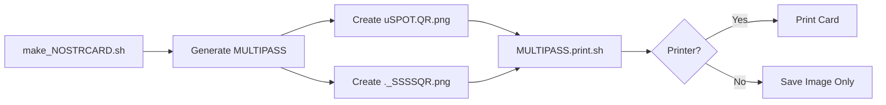

# MULTIPASS.print.sh - MULTIPASS Authentication Card Printer

## 📋 Description

`MULTIPASS.print.sh` generates and optionally prints a physical authentication card for MULTIPASS identities on Brother QL-700 label printers.

The card contains two essential QR codes that enable authentication on any UPlanet terminal:

1. **uSPOT/scan QR** - Access to uSPOT wallet and authentication interface
2. **SSSS Key QR** - Secret Sharing Scheme QR code for terminal authentication (M-base58 encoded)

## 🎯 Purpose

This card enables **mobile authentication** without requiring browser storage. Users can:
- Scan the uSPOT QR with their phone to access wallet features
- Scan the SSSS QR on any UPlanet terminal to authenticate
- Regenerate their MULTIPASS using PASS "0000" if card is lost

## 📦 Card Layout (Updated v0.2)

```
┌─────────────────────────────────────────────┐
│ ┏━━━━━━━━━━━━━━━━━━━━━━━━━━━━━━━━━━━━━━━┓ │
│ ┃ ┌──────┐  MULTIPASS                   ┃ │
│ ┃ │ uSPOT│  user@example.com            ┃ │
│ ┃ │  QR  │  User Name                   ┃ │
│ ┃ │ SCAN │  G1: 12345678                ┃ │
│ ┃ └──────┘  uSPOT Scan Authentication   ┃ │
│ ┗━━━━━━━━━━━━━━━━━━━━━━━━━━━━━━━━━━━━━━━┛ │
│ ─────────────────────────────────────────── │
│                                             │
│       SSSS Authentication Key               │
│      Scan on any UPlanet terminal           │
│                                             │
│   ┏━━━━━━━━━━━━━━━━━━━━━━━━━━━━━━━━━━┓   │
│   ┃                                  ┃   │
│   ┃      ┌─────────────────────┐    ┃   │
│   ┃      │                     │    ┃   │
│   ┃      │    SSSS QR CODE     │    ┃   │
│   ┃      │    (LARGE - 650px)  │    ┃   │
│   ┃      │                     │    ┃   │
│   ┃      └─────────────────────┘    ┃   │
│   ┃                                  ┃   │
│   ┗━━━━━━━━━━━━━━━━━━━━━━━━━━━━━━━━━━┛   │
└─────────────────────────────────────────────┘
     696 x 1000 pixels (Brother QL-700)
```

**Layout Features:**
- **Header Section** (200px): Blue border with uSPOT QR (180px) + identity info
- **Separator Line**: Visual separation between sections
- **SSSS Section** (800px): Large SSSS QR code (650px) for easy terminal scanning

## 🚀 Usage

### Automatic (during MULTIPASS creation)

The script is automatically called by `make_NOSTRCARD.sh` after generating a new MULTIPASS:

```bash
./make_NOSTRCARD.sh user@example.com ./profile.png 48.85 2.35
```

If a Brother QL-700 printer is detected, the card will be printed automatically.

### Manual (print or reprint existing MULTIPASS)

```bash
# Print existing card (uses cached version if available)
./MULTIPASS.print.sh user@example.com

# Force regeneration and print
./MULTIPASS.print.sh --force user@example.com
```

### Caching Behavior

**NEW in v0.2**: The generated card image is cached to avoid regenerating it every time:

- **First run**: Generates `~/.zen/game/nostr/EMAIL/.MULTIPASS.CARD.png`
- **Subsequent runs**: Uses cached image (instant)
- **Force regeneration**: Use `--force` flag to recreate the card

**Benefits:**
- ⚡ Instant reprinting without regeneration
- 💾 Preserves bandwidth and CPU
- 🔄 Easily regenerate with `--force` if QR codes are updated

## 📁 Output Files

- **Card Image**: `~/.zen/game/nostr/${EMAIL}/.MULTIPASS.CARD.png`
- **Input QR Codes**:
  - `~/.zen/game/nostr/${EMAIL}/uSPOT.QR.png`
  - `~/.zen/game/nostr/${EMAIL}/._SSSSQR.png`

## ⚙️ Requirements

### System Tools

- **ImageMagick** (`convert`, `composite`) - For image composition
- **Brother QL tools** (optional, for printing):
  ```bash
  pip install brother_ql
  ```

### Hardware

- **Brother QL-700** label printer (optional)
- Connected via USB at `/dev/usb/lp*`

## 🔧 Integration

### Called by:

1. **make_NOSTRCARD.sh** (line ~237)
   - During MULTIPASS creation
   - Runs in background (`&`)
   - Automatic if printer detected

### Workflow:



## 📐 Technical Specifications

### Brother QL-700 Label

- **Label Size**: 62mm continuous
- **Image Size**: 696x1000 pixels (vertical layout)
- **Header Section**: 200px (uSPOT QR 180x180 + text)
- **SSSS Section**: 800px (QR 650x650)
- **Format**: PNG → Binary (.bin)

### QR Code Details

| QR Code | Size | Content | Purpose |
|---------|------|---------|---------|
| **uSPOT/scan** | 180x180px | `${uSPOT}/scan` | Mobile web interface access |
| **SSSS Key** | 650x650px | `M-${SSSS_HEAD_B58}:${NOSTRNS}` | Terminal authentication |

### Layout Dimensions

- **Canvas**: 696 x 1000 pixels
- **Header**: 
  - Height: 200px
  - Border: #667eea (5px)
  - uSPOT QR: 180x180px @ (10, 10)
  - Text area: Starting @ (200, 15)
- **Separator**: Line @ y=210
- **SSSS Section**:
  - Label @ y=225
  - QR Code: 650x650px @ bottom center (15px margin)

## 🔐 Security Features

- **SSSS (Shamir's Secret Sharing Scheme)**: 2-of-3 threshold
  - HEAD: Encrypted with G1PUBNOSTR (player key)
  - MIDDLE: Encrypted with CAPTAING1PUB (captain key)
  - TAIL: Encrypted with UPLANETG1PUB (network key)
- **M-base58 Encoding**: Compact and mobile-friendly
- **Combined with NOSTRNS**: Enables vault access

## 🆘 PASS Codes (Terminal Usage)

When scanning the SSSS QR on a UPlanet terminal:

| PASS Code | Function |
|-----------|----------|
| `0000` | Regenerate MULTIPASS (lost/stolen card) |
| `1111` | Open full Astro Base interface |
| *default* | Simple NOSTR message interface |

## 🔄 Comparison with VISA.print.sh

| Feature | VISA.print.sh | MULTIPASS.print.sh |
|---------|---------------|---------------------|
| **Target** | ZenCard (full player) | MULTIPASS (light identity) |
| **QR Codes** | G1PUB, IPNS, PIN | uSPOT/scan, SSSS Key |
| **Use Case** | Complete identity card | Authentication card |
| **Printer** | Brother QL-700 | Brother QL-700 |
| **Called by** | VISA.new.sh, captain.sh, dashboard.sh | make_NOSTRCARD.sh |

## 📧 Support

- Email: support@qo-op.com
- Relay: wss://relay.copylaradio.com

## 📄 License

AGPL-3.0

