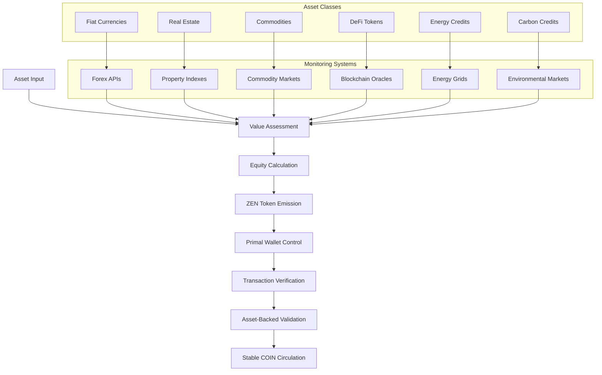

# Primal Wallet Control

## Overview

The `primal_wallet_control.sh` script provides a generic solution for monitoring wallet transactions and ensuring that incoming transactions come from wallets with the same primal source. This implements a security system that detects unauthorized transactions and automatically redirects them to UPLANETNAME_G1 to prevent transaction loops.

## Context and Purpose

### UPlanet Ecosystem Architecture

The UPlanet ecosystem operates on two distinct levels with different security requirements:

#### **UPlanet ORIGIN (EnfinLibre)**
- **Level**: Basic access level for all users
- **Security**: Standard Ğ1 transaction monitoring
- **No Swarm Key**: Uses no swarm key
- **Control**: Basic primal (can be any) transaction verification
- **Purpose**: Entry point for new users with MULTIPASS and ZENCARD services

#### **UPlanet Ẑen (Private Network)**
- **Level**: Advanced level requiring Y-level activation (SSH<->IPFS key twin)
- **Security**: Enhanced primal transaction control with intrusion detection
- **Swarm Key**: Uses private `~/.ipfs/swarm.key` for secure network isolation
- **Control**: **Real-time token capitalization tool** - controls input € = output Ẑen emissions
- **Purpose**: Secure financial operations and advanced services

### Custom Token Valuation in UPlanet Ẑen

The ZEN Economy operates as a **Stable COIN system** that can work with **any asset class** while maintaining proper value equity through the primal wallet control mechanism:

One of the most powerful features of UPlanet Ẑen is the ability to **define custom token valuations** based on the specific `swarm.key` used. While the technical value remains **0.1 Ğ1** per token, the **perceived and economic value** can be customized according to the community's needs:

#### **Examples of Custom Token Valuations**

| **Swarm Key Community** | **Token Value** | **Economic Model** | **Use Case** |
|-------------------------|-----------------|-------------------|--------------|
| **Forest Conservation** | 1 hectare of forest | Environmental credits | Carbon offset trading |
| **Local Economy** | 10€ | Local currency | Regional commerce |
| **Energy Network** | 1 kWh renewable | Energy credits | Green energy trading |
| **Education** | 1 hour of tutoring | Knowledge credits | Skill exchange |
| **Healthcare** | 1 consultation | Health credits | Medical services |
| **Agriculture** | 1 kg organic produce | Food credits | Local food networks |
| **Fiat Currencies** | 1 Ẑen = 1€, 1$, 1¥ | Exchange rate monitoring | Real-time forex tracking |
| **Real Estate** | 1 Ẑen = 1m² land | Property valuation index | Market price updates |
| **Commodities** | 1 Ẑen = 1kg gold/silver | Commodity price feeds | Live market data |
| **DeFi Tokens** | 1 Ẑen = 1 USDC/DAI | Smart contract oracles | Blockchain price feeds |
| **Energy Credits** | 1 Ẑen = 1 kWh | Energy market pricing | Grid price monitoring |
| **Carbon Credits** | 1 Ẑen = 1 ton CO2 | Environmental markets | Carbon price tracking |

...

#### **Benefits of Custom Valuation**

1. **Community-Specific Economics**: Each community can define its own economic model
2. **Real-World Asset Backing**: Tokens can represent tangible assets (forest, energy, etc.)
3. **Flexible Exchange Rates**: Different communities can have different €/Ẑen ratios
4. **Incentive Alignment**: Token values align with community goals and values
5. **Scalable Architecture**: Multiple communities can coexist with different valuations
6. **Universal Asset Support**: Any asset can be tokenized as ZEN
7. **Stable Value Preservation**: Each community maintains its defined value
8. **DeFi Compatibility**: Seamless integration with existing DeFi protocols
9. **Real-World Utility**: Direct backing by tangible assets
10. **Risk Diversification**: Multiple asset classes reduce systemic risk
11. **Community Autonomy**: Each community controls its own asset backing

...

#### **Stable COIN Monitoring Architecture**



#### **DeFi Integration Capabilities**

The ZEN Economy can integrate with **any DeFi protocol** while maintaining stability:

```bash
# DeFi Stable COIN Integration Examples

# USDC Integration
~/.ipfs/swarm.key = "SharedSecretForUSDCBackedZEN"
1_Ẑen = 1_USDC = 0.1_Ğ1
# Monitoring: Chainlink price feeds, Aave liquidity pools

# DAI Integration  
~/.ipfs/swarm.key = "SharedSecretForDAIBackedZEN"
1_Ẑen = 1_DAI = 0.1_Ğ1
# Monitoring: MakerDAO oracle, Compound lending rates

# Real Estate Tokenization
~/.ipfs/swarm.key = "SharedSecretForRealEstateZEN"
1_Ẑen = 1_REIT_token = 0.1_Ğ1
# Monitoring: Property valuation APIs, rental yield data

# Commodity Backing
~/.ipfs/swarm.key = "SharedSecretForGoldBackedZEN"
1_Ẑen = 1_gram_gold = 0.1_Ğ1
# Monitoring: LBMA gold prices, vault verification
```

#### **Cross-Asset Arbitrage Prevention**

The primal wallet control system prevents arbitrage between different asset-backed ZEN communities:

```bash
# Security Mechanism
function prevent_cross_asset_arbitrage() {
    # Each swarm.key community is isolated
    # No direct conversion between different asset-backed ZEN
    # All conversions must go through Ğ1 as intermediary
    # Maintains value equity across all asset classes
}
```

### Real-Time Token Capitalization Tool

The `primal_wallet_control.sh` script is specifically designed for **UPlanet Ẑen** as a **Real-Time Token Capitalization Tool** that:

1. **Monitors Input Transactions**: Tracks incoming € (Euro) transactions
2. **Controls Output Emissions**: Manages Ẑen token emissions based on verified primal sources
3. **Prevents Unauthorized Access**: Ensures only wallets with matching primal sources can receive Ẑen tokens
4. **Maintains Network Integrity**: Protects the private UPlanet Ẑen network from external intrusions
5. **Enforces Custom Valuations**: Ensures token emissions respect the community's defined economic model

## Implementation Summary

This implementation extracts and generalizes the primal transaction control functionality from `NOSTRCARD.refresh.sh` and `G1PalPay.sh` into a reusable, generic solution that eliminates cache dependencies and provides real-time security monitoring for the UPlanet Ẑen private network.

### Key Features Implemented

#### 1. Generic Primal Transaction Control
- **Real-time Verification**: Uses `silkaj --json money primal` for live primal source verification
- **Smart Cache Usage**: Uses existing cache files when available and recent for performance optimization
- **History-based Detection**: Analyzes transaction history to count existing intrusions without cache dependency
- **Automatic Redirection**: Immediately redirects unauthorized transactions to UPLANETNAME_G1
- **Intrusion Tracking**: Counts intrusion attempts for monitoring and alerts
- **Loop Prevention**: Avoids transaction loops by redirecting instead of refunding

#### 2. Security Enhancements
- **Systematic Redirection**: All intrusions redirected to UPLANETNAME_G1 for cooperative recovery
- **Email Alerts**: Sends detailed alerts for all intrusions with redirection notifications
- **Fund Recovery**: Transfers intrusive amounts to cooperative treasury (UPLANETNAME_G1)
- **Loop Prevention**: No refunds to sender to avoid potential transaction loops
- **History-based Detection**: Analyzes transaction history to count existing intrusions without cache

#### 3. Integration Points
- **NOSTR Card Refresh**: Monitors MULTIPASS wallet transactions
- **G1PalPay**: Monitors player wallet transactions
- **Extensible**: Can be used for any wallet requiring primal control

## Features

- **Primal Transaction Verification**: Uses `silkaj --json money primal` to verify the primal source of incoming transactions
- **Automatic Redirection**: Automatically redirects unauthorized transactions to UPLANETNAME_G1
- **Intrusion Detection**: Tracks intrusion attempts for monitoring and cooperative fund recovery
- **Email Alerts**: Sends detailed alerts for all intrusions with redirection notifications
- **Smart Cache Usage**: Uses existing cache files when available and recent for performance optimization
- **History-based Detection**: Analyzes transaction history to count existing intrusions without cache dependency
- **Loop Prevention**: Eliminates transaction loops by redirecting instead of refunding to sender

## Technical Implementation

### Core Functions

1. **`get_primal_source()`** - Retrieves primal source using silkaj
2. **`get_wallet_history()`** - Gets transaction history with retry logic
3. **`send_alert_email()`** - Sends email alerts using templates
4. **`count_existing_intrusions()`** - Analyzes transaction history to count existing intrusion transactions
5. **`control_primal_transactions()`** - Main control function with redirection logic

### How It Works

1. **Cache Check**: Checks for existing cache files (`~/.zen/tmp/coucou/$pubkey.primal` and `~/.zen/tmp/coucou/$pubkey.history`)
2. **Transaction History Retrieval**: Gets the wallet's complete transaction history using `silkaj --json money history` (or from cache if recent)
3. **Existing Intrusion Analysis**: Scans transaction history for existing intrusion transactions to avoid cache dependency
4. **Primal Source Verification**: For each incoming transaction, verifies the primal source using `silkaj --json money primal` (or from cache if recent)
5. **Intrusion Detection**: Compares the primal source with the expected master primal
6. **Automatic Redirection**: If an intrusion is detected, automatically redirects the transaction to UPLANETNAME_G1
7. **Alert System**: Sends email alerts for all intrusions with redirection notifications
8. **Fund Recovery**: All intrusive amounts are recovered by the cooperative treasury

## Usage

### Direct Script Execution

```bash
./primal_wallet_control.sh <wallet_dunikey> <wallet_pubkey> <master_primal> <player_email>
```

### Parameters

- `wallet_dunikey`: Path to the wallet's dunikey file
- `wallet_pubkey`: Wallet's public key
- `master_primal`: Expected master primal source
- `player_email`: Player's email for alerts

### Function Call

```bash
# Source the script
source ./primal_wallet_control.sh

# Call the function
control_primal_transactions \
    "/path/to/wallet.dunikey" \
    "5fTwfbYUtCeoaFLbyzaBYUcq46nBS26rciWJAkBugqpo" \
    "AwdjhpJNqzQgmSrvpUk5Fd2GxBZMJVQkBQmXn4JQLr6z" \
    "player@example.com"
```

## Integration Examples

### NOSTR Card Integration

```bash
# In NOSTRCARD.refresh.sh
${MY_PATH}/../tools/primal_wallet_control.sh \
    "${HOME}/.zen/game/nostr/${PLAYER}/.secret.dunikey" \
    "${G1PUBNOSTR}" \
    "${UPLANETNAME_G1}" \
    "${EMAIL}"
```

### G1PalPay Integration

```bash
# In G1PalPay.sh
${MY_PATH}/../tools/primal_wallet_control.sh \
    "${HOME}/.zen/game/players/${PLAYER}/secret.dunikey" \
    "${G1PUB}" \
    "${UPLANETNAME_G1}" \
    "${EMAIL}"
```

## Security Features

- **Smart Cache Usage**: Uses existing cache files when available and recent for performance optimization
- **Real-time Fallback**: Falls back to live verification when cache is not available or outdated
- **History-based Intrusion Detection**: Analyzes transaction history to count existing intrusions without cache dependency
- **Automatic Redirection**: Unauthorized transactions are immediately redirected to UPLANETNAME_G1
- **Loop Prevention**: No refunds to sender to avoid potential transaction loops
- **Email Notifications**: Detailed alerts for all security events with redirection notifications
- **Fund Recovery**: All intrusive amounts recovered by cooperative treasury (UPLANETNAME_G1)

## Dependencies

### Required Tools
- `silkaj` - Blockchain interaction and primal verification
- `jq` - JSON parsing
- `bc` - Mathematical calculations
- `mailjet.sh` - Email notifications
- `PAYforSURE.sh` - Secure payments
- `duniter_getnode.sh` - BMAS node discovery

### Cache Files
The script uses existing cache files for performance optimization:

- `~/.zen/tmp/coucou/$pubkey.primal` - Cached primal source (permanently valid)
- `~/.zen/tmp/coucou/$pubkey.history` - Cached transaction history (valid for 30 minutes)

### Templates
The script uses HTML templates for email alerts:

- `templates/NOSTR/wallet_alert.html` - For intrusion alerts (first intrusion)
- `templates/NOSTR/wallet_redirection.html` - For redirection notifications (all intrusions)

## Benefits Achieved

### 1. Code Reusability
- **Single Implementation**: One script handles all primal control scenarios
- **Consistent Behavior**: Same logic across different wallet types
- **Maintainability**: Centralized updates and bug fixes

### 2. Enhanced Security
- **Real-time Verification**: Uses live data when cache is not available or outdated
- **Smart Cache Usage**: Leverages existing cache for performance while maintaining security
- **History-based Detection**: Eliminates cache dependency for intrusion counting
- **Automatic Response**: Immediate redirection and alert system
- **Loop Prevention**: Eliminates transaction loops by redirecting instead of refunding

### 3. Improved Reliability
- **Retry Logic**: Handles network failures gracefully
- **Error Handling**: Comprehensive error checking and reporting
- **Logging**: Detailed operation logging for debugging
- **Cache Management**: Automatic cache creation and validation

### 4. Flexibility
- **Simplified Logic**: Single redirection rule for all intrusions
- **Template System**: Customizable email alerts for different intrusion types
- **Extensible Design**: Easy to add new wallet types

## Error Handling

- **Network Failures**: Retries up to 3 times for network operations
- **Invalid JSON**: Validates JSON responses before processing
- **Missing Files**: Creates required files if they don't exist
- **Invalid Parameters**: Provides detailed usage information for incorrect parameters

## Logging

The script provides detailed logging for:
- Transaction processing
- Primal verification results
- Intrusion detection
- Redirection operations
- Fund recovery to cooperative treasury

## Security Considerations

- **Private Key Security**: Ensure dunikey files have appropriate permissions (600)
- **Email Security**: Verify email addresses to prevent alert spoofing
- **Network Security**: Use secure connections for blockchain operations
- **File Permissions**: Protect cache files and transaction logs from unauthorized access

## Troubleshooting

### Common Issues

1. **"silkaj not found"**: Install silkaj or ensure it's in PATH
2. **"Invalid JSON response"**: Check network connectivity to BMAS nodes
3. **"Permission denied"**: Check file permissions for dunikey and log files
4. **"Email sending failed"**: Verify mailjet.sh configuration

### Debug Mode

Add debug output by setting:

```bash
export DEBUG=1
```

## Future Enhancements

### Potential Improvements
* **Custom Alert Channels**: Cesium+, Slack, Discord, etc.

## License

AGPL-3.0 - See LICENSE file for details. 
